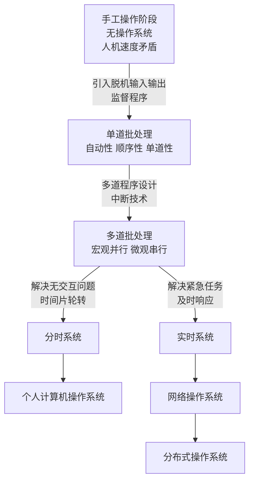
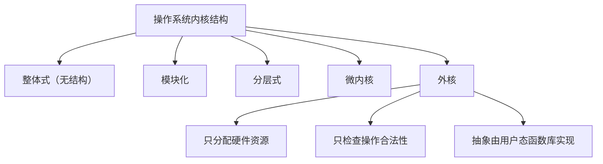
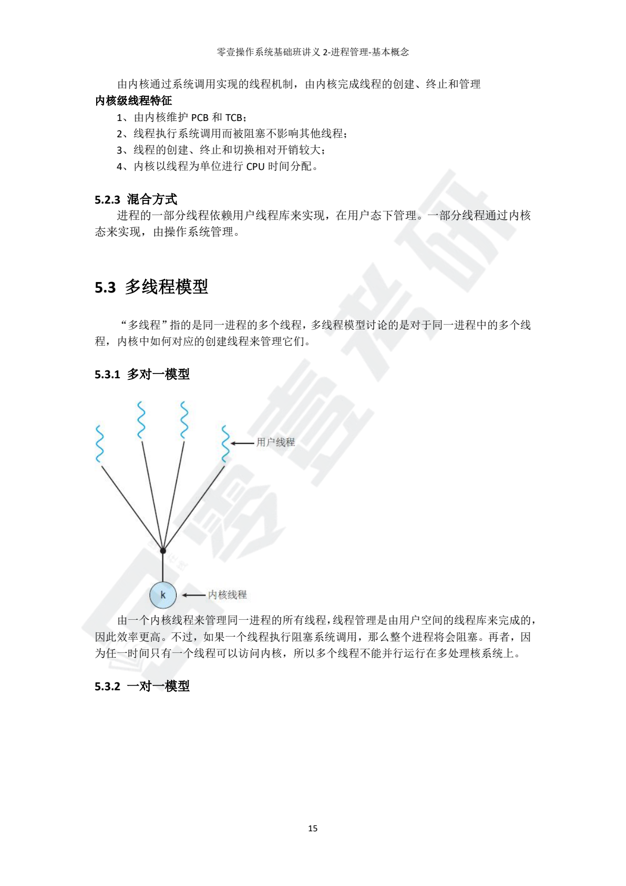
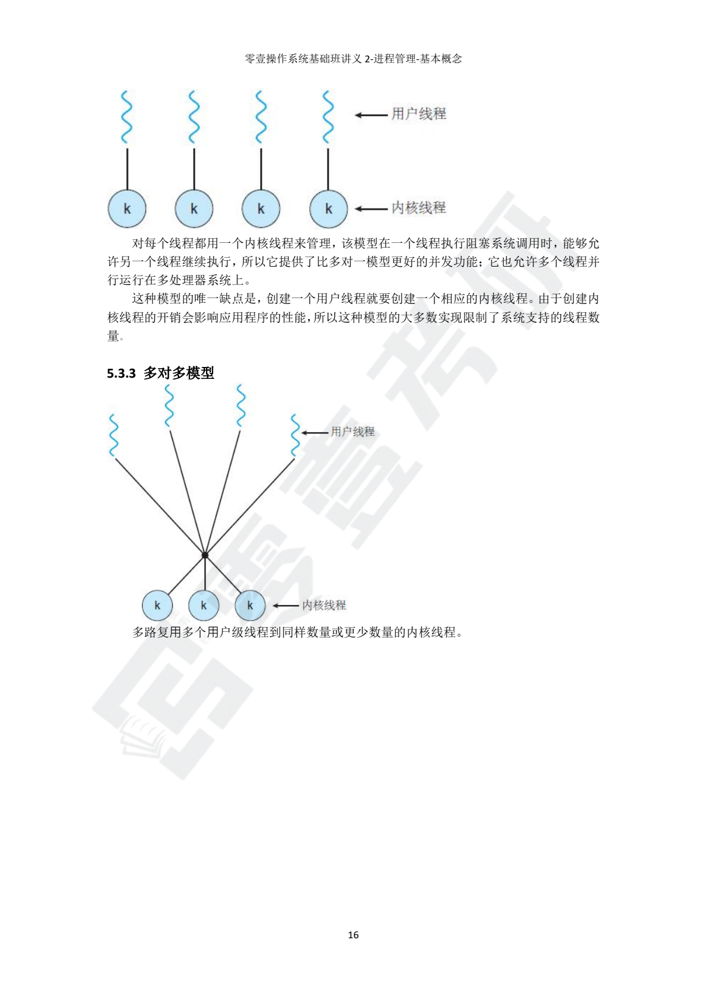
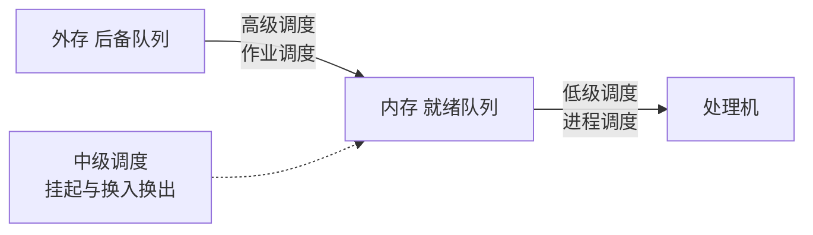
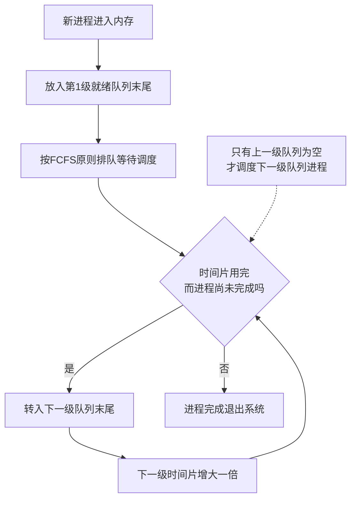
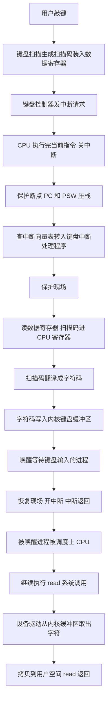
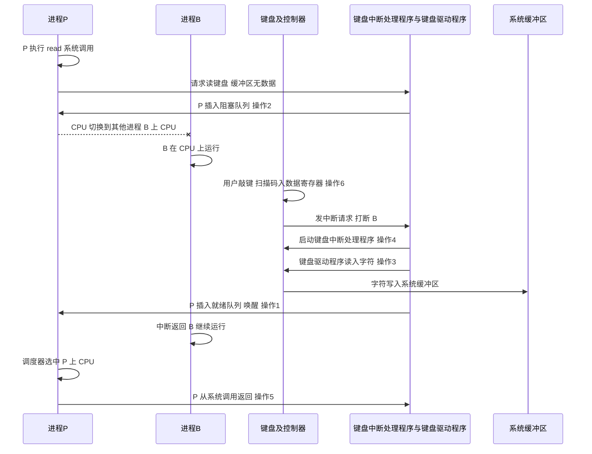

# 操作系统

## 第一章 计算机系统概述

### 操作系统的分类与发展（2026-08-15）

> 相关章节：第二章 进程与线程（时间片轮转调度）、第一章 中断与异常

#### 核心概念

- 操作系统的发展就是不断解决"矛盾"的过程：人机速度矛盾 → CPU 与 I/O 速度不匹配 → CPU 利用率低 → 无交互 → 紧急任务处理
- 按工作方式与用途分类，408 考纲要求掌握批处理、分时、实时三大基本类型，以及网络、分布式、个人计算机、嵌入式等类型
- 批处理系统（无论单道还是多道）都没有交互能力，用户无法干预作业运行；交互是分时系统的标志
- 实时系统的两大特点：及时响应和高可靠性
- 多道程序设计的本质：宏观上并行、微观上串行（单处理器任一时刻只处理一个进程）

#### 要点总结

**发展历程主线（5 个阶段）**

| 阶段 | 解决的主要矛盾 | 关键技术与手段 | 主要特点 | 主要缺点 |
| ---- | -------------- | -------------- | -------- | -------- |
| 手工操作阶段 | 人机速度矛盾 | 人工装入、卸下纸带 | 用户独占全机 | CPU 大量空闲，资源利用率极低 |
| 单道批处理阶段 | 人机矛盾、CPU 与 I/O 速度不匹配 | 脱机输入输出、监督程序 | 自动性、顺序性、单道性 | CPU 仍需大量等待 I/O |
| 多道批处理阶段 | CPU 利用率低 | 多道程序设计、中断技术 | 多道性、宏观并行微观串行 | 无交互性、平均周转时间长 |
| 分时系统 | 无交互 | 时间片轮转 | 同时性、交互性、独立性、及时性 | 可靠性不足，不能处理紧急任务 |
| 实时系统 | 紧急任务的及时处理 | 优先级调度、及时响应 | 及时响应、高可靠性 | 设计复杂、成本较高 |

发展主线流程：



- 演变总览（零壹操作系统基础课件1 第 97 页）：
  
- 手工操作阶段：每个作业都要人工装入、人工操作，CPU 等待时间远大于运行时间（零壹操作系统基础课件1 第 98 页）：
  

**单道批处理与多道批处理（高频对比）**

- 根本区别：内存中同时存在的作业数不同（一道 vs 多道），由此引出能否借助中断技术在等待 I/O 期间切换运行别的程序
- 单道：一道作业发出 I/O 请求后 CPU 空转等待；多道：中断触发，CPU 立即转去运行另一道程序，实现 CPU 与 I/O 并行
- 两者都没有交互性，交互不是区别
- 多道批处理是宏观并行、微观串行，单处理器任一时刻只运行一道程序
- 程序道数不是越多越好，进程过多时内存紧张、CPU 利用率反而下降

| 对比项 | 单道批处理 | 多道批处理 |
| ------ | ---------- | ---------- |
| 内存中作业数 | 仅一道 | 同时多道 |
| CPU 与 I/O 并行 | 不能，CPU 空转等待 | 能，借助中断技术切换 |
| 运行方式 | 完全串行，一道接一道 | 宏观并行、微观串行 |
| 资源利用率 | 低 | 高 |
| 系统吞吐量 | 小 | 大 |
| 技术支撑 | 监督程序、脱机输入输出 | 多道程序设计技术、中断技术 |
| 交互性 | 无 | 无 |

执行过程对比（最直观）：

```text
单道批处理（CPU 空转等 I/O）：
作业A：|====计算====|----I/O----|====计算====|
CPU  ：|====忙碌====|~~~~空闲~~~~|====忙碌====|
                               ↑ 作业A做I/O时，CPU无事可做

多道批处理（CPU 切换不停歇）：
作业A：|====计算====|----I/O----|====计算====|
作业B：|    等待    |====计算====|====计算====|
CPU  ：|====A计算===|====B计算===|====B计算===|
                               ↑ A做I/O时，中断触发，CPU切去运行B
```

- 分时、多道程序设计、批处理系统的定义与关系（零壹操作系统基础班讲义1 第 22 页）：
  _p22.png>)

**分时系统与实时系统对比**

- 分时：时间片轮转方式同时为多个用户服务，交互是必须的；每个用户只是"感觉"独占一台计算机，并非真正独占
- 实时：对外来信息以足够快的速度处理，并在被控对象允许的时间范围内做出快速反应；分硬实时（必须绝对满足截止时间）与软实时（偶尔违反可接受）

| 对比项 | 分时系统 | 实时系统 |
| ------ | -------- | -------- |
| 核心目标 | 交互性，用户感觉独占 | 及时响应，高可靠性 |
| 响应要求 | 时间片内尽快响应 | 规定截止时间内必须响应 |
| 可靠性 | 一般 | 高 |
| 典型应用 | 多用户终端 | 工业控制、武器系统 |

- 实时操作系统的定义与特点（零壹操作系统基础班讲义1 第 21 页）：
  _p21.png>)

**分类总表**

| 分类 | 核心特征 | 典型场景 |
| ---- | -------- | -------- |
| 批处理操作系统 | 无交互，成批处理，追求高吞吐量 | 大型计算中心 |
| 分时操作系统 | 时间片轮转，交互性强 | 多用户通用计算机 |
| 实时操作系统 | 及时响应，高可靠性 | 工业控制、导弹系统 |
| 网络操作系统 | 联网通信，资源共享 | 计算机网络系统 |
| 分布式操作系统 | 统一管理，任务分布执行，透明性 | 分布式系统 |
| 个人计算机操作系统 | 单用户多任务 | 个人电脑 |
| 嵌入式操作系统 | 专用性强，常带实时性要求 | 手机、智能设备 |

#### 解题方法与步骤

判断"某系统是否具有交互性/及时性"类概念题：

1. 批处理一律无交互（单道、多道都一样），作业只能靠事先编好的作业控制说明书间接干预
2. 交互是分时系统必须有的功能；分时不保证高可靠性、不能胜任紧急任务
3. 实时系统强调及时响应与高可靠性，能处理紧急任务
4. 判断"宏观并行微观串行"：只要是多道程序（多道批处理），单处理器上就是宏观并行微观串行

#### 易错提醒

> [!WARNING]
> - 交互性不是单道与多道的区别，两种批处理都无交互（2016 年第 23 题）
> - 多道"并行"只是宏观效果，微观上单处理器任一时刻只处理一个进程
> - 分时系统的"独占感"是时间片轮转的虚拟效果，不是真正独占
> - 实时系统两大特征：及时响应和高可靠性；与分时最本质的区别是可靠性与截止时间要求
> - 网络 OS 重在资源共享（各机独立），分布式 OS 重在统一透明管理（任务分布执行）
> - 多道批处理借助中断技术实现 CPU 与 I/O 并行，不是靠"并行执行"字面意思

#### 例题与真题

**2016 年统考第 23 题**：判断关于批处理系统的说法：

- 说法一"批处理系统具有交互能力"：错误。作业执行时用户无法干预其运行，只能事先编制作业控制说明书间接干预，缺少交互能力，因此才发展出分时系统
- 说法二"批处理系统按发展历程分为单道批处理和多道批处理"：正确
- 说法三"多道批处理系统的 I/O 设备可与 CPU 并行工作，借助中断技术实现"：正确。多道程序设计技术允许多个程序同时放入内存交替运行，共享软硬件资源，一道程序因 I/O 请求暂停时 CPU 立即转去运行另一道程序

**答案：说法二、三正确，说法一错误。**

- 真题解析原文（2016 年真题解析第 5 页）：
  

**2022 年真题（关联考点）**：并发和共享是操作系统最基本、必须实现的特征；早期多道批处理系统即使不支持虚拟存储管理，也能实现多道程序并发；进程多并不意味着 CPU 利用率高。

#### 资料定位

- 《零壹操作系统基础班讲义1_概述》第 21、22 页：实时操作系统、分时操作系统、多道程序设计、批处理操作系统
- 《零壹操作系统基础课件1_综述》第 97、98 页：操作系统的演变、手工操作阶段
- 《2016年计算机408统考真题解析》第 5 页：第 23 题解析
- 《2022年计算机408统考真题解析》第 4 页：操作系统基本特征（并发与共享）

### 外核（Exokernel）考点整理（2026-08-15）

#### 核心概念

- 外核是操作系统的一种内核结构：内核只负责两件事——给每个进程分配硬件资源、检查进程对资源的使用是否合法
- 外核不给用户提供"文件""进程"等抽象，而是把未经抽象的原始硬件资源（磁盘块、物理内存页、CPU 时间片）直接分配给用户进程，由用户进程自己在用户态（借助函数库）实现操作系统抽象
- 一句话记忆：外核 = 资源分配 + 安全检查，抽象交给用户态库
- 外核将硬件资源直接以函数库的形式提供给用户程序（零壹操作系统基础课件1 第 126 页）：

  

#### 要点总结

**工作方式（选择题常考）**

1. 外核给每一个进程分配一定的硬件资源，各进程可以直接使用未经抽象的硬件资源
2. 内核负责检查该操作是否合法
3. 用户程序需要先向内核申请需要访问的资源，才能直接使用硬件资源

**五种内核结构对比**

| 结构 | 内核包含内容 | 优点 | 缺点 |
| --- | --- | --- | --- |
| 大内核（宏内核） | 全部功能集中在内核（进程、存储、设备、文件等） | 性能高 | 可靠性差、难维护 |
| 微内核 | 只留最基本功能（进程切换、中断、通信等），其余以用户态服务器进程实现 | 可靠、可扩展 | 用户态与内核态切换频繁，性能低 |
| 外核 | 仅资源分配和安全检查 | 灵活、性能高 | 实现复杂，多用于研究 |
| 分层式 | 按功能分若干层，相邻层单向调用 | 易调试和验证 | 层次难以划分 |
| 模块化 | 按功能划分模块，模块间通过接口调用 | 结构清晰 | 模块间可任意调用，关系复杂 |

演进顺序：整体式（无结构）→ 模块化 → 分层式 → 微内核 → 外核。

宏内核与微内核的区别（零壹操作系统讲义1_概述 第 23 页）：

_p23.png>)

**外核与微内核辨析（高频考点）**

| 对比项 | 微内核 | 外核 |
| --- | --- | --- |
| 内核职责 | 提供最基本的功能与服务 | 只分配资源并检查合法性 |
| 抽象由谁实现 | 用户态的服务器进程 | 用户态的函数库 |
| 使用硬件方式 | 通过服务器间接使用 | 直接使用原始硬件资源 |

共同点（易错，必记）：外核与微内核都是操作系统层面的设计，并不能突破硬件的局限性：

1. 特权指令依然只能在内核态执行；微内核只是把用非特权指令实现的部分放入用户态执行
2. I/O 指令无法由外核直接使用，但可以通过 MMIO 统一编址等方式映射到用户空间上

（零壹操作系统基础课件1 第 127 页，本知识点最重要的一页）：


**知识框架**



#### 解题方法与步骤

判断内核结构类概念题：

1. 看内核职责定位：抽象最多的是大内核，抽象最少的是外核
2. "内核功能最多"是大内核；"内核功能最少、只做资源分配"是外核
3. 外核与微内核同属软件层面设计，特权指令仍在内核态执行，二者均不能突破硬件局限
4. 说法中出现"外核实现文件系统等抽象"即为错误项

#### 易错提醒

> [!WARNING]
> - 外核不是"没有内核"，它仍要分配资源和做安全检查；进程必须先申请资源才能直接使用硬件
> - 别夸大外核的能力：特权指令仍在内核态执行，外核无法突破硬件局限
> - 外核与微内核的共同点（都受限于硬件、特权指令仍在内核态执行）常作为选项考查
> - 2023 年 408 第 23 题考过微内核的相关表述，本知识点通常以选择题选项形式出现，理解概念、能辨析即可

#### 例题与真题

**自编巩固题（单选）**：下列关于外核的说法中，错误的是：

- A. 外核给每个进程分配一定的硬件资源 —— 正确
- B. 用户进程可以直接使用未经抽象的硬件资源 —— 正确
- C. 外核负责实现文件系统等操作系统抽象 —— 错误（抽象由用户态函数库实现，外核不提供抽象）
- D. 特权指令依然只能在内核态执行 —— 正确

**答案：C**

#### 资料定位

- 《零壹操作系统基础课件1_综述》第 126 页：外核思想与结构图
- 《零壹操作系统基础课件1_综述》第 127 页：外核与微内核的辨析
- 《零壹操作系统讲义1_概述》第 23 页：宏内核和微内核的区别
- 《零壹操作系统白纸输出法框架》第 1 页：大纲条目（微内核和外核的概念和特点）

## 第二章 进程与线程

### 线程、共享地址空间与多线程模型（2026-08-11）

#### 核心概念

- 线程是进程内的执行单元；进程是**资源分配**的基本单位，线程是**处理机调度**的基本单位
- 同一进程内的线程**共享同一个虚拟地址空间（同一套页表）**：虚拟地址相同 → 页表相同 → 翻译出的物理地址相同，所以拿到其他线程局部变量的地址就能访问
- **进程间的内存隔离靠页表实现**：不同进程页表不同，同一虚拟地址翻译出的物理地址不同（或页表项无效），所以跨进程"拿地址"访问不到
- 用户级线程由用户空间的**线程库**管理，内核不感知（无 TCB）；内核级线程由**内核**管理（有 TCB）
- 多线程模型讨论同一进程中用户线程（ULT）与内核线程（KST）的映射方式：多对一、一对一、多对多

#### 要点总结

**共享地址空间的本质（答疑核心思路）**

- 虚拟地址只是一个"数字"，必须配合本进程的页表（翻译规则）才有意义；脱离地址空间的虚拟地址不能指向任何物理位置
- 同进程：线程 A、B 共用一套页表，A 拿 B 的局部变量地址 0x1000，翻译结果与 B 一致 → 能访问
- 跨进程：a 拿 b 的局部变量地址 0x1000，用 a 所在进程的页表翻译，得到的是 a 地址空间内的物理页，不是 b 的 → 访问不到（页表项不存在时直接缺页/段错误）
- 比喻：虚拟地址 = 门牌号，页表 = 小区地图；同进程线程 = 同一小区住户（共用地图），不同进程 = 不同小区（各查各的地图）

**用户级线程 vs 内核级线程**

| 对比项 | 用户级线程 | 内核级线程 |
| --- | --- | --- |
| 内核感知 | 只感知进程，不感知线程（无 TCB） | 感知并管理线程（有 TCB） |
| 调度单位 | 进程；线程由用户线程库调度 | 线程（内核直接调度） |
| 切换开销 | 小（用户态完成，不陷入内核） | 大（需陷入内核） |
| 线程阻塞 | 一个阻塞则整个进程阻塞 | 只阻塞该线程，不影响其他线程 |
| 多核并行 | 不能 | 能 |

**多线程模型**

- **多对一**（多个 ULT → 1 个 KST，即用户级线程）：切换快、不需要内核支持；但一个线程阻塞整个进程阻塞，无法多核并行
- **一对一**（1 个 ULT → 1 个 KST，即内核级线程）：阻塞互不影响、可多核并行；但创建/切换开销大，线程数受内核资源限制
- **多对多**（n 个 ULT → m 个 KST，n > m）：折中方案，m 个内核线程可并行，线程总数可多于内核线程；一个线程阻塞只影响同 KST 上的其他线程
- 无论哪种实现，**进程始终是资源分配的基本单位**，区别只在"调度基本单位是谁"

#### 解题方法与步骤

判断"说法错误"类概念题（以模拟卷第 30 题为例）：

1. 明确调度单位与资源分配单位的归属：内核级线程下，处理机调度的实体是**线程**
2. 抓住关键区分：处理机时间由**内核调度器直接分配给线程**，不由进程"获取后再分配"
3. 逐项排除：A（调度实体是线程，对）、C（共享地址空间，对）、D（竞争资源可阻塞，对）→ 只有 B 错

#### 易错提醒

> [!WARNING]
> - 局部变量"私有"只表示程序语义上不共享，但地址空间共享导致**物理上可访问**；考题问"能否访问"答"能"
> - "地址"必须和"地址空间"绑定，跨进程拿地址无用，隔离靠页表而非地址大小
> - "多对一 = 用户级线程，一对一 = 内核级线程"要能互换
> - 2019 年真题第 23 题：说法错误的是"操作系统为每个用户级线程建立一个线程控制块"（用户级线程由线程库管理，内核不建 TCB）
> - 多对一模型"一个线程阻塞，整个进程阻塞"是高频考点

#### 例题与真题

**第 30 题（选择题）**：在支持内核级线程的操作系统中，下面说法错误的是（ ）

- A. 参与处理机调度的实体只包含线程而不包含进程 —— 正确（线程是调度实体，进程不参与调度）
- B. 进程作为资源分配平台，为线程获取内存和处理机时间等资源，再分配给内部线程使用 —— 错误（处理机时间由内核调度器直接分配给线程；进程只分配内存、文件等资源）
- C. 若拥有局部变量地址，线程可以访问到同一进程其它线程的局部变量 —— 正确（共享地址空间、共享页表）
- D. 同一进程内的不同线程可能会因为互相竞争资源而进入阻塞态 —— 正确（竞争锁、信号量等拿不到时阻塞）

**答案：B**

**关键解析**：内核调度器直接选择线程分配 CPU 时间，进程仅作为资源分配平台（内存、文件等），不参与 CPU 时间获取或分配；A、C、D 说法均正确。出处：《27零壹408全真模拟1》第 30 题。

**2019 年真题第 23 题**：下列关于线程的描述中，错误的是（ B ）——"操作系统为每个用户级线程建立一个线程控制块"错误（用户级线程由用户线程库管理，内核不建立 TCB）。

#### 资料定位

- 《操作系统讲义2_进程管理_基本概念》第 14~16 页：用户级线程特征、内核级线程特征、多线程模型
  
  
- 《零壹考研408一模参考答案及解析》第 7 页：第 30 题官方解析（答案 B）
  _p7.png>)

### 处理机调度：调度算法与评价指标全梳理（2026-08-20）

> 相关章节：第一章 计算机系统概述（分时系统与时间片轮转）、第五章 输入/输出管理（调度与设备利用）

#### 核心概念

- 处理机调度：在多道程序设计系统中，从就绪队列中按一定算法选择一个进程，并把处理机分配给它；调度的本质是处理机资源的分配
- 调度的三个层次：高级调度（作业调度，选作业进内存）、中级调度（内存调度，换入换出）、低级调度（进程调度，选进程上处理机）；进程调度频率最高且必不可少
- 调度是"选谁"的决策，切换是"换人"的动作；一次调度不一定引起切换，切换一定伴随调度或中断
- 模式切换（用户态与内核态互转，如系统调用）不等于进程切换，两者不一定同时发生
- 评价指标的核心是时间：周转时间、带权周转时间、等待时间、响应时间；响应时间是评价指标，响应比是 HRRN 算法内部的动态优先级，两者不是一回事
- 408 考纲共七种传统调度算法：FCFS、SJF（抢占版 SRTN）、HRRN、RR、优先级、多级队列、多级反馈队列

#### 要点总结

**（一）三级调度**

| 层次 | 别称 | 任务 | 发生频率 |
| --- | --- | --- | --- |
| 高级调度 | 作业调度、长程调度 | 从外存后备队列选作业调入内存，建立进程 | 最低 |
| 中级调度 | 内存调度 | 挂起进程换出内存、唤醒时换入，提高内存利用率 | 中等 |
| 低级调度 | 进程调度、短程调度 | 从就绪队列选进程，把处理机分配给它 | 最高 |



- CPU 调度的基本概念与层次（里昂学长操作系统讲义第 87 页）：

  

**（二）调度的时机与切换**

- 进程主动放弃处理机（可调度）：正常终止；运行异常；主动请求阻塞（如等待 I/O）
- 进程被动放弃处理机（可调度）：时间片用完；有更紧急事件需要处理（如 I/O 中断）；更高优先级进程就绪（抢占式）
- 不能进行调度与切换：处理中断的过程中；进程处于临界区中；原子操作过程中

相关细节：

- 系统调用发生的是模式切换（用户态到内核态），不一定发生进程切换，这是经典辨析点
- 上下文切换有代价：保存与恢复现场、更新 PCB、可能使快表与高速缓存失效，所以时间片不能太小
- 闲逛进程：就绪队列为空时才运行，优先级最低，一有进程就绪立即让出处理机

- 进程状态转换图（里昂学长操作系统讲义第 88 页）：

  

- 调度方式与闲逛进程（里昂学长操作系统讲义第 92、93 页）：

  
  

**（三）调度方式**

| 调度方式 | 说明 | 优点 | 缺点 | 适用 |
| --- | --- | --- | --- | --- |
| 非剥夺式 | 只有进程主动放弃处理机时才调度 | 实现简单、系统开销小 | 紧急任务不能及时处理 | 早期批处理系统 |
| 剥夺式 | 调度程序可强行剥夺当前进程的处理机 | 及时响应、适合交互与实时 | 实现复杂、切换开销大 | 分时系统、实时系统 |

剥夺的触发条件：时间片用完、更高优先级进程就绪、更紧急事件出现。

**（四）评价指标**

| 指标 | 定义 | 补充说明 |
| --- | --- | --- |
| CPU利用率 | CPU忙碌时间占总时间的百分比 | 有效工作时间占总时间的比率 |
| 系统吞吐量 | 单位时间内完成的作业数量 | 长作业会降低吞吐量 |
| 周转时间 | 作业从提交到完成所经历的时间 | 包含后备队列等待、就绪等待、运行、I/O等全部时间 |
| 带权周转时间 | 周转时间除以实际运行时间 | 恒大于等于1，越接近1体验越好 |
| 等待时间 | 进程等待处理机的时间之和 | 进程调度意义上不含运行时间 |
| 响应时间 | 从提交请求到系统首次响应的时间 | 分时系统关键指标 |

核心公式：

- 周转时间 = 完成时间 - 到达时间
- 周转时间 = 等待时间 + 运行时间（忽略 I/O 时）
- 带权周转时间 = 周转时间 / 运行时间，恒大于等于 1
- 平均周转时间 = 各进程周转时间之和 / 进程数
- 响应比 = （等待时间 + 要求服务时间）/ 要求服务时间 = 1 + 等待时间 / 要求服务时间

两个易混点：

- 响应时间是评价指标；响应比是 HRRN 算法内部用来选进程的动态优先级
- 等待时间有两种口径：进程调度只算就绪队列等待；作业调度还要加后备队列等待

- 调度相关参数（零壹操作系统讲义3 第 13 页）：

  

**（五）七大调度算法**

**1. 先来先服务（FCFS）**

- 规则：按进程进入就绪队列的先后顺序排队，每次选队头进程运行，直到完成或阻塞
- 性质：非抢占式；不会饥饿；利于长作业与 CPU 密集型进程；对短作业和 I/O 密集型进程不利
- 适用：常与其他算法结合使用（如 RR 的队列内部、多级反馈队列的每级队列内部）

**2. 短作业优先（SJF）**

- 规则：每次从就绪队列中选运行时间最短的进程运行
- 非抢占版 SJF：只有当前进程运行完或阻塞才重新挑选
- 抢占版 SRTN（最短剩余时间优先）：每当有新进程到达，就与当前进程的剩余运行时间比较，剩余时间更短者抢占处理机
- 性质：所有进程同时到达时，SJF 的平均等待时间、平均周转时间最小（可证明的最优性质）；不同时到达时由 SRTN 保证最优；对长作业不利，可能饿死；必须事先知道运行时间

- 短进程优先的就绪队列排序与三态转换（零壹课件3 第 145 页）：

  

- 短进程优先平均周转时间最优的证明过程（零壹课件3 第 146 页）：

  

- 短进程优先的缺点：饥饿、需预知运行时间（零壹课件3 第 147 页）：

  

- 短剩余时间优先 SRTN 的例题数据（零壹课件3 第 148 页）：

  

**3. 高响应比优先（HRRN）**

- 规则：每次调度时计算每个就绪进程的响应比，选响应比最高者运行，非抢占式
- 响应比 = （等待时间 + 要求服务时间）/ 要求服务时间 = 1 + 等待时间 / 要求服务时间
- 三个结论：等待时间相同时短作业响应比高（照顾短作业）；服务时间相同时等待越久响应比越高（长作业不会饿死）；长作业等待足够久后响应比会超过短作业（兼顾两类）
- 缺点：每次调度都要计算响应比，开销较大

- 响应比公式与计算示例（零壹课件3 第 150、151 页）：

  
  

**4. 时间片轮转（RR）**

- 规则：就绪队列按 FCFS 排队，每次取队头进程运行一个时间片；时间片用完未完成则排到队尾；时间片内完成或阻塞则直接离开
- 性质：抢占式（时间片用完即剥夺）；用于分时系统；不会饥饿
- 时间片大小的影响：太大退化为 FCFS；太小切换开销过大；一般取切换开销占比不超过百分之一的时间片
- 对 I/O 密集型进程友好：它们常在时间片内主动让出，获得更频繁的调度

- 时间片轮转的算法思路图（零壹课件3 第 152 页）：

  

- 时间片 20 的 RR 计算示例（零壹课件3 第 153 页）：

  

- 时间片长度选择与百分之一经验规则（零壹课件3 第 154 页）：

  

- 优先级调度与时间片轮转（零壹操作系统讲义3 第 14 页）：

  

- 时间片轮转（里昂学长操作系统讲义第 95 页）：

  

**5. 优先级调度**

- 规则：给每个进程一个优先级，每次选就绪队列中优先级最高的进程运行
- 抢占方式：非抢占式（高优先级只有等当前进程让出才能运行）和抢占式（高优先级一到立即剥夺）两种
- 优先级类型：静态优先级（创建时确定不变）；动态优先级（运行期间可调，如老化：等待越久优先级越高，解决饿死问题）
- 优先级的确定依据：进程类型、资源需求（I/O 型进程通常更高）、用户要求
- 注意：优先数的大小与优先级高低可能相反（如 Unix 规定优先数越小优先级越高），做题必须看题干约定；抢占式中被抢占的高优先级进程回到就绪队列队首

- 静态与动态优先级、优先级比较惯例（零壹课件3 第 142 页）：

  

- 非抢占式优先级调度示例（零壹课件3 第 143 页）：

  

- 抢占式优先级调度（零壹课件3 第 144 页）：

  

- 优先级与优先数（里昂学长操作系统讲义第 94 页）：

  

**6. 多级队列调度**

- 规则：按进程类型放入不同队列，每个队列固定使用自己的算法（如前台队列用 RR、后台队列用 FCFS），队列之间按优先级调度
- 与多级反馈队列的区别：进程固定在某个队列中，不会在队列之间移动

- 多级队列调度 MQ 的队列划分与调度策略（零壹课件3 第 161 页）：

  

**7. 多级反馈队列（408 重点算法）**

- 规则（五条）：
  1. 设置多个优先级由高到低的就绪队列
  2. 新进程先进入第 1 级队列末尾，按 FCFS 排队
  3. 只有第 1 级队列为空时，才调度第 2 级队列的进程，依此类推
  4. 时间片用完且进程未完成，就降入下一级队列末尾；每降一级，时间片增大一倍
  5. 进程运行完或阻塞后离开队列
- 优点：不需要事先知道运行时间；短进程在第 1 级就能完成；长进程逐级下降获得越来越长的时间片，减少切换开销
- 缺点：长作业可能长期得不到运行而饥饿（可配合老化机制缓解）
- 细节：被抢占的进程回到原队列队尾而不是降级；它是抢占式的



- 多级反馈队列（零壹操作系统讲义3 第 15 页）：

  

- 多级队列与多级反馈队列（里昂学长操作系统讲义第 96、97 页）：

  
  

- 多级反馈队列 MLFQ 的结构与时间片逐级加倍（零壹课件3 第 162 页）：

  

- 调度基本内容、抢占原则与各算法要点（学习指导与题解第 70、71 页）：

   (z-library.sk, 1lib.sk, z-lib.sk)_p70.png>)
   (z-library.sk, 1lib.sk, z-lib.sk)_p71.png>)

**（六）CPU 密集型与 I/O 密集型的算法适配**

两类进程的特征：

| 类型 | 典型行为 | 运行时间 | 时间片使用 |
| --- | --- | --- | --- |
| CPU密集型 | 大量计算，很少等待 I/O | 长 | 几乎每次都把时间片用满 |
| I/O密集型 | 频繁发起输入输出、频繁等待设备 | 短 | 常在时间片内就主动让出 CPU |

调度设计的总原则：照顾 I/O 密集型进程。I/O 密集型进程运行时会启动设备工作，若让 CPU 密集型长进程独占 CPU，设备会大量空闲；反之让 I/O 型进程先运行，设备与 CPU 并行工作，系统整体利用率和吞吐量最高。

逐个算法分析：

| 算法 | 偏向哪类进程 | 原因 |
| --- | --- | --- |
| 先来先服务 | CPU密集型 | 长作业不被打断一路运行；I/O型让出后重排队尾，等待久 |
| 短作业优先 | I/O密集型 | I/O型进程运行时间短，被优先调度；CPU型长作业可能饿死 |
| 高响应比优先 | 两者兼顾 | 等待越久响应比越高，CPU型长作业不会被饿死 |
| 时间片轮转 | I/O密集型 | I/O型常在时间片内主动让出，调度更频繁、响应更快 |
| 优先级调度 | 取决于设置 | 动态优先级惯例给I/O型更高优先级，让设备与CPU并行 |
| 多级反馈队列 | 短进程优先且兼顾长进程 | I/O型在高级队列快速完成；CPU型降级后获得加长的时间片 |

**（七）细节考点汇总**

考纲边界：408 只考七种传统调度算法；实时调度算法（EDF、LLF）、多处理机调度、保证调度、公平分享调度等均不在考纲范围，无需掌握。

真题高频细节：

- 不能进行调度与切换的三种情形：处理中断过程中、临界区中、原子操作过程中；其中"临界区"有辨析：若临界区的互斥不是靠屏蔽中断实现，进程在临界区内其实可以切换
- 降低进程优先级的合理时机：进程的时间片用完
- 系统调用发生的是模式切换，不一定发生进程切换
- SJF 平均等待时间最小的前提是所有进程同时到达
- RR 时间片太大退化为 FCFS

进程切换与调度实现的流程细节（零壹课件3 第 158、159 页）：

- 时间片轮转的主动调度实现：保存当前进程上下文到内核堆栈，执行调度程序选中就绪进程，保存 PCB 与恢复 PCB、切换地址空间与堆栈，最后从新进程内核堆栈恢复用户态断点与上下文：

  

- 抢占式调度实现：调度程序执行时置"需要调度"标志位，先返回原进程，待时机合适再执行进程切换：

  

算法内部细节：

| 算法 | 细节考点 |
| --- | --- |
| 先来先服务 | 非抢占式；利于长作业与CPU密集型；不会饥饿 |
| 短作业优先 | 平均等待最短要求所有进程同时到达；不同时到达用SRTN；抢占条件是新到达进程剩余时间更短 |
| 高响应比优先 | 响应比恒大于等于1；每次调度都要计算，开销大；不会饥饿 |
| 时间片轮转 | 时间片太大退化为FCFS；时间片用完与新到达同一时刻的入队顺序看题目约定；I/O型进程常在时间片内让出 |
| 优先级调度 | 优先数大小与优先级高低可能相反，看题干约定；被抢占的高优先级进程回就绪队列队首；老化解决饥饿 |
| 多级反馈队列 | 被抢占的进程回原队列队尾而不是降级；时间片随级别下降逐级加倍；抢占式；长作业可能饿死 |

传统调度算法总结（零壹课件3 第 163-167 页的官方归纳卡片）：


概念辨析：

| 易混对 | 区分要点 |
| --- | --- |
| 响应时间 与 响应比 | 评价指标与HRRN内部动态优先级 |
| 调度 与 切换 | 决策与动作，不一定同时发生 |
| 模式切换 与 进程切换 | 用户态内核态互转与进程更换 |
| 多级队列 与 多级反馈队列 | 进程是否在队列间移动、算法是否固定 |
| 饥饿 与 死锁 | 饥饿只是得不到调度机会，老化可解；死锁是循环等待资源 |
| 等待时间两种口径 | 进程等待只算就绪队列；作业等待还要加后备队列 |

#### 解题方法与步骤

调度计算题通用步骤：

1. 画时间轴，标出各进程的到达时刻
2. 按算法规则逐步确定每个时刻谁运行：FCFS 看队列顺序；SJF 选运行时间最短者（抢占版每次新到达比较剩余时间）；HRRN 每次调度计算各进程响应比；RR 每个时间片轮换并注意入队顺序约定；多级反馈队列注意降级与时间片加倍
3. 填表记录每个进程的开始时刻、完成时刻、周转时间、带权周转时间
4. 求平均周转时间与平均带权周转时间

概念题判断要点：

- 会不会饥饿、是否抢占式、对长短作业与两类进程的偏向
- 指标计算只认定义，不凭感觉

#### 易错提醒

> [!WARNING]
> - SJF 的最优性只在所有进程同时到达时成立；不同时到达时用 SRTN
> - 带权周转时间与响应比都恒大于等于 1，等于 1 表示进程一到就运行、零等待
> - 时间片轮转中 I/O 型进程并非获得更多时间片，而是更快让出、更频繁被调度
> - 多级反馈队列时间片方向别记反：队列级别下降、时间片增大
> - 被抢占进程的去向：抢占式优先级回队首；多级反馈队列回原队列队尾
> - 优先数大小与优先级高低无统一规定，做题先看题干约定
> - 响应时间与响应比是两个概念；等待时间有进程与作业两种口径
> - 饥饿不是死锁；老化机制解决饥饿

#### 例题与真题

**综合例题（六种算法对比计算）**：4 个进程的到达时间与运行时间：P1（0，7）、P2（2，4）、P3（4，1）、P4（5，4）。

FCFS（执行顺序 P1 到 P2 到 P3 到 P4）：

| 进程 | 开始时刻 | 完成时刻 | 周转时间 | 带权周转时间 |
| --- | --- | --- | --- | --- |
| P1 | 0 | 7 | 7 | 1 |
| P2 | 7 | 11 | 9 | 2.25 |
| P3 | 11 | 12 | 8 | 8 |
| P4 | 12 | 16 | 11 | 2.75 |

平均周转时间 8.75，平均带权周转时间 3.5。

SJF 非抢占（P1 先运行到 7，此后依次 P3、P2、P4）：

| 进程 | 开始时刻 | 完成时刻 | 周转时间 | 带权周转时间 |
| --- | --- | --- | --- | --- |
| P1 | 0 | 7 | 7 | 1 |
| P3 | 7 | 8 | 4 | 4 |
| P2 | 8 | 12 | 10 | 2.5 |
| P4 | 12 | 16 | 11 | 2.75 |

平均周转时间 8，平均带权周转时间 2.5625。

SRTN 抢占（执行片段：P1 到 2，P2 到 4，P3 到 5，P2 到 7，P4 到 11，P1 到 16）：

| 进程 | 开始时刻 | 完成时刻 | 周转时间 | 带权周转时间 |
| --- | --- | --- | --- | --- |
| P1 | 0 | 16 | 16 | 2.29 |
| P2 | 2 | 7 | 5 | 1.25 |
| P3 | 4 | 5 | 1 | 1 |
| P4 | 7 | 11 | 6 | 1.5 |

平均周转时间 7，平均带权周转时间约 1.51，是所有算法中最好的，印证 SRTN 的最优性。

- SRTN 完整计算过程与甘特图（零壹课件3 第 149 页）：

  

HRRN：时刻 7 时各进程等待时间 P2 为 5、P3 为 3、P4 为 2；响应比 P2 =（5+4）/ 4 = 2.25，P3 =（3+1）/ 1 = 4，P4 =（2+4）/ 4 = 1.5，P3 最高；时刻 8 时 P2 =（6+4）/ 4 = 2.5 大于 P4 =（3+4）/ 4 = 1.75，P2 运行。结果与 SJF 非抢占相同：平均周转时间 8，平均带权周转时间 2.5625。

RR（时间片 2，约定同一时刻新到达者先入队尾）：执行片段 P1（0到2）、P2（2到4）、P1（4到6）、P3（6到7）、P2（7到9）、P4（9到11）、P1（11到13）、P4（13到15）、P1（15到16）：

| 进程 | 开始时刻 | 完成时刻 | 周转时间 | 带权周转时间 |
| --- | --- | --- | --- | --- |
| P1 | 0 | 16 | 16 | 2.29 |
| P2 | 2 | 9 | 7 | 1.75 |
| P3 | 4 | 7 | 3 | 3 |
| P4 | 5 | 15 | 10 | 2.5 |

平均周转时间 9，平均带权周转时间约 2.38。短进程 P3 完成很快，长进程 P1 被频繁打断。

多级反馈队列（时间片依次 1、2、4，按非抢占式处理）：P1 在第1级跑 1 个单位降到第2级，再跑 2 个单位（1到3）降到第3级；P2 在第1级跑 1 个单位（3到4）；P3 到达后跑 1 个单位（4到5）完成；P4 在第1级跑 1 个单位（5到6）；随后 P2 与 P4 依次在第2级跑完；第3级按进入顺序 P1（10到14）、P2（14到15）、P4（15到16）：

| 进程 | 开始时刻 | 完成时刻 | 周转时间 | 带权周转时间 |
| --- | --- | --- | --- | --- |
| P1 | 0 | 14 | 14 | 2 |
| P2 | 2 | 15 | 13 | 3.25 |
| P3 | 4 | 5 | 1 | 1 |
| P4 | 5 | 16 | 11 | 2.75 |

平均周转时间 9.75，平均带权周转时间 2.25。短进程 P3 只周转 1 就完成，长进程 P1 付出代价，正是多级反馈队列"照顾短作业、拖长作业"的体现。

六种算法结果对比：

| 算法 | 平均周转时间 | 平均带权周转时间 |
| --- | --- | --- |
| 先来先服务 | 8.75 | 3.5 |
| 短作业优先（非抢占） | 8 | 2.5625 |
| 短作业优先（抢占SRTN） | 7 | 1.51 |
| 高响应比优先 | 8 | 2.5625 |
| 时间片轮转（时间片2） | 9 | 2.38 |
| 多级反馈队列（时间片1、2、4） | 9.75 | 2.25 |

- 五种算法综合例题（学习指导与题解第 79 页）：

   (z-library.sk, 1lib.sk, z-lib.sk)_p79.png>)

- 真题（选择题）：下列事件中可能引起进程调度程序执行的是：I 中断处理结束、II 进程阻塞、III 进程执行结束、IV 进程的时间片用完（答案 D：I、II、III、IV 四项均可引起进程调度）（零壹课件3 第 160 页）：

  

- 多级队列综合计算题（白纸输出法框架指定 PPT3 第 169 页问题）：三个队列 Q1、Q2、Q3 优先级依次降低，队列内部用短进程优先，非抢占式，调度与切换开销 2ms，求各进程平均周转时间与平均等待时间（零壹课件3 第 169 页）：

  

#### 资料定位

- 《零壹操作系统基础课件3-进程通信与进程调度》第 142-154 页（优先级调度、短进程优先与 SRTN、高响应比优先、时间片轮转与时间片长度选择）、第 158-159 页（调度的切换实现）、第 160 页（真题：引起进程调度的事件）、第 161-162 页（多级队列、多级反馈队列）、第 163-167 页（传统调度算法总结）、第 169 页（多级队列综合题）
- 《零壹操作系统讲义3-进程通信、调度、同步互斥与死锁》第 13 页（调度参数与评价指标）、第 14 页（优先级调度与时间片轮转）、第 15 页（多级反馈队列）
- 《26版里昂学长操作系统讲义》第 87-88 页（CPU调度概述与进程状态图）、第 92-93 页（调度方式与闲逛进程）、第 94 页（优先级与优先数）、第 95-97 页（时间片轮转、多级队列、多级反馈队列）
- 《计算机操作系统（第4版）学习指导与题解》第 70-71 页（调度基本内容、抢占原则、各算法要点与响应比公式）、第 79 页（五种算法综合例题）

## 第五章 输入/输出管理

### 键盘输入全流程与键盘中断（2026-08-15）

> 相关章节：计算机组成原理 第七章 输入/输出系统（中断响应过程、I/O 端口编址方式）

#### 核心概念

- 键盘是字符型设备：数据量小、传送频繁，采用中断驱动方式，数据必经 CPU 寄存器中转；字符设备不用 DMA（DMA 适合块设备，数据在设备与主存间直接传送、不过 CPU）
- 两个易混的"缓冲"：键盘控制器内部的数据寄存器（硬件暂存，扫描码先到此处）与内核键盘缓冲区（内存中的循环队列，操作系统管理），前者在设备里、后者在内存里
- 数据流单向：数据寄存器（I/O 端口）到 CPU 寄存器，再到内核缓冲区，最后到用户进程空间；执行者分三拨：硬件自动响应中断、中断处理程序收数写缓冲区、设备驱动取数拷贝
- lw（读端口）与 sw（写缓冲区）只在统一编址（内存映射 I/O）下成立；独立编址时读端口用专门的输入指令（如 x86 的 in），写内存用 mov
- 键盘中断服务例程执行结束时，输入数据已在内核缓冲区（2024 年真题直接考查）

- I/O 端口编址方式决定读端口用哪类指令（零壹计组基础讲义12-IO 第 5 页）：
  _p5.png>)

- 扫描码（位置码）由键盘中断服务程序转换为 ASCII 码（袁春风《计算机组成与系统结构（第3版）》第 292 页）：
   (Z-Library)_p292.png>)

- I/O 软件层次与中断处理程序的主要任务（零壹操作系统讲义9 I/O管理 第 6 页）：
  _p6.png>)

#### 要点总结

数据流一条线（lw、sw 以统一编址为例；独立编址时分别换成输入指令和写内存指令）：


完整流程四阶段：

**阶段一：按键与中断请求（硬件动作）**

1. 用户敲键，键盘内的单片机完成按键扫描、消除抖动，生成扫描码
2. 扫描码装入键盘控制器的数据寄存器
3. 键盘控制器通过中断控制器向 CPU 发出中断请求

**阶段二：CPU 响应中断（硬件自动完成）**

4. CPU 执行完当前指令后进入中断周期：关中断
5. 保护断点：PC 和 PSW 压栈
6. 根据中断类型号查中断向量表，取出键盘中断处理程序入口地址，转入执行

**阶段三：键盘中断处理程序（操作系统内核代码）**

7. 保护现场（保存各通用寄存器）
8. 读键盘控制器数据寄存器，扫描码进入 CPU 寄存器（执行 lw 或输入指令）
9. 把扫描码（位置码）翻译成字符码（如 ASCII 码）
10. 把字符码写入内核键盘缓冲区（执行 sw 或写内存指令，写入内存中的循环队列）
11. 唤醒等待键盘输入的进程（阻塞态变就绪态）
12. 恢复现场、开中断、中断返回，被打断的进程继续运行

**阶段四：用户进程取数（系统调用路径）**

13. 被唤醒的进程进入就绪队列，调度器选中后上 CPU
14. 该进程继续执行 read 系统调用，依次经过用户级 I/O 软件、设备独立性软件、键盘设备驱动程序
15. 设备驱动从内核键盘缓冲区取出字符，拷贝到用户进程的地址空间
16. read 返回，进程拿到字符，继续执行



- 同构例子：打印机完成字符打印后向 CPU 发中断请求，CPU 暂停正在执行的进程调出中断服务程序，服务程序判断任务完成情况后解除用户进程阻塞、送入就绪队列（零壹计组基础讲义12-IO 第 9 页）：
  _p9.png>)

- I/O 中断处理程序的工作过程与用户进程读键盘的层次顺序（《计算机操作系统（第4版）学习指导与题解》第 136、194 页）：
   (z-library.sk, 1lib.sk, z-lib.sk)_p136.png>)
   (z-library.sk, 1lib.sk, z-lib.sk)_p194.png>)

#### 易错提醒

> [!WARNING]
> - 2024 年第 31 题答案：内核缓冲区。中断服务例程执行结束时数据已在内核缓冲区，不在数据寄存器（已读走）、不在 CPU 寄存器（现场已恢复）、更不在用户缓冲区（进程还没来取）
> - 数据先到 CPU 寄存器再到内核缓冲区，顺序不可反：把数据写进内存必须执行写内存指令，而该指令的数据源只能是 CPU 寄存器
> - 中断发生后，把字符从键盘控制器读入系统缓冲区（操作③）由键盘驱动程序完成（2023 年第 46 题官方解析口径）；中断处理程序与键盘驱动程序在中断路径中紧密协作，进程执行 read 时的调用路径同样经过设备驱动程序
> - 唤醒不等于立刻执行：进程唤醒后进入就绪队列，要等调度器选中才上 CPU 取数
> - 键盘控制器的数据寄存器不是内核缓冲区：前者在设备硬件内部，后者在内存中

#### 例题与真题

**2024 年第 31 题（答案 C）**：键盘中断服务例程执行结束时，所输入数据的存放位置是（C. 内核缓冲区）。选项：A. 用户缓冲区、B. CPU 中的通用寄存器、C. 内核缓冲区、D. 键盘控制器的数据寄存器。


**2023 年第 46 题综合题（8 分）**：进程 P 通过执行系统调用从键盘接收一个字符的输入。已知相关操作：①将进程 P 插入就绪队列；②将进程 P 插入阻塞队列；③将字符从键盘控制器读入系统缓冲区；④启动键盘中断处理程序；⑤进程 P 从系统调用返回；⑥用户在键盘上输入字符。编号仅用于标记，与先后顺序无关。

正确顺序：②⑥④③①⑤

四个小问与官方答案：

- (1) 操作①的前一个操作是③、后一个操作是⑤；操作⑥的后一个操作是④
- (2) 操作②之后 CPU 一定从进程 P 切换到其他进程（P 阻塞，CPU 去执行就绪队列中的进程，如进程 B）；操作①之后（P 进入就绪队列）CPU 调度程序才能选中进程 P 执行
- (3) 操作③（将字符从键盘控制器读入系统缓冲区）的代码属于键盘驱动程序——键盘驱动程序负责把字符从键盘控制器读入系统缓冲区
- (4) 键盘中断处理程序执行时，进程 P 处于阻塞态；CPU 处于内核态

含进程 B 和键盘驱动程序的完整时序（操作编号以阿拉伯数字简写）：



- 官方解析（2023 年真题解析第 10、11 页）：
  
  

- 真题原文（2023 年真题第 8 页）：
  

**2012 年第 30 题（关联考点）**：用户进程读取键盘数据时，I/O 软件按层次组织排列顺序：用户级 I/O 软件、设备无关软件、设备驱动程序、中断处理程序、硬件。

#### 资料定位

- 《2023年计算机408统考真题》第 8 页：第 46 题键盘输入流程操作排序题
- 《2023年计算机408统考真题解析》第 10、11 页：第 46 题官方解析（正确顺序 ②⑥④③①⑤）
- 《2024年计算机408统考真题》第 6 页：第 31 题（中断服务例程结束时数据存放位置）
- 《计算机组成与系统结构（第3版）》袁春风 第 292 页：键盘扫描码与键盘中断服务程序
- 《零壹操作系统讲义9 I/O管理》第 6 页：I/O 软件层次结构与中断处理程序
- 《计算机操作系统（第4版）学习指导与题解》第 136、194 页：I/O 中断处理程序工作过程、读键盘处理流程
- 《零壹计组基础讲义12-IO》第 5、9 页：I/O 端口编址方式、打印机中断例子
- 《零壹计组强化讲义5-IO与多处理器》第 1 页：统一编址方式下用 load 指令读数据缓冲寄存器
