# 零壹计组白纸输出法框架

本笔记根据《零壹计组白纸输出法框架》PDF 全量整理：逐题给出完整、准确的解答，覆盖计算机组成原理全部章节（绪论、数据的表示与运算、存储器、指令系统、总线、CPU、CU与ALU、输入/输出系统）。内容取材自零壹计组 PPT / 讲义与教材（零壹 PPT 命中页优先），保留「资料定位」以供对照复习。

用法：先合上资料在白纸上默写，再对照本答案核签；计算类题目均给出完整步骤与结果。

---

## 第一讲 绪论

> 使用说明：先合上资料，在白纸上默写四大题的要点与流程，再对照本答案核签。"白纸输出法"重在自己先输出、再核对，故本答案按"给定义、列要点、画流程、做计算、标易错"组织。严格限定 408《计算机组成原理》第一章 计算机系统概述考纲范围。

---

#### 题目一：计算 ax²+bx+c 的数据流动、指令序列与运行模拟

**题目**：计算 (ax+b)x+c。设 a=1，b=2，c=3，x=1，真实结果应为 6（请自行口算验证：a 乘 x 得 1，加 b 得 3，再乘 x 得 3，加 c 得 6）。

##### 1.1 数据如何在输入设备、存储器、运算器、输出设备中流动？

###### 概念与要点

- **输入设备**：把 a=1、b=2、c=3、x=1 四个原始数据送入计算机。数据经输入设备转换成计算机可识别的二进制编码后，写入主存。
- **（主）存储器**：存放**程序（指令）**与**数据**，按地址访问。本例 a、b、c、x 依次存放在地址 1000、1001、1010、1011 单元；计算结果（6）最后存入地址 1100 单元。寻址的基本单位是存储字（一个存储单元），不是比特。
- **运算器**：完成加、乘等算术运算，内有 ACC（累加器）、X（操作数寄存器）、MQ（乘商寄存器）、ALU（算术逻辑单元）。
- **输出设备**：把结果以人能识别的形式送出（本例打印输出 6）。
- **控制器**：指挥各部件按节拍协同工作，内含 PC、IR、CU。
- **核心流动思想**：指令与数据均存入存储器；CPU 从存储器**取指令**（逐条执行），再按地址**取数据**，送运算器运算，结果**回写存储器**，最后从存储器取结果经输出设备打印。这就是"存储程序"与"按地址访问"的体现。

###### 流动路径（mermaid 流程图）

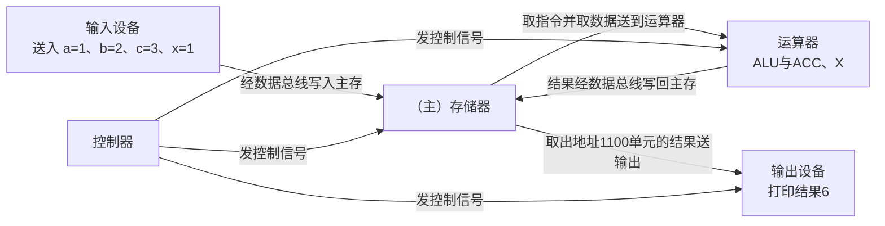

> 说明：原冯·诺依曼机中，输入输出设备与存储器之间的数据传送要**通过运算器**完成；现代计算机则以存储器为中心，I/O 直接与存储器交换数据。第 18 页示意图如下。

_p18.png>)

###### 顺序文字表述（按时间推进）

1. **输入**：输入设备把 a、b、c、x 写入主存 1000～1011 单元（原始数据进入主机）。
2. **取指**：控制器 PC 给出指令地址，从主存取出指令存入 IR，译码后发出控制信号。
3. **取数**：按指令地址码 Ad(IR) 送 MAR，从主存取出操作数（经 MDR）送运算器。
4. **运算**：运算器在 ACC 与 X 之间完成乘、加，结果保存在 ACC。
5. **存数**：把 ACC 结果经 MDR 写回主存 1100 单元。
6. **输出**：从主存 1100 单元取出结果，经输出设备打印（输出 6）。

##### 1.2 机器指令序列

###### 机器模型约定（简化单地址定点机）

- **控制器寄存器**：PC（程序计数器，与 MAR 之间有一条直接通路，可自动加一形成下一条指令地址）、MAR（存储器地址寄存器）、MDR（存储器数据寄存器，即 VDR）、IR（指令寄存器）。
- **运算器寄存器**：ACC（累加器）、X（操作数寄存器）、MQ（乘商寄存器，本例乘法结果放 ACC，用不到 MQ 高低位）。
- **ALU**：在 ACC 与 X 之间做算术运算。
- **指令格式**：每条指令占一个存储字 = **操作码 OP + 地址码 AD**。地址码 AD 为 4 位（后 4 位给出操作所需的内存地址），取指、取操作数均按存储单元地址寻址。
- **取指与执行**：取指令用 PC 地址取到 IR；取操作数用 IR 的地址码送 MAR 取到 MDR。OP(IR) 送 CU 译码产生控制信号，Ad(IR) 送 MAR 存取操作数。

| 指令 | 含义 | 具体操作 |
| --- | --- | --- |
| LOAD AD | 取数 | (ACC) ← M[AD]，把 AD 存储单元内容取到 ACC |
| MUL AD | 乘法 | 先把 M[AD] 取到 X，再 (ACC) ← (ACC) × (X) |
| ADD AD | 加法 | 先把 M[AD] 取到 X，再 (ACC) ← (ACC) + (X) |
| STORE AD | 存数 | M[AD] ← (ACC)，把 ACC 内容存到 AD 单元 |
| PRINT AD | 打印 | 输出打印 M[AD]（打印主存单元内容） |
| HLT | 停机 | 停止运行 |

###### 内存布局

| 地址（二进制） | 内容 | 备注 |
| --- | --- | --- |
| 0000～0111 | 8 条指令 | 程序区 |
| 1000 | a = 1 | 数据 a |
| 1001 | b = 2 | 数据 b |
| 1010 | c = 3 | 数据 c |
| 1011 | x = 1 | 数据 x |
| 1100 | 结果（初值空） | 存放结果单元 |

###### 指令序列（存于 0000～0111）

把 ax²+bx+c 改写为 (ax+b)x+c，用 ACC 保存中间结果，X 作为乘数/加数寄存器：

| 指令地址 | 指令 | 执行效果 |
| --- | --- | --- |
| 0000 | LOAD 1000 | (ACC) ← a = 1 |
| 0001 | MUL 1011 | (ACC) ← a × x = 1 × 1 = 1 |
| 0010 | ADD 1001 | (ACC) ← ax + b = 1 + 2 = 3 |
| 0011 | MUL 1011 | (ACC) ← (ax+b) × x = 3 × 1 = 3 |
| 0100 | ADD 1010 | (ACC) ← (ax+b)x + c = 3 + 3 = 6 |
| 0101 | STORE 1100 | M[1100] ← (ACC) = 6 |
| 0110 | PRINT 1100 | 打印输出 M[1100] = 6 |
| 0111 | HLT | 停机 |

> 恰好 8 条指令，正好占满 0000～0111 八个存储单元。第 72 页为完整示意图。

_p72.png>)

###### 指令的二进制编码示意（第 73 页）

若操作码占若干位、地址码占后 4 位，则每条指令是一个二进制字。例如把"取数、乘法、加法、存数、打印、停机"分别编码为不同 OP 码，再拼上 4 位地址码即得机器指令。取指与取操作数都按存储单元地址寻址。

##### 1.3 程序运行模拟（PC、MAR、MDR、IR、ALU 变化 + 总线数据流动）

###### 初始状态

- 主存 1000～1011 依次存 1、2、3、1；1100 初值为空；0000～0111 存上表 8 条指令。
- PC = 0000；MAR、MDR、IR、ACC、X 初值未定义。

###### 运行过程跟踪表（每个指令两行：取指 / 执行）

| 指令地址 | 阶段 | MAR | MDR | IR | ACC | X | 说明 |
| --- | --- | --- | --- | --- | --- | --- | --- |
| 0000 LOAD 1000 | 取指 | 0000 | LOAD 1000 | LOAD 1000 | 空 | 空 | PC→MAR，取指令，PC→0001 |
| 0000 LOAD 1000 | 执行 | 1000 | 1 | LOAD 1000 | 1 | 空 | 地址1000→MAR，取数a=1到ACC |
| 0001 MUL 1011 | 取指 | 0001 | MUL 1011 | MUL 1011 | 1 | 空 | PC→0010 |
| 0001 MUL 1011 | 执行 | 1011 | 1 | MUL 1011 | 1 | 1 | 取x=1到X，ACC=1×1=1 |
| 0010 ADD 1001 | 取指 | 0010 | ADD 1001 | ADD 1001 | 1 | 空 | PC→0011 |
| 0010 ADD 1001 | 执行 | 1001 | 2 | ADD 1001 | 3 | 2 | 取b=2到X，ACC=1+2=3 |
| 0011 MUL 1011 | 取指 | 0011 | MUL 1011 | MUL 1011 | 3 | 空 | PC→0100 |
| 0011 MUL 1011 | 执行 | 1011 | 1 | MUL 1011 | 3 | 1 | 取x=1到X，ACC=3×1=3 |
| 0100 ADD 1010 | 取指 | 0100 | ADD 1010 | ADD 1010 | 3 | 空 | PC→0101 |
| 0100 ADD 1010 | 执行 | 1010 | 3 | ADD 1010 | 6 | 3 | 取c=3到X，ACC=3+3=6 |
| 0101 STORE 1100 | 取指 | 0101 | STORE 1100 | STORE 1100 | 6 | 空 | PC→0110 |
| 0101 STORE 1100 | 执行 | 1100 | 6 | STORE 1100 | 6 | 空 | ACC=6→MDR，写M[1100]=6 |
| 0110 PRINT 1100 | 取指 | 0110 | PRINT 1100 | PRINT 1100 | 6 | 空 | PC→0111 |
| 0110 PRINT 1100 | 执行 | 1100 | 6 | PRINT 1100 | 6 | 空 | 读M[1100]=6送输出设备打印 |
| 0111 HLT | 取指 | 0111 | HLT | HLT | 6 | 空 | PC→1000 |
| 0111 HLT | 执行 | 空 | 空 | HLT | 6 | 空 | 停机 |

> 打印只能打印主存单元内容，故结果必须先用 STORE 写入 1100，再 PRINT 1100 打印。最终输出 **6**，与手工计算相符。

###### 各寄存器/部件作用与变化规律（在控制器示意图基础上理解）

- **PC**：存放当前要执行的指令地址，与 MAR 有一条直接通路，可自动加一形成下一条指令地址。
- **IR**：存放当前要执行的指令，内容来自 MDR。其操作码 OP(IR) 送 CU 译码产生控制信号；其地址码 Ad(IR) 送 MAR 以存取操作数。
- **MAR**：给出访存地址（取指令时=PC，取/存操作数时=Ad(IR)）。
- **MDR**：作为数据中转（取指令指令字、取操作数数据、存数结果、输出数据都经它）。
- **ACC / X / ALU**：ALU 在 ACC 与 X 之间完成加、乘，结果回存 ACC。

_p92.png>)

###### 总线上的数据流动

- **地址总线**：取指时 PC 送 MAR；取/存操作数时 Ad(IR) 送 MAR（均给出访存地址）。
- **数据总线**：
  - 取指令：M[MAR]（指令字）先送到 MDR，再由 MDR 送 IR；
  - 取操作数：M[MAR]（数据）先送到 MDR，再由 MDR 送 X（或 ACC）；
  - 存数：ACC 先送到 MDR，再由 MDR 送 M[MAR]；
  - 打印：M[MAR]（结果）先送到 MDR，再由 MDR 送输出设备。
- **控制总线**：控制器（CU）向各部件发控制信号，如存储器读/写信号、输出信号、运算控制信号等。

##### 1.4 易错提醒

1. **起始第一条取数**：要算 ax，应先 LOAD a 到 ACC，再 MUL x（x 取到 X），千万不要先 LOAD x——LOAD x 到 ACC 后再乘 x 得到的是 x 平方，不是 ax。
2. **先改写表达式**：ax²+bx+c 直接算要做平方；改写为 (ax+b)x+c 可避免自己写平方指令，且少一次乘法。
3. **先存后打**：PRINT 只能打印主存单元内容，必须先 STORE 到 1100 再 PRINT；若直接 PRINT 某寄存器会出错。
4. **取操作数用 Ad(IR)**：取指令用 PC，取操作数用 IR 的地址码，两者不能混淆。
5. **结果核对**：务必手算一遍，(1 乘 1 加 2) 乘 1 加 3 = 6，扫描到 ACC=6、M[1100]=6、输出 6 才算正确。

---

#### 题目二：冯诺依曼机结构图与 6 大特点

##### 2.1 冯诺依曼机定义

冯·诺依曼提出一种计算机模型，描绘了现代计算机的雏形，其核心思想在于 **"存储程序"**。基于此模型的各类计算机通称为冯诺依曼机。"存储程序"指把程序（指令）与数据都以二进制形式存放在存储器中，机器按顺序逐条取指令执行。

##### 2.2 结构图（以运算器为中心，标注中心部件）

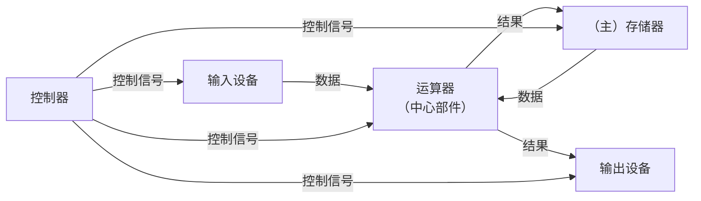

- **中心部件 = 运算器**。原冯诺依曼机以运算器为中心：输入设备与输出设备之间的数据传送、存储器与 I/O 之间的数据传送都**经过运算器**。
- **五大部件**：运算器、存储器、控制器、输入设备、输出设备。
- **控制器**：指挥各部件，内含 PC、IR、CU。

> **现代计算机以存储器为中心**，所以教学上常额外画"以存储器为中心"的版本：I/O 与存储器直接交换数据，运算器经 ALU 与存储器交换，不绕经运算器。考试判定时注意区分"原冯诺依曼=以运算器为中心""现代=以存储器为中心"。

##### 2.3 冯诺依曼机的 6 大特点

| 序号 | 特点 | 要点补充 |
| --- | --- | --- |
| 1 | 计算机由运算器、存储器、控制器、输入设备和输出设备**五大部件**组成 | 五部件缺一不可 |
| 2 | 指令和数据**以同等地位**存放于存储器内，并**可按地址寻访** | 存储程序；程序与数据统一编址 |
| 3 | 指令和数据**均用二进制数**表示 | 程序与数据都二进制编码 |
| 4 | 指令由**操作码**（指明操作性质）和**地址码**（指明操作数在存储器中的位置）组成 | 判断是取数、乘法、加法等 |
| 5 | 指令在存储器内按顺序存放，通常**顺序执行**，特定条件下可按结果或设定条件**改变执行顺序** | 对应转移/跳转指令 |
| 6 | **机器以运算器为中心** | 输入输出设备与存储器间数据传送通过运算器完成 |

> 第 6 条同时附注：**现代计算机以存储器为中心**（红字重点，常设考点）。

_p128.png>)

##### 2.4 对比：以运算器为中心 vs 以存储器为中心

| 对比项 | 原冯诺依曼机（以运算器为中心） | 现代计算机（以存储器为中心） |
| --- | --- | --- |
| 数据传送路径 | I/O 与存储器之间数据传送**经过运算器** | I/O 与存储器直接交换数据，不绕运算器 |
| 结构瓶颈 | 运算器负担重，I/O 速度受牵制 | 存储器为数据交换中枢，更高效 |
| 判定要点 | 题目若问"冯诺依曼机特点第 6 条" | 题目若问"现代计算机"则答以存储器为中心 |

##### 2.5 易错提醒

1. **"存储程序"要写全**：核心思想是"存储程序"，指的是程序（指令）与数据一起存放在存储器中并按顺序执行，不是简单说"程序存在内存里"。
2. **以运算器为中心 vs 以存储器为中心**：冯诺依曼机特点第 6 条=以运算器为中心；注意"现代计算机以存储器为中心"，两者别搞反。
3. **五大部件名称**精确为"运算器、存储器、控制器、输入设备、输出设备"，输入/输出合称 I/O，不要写成"主机、外设"这类非考纲表述。
4. **指令组成**：操作码 + 地址码。操作码给"做什么"，地址码给"对哪个存储单元做"。

---

#### 题目三：计算机分层结构（M0～M4）

##### 3.1 分层结构图

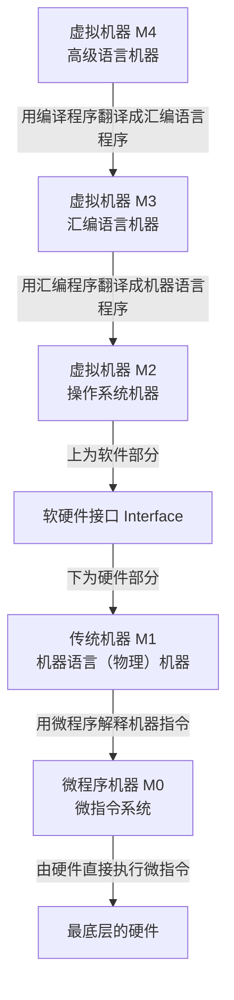

- **软硬件接口**：位于 **M1（传统机器）与 M2（操作系统机器）之间**（虚线处），是划分软件与硬件的分界线。接口以上为软件（虚拟机器），接口以下为硬件（裸机）。
- **虚拟机器（软件侧）**：M4、M3、M2。
- **裸机（硬件侧）**：M1、M0。

##### 3.2 各层定义与转换关系

| 层次 | 名称 | 一句话定义 | 翻译/解释关系 |
| --- | --- | --- | --- |
| M4 | 虚拟机器（高级语言机器） | 直接面向高级语言程序 | 用**编译程序**翻译成汇编语言程序 |
| M3 | 虚拟机器（汇编语言机器） | 面向汇编语言程序 | 用**汇编程序**翻译成机器语言程序 |
| M2 | 虚拟机器（操作系统机器） | 提供资源管理与系统调用等 | 控制管理计算机软硬件资源 |
| M1 | 传统机器（机器语言机器） | 能直接执行机器指令 | 用**微程序**解释机器指令 |
| M0 | 微程序机器（微指令系统） | 用微指令描述机器指令 | 由**硬件直接执行微指令** |

##### 3.3 易错提醒

1. **软硬件接口位置**必考：在 **M1 与 M2 之间**，而不是 M0 与 M1 之间或 M2 与 M3 之间。
2. **每条转换用什么程序**：M4 到 M3 用"编译程序"，M3 到 M1 用"汇编程序"，M1 到 M0 用"微程序"，M0 由硬件直接执行。别把编译与汇编搞混。
3. **M0 是最底层**，是微指令系统（由硬件直接执行微指令），它不属于"机器语言机器"。
4. M1 称作"传统机器/机器语言机器"是"物理机/裸机"的最上层，M0 也是裸机的一部分。

_p141.png>)

---

#### 题目四：计算机字长与主要性能指标

##### 4.1 四种"字长"概念与辨析

| 字长 | 定义 | 与什么有关/等于什么 |
| --- | --- | --- |
| 机器字长 | 与 CPU 的通用寄存器位数有关，决定计算机运算精度，也叫计算机位数，是一次整数（定点数）运算可以支持的最大位数 | = 通用寄存器位数 = ALU 一次整数运算的数据宽度；**浮点数运算不包括在内** |
| 指令字长 | 等于一个指令字的位数，与机器字长**没有关系**，一般取存储字长的整数倍或 1/2 倍 | = 一条指令的位数 |
| 存储字长 | 一个存储单元的二进制位数 | = 一个存储单元能存放的位数 |
| 数据字长 | 数据总线的位数，等于 MDR 的位数 | = 数据总线宽度 = MDR 位数 |

**辨析要点**：

- 机器字长与存储字长、指令字长**无必然相等关系**；机器字长决定运算精度与一次定点数运算位数。
- 数据字长 = 数据总线位数 = MDR 位数；存储字长与数据字长关系密切（常相等或成倍数）。
- 指令字长与机器字长无关，常为存储字长的整数倍或 1/2 倍。

_p144.png>)

##### 4.2 主要性能指标：定义与公式

| 指标 | 定义 | 公式/关系（公式见下方公式块） |
| --- | --- | --- |
| 时钟周期（T） | CPU 中最小的单位时间，通常为节拍脉冲或 T 周期 | T 等于 1 除以主频，单位为秒 |
| 主频（f） | 即 CPU 时钟频率，与时钟周期互为倒数，单位为 Hz（1 GHz 等于 10 的 9 次方 Hz） | f 等于 1 除以 T，即为每秒的时钟周期数 |
| 机器周期（CPU 周期） | 完成一个基本操作（取指令、存储器读、存储器写等）所需时间，常用从内存读取一个指令字的最短时间来规定 | 通常为若干时钟周期 |
| CPI（Cycle per Instruction） | 执行一条指令所需的时钟周期数 | 平均 CPI 等于各类指令占比乘对应 CPI 再求和 |
| CPU 执行时间（E） | 运行一个程序所花费的时间 | E 等于所需CPU时钟周期数乘时钟周期，也等于所需CPU时钟周期数除以主频 |
| MIPS | 每秒能够执行多少百万条指令 | MIPS 等于 主频 除以（平均CPI 乘 10 的 6 次方） |
| MFLOPS / GFLOPS / TFLOPS | 每秒执行多少百万 / 十亿 / 万亿次浮点运算 | 反映浮点运算速度 |
| 吞吐量（throughput） | 单位时间内所完成的工作量 | 系统性能的两个基本指标之一 |
| 响应时间（response time） | 从任务开始到完成所花费的时间，也称执行时间（execution time） | 系统性能的两个基本指标之一 |

**关键公式（集中写出）**：

$$CPI = \sum_{i} \left(P_i \times CPI_i\right)$$

$$E_{CPU} = \frac{\text{指令条数} \times CPI}{f} = \text{指令条数} \times CPI \times T$$

$$MIPS = \frac{f}{CPI \times 10^6}$$

> 可见 CPU 性能取决于三个要素：**主频**、**CPI**、**指令条数**。（第 147 页）

_p147.png>)

_p146.png>)

##### 4.3 计算例子

###### 例 1（2013 年 408 真题，求 MIPS）

某计算机主频为 1.2 GHz，其指令分为 4 类，它们在基准程序中所占比例及 CPI 如下表。求该机的 MIPS。

| 指令类型 | 所占比例 | CPI |
| --- | --- | --- |
| A | 50% | 2 |
| B | 20% | 3 |
| C | 10% | 4 |
| D | 20% | 5 |

**解答**：

1. 先求平均 CPI：
$$CPI = 0.5 \times 2 + 0.2 \times 3 + 0.1 \times 4 + 0.2 \times 5 = 1.0 + 0.6 + 0.4 + 1.0 = 3.0$$

2. 再求 MIPS：
$$MIPS = \frac{f}{CPI \times 10^6} = \frac{1.2 \times 10^9}{3.0 \times 10^6} = 400$$

**答案：该机 MIPS = 400**（选项 C）。

_p153.png>)

###### 例 2（求 CPU 执行时间）

某程序一共 2000 条指令，其平均 CPI 为 1.5，主频为 2 GHz。求该程序的 CPU 执行时间。

**解答**：

$$E_{CPU} = \frac{指令条数 \times CPI}{f} = \frac{2000 \times 1.5}{2 \times 10^9} = \frac{3000}{2 \times 10^9} = 1.5 \times 10^{-6} \text{ 秒} = 1.5 \ \mu s$$

**答案：约 1.5 微秒。**

###### 例 3（吞吐量与响应时间概念判断）

- 响应时间 = 完成一个任务花费的时间，越小越好。
- 吞吐量 = 单位时间内完成的工作量（如每秒处理的请求数/作业数），越大越好。
- 二者之间可以相互转化：吞吐量 = 工作总量 / 响应时间（对一组连续任务而言）。

##### 4.4 易错提醒

1. **CPI 是"每条指令的时钟周期数"**，不是时间；CPU 执行时间才包含主频/时钟周期。
2. **平均 CPI 用加权**：$CPI = \sum (占比 \times CPI_i)$，占比之和应为 100%。MIPS 计算先用平均 CPI，再代入 $f$。
3. **MIPS 公式分母 $\times 10^6$**：因为 MIPS 是"百万"条指令/秒，主频是 Hz（即每秒多少周期），单位换算别漏。
4. **MIPS 不能很好反映性能**：不同指令的 CPI 不同，只看指令条数/秒无法反映真实执行速度；浮点运算用 MFLOPS/GFLOPS 衡量。
5. **机器字长是定点（整数）运算**，浮点数运算位数不包含在机器字长内；机器字长、指令字长、存储字长、数据字长是四个不同概念，别混为一谈。
6. **吞吐率与响应时间是系统级性能指标**，CPU 性能三大要素是主频、CPI、指令条数，两组概念要区分清楚。

---

#### 资料定位

> 以下为本讲解答取材的本地资料（命中页按优先级排列；零壹 PPT 命中最前）。

**零壹 PPT（最高优先级，命中页排最前）**

- 《计算机组成原理/基础/PPT/计算机组成基础课1_绪论_PPT (1).pdf》 第 17、18、19、28 页：ax²+bx+c 数据在输入设备、主存、运算器、输出设备间的流动（图文）。
- 同文件 第 72 页：ax²+bx+c 机器指令序列 + 存储单元布局（&a=1000、&b=1001、&c=1010、&x=1011、&结果=1100）。
- 同文件 第 73 页：机器指令二进制编码；第 88 页：机器指令的三个问题（存放位置、如何取指、如何执行）。
- 同文件 第 92、93、94、95 页：控制器（PC、IR、CU 及取指/取数过程）。
- 同文件 第 127、128 页：冯诺依曼机及 6 大特点（以运算器为中心；现代机以存储器为中心）。
- 同文件 第 139、141 页：计算机系统多级层次结构（M0～M4、软硬件接口在 M1 与 M2 之间）。
- 同文件 第 144 页：机器字长、指令字长、存储字长、数据字长辨析。
- 同文件 第 146、147、148 页：时钟周期、机器周期、主频、CPI、CPU 执行时间、MIPS、MFLOPS、GFLOPS、TFLOPS。
- 同文件 第 153、154 页：2013 年 408 真题（主频 1.2 GHz，四类指令占比与 CPI，求 MIPS，答案 400）。
- 同文件 第 156 页：性能指标例（神威太湖之光）。

**零壹讲义**

- 《计算机组成原理/基础/讲义/零壹计组基础讲义1_基础绪论 (1).pdf》 第 6、7、8 页：运算器与寄存器、ACC/X、寻址与存储字、指令系统引入。
- 同文件 第 9 页：ax²+bx+c 改写为 (ax+b)x+c 并写结果到 (1100)2 的指令序列问题。
- 同文件 第 11 页：冯诺依曼机及特点；第 12 页：多级层次结构设计思想；第 13 页：使用层次架构存储。
- 同文件 第 14 页：机器字长、指令字长、存储字长、数据字长辨析；第 15 页：CPI、CPU 执行时间、MIPS、MFLOPS 等。

**袁春风教材（判定标准，较严谨）**

- 《计算机组成与系统结构（第 3 版）（袁春风、唐杰、杨若瑜、李俊）》 第 33 页：计算机性能的定义（吞吐率、响应时间）。
- 同书 第 34 页：CPI 的定义、综合 CPI、CPU 执行时间公式。
- 同书 第 37 页：计算机系统基本性能指标（响应/执行时间、吞吐率，CPU 基本参数主频、CPI，MIPS/MFLOPS 等）。
- 同书 第 61 页：字长（CPU 内部用于整数运算的数据通路宽度，即平时说的 16 位、32 位）。

> 冲突处理：教材/真题解析作为最终判定标准；PPT、讲义用作教学框架与图示。本讲核心定义（冯诺依曼 6 特点、四种字长、CPI/MIPS 公式、层次结构）与教材一致。


## 第二讲 数据的表示与运算（一：真值、码制、移位）

> 本讲解答第 1-6 题。约定：以下"机器字长 n+1"指 1 位符号位 + n 位数值位（与 408 考纲、王道、袁春风教材一致）。若题目给出的是"总字长为 n 位"，则把本讲的 n 替换为 n 减 1（即数值位为 n 减 1）。定点数一律分"定点整数"和"定点小数"两种情况讨论。

#### 第 1 题 真值、机器数与数据表示要解决的问题

##### 1. 真值（真值 True Value）

真值是一个数"真正"的数学数值，用带正负号的形式书写，能直接看出大小与符号，例如 +5、负 3、正 0.375、负 0.375、负 128。真值是客观的数学值，不以计算机的存储形式为转移。

##### 2. 机器数（机器数 Machine Number）

机器数是真值在计算机中实际保存的 0、1 位串。计算机只能存 0 和 1，无法直接存加号、减号和小数点，所以必须把符号也编码成 0、1，并约定小数点的位置。这个"带有符号信息的 0、1 位串"就叫机器数。

例如：

- 真值 +5 的 8 位补码机器数是 00000101；
- 真值 负 5 的 8 位补码机器数是 11111011；
- 真值 负 0.375 的 5 位补码机器数（定点小数）是 1.1010。

##### 3. 数据表示主要解决的问题

数据表示 Data Representation 要解决的核心问题：用有限个 0、1 位串，把"带符号、带小数、数量可能无穷"的真值，转换成"计算机能存储、能比较、能运算"的机器数。它具体解决四件事：

1. 符号的二进制编码：用最高位作符号位（0 正、1 负），这是原码、反码、补码、移码的共同出发点；
2. 小数点的定位：定点数（小数点位置固定）与浮点数（小数点位置浮动，阶码加尾数）；
3. 零的表示与范围的取舍：原码、反码存在正零和负零两种零，补码零唯一，并能多表示一个最小负数；不同编码得到确定的表示范围；
4. 让运算（尤其是减法）便于实现：原码做加减要判符号、判大小，麻烦；补码把减法变成加法（模运算）；移码便于比较大小。

> 例如补码为什么"能自然做加减法"：因为补码的符号位权重为负，符号位和数值位能像普通二进制一样相加。

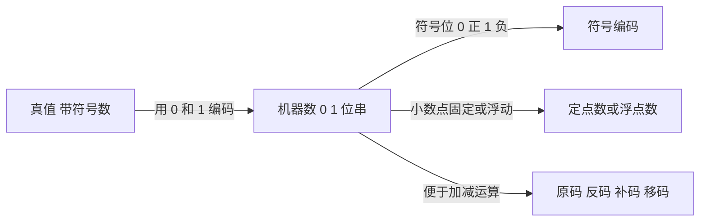

易错提醒：真值是数学值，机器数是计算机里存的位串，两者不能混用。数据表示本质上是在"有限位串"与"无穷真值"之间做取舍，不同编码方案的表示范围、零的个数、运算便利程度都不同。

#### 第 2 题 原码、反码、补码

##### 2.1 定义

三种表示的共同点：都用机器数的最高位作符号位（0 正、1 负），区别在于绝对值部分（数值位）的编码方式不同。

**原码（Sign-Magnitude 原码）**：符号位加真值的绝对值。

- 正数：符号位 0，数值位等于真值绝对值。
- 负数：符号位 1，数值位等于真值绝对值。
- 例子：+5 的原码（8 位）00000101，负 5 的原码 10000101；正 0.375 的原码 0.0110，负 0.375 的原码 1.0110。
- 原码有正零（0.0000）和负零（1.0000）两种零。

**反码（One's Complement 反码）**：

- 正数：与原码相同（符号位 0，数值位等于真值绝对值）。
- 负数：符号位 1，数值位等于真值绝对值逐位取反（即对原码数值位取反）。
- 例子：负 0.375 的原码 1.0110，反码 1.1001（数值位 0110 逐位取反得 1001）。
- 反码有正零（0.0000）和负零（1.1111）两种零。

**补码（Two's Complement 补码）**：

- 正数：与原码相同。
- 负数：符号位 1，数值位等于真值绝对值逐位取反再加 1。
- 例子：负 0.375，原码 1.0110，数值位 0110 取反得 1001，再加 1 得 1010，故补码 1.1010。
- 补码零唯一（0.0000），且补码能表示负 1（定点小数）或负 2 的 n 次方（定点整数），比原码、反码多表示一个最小负数。

##### 2.2 真值与机器数关系的公式

**定点整数（机器字长 n+1，1 位符号位加 n 位数值位）：**

$$原码: [x]_原=\begin{cases} x, & 0\le x<2^{n} \\ 2^{n}-x, & -2^{n}<x\le 0 \end{cases}$$

$$反码: [x]_反=\begin{cases} x, & 0\le x<2^{n} \\ (2^{n+1}-1)+x, & -2^{n}<x\le 0 \end{cases}$$

$$补码: [x]_补=\begin{cases} x, & 0\le x<2^{n} \\ 2^{n+1}+x, & -2^{n}\le x<0 \end{cases}$$

**定点小数（机器字长 n+1，1 位符号位加 n 位小数位）：**

$$原码: [x]_原=\begin{cases} x, & 0\le x<1 \\ 1-x, & -1<x\le 0 \end{cases}$$

$$反码: [x]_反=\begin{cases} x, & 0\le x<1 \\ (2-2^{-n})+x, & -1<x\le 0 \end{cases}$$

$$补码: [x]_补=\begin{cases} x, & 0\le x<1 \\ 2+x, & -1\le x<0 \end{cases}$$

说明：原码、补码的定点小数公式说明，补码负数用"模 2"运算，所以符号位为 1 时整体落在 1 到 2 之间。式中的 x 是真值，左边是机器数（按位串整体解释成的一个数）。

##### 2.3 数据表示范围

**定点整数（n 位数值位）：**

原码、反码为负（2 的 n 次方减 1）到正（2 的 n 次方减 1），即关于原点对称，且都有两种零；补码、移码为负（2 的 n 次方）到正（2 的 n 次方减 1），零唯一。

$$定点整数: 原码、反码:\ -(2^{n}-1)\le x\le 2^{n}-1;\qquad 补码、移码:\ -2^{n}\le x\le 2^{n}-1$$

**定点小数（n 位小数位）：**

原码、反码为负（1 减 2 的负 n 次方）到正（1 减 2 的负 n 次方）；补码为负 1 到正（1 减 2 的负 n 次方），零唯一。

$$定点小数: 原码、反码:\ -(1-2^{-n})\le x\le 1-2^{-n};\qquad 补码:\ -1\le x\le 1-2^{-n}$$

汇总表（机器字长 n+1 位）：

| 编码 | 定点整数（n 位数值位） | 定点小数（n 位小数位） |
| --- | --- | --- |
| 原码 | 负（2 的 n 次方减 1）到（2 的 n 次方减 1） | 负（1 减 2 的负 n 次方）到（1 减 2 的负 n 次方） |
| 反码 | 负（2 的 n 次方减 1）到（2 的 n 次方减 1） | 负（1 减 2 的负 n 次方）到（1 减 2 的负 n 次方） |
| 补码 | 负（2 的 n 次方）到（2 的 n 次方减 1） | 负 1 到（1 减 2 的负 n 次方） |
| 移码 | 负（2 的 n 次方）到（2 的 n 次方减 1） | 一般只用于定点整数，不用定点小数 |

易错提醒：

- 补码比原码、反码多表示一个最小负数；定点小数补码能把负 1（1.0000 补码）也表示出来。
- 原码、反码各有两种零（正零、负零），所以它们能表示的"有效状态数"比补码少一个。
- 表示范围是"闭区间"，上界、下界都取等号；不要把边界写错。

##### 2.4 补码的位权表示法

补码可以按各二进制位（位权）展开求和。设符号位权重为负，其余数值位权重为正：

$$整数: x=-x_n\cdot 2^{n}+\sum_{i=0}^{n-1}x_i\cdot 2^{i}$$

$$小数: x=-x_0+\sum_{i=1}^{n}x_i\cdot 2^{-i}$$

说明：最高位（符号位）权重为负（整数是负 2 的 n 次方，小数是负 1），其余各位权重为正。正因为符号位权重为负，补码符号位为 1 时表示负数，且加减法可以像无符号数一样直接做。

举例：

- 5 位补码 1.1010（定点小数）：负 1 加 1 乘 2 的负 1 次方，加 0 乘 2 的负 2 次方，加 1 乘 2 的负 3 次方，加 0 乘 2 的负 4 次方，等于负 1 加 0.5 加 0.125，等于负 0.375。
- 8 位补码 10000000（定点整数）：负 1 乘 2 的 7 次方，加 0，等于负 128（补码能表示的最小数）。

##### 2.5 原码、反码、补码的相互转换与取反方法

- 原码与反码互转：符号位不变，负数把数值位逐位取反；正数不变。双向同一规则。
- 原码转补码：正数不变；负数符号位不变，数值位逐位取反再加 1。
- 补码转原码：正数不变；负数符号位不变，数值位逐位取反再加 1（与上面同一规则）。
- 反码转补码：正数不变；负数在反码基础上末位加 1。
- 取反的含义：指按位取反（逐位 0 变 1、1 变 0）。要区分"按位取反"（求反码用）与"取反再加 1"（求补码、求相反数用）。

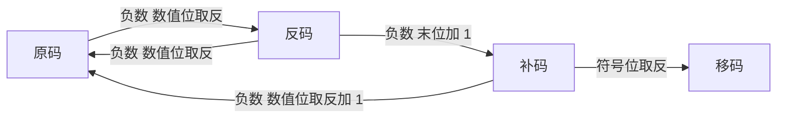

易错提醒：

- 对补码"连同符号位取反再加 1"得到的是该数的相反数（用于求负 x），而不是原码。要求原码要"符号位不变，数值位取反再加 1"。
- 例子：补码 1.1010（负 0.375）连同符号位取反再加 1 得 0.0110（正 0.375），这是相反数；而保留符号位、数值位 1010 取反再加 1 得 1.0110（原码）。

#### 第 3 题 移码表示法

##### 3.1 真值与机器数关系的公式，并举例

移码给真值加一个偏移量（偏置值 bias），偏移量通常取 2 的 n 次方（机器字长 n+1）：

$$[x]_移 = x + 2^{n}$$

即：先把真值 x 加上偏移量，再按无符号数的方式直接写成 n+1 位二进制。

- 例一：8 位移码（n=7，偏置为 128），真值负 64 的移码等于负 64 加 128，等于 64，写成 01000000。
- 例二：移码 01000000 按无符号数解释为 64，则真值等于 64 减 128，等于负 64。

##### 3.2 数据表示范围

移码一般用于定点整数（浮点数的阶码也用移码，但偏移量不同）。移码表示范围：

$$-2^{n}\le x\le 2^{n}-1$$

移码中零的表示唯一（8 位移码的零是 10000000，因为 0 加 128 等于 128）。

##### 3.3 移码与补码的关系

- 同一个真值的移码和补码，仅相差一个符号位（当偏移量取 2 的 n 次方时）。即移码符号位与补码符号位相反，数值位相同。
- 例：负 64 的 8 位补码是 11000000，移码是 01000000，符号位相反。
- 性质：移码的大小关系与真值的大小关系一致，移码越大真值越大，因此移码便于比较大小。
- 移码只用于整数（阶码），不用定点小数。

易错提醒：浮点数 IEEE 754 的阶码也用"移码"，但偏移量是 2 的 n 次方减 1（例如 8 位阶码偏移 127），而不是移码定义里的 2 的 n 次方（128）。两者差 1，要区分开。移码与补码"仅差符号位"这条性质只在偏移量取 2 的 n 次方时成立。

#### 第 4 题 算术移位规则，溢出与精度损失

##### 4.1 算术移位规则

算术移位针对有符号数（定点整数、定点小数），相当于把真值乘以或除以 2 的 k 次方（左移乘、右移除）。

- 原码、反码：符号位不动，只有数值位参与移动。
- 补码：符号位和数值位一起参与移动。

空位补数（填入移动后腾出的位）：

| 数的符号 | 机器数形式 | 左移空位补 | 右移空位补 |
| --- | --- | --- | --- |
| 正数 | 原码、补码、反码 | 0 | 0 |
| 负数 | 原码 | 0 | 0 |
| 负数 | 反码 | 1 | 1 |
| 负数 | 补码 | 0 | 1 |

记忆要点：补码右移补符号位（正补 0、负补 1）；补码左移补 0（即使符号位是 1 也补 0，所以补码负数左移可能改变符号导致溢出）；原码正负都补 0；反码正数补 0、负数补 1。

##### 4.2 用 0.375 与负 0.375 分析（机器字长 5 位定点小数，1 位符号加 4 位小数）

先写初始机器数：

- 0.375 等于 0.0110 二进制，原码、反码、补码都是 0.0110。
- 负 0.375 等于负 0.0110 二进制，原码 1.0110，反码 1.1001（数值位取反），补码 1.1010（数值位取反加 1）。

**正数 0.375（原码、反码、补码都是 0.0110）：**

| 操作 | 原码 | 补码 | 反码 | 移位后真值 | 判断 |
| --- | --- | --- | --- | --- | --- |
| 左移 1 位（乘以 2） | 0.1100 | 0.1100 | 0.1100 | 0.75 | 正确 |
| 左移 2 位（乘以 4） | 0.1000 | 0.1000 | 0.1000 | 0.5 | 溢出（应为 1.5） |
| 右移 1 位（除以 2） | 0.0011 | 0.0011 | 0.0011 | 0.1875 | 正确 |
| 右移 2 位（除以 4） | 0.0001 | 0.0001 | 0.0001 | 0.0625 | 精度丢失（应为 0.09375） |

**负数 负 0.375（原码 1.0110、反码 1.1001、补码 1.1010）：**

| 操作 | 原码 | 补码 | 反码 | 说明 | 判断 |
| --- | --- | --- | --- | --- | --- |
| 左移 1 位 | 1.1100 | 1.0100 | 1.0011 | 三者真值都是 0.75 的负数 | 正确 |
| 左移 2 位 | 1.1000 | 0.1000 | 1.0111 | 原码、反码是 0.5 的负数，补码变正 0.5 | 溢出（应为 1.5 的负数） |
| 右移 1 位 | 1.0011 | 1.1101 | 1.1100 | 三者真值都是 0.1875 的负数 | 正确 |
| 右移 2 位 | 1.0001 | 1.1110 | 1.1110 | 原码、反码是 0.0625 的负数，补码是 0.125 的负数 | 精度丢失（应为 0.09375 的负数） |

说明（数值核对）：原码、反码、补码三种编码下，负 0.375 左移 1 位都应得到负 0.75 的机器数。注意补码左移 2 位得到 0.1000，符号位由 1 变成 0，符号反转，这是典型的溢出现象。

##### 4.3 溢出与精度损失分别在何时发生

- 左移溢出：左移后真值超出该编码的表示范围就发生溢出。定点小数左移后绝对值大于等于 1 即溢出；定点整数左移后超出上界或下界即溢出。补码负数左移若符号位被数值位侵占、符号反转，也属于溢出。判别方法：左移时移出的最高位为 1（或结果超出范围），即溢出。
- 右移精度损失：右移时被移出的低位不全为 0，真值无法精确表示，发生截断（向 0 的方向舍入），称为精度丢失。被丢弃的低位越多、值越大，误差越大。
- 本例判断：0.375（0.0110）左移 1 位，移出的是 0，结果 0.1100 准确；左移 2 位，移出的 01 不是全 0 且结果超出范围，溢出。右移 1 位，丢弃的末位是 0，结果 0.0011 准确；右移 2 位，丢弃的末两位 10 不是全 0，结果 0.0001 相对 0.09375 发生精度丢失。

易错提醒：原码、反码负数左移空位补 0，补码负数左移空位也补 0 但符号位会跟着一起移动，所以补码负数左移最容易出现"符号被占、符号反转"的溢出现象。右移只损失精度、不溢出；左移只溢出、不损失精度（左移空位补 0，不丢信息，只是内容超出范围）。

#### 第 5 题 逻辑移位规则

逻辑移位把机器数看作无符号数，不区分符号位与数值位，符号位也当作数值参与移动。

- 逻辑左移：高位移出（若最高位为 1 则发生溢出），低位补 0。
- 逻辑右移：低位移出（丢弃），高位补 0。

意义：对无符号数，逻辑左移相当于乘以 2，逻辑右移相当于整除 2（向下取整）。C 语言等高级语言用逻辑移位来处理无符号数的乘除。

- 例子：无符号数 11011101 逻辑左移 1 位得 10111010（最高位 1 移出，溢出），逻辑右移 1 位得 01101110（最高位补 0）。

与算术移位的区别：逻辑移位不考虑符号，所有位一起移动，空位固定补 0；算术移位保留符号位（原码、反码符号位不动，补码符号位参与移动但右移补符号位）。

易错提醒：无符号整数右移用逻辑移位（补 0）；带符号整数右移用算术移位（补符号位）。不要混用。逻辑左移只看最高位移出的是否为 1 来判断溢出。

#### 第 6 题 循环移位规则（带进位与不带进位）

##### 6.1 规则

循环移位：移出的位又移入数据中（数据位不丢失）。根据是否带有进位标志位 CF，分为带进位循环移位和不带进位循环移位两种；每种又分左移、右移。

| 类型 | 移位方向 | 规则 |
| --- | --- | --- |
| 不带进位 | 循环左移 ROL | 最高位同时移入 CF 和最低位，其余位逐位左移 |
| 不带进位 | 循环右移 ROR | 最低位同时移入 CF 和最高位，其余位逐位右移 |
| 带进位 | 循环左移 RCL | 最高位移入 CF，CF 移入最低位 |
| 带进位 | 循环右移 RCR | 最低位移入 CF，CF 移入最高位 |

要点：不带进位循环时，CF 只是"复制"了移出位（数据自身完整旋转）；带进位循环时，CF 作为一个额外位参与 9 位旋转（8 位数据加 CF）。

##### 6.2 以 8 位机器数 11011101 为例（设 CF 初值为 0）

| 类型 | 移位方向 | 移位后机器数 | 进位标志 CF | 说明 |
| --- | --- | --- | --- | --- |
| 不带进位 | 循环左移 ROL | 10111011 | 1 | 最高位 1 同时进 CF 和最低位 |
| 不带进位 | 循环右移 ROR | 11101110 | 1 | 最低位 1 同时进 CF 和最高位 |
| 带进位 | 循环左移 RCL | 10111010 | 1 | 最高位 1 进 CF，CF 原 0 进最低位 |
| 带进位 | 循环右移 RCR | 01101110 | 1 | 最低位 1 进 CF，CF 原 0 进最高位 |

逐位说明：

- 不带进位循环左移：11011101 的最高位 1 移到 CF，同时循环转回最低位，结果 10111011。
- 不带进位循环右移：11011101 的最低位 1 移到 CF，同时循环转到最高位，结果 11101110。
- 带进位循环左移：11011101 的最高位 1 进入 CF，原 CF（0）填入最低位，结果 10111010。
- 带进位循环右移：11011101 的最低位 1 进入 CF，原 CF（0）填入最高位，结果 01101110。

易错提醒：循环移位与逻辑移位的区别是"移出的位是否回到数据里"。逻辑移位移出后丢弃（补 0），循环移位移出的位回到另一端（不丢位）。循环移位一般不溢出（位数不变），带进位循环是把 CF 也拉进旋转。循环移位不考虑符号位，符号位也参与移动。

#### 易错提醒汇总

1. 真值是数学值，机器数是机器里存的位串，不要混用。
2. 补码比原码、反码多表示一个最小负数；补码零唯一；定点小数补码能表示负 1。
3. 原码、反码都有正零和负零两种零，因此比补码少一个有效状态。
4. 原码、补码互转：正数不变，负数符号位不变、数值位取反加 1；反码转补码：负数末位加 1。
5. 对补码"连同符号位取反加 1"得到相反数，不是原码；求原码要保留符号位、只对数值位取反加 1。
6. 移码与补码"仅差符号位"只在偏移量取 2 的 n 次方时成立；IEEE 754 阶码偏移是 2 的 n 次方减 1（8 位是 127）。
7. 算术移位：原码、反码符号位不动；补码符号位参与移动。补码左移补 0、右移补符号位；原码正负都补 0；反码正数补 0、负数补 1。
8. 算术右移只损失精度不溢出；算术左移只溢出不损失精度。补码负数左移最易符号反转而溢出。
9. 逻辑移位看作无符号数，左移低位补 0、右移高位补 0；无符号数右移用逻辑移位，带符号整数右移用算术移位。
10. 循环移位分带进位与不带进位，移出的位回到数据另一端，位数不变、一般不溢出；带进位时 CF 参与旋转。

#### 资料定位

（以下均为本地资料库命中页，零壹 PPT 排在最前。）

- 《计算机组成原理基础课2_数据的机器级表示_PPT》第 47 页：真值及其机器级表示（平移表示法引入移码）
  _p47.png>)
- 《计算机组成原理基础课2_数据的机器级表示_PPT》第 59、61、63、64、69、70 页：原码、补码表示法（整数，含公式与例子）
- 《计算机组成原理基础课2_数据的机器级表示_PPT》第 73 页：有符号整数的补码表示法，补码位权表示法（真值与机器数的关系）
- 《计算机组成原理基础课2_数据的机器级表示_PPT》第 77、78 页：反码表示法（含正负零）
- 《计算机组成原理基础课2_数据的机器级表示_PPT》第 86 页：移码表示法（性质：与补码差符号位、零唯一、大小关系一致）
  _p86.png>)
- 《计算机组成原理基础课2_数据的机器级表示_PPT》第 94、97、102 页：定点小数原码、补码表示法（含 8 位例子与范围）
- 《计算机组成原理基础课2_数据的机器级表示_PPT》第 110 页：原码、反码、补码、移码表示范围总结表
  _p110.png>)
- 《计算机组成基础课3_数据运算的过程与实现_PPT》第 3-12 页：算术移位（0.375 与负 0.375 的原码、反码、补码左移右移，溢出与精度损失）
  _p5.png>)
  _p9.png>)
- 《计算机组成基础课3_数据运算的过程与实现_PPT》第 16-21 页：逻辑移位与循环移位（11011101 不带进位、带进位循环左移）
  _p16.png>)
  _p20.png>)
- 《零壹计组基础讲义2_数据的机器级表示》第 5-14 页：原码、反码、补码、移码定义与范围、位权表示法
- 《零壹计组基础讲义4_数据的存储转换与浮点数》第 4 页：移位运算（逻辑移位与算术移位，无符号数与带符号数）
- 《计算机组成强化1_数据运算总线_PPT》第 43-45 页：移位运算回顾（无符号数逻辑移位规则），第 55 页：定点数运算溢出判断
- 《计算机组成与系统结构（第 3 版）》（袁春风等）第 47、70、72、105 页：补码表示、移位运算（逻辑移位与算术移位）、溢出判断（判定标准）
- 《26 版里昂学长计组讲义》第 46、47、49、50、53、73 页：编码表示、表示范围、补码与移码、移位运算


## 第二讲 数据的表示与运算（二：加减、乘除、类型转换、浮点）

> 严格按 408 考纲。题 8（乘除）说明书：乘除运算在 408 中考察概率较低，但仍给出完整方法、步骤与验证。

---

#### 第 7 题　补码加法和补码减法的运算方式，及三种溢出判断方式

##### 一、补码加、减法的运算方式

补码加减法的最大优势是：**加法与减法共用同一套加法电路**，减法通过"加一个负数的补码"实现，符号位连同数值位一起参与运算，无需单独处理符号。

- 补码加法：设补码为模 2 的 n 次方 表示，则
  $$[x + y]_{\tt 补} = [x]_{\tt 补} + [y]_{\tt 补} \pmod{2^{n}}$$
  即：两个补码直接相加（包含符号位），把进位看作自然溢出舍弃，即得和的补码。
- 补码减法：减法转化为加法，
  $$[x - y]_{\tt 补} = [x]_{\tt 补} + [-y]_{\tt 补} = [x]_{\tt 补} + \Big(\,[y]_{\tt 补}\,\Big){\text{按位取反}} + 1$$
  即：先对 [y]补 连同符号位按位取反再加 1，得到 [-y]补（对补码求相反数），再与 [x]补 相加。

**说明**：符号位参与运算、模 2 的 n 次方 取模；做减法时，[-y]补 就是 [y]补 各位取反后末位加 1。补码加法器同时能区分"带符号数"与"无符号数"，只需要看进位/借位标志与溢出标志即可。

##### 二、三种溢出判断方法

补码数溢出只可能发生在"两个同号数相加"或"两个异号数相减"（后者已化成同号相加）；"异号相加、同号相减"永不溢出。

###### 方法一　双符号位法（变形补码）

用两个符号位表示符号。判断规则：

| 结果的双符号位 | 含义 | 是否溢出 |
|---|---|---|
| 00 | 正数，正常 | 不溢出 |
| 11 | 负数，正常 | 不溢出 |
| 01 | 正数相加越过上界 | 正溢出（上溢） |
| 10 | 负数相加越过下界 | 负溢出（下溢） |

设结果两位符号位为 S1S2，则
$${\rm OF} = S_1 \oplus S_2$$
当两个符号位不同时（01 或 10）即为溢出。双符号位法直观、可靠，缺点是占多用 1 位。

###### 方法二　进位判断法

用最高位（符号位）的进位输出和次高位的进位（即最高数值位向符号位的进位）是否相同来判断。
$${\rm OF} = C_n \oplus C_{n-1}$$
其中 Cn 是符号位产生的进位（向更高位的进位输出），Cn-1 是数值最高位向符号位的进位。二者不同则溢出。

###### 方法三　根据符号位判断

"同号相加，结果符号与操作数符号"不同即溢出。设有符号操作数 As、Bs（符号位），结果符号 Cs，则
$${\rm OF} = A_s \cdot B_s \cdot \overline{C_s} + \overline{A_s} \cdot \overline{B_s} \cdot C_s$$
即：同号相加（As=Bs=0 或 As=Bs=1）而结果符号改变（Cs 与之不同）时，OF=1。

> 三种方法等价，结果一致；考场上最常用"双符号位法"与"进位判断法"，且 408 真题常要求用 OF = Cn⊕Cn-1 或 V = S1⊕S2 形式作答。

##### 三、举例（4 位补码整数，表示范围 -8 到 +7）

**例 1　正溢出：5 + 6 = 11，超出 4 位补码范围。**

各自补码：[+5]补=0101，[+6]补=0110。

- 直接加法：0101 + 0110 = 1011。结果为 1011（真值 -5），与真实值 11 不符，说明溢出。
- **进位判断法**：逐位进位如下：

| 位 | 被加数 | 加数 | 低位进位 | 和 | 向高位进位 |
|---|---|---|---|---|---|
| b0 | 1 | 0 | 0 | 1 | 0 |
| b1 | 0 | 1 | 0 | 1 | 0 |
| b2 | 1 | 1 | 0 | 0 | 1 |
| b3（符号位） | 0 | 0 | 1 | 1 | 0 |

最高位进位 Cn=0，次高位进位 Cn-1=1，故
$${\rm OF} = C_n \oplus C_{n-1} = 0 \oplus 1 = 1 \Rightarrow \text{溢出}$$

- **双符号位法**：00 101 + 00 110 = 01 011，双符号位为 01，正溢出。
- **符号位判断法**：两数同为正（As=Bs=0），结果符号 Cs=1，故 OF = 0·0·1 + 1·1·0 = 1，溢出。

**例 2　负溢出：-6 + (-7) = -13，超出 4 位补码下界。**

[-6]补=1010，[-7]补=1001；1010 + 1001 = 10011，取 4 位得 0011（+3），与真值 -13 不符。双符号位：11 010 + 11 001 = 10 011，双符号位 10，负溢出。进位判断：符号位进位 Cn=1，次高位进位 Cn-1=0，OF = 1⊕0 = 1，溢出。

---

#### 第 8 题　定点数乘除法

##### 1）原码一位乘：x=-0.1110，y=-0.1101，求 [x·y]原

**思路**：原码乘法把符号位与数值位分开。乘积符号 = 两数符号异或；乘积的数值 = 两数绝对值相乘。

- [x]原=1.1110，[y]原=1.1101；符号位 xs=1、ys=1。
- 积符号 xf ⊕ yf = 1⊕1 = 0（正）。
- 绝对值：|x|=0.1110，|y|=0.1101。

**运算过程**（部分积寄存器含 1 位临时进位，共 5 位；乘数寄存器 4 位；每步"判乘数最低位 Q0 → 加/不加 |x| → 连同部分积整体右移一位"）：

| 步骤 | 部分积（含进位位） | 乘数 | 说明 |
|---|---|---|---|
| 初始 | 0.0000 | 1101 | 部分积清零；乘数最低位为 1 |
| 第 1 步 | 0.1110 | 1101 | 加上 x 的绝对值 0.1110，得 0.1110 |
| 右移 | 0.0111 | 1110 | 部分积与乘数一起右移一位 |
| 第 2 步 | 0.0111 | 1110 | 乘数最低位为 0，不加 |
| 右移 | 0.0011 | 1011 | 右移一位 |
| 第 3 步 | 1.0001 | 1011 | 乘数最低位为 1，加 x 的绝对值，产生进位（部分积为 1.0001） |
| 右移 | 0.1000 | 1101 | 右移一位（进位落入数值位） |
| 第 4 步 | 1.0110 | 1101 | 乘数最低位为 1，加 x 的绝对值，得 1.0110 |
| 右移 | 0.1011 | 0110 | 右移一位 |

**结果**：4 位乘 4 位得 8 位乘积，把最后的部分积低 4 位（1011）与乘数（0110）拼接：
$$|x \cdot y| = 0.1011\ 0110 = 0.10110110_2$$

**验证**：0.1110 = 14/16，0.1101 = 13/16，(14×13)/256 = 182/256 = 0.7109375。而 0.10110110 对应 1/2+1/8+1/16+1/64+1/128 = 0.7109375，一致。

综合符号：
$$[x \cdot y]_{\tt 原} = 0.10110110$$

> 易错提醒：① 原码一位乘的**符号 = 两数符号异或**（本题两负相乘得正），**数值 = 绝对值相乘**，两者分开进行；② 部分积寄存器要有"临时进位位"，步骤中产生 1 的进位（如 1.0001）是正常现象，右移时它落到数值最高位；③ 最后乘积位数 = 两被乘数小数位数之和（4+4=8 位）。

##### 2）补码一位乘（Booth 比较法）：[x]补=1.0101，[y]补=1.0011，求 [x·y]补

**规则**：符号位和数值位一起参与运算，补码的积也是补码。设 yn 为当前乘数最低位，yn+1 为刚右移出的乘数位（初始为 0）：

| yn | yn+1 | 操作 |
|---|---|---|
| 0 | 0 | 部分积加 0，右移一位 |
| 0 | 1 | 部分积加 [被乘数]补，右移一位 |
| 1 | 0 | 部分积加 [-被乘数]补，右移一位 |
| 1 | 1 | 部分积加 0，右移一位 |

被乘数 X=[x]补=1.0101，-X=[-x]补=0.1011。乘数 Y=[y]补=1.0011，末尾补 yn+1=0。这里操作数为 5 位（1 符号位 + 4 数值位），故循环 5 次（A、Q 各 5 位）。

| 循环 | 判断(yn yn+1) | 操作 | 部分积 A | 乘数 Q | Q(yn+1) |
|---|---|---|---|---|---|
| 初始 | — | — | 0.0000 | 1.0011 | 0.0000 |
| 1 | 10 | A=A-X | 0.1011 | 1.0011 | 0 |
| 右移 | — | — | 0.0101 | 1.1001 | 1 |
| 2 | 11 | 加 0 | 0.0101 | 1.1001 | 1 |
| 右移 | — | — | 0.0010 | 1.1100 | 1 |
| 3 | 01 | A=A+X | 1.0111 | 1.1100 | 1 |
| 右移 | — | — | 1.1011 | 1.1110 | 0 |
| 4 | 00 | 加 0 | 1.1011 | 1.1110 | 0 |
| 右移 | — | — | 1.1101 | 1.1111 | 0 |
| 5 | 10 | A=A-X | 0.1000 | 1.1111 | 0 |
| 右移 | — | — | 0.0100 | 0.1111 | 1 |

最后结果 = A 与 Q 拼接：00100 01111（10 位），即
$$[x \cdot y]_{\tt 补} = 0.10001111$$

**验证**：[x]补=1.0101 表示 x=-0.1011；[y]补=1.0011 表示 y=-0.1101。(-0.1011)×(-0.1101) = (+0.1011×0.1101)。0.1011=11/16，0.1101=13/16，(11×13)/256 = 143/256 = 0.55859375。0.10001111 = 1/2+1/32+1/64+1/128+1/256 = 0.55859375，一致。

> 易错提醒：① Booth 算法只在 (yn,yn+1)=(0,1) 时"加被乘数"，(1,0) 时"加减被乘数"，(0,0)/(1,1) 时"加 0"；② **算术右移**保留符号位（符号位不变地向右复制），绝不是逻辑右移；③ yn+1 初始为 0，每步右移后更新；④ 循环次数 = 操作数位数（含符号位），本题为 5 次。

##### 3）原码除法（不恢复余数法 / 加减交替法）：x=-0.1011，y=0.1101，求 [x/y]原

**思路**：符号位分开，商符 xs⊕ys；数值位用"加减交替法"求商的绝对值。

- [x]原=1.1011，|x|=0.1011；[y]原=0.1101，|y|=0.1101。
- [|y|]补=0.1101，[-|y|]补=1.0011。商符号 = 1⊕0 = 1（负）。
- 因 |x|<|y|，商绝对值 < 1，不会溢出。

规则：被除数（或余数）减 |y|，若余数为正（够除）则商 1、余数左移一位再减 |y|；若余数为负（不够除）则商 0、余数左移一位再加 |y|。具体（用 5 位含符号表示余数，n=4）：

| 步骤 | 被除数/余数 | 操作 | 上商 | 说明 |
|---|---|---|---|---|
| 初始 | 0.1011 | — | — | x 的绝对值 0.1011 |
| 第 1 步 | 1.1110 | 0.1011+1.0011（减 y 的绝对值） | 0 | 余数为负，商 0 |
| 左移加 | 0.1001 | 1.1100+0.1101 | 1 | 余数左移一位再加 y 的绝对值，余数为正，商 1 |
| 左移减 | 0.0101 | 1.0010-0.1101 | 1 | 余数为正，商 1 |
| 左移减 | 1.1101 | 0.1010-0.1101 | 0 | 余数为负，商 0 |
| 左移加 | 0.0111 | 1.1010+0.1101 | 1 | 余数为正，商 1 |

商的绝对值（4 位）由后面 4 次上商得到：**1 1 0 1**，即 |x/y|=0.1101。

**最终**：商符为 1，故
$$[x / y]_{\tt 原} = 1.1101$$

**验证**：|x|/|y| = (11/16)/(13/16) = 11/13 ≈ 0.8462。0.1101 = 13/16 = 0.8125（4 位截断）。检验末余数：被除数 11/16 - 商 13/16 × 除数 13/16 = 176/256 - 169/256 = 7/256，与算法末余数 0.0111（=7/16，再乘以 2 的 -4 次方 = 7/256）一致。

> 易错提醒：① 原码除法中"余数为正上商 1、再左移并减|y|；余数为负上商 0、再左移并加|y|"，上商与左移、加减的顺序别弄反；② 首次减法直接用 |x| 减 |y|，得到的是小数点后第一位上的商；③ 最终商符 = xs⊕ys；④ 余数寄存器用 5 位（含一位符号），左移时符号位数值位一起左移。

##### 4）补码除法（补码加减交替法）：x=0.1000，y=-0.1011，求 [x/y]补

**规则**：被除数、除数、商、余数均用补码表示，符号位参与运算。

- [x]补=00.1000，[y]补=11.0101，[-y]补=00.1011（此处用双符号位，便于判断溢出与符号）。
- 判同异号并上商：**被除数与除数同号 → 被除数减除数；异号 → 被除数加除数**；随后每一步"余数与除数同号 → 商 1、左移、减除数；异号 → 商 0、左移、加除数"，重复数值位数次，末位恒置 1。

| 步骤 | 被除数/余数 | 操作 | 上商 | 说明 |
|---|---|---|---|---|
| 初始 | 00.1000 | — | — | [x]补 |
| 第 1 步 | 11.1101 | 00.1000+11.0101 | 1 | x 与 y 异号，加 y 的补码；余数 11 与除数 11 同号，商 1 |
| 左移减 | 00.0101 | 11.1010+00.1011 | 0 | 余数 00 与除数 11 异号，商 0 |
| 左移加 | 11.1111 | 00.1010+11.0101 | 1 | 余数 11 与除数 11 同号，商 1 |
| 左移减 | 00.1001 | 11.1110+00.1011 | 0 | 余数 00 与除数 11 异号，商 0 |
| 左移加 | 00.0111 | 01.0010+11.0101 | 0 | 余数 00 与除数 11 异号，商 0；末位恒置 1 |

上商序列为 1 0 1 0 0（共 5 位：第 1 位为商的符号位，其余 4 位为数值位），末位恒置 1 得 **1 0 1 0 1**。商的第一位"1"即商的符号位（负），数值位为 0101，故
$$[x / y]_{\tt 补} = 1.0101\ \ (\text{写成双符号位为 } 11.0101)$$

**验证**：x=0.1000=+0.5，y=-0.1011=-0.6875，x/y = 0.5/(-0.6875) = -0.72727。|x/y| 截断到 4 位 = 0.1011（=0.6875），故商 = -0.1011，其补码 = 1.0101（0.1011 取反加 1：0100+0001=0101）。吻合。

> 易错提醒：① 补码除法第一步"被除数与除数同号则相减、异号则相加"，得到的余数符号再与除数符号比较定商；② 补码除法的商**符号自然形成**（商的第一位就是符号位），无需另求；③ 常用"末位恒置 1"提高精度，即把最后一位商固定置 1；④ 补码除法的上商规则与"余数与除数同号/异号"对应，与原码除法"余数正负"的规则不同，勿混用。

---

#### 第 9 题　整数类型之间的转换规则（字长与符号扩展）

C 语言（和多数高级语言）在运算前先做"类型统一"，转换规则与**转换前后字长**以及**是否带符号**有关。设源类型字长为 w，目标类型字长为 w'。

##### 1）转换前后字长相同（w = w'）

**位级等价**：实际存储的二进制机器数不发生任何改变，只是对它的"解释方式"变了。

- 例：int 与 unsigned int 互换（同 32 位）。机器数 0xFFFFFFFE 按 int 解释为 -2，按 unsigned 解释为 4294967294，位串完全相同。

即：有符号 ↔ 无符号只改变数值含义，不改变存储位。

##### 2）被转换数据字长 < 目标字长（w < w'，扩位）

规则：需要**符号扩展**（有符号时补符号位；无符号时补 0，称为"零扩展"），保证数值不变。

- 有符号（补码）扩展：用原符号位填充高位。值不变。例：8 位 0xC5（1100 0101，符号位 1）扩展到 16 位 → 1111 1111 1100 0101 = 0xFFC5，仍是 -59。
- 无符号扩展：高位补 0。例：8 位 0xC5（无符号 197）扩展到 16 位 → 0x00C5 = 197。

##### 3）被转换数据字长 > 目标字长（w > w'，截断）

规则：把低位 w' 位保留，高位（w - w' 位）直接丢弃，相当于对结果"模 2 的 w' 次方"。是否溢出取决于截断后能否容纳。

- 例：int（4 字节）转 short（2 字节），只保留低 16 位；若原值超出 16 位 short 范围，则溢出/截断。

##### 4）补码符号扩展的规则（区分整数与小数）

| 类型 | 符号扩展方向 | 说明 |
|---|---|---|
| 定点整数 | 高位补符号位 | 原符号位是 1 就补 1，是 0 就补 0，数值不变 |
| 定点小数 | 低位补 0 | 在小数最低位（末尾）补 0，数值不变 |

> 易错提醒：**整数符号扩展补在"高位"（补符号位），小数符号扩展补在"低位"（补 0）**，二者方向相反，极易记混。扩展时数值本身不变，只有宽度变大。

---

#### 第 10 题　无符号数的加减法与进位/借位判断

##### 运算规则

无符号数即自然数的二进制表示，直接做机器数加/减即可。无符号数是"模 2 的 n 次方"运算，超出 n 位部分被丢弃。

- 加法：两个 n 位无符号数相加，结果可能达到 n+1 位；最高位产生进位输出（Cout 或 C）就是"是否超出 n 位范围"的标志。
- 减法：被减数 < 减数时，要用借位；最高位是否发生借位就是"是否不够减"的标志。

##### 进位 CF / 借位 CF 的判断

统一由标志位 CF（进位/借位标志）表示，它在加法器电路中由"最高位进位输出 Cout"与"加减控制信号 Sub"共同决定：

$${\rm CF} = \text{加法时} = C_{out};\qquad {\rm CF} = \text{减法时} = \overline{C_{out}}\ (\text{即 } C_{out}\text{ 取反表示借位})$$

实际上综合写成：
$${\rm CF} = {\rm Sub} \oplus C_{out}$$

- 加法（Sub=0）：CF = Cout。Cout=1 表示最高位有进位 → **无符号数加法溢出**（结果超出 n 位范围）。
- 减法（Sub=1）：CF = 1⊕Cout = Cout 取反。CF=1 表示最高位有借位 → **被减数小于减数，不够减（借位）**。

> 易错提醒：① 无符号加减的"进位/借位"标志 CF 与"溢出"标志 OF 是两回事：CF 反映无符号数的进位/借位，OF 反映带符号数的溢出；② 无符号"减法溢出"即"不够减、产生借位"，其 CF 值 = 加法器进位输出 Cout 取反。

##### 示例

- 无符号加法：8 位 1111 1111（255）+ 0000 0001（1）= 1 0000 0000，最高位进位 Cout=1 → 溢出，CF=1（结果超出 8 位）。
- 无符号减法：0001 0000 - 0000 1000 = 0000 1000，无借位，CF=0。而 0000 1000 - 0001 0000 = 1111 1000，产生借位，CF=1（不够减）。

---

#### 第 11 题　无符号数与有符号数乘法：溢出判断与位级等价性

##### 1）如何判断是否溢出

两个 w 位二进制数相乘，结果为 2w 位，溢出判断看高 w 位是否"多余"。

- **无符号数乘法**：无符号数 x、y（各 w 位）的乘积位为 2w 位。若结果的**高 w 位不全为 0**，则溢出（超出 w 位无法表示）。
- **有符号数（补码）乘法**：设结果为 2w 位补码。若结果的**高 w 位每一位都与低 w 位的最高位（符号位）相同**（即高 w 位全是符号扩展），则不溢出；否则溢出。

    等价表述（零壹强化讲义/PPT）：设乘积 2w 位为 [c_(2w-1) ... c_w c_(w-1) ... c_0]，无符号乘法溢出当且仅当 c_(2w-1) ... c_w 不全为 0；补码乘法溢出当且仅当 c_(2w-1) ... c_w 不全为 0 且不全为 1（即未全部等于符号位）。

##### 2）位级等价性

**位级等价性**：对同一串二进制位 x、y，先按无符号数相乘并截断到 w 位，与先按有符号数相乘并截断到 w 位，二者得到的 w 位结果**位级完全相同**。原因：无符号与有符号的乘法在"模 2 的 w 次方"运算下等价，即
$$x{\times}_{w}^{u} y \;=\; U2T_w\Big[\big(x \times y\big) \bmod 2^{w}\Big]\ \text{与}\ x{\times}_{w}^{s} y\ \text{的位串一致}$$

数学上：
$${\rm U2T}_w\big[(x \times y) \bmod 2^{w}\big] \;=\; (X \times Y) \bmod 2^{w}$$

位级等价意味着：**乘法的硬件电路只需一套**（无符号/有符号乘法器可以共用，乘法结果的低 w 位完全相同），仅在溢出判断和处理上有所不同。

**举例**：设 w=4，x=1001（无符号 9 / 有符号 -7），y=0101（无符号 5 / 有符号 5）。

- 无符号：9 × 5 = 45 = 101101，截断到 4 位得 **1101**。
- 有符号：-7 × 5 = -35，-35 模 2 的 4 次方 = -35 + 48 = 13 = 1101，截断到 4 位得 **1101**。

两者均为 1101，位级一致，即验证了位级等价性。

> 易错提醒：① 无符号乘法溢出判断用"高 w 位是否全为 0"，有符号乘法用"高 w 位是否等于符号位"（全 0 或全 1），两者不同；② 位级等价性指的是**截断后的低 w 位位串相同**，不是说数值相同（无符号 45 与有符号 13 数值不同，但位串都是 1101）。

---

#### 第 12 题　规格化浮点数的尾数条件

浮点数尾数的位数决定有效数位，规格化就是要让**有效数字尽量占满尾数位**（即尾数的最高位必须是非零有效位）。

##### 补码尾数（通用浮点数，非 IEEE754 隐含位形式）的规格化条件

**尾数符号位与最高数值位必须不同**（即二者相反）：

- 正数规格化：**0.1xxx…**（尾数最高数值位为 1，符号位为 0）。
- 负数规格化：**1.0xxx…**（尾数最高数值位为 0，符号位为 1）。

即补码规格化尾数的形式为 0.1xxx 或 1.0xxx（符号位与最高数值位相异）；若出现 0.0xxx 或 1.1xxx，则为非规格化，需**左规**（尾数左移直到规格化，同时阶码减小）。

##### IEEE754 规格化（隐含"1."形式）的尾数条件

IEEE754 规格化数采用隐含位，尾数（小数部分）满足：**隐含一个"1"，即真值形式为 (1.xxxx) × 2 的 E 次方**，也就是 1 ≤ |M| < 2。机器数中该隐含的"1"不存储，只存小数点后的 f 位。

> 易错提醒：① 区分两种规格化：**补码尾数规格化 = 尾数符号位与最高数值位相反**（0.1xxx 或 1.0xxx）；**IEEE754 规格化 = 隐含"1."**（M 满足 1 到 2 之间）；② 尾数溢出（如两数相加尾数出现 11.xxx 或进位）要**右规**（尾数右移一位，阶码加 1）；尾数太小（0.0xxx / 1.1xxx）要**左规**（左移，阶码减）。

---

#### 第 13 题　IEEE 754 标准回顾

##### 1）单精度与双精度机器数格式

| 类型 | 符号位 s | 阶码 E（含偏移） | 尾数 f | 总位数 |
|---|---|---|---|---|
| 单精度 float | 1 位 | 8 位 | 23 位 | 32 位 |
| 双精度 double | 1 位 | 11 位 | 52 位 | 64 位 |

IEEE754 采用"隐含 1"的规格化表示，机器数 = 符号 1 位 + 阶码 E 位 + 尾数 f 位。

##### 2）规格化数真值计算公式

规格化数带隐含"1"，真值（阶码 E 为偏置后的值）：
$$V = (-1)^{s} \times (1.f) \times 2^{\,E - 127}\quad (\text{单精度，偏置 127})$$
$$V = (-1)^{s} \times (1.f) \times 2^{\,E - 1023}\quad (\text{双精度，偏置 1023})$$

其中 E 是机器数中存储的阶码（不含偏移的部分），(1.f) 即隐含"1"加 23/52 位尾数。

##### 3）规格化数真值取值范围

- **单精度**（阶码 E 取 1 到 254，即指数 E-127 取 -126 到 127）：
  $$1.0 \times 2^{-126} \;\le\; |V| \;\le\; (2 - 2^{-23}) \times 2^{127}$$
  即数量级约 1.2 × 10 的 -38 次方 到 3.4 × 10 的 38 次方。
- **双精度**（阶码 E 取 1 到 2046，指数 E-1023 取 -1022 到 1023）：
  $$1.0 \times 2^{-1022} \;\le\; |V| \;\le\; (2 - 2^{-52}) \times 2^{1023}$$

##### 4）单精度规格化数与机器数特征

| 阶码 E | 尾数 f | 含义 |
|---|---|---|
| E=0（全 0） | f=0 | 正负 0 |
| E=0（全 0） | f ≠ 0 | **非规格化数** |
| 1 ≤ E ≤ 254 | — | **规格化数**（隐含"1."） |
| E=255（全 1） | f=0 | 正负无穷大 |
| E=255（全 1） | f ≠ 0 | NaN（非数） |

单精度**规格化数**的机器数特征：阶码既不全 0 也不全 1（E 取 1 到 254），尾数隐含"1."（存储的是小数点后 23 位）。

##### 5）单精度非规格化数的真值计算

非规格化数：阶码 E = 0，此时**没有隐含的"1"**，尾数直接为 0.f，且指数固定取最小（单精度按 E = 1 - 127 = -126 处理，而不是 0 - 127）：
$$V = (-1)^{s} \times (0.f) \times 2^{-126}$$
即：符号位 1 位，阶码全 0，尾数 f 不含隐含位，真值 = (-1) 的 s 次方 × (0.f) × 2 的 -126 次方。

> 易错提醒：① 非规格化数的指数是 **1-127 = -126**（固定取最小的指数），不是 0-127 = -127；② 非规格化数**无隐含 1**，规格化数**有隐含 1**；③ 阶码全 1、尾数全 0 得无穷大，尾数非 0 得 NaN。

##### 6）浮点数加减法运算过程

浮点加减要"先对阶、按位对齐"，过程分五步：

1. **对阶**：把两个数的阶码统一，原则是**小阶向大阶看齐**（阶码小的那个，其尾数右移，右移位数 = 阶差），阶码取两者较大值。
2. **尾数运算**：对阶后阶码相同，直接做尾数加/减（IEEE754 中尾数为原码/普通带符号数，按定点小数加减）。
3. **规格化**：若结果尾数溢出（如绝对值大于等于 1）则**右规**（尾数右移一位，阶码加 1）；若尾数太小（不满足规格化）则**左规**（尾数左移，阶码减 1），直到满足规格化条件。IEEE754 规格化要求结果满足隐含"1."（1 ≤ 尾数 < 2）。
4. **舍入**：为控制误差，按需对尾数做舍入（常见"就近舍入到偶数"、恒置 1、截断等）；对阶右移和右规都可能产生舍入。
5. **溢出判断**：运算后检查阶码是否超出可表示范围。指数超过最大允许值（单精度 127 / 双精度 1023）为**上溢**（结果无穷大），指数小于最小允许值为**下溢**（结果趋于 0，按非规格化或 0 处理）。

> 易错提醒：① 对阶一定是"小阶向大阶看齐"，尾数右移的位数 = 两数阶码之差；② 先对阶后加/减，不能先加/减再对阶；③ 每次规格化（左规/右规）都要相应改变阶码；④ 舍入只在"右移"（对阶、右规）时发生，左规并不产生舍入。

---

#### 第 14 题　大端方式与小端方式

大端/小端是指**多字节数据（如 int、float、double、short）在内存中按字节的存放顺序**。

- **大端（Big-Endian）**：高字节存放在低地址，低字节存放在高地址（顺序与人类书写一致，从左到右、地址从低到高）。
- **小端（Little-Endian）**：低字节存放在低地址，高字节存放在高地址（与 x86 等多数 PC 一致）。

**举例**：32 位数据 0x12345678 存放在起始地址 0x1000（按字节编址）：

| 地址 | 大端存放 | 小端存放 |
|---|---|---|
| 0x1000 | 12 | 78 |
| 0x1001 | 34 | 56 |
| 0x1002 | 56 | 34 |
| 0x1003 | 78 | 12 |

大端按 12 34 56 78 依次存放，小端按 78 56 34 12 依次存放。

> 易错提醒：① 大端/小端只针对**跨字节**的数据（多字节类型），字节内部位序不变；② x86 是小端，网络字节序（大端）、大多数网络协议用大端；③ 做题时先确认字长与起始地址，再决定每个字节放哪个位置。

---

#### 第 15 题　数据存放的边界对齐规则

**边界对齐（对齐）**：数据在内存中的起始地址必须满足"地址值能被该数据类型的字节数整除"，即起始地址是数据大小的整数倍，常取 2 的 k 次方边界。

- 目的：提高存储器的**存取速度**（一次总线周期就能取到完整数据，避免跨存储字拆分），代价是可能**浪费少量存储空间**。
- char 对齐值 1，short 对齐值 2，int/float 对齐值 4，double/long（64 位）对齐值 8（视具体系统）。

**结构体（struct）对齐规则**：
1. 每个成员按其类型的大小对齐（起始地址是自身大小的整数倍）。
2. 结构体的总长度必须是**最大对齐成员**大小的整数倍（尾部需要填充）。

例如：struct { char a; int b; }：char 占 1 字节（地址 0），为让 int b 对齐到 4 字节边界，需在 a 后填充 3 字节，b 从地址 4 开始，int 占 4 字节到地址 8，总大小 8 字节（4 的整数倍）。

> 易错提醒：① 边界对齐要求"起始地址是数据大小的整数倍"，同时结构体总大小是最大对齐值的整数倍；② 对齐保证速度但可能浪费空间（填充字节），非对齐省空间但存取可能慢；③ short 大小 2、int/float 大小 4、double 大小 8，常见机器这样对齐，具体对齐数要看系统（32 位 vs 64 位）。

---

#### 第 16 题　char、short、int、unsigned int、float、double 相互转换的溢出与精度丢失

设 char=1 字节、short=2 字节、int/unsigned int/float=4 字节、double=8 字节（常用 32 位环境）。

| 转换方向 | 是否可能溢出 | 是否可能精度丢失 | 说明 |
|---|---|---|---|
| char → short/int/unsigned | 否 | 否 | 字长扩大，值不变（有符号符号扩展，无符号零扩展） |
| short → int/unsigned | 否 | 否 | 字长扩大，值不变 |
| char/short/int → float | 否 | **可能** | float 有效数位约 24 位（含隐含 1），int 超过 24 位有效位会舍入丢失 |
| char/short/int → double | 否 | 否 | double 有效数位约 53 位，能精确容纳 32 位整数 |
| float → double | 否 | 否 | 宽度增大，精度提升 |
| int → char/short | **可能** | 否 | 截断低位，可能超出范围 |
| float/double → int | **可能** | **可能** | 小数部分被向 0 截断；且可能超出 int 范围 |
| float → char/short | **可能** | **可能** | 先（可能）溢出，又可能截断丢精度 |
| double → float | **可能** | **可能** | 有效数位减少（53 到 24），可能溢出与舍入 |

**归纳要点**：

- **不会溢出**的类型：小字长 → 大字长的整数（char/short/int → 更大类型）；浮点转"更宽浮点"（float → double）。
- **可能溢出**的类型：大字长 → 小字长（int → char/short）；浮点数 → 整数（float/double → int）会溢出；double → float 可能溢出。
- **可能精度丢失**：int → float（float 有效位只有 24 位，对大的 int 会舍入）；浮点 → 整数（小数位被向 0 截断）；double → float（位宽变小）。

> 易错提醒：① "溢出"指超出目标类型表示范围；"精度丢失"指因位数不足导致舍入或截断，二者要区分判断；② int 转 float 会精度丢失但**不会溢出**（float 指数范围远大于 int）；float 转 int 会精度丢失**且可能溢出**；③ int 转 double 既不溢出也不丢精度，double 转 int 则既可能溢出又丢精度。

---

#### 资料定位（本地上课资料，零壹 PPT 优先）

**零壹 PPT**
- 《计算机组成基础课3_数据运算的过程与实现_PPT (1)》 第 83、84、85 页：原码一位乘（x=-0.1110，y=-0.1101）
- 《计算机组成基础课3_数据运算的过程与实现_PPT (1)》 第 97、98、99 页：补码一位乘（Booth 比较法）规则与流程
- 《计算机组成基础课3_数据运算的过程与实现_PPT (1)》 第 114、115、116、117、118、119、120 页：原码除法（加减交替法）规则与全过程
- 《计算机组成基础课3_数据运算的过程与实现_PPT (1)》 第 137、138、139、140、141、142、143、144、145、146、147 页：补码除法（加减交替法）规则与全过程（含题 8 例 x=0.1000，y=-0.1011）
- 《计算机组成基础课4_数据的存储转换与浮点数 (1)》 第 79 页：边界对齐（结构体）
- 《计算机组成强化1_数据运算总线_PPT (1)》 第 49 页：定点数类型转换规则；第 56、57、58、61 页：无符号/补码乘法快速运算与溢出判断；第 102 页：浮点数与整数的转换

**零壹讲义**
- 《零壹计组基础讲义3_数据的运算过程与实现 (1)》 第 10 页：补码一位乘法（比较法）；第 11 页：原码除法（不恢复余数法）、补码除法
- 《零壹计组基础讲义4_数据的存储转换与浮点数 (2)》 第 5 页：整数类型转换、位扩展与位截断；第 6 页：无符号数加减法；第 7 页：乘法溢出判断与位级等价性；第 9 页：规格化与非规格化；第 11 页：IEEE754 标准
- 《零壹计组强化讲义1_数据运算.pdf》 第 4 页：定点数类型转换；第 5 页：有符号数加法与溢出；第 7 页：IEEE754 标准练习
- 《零壹计组基础讲义11-CU与ALU (1)》 第 20 页：加法器/进位；第 23 页：乘法器（补码乘法器逻辑）

**教材（判定标准，袁春风《计算机组成与系统结构（第3版）》）**
- 第 79、81 页：原码一位乘法；第 82、83、84 页：补码一位乘法（Booth 算法）与布斯乘法效率
- 第 91 页：补码除法运算；第 94、95 页：无符号/有符号乘法示例与溢出判断；第 98 页：浮点加减运算
- 第 53 页：浮点数规格化；第 56、57 页：IEEE754、类型转换与浮点/整型转换的溢出与精度
- 第 78 页：加减运算的进/借位（CF 与 Sub、Cout 的关系）


## 第三讲 存储器（一：分类、DRAM、刷新、总线事务、Cache 标记）

> 本文对应《零壹计组白纸输出法框架》"存储器"部分第 1—13 题，严格贴合 408 考纲。概念给出定义与要点，DRAM/刷新给机制与计算公式，访存流程用 mermaid 流程图，每处附易错提醒。表格单元格一律不含 LaTeX 公式，公式独立成块；mermaid 节点与边标签内无半角括号、无半角引号、无 Unicode 数学符号。

---

#### 第 1 题 存储器有哪些分类？各种存储器有什么特点？

##### 一、按存储介质分类（构成存储元件的材料）

存储元件必须具有两种截然不同的物理状态，才能表示二进制代码 0 和 1。主要介质有三种。

| 介质 | 构成存储器的类型 | 代表 | 易错点 |
| --- | --- | --- | --- |
| 半导体器件 | 半导体存储器 | SRAM、DRAM、ROM（EPROM、EEPROM、Flash） | 半导体存储器属于随机存取，也分易失与非易失 |
| 磁性材料 | 磁表面存储器 | 磁盘、磁带 | 磁盘是"直接存取"，磁带是"顺序存取" |
| 光介质 | 光盘存储器 | CD-ROM、DVD | 光盘属于外部存储器，按块存取 |

> 说明：讲义中"半导体存储器（RAM 与 ROM）"只针对"不包含磁盘"的一部分，磁盘和磁带另按磁性材料归一类。判断题若说"存储器由半导体构成"是片面的。

##### 二、按存取方式分类（存储器的核心考法）

详见第 2 题。分成随机存取、顺序存取、直接存取三类。

##### 三、按易失性分类（断电后信息是否保存）

| 类别 | 定义 | 代表 |
| --- | --- | --- |
| 易失性存储器 | 电源消失时，所存信息随即丢失 | SRAM、DRAM |
| 非易失性存储器 | 电源消失时，所存信息仍能保存 | ROM 系列、磁盘、磁带、光盘、Flash |

##### 四、按在计算机中的作用（层次）分类

| 作用 | 组成 | 特点 |
| --- | --- | --- |
| 内部存储器（主存） | ROM + RAM 共同组成 | CPU 可直接访问；RAM 为通常意义上的内存；ROM 存放 BIOS 等 |
| 高速缓存 Cache | SRAM 构成 | 速度快、容量小、价格贵，介于 CPU 与主存之间 |
| 外部存储器 | 磁盘、磁带、光盘、U 盘、固态硬盘 | 需先调入主存才能被 CPU 访问 |

##### 五、存储层次结构（讲义补充，常考）

为解决"处理器快、存储器慢"以及"单一元件无法同时满足大容量、高速度、低成本"的矛盾，采用层次化存储体系。

| 层次 | 典型存取时间 | 典型容量 | 归类 |
| --- | --- | --- | --- |
| 寄存器 | 约 1 纳秒 | 小于 1KB | — |
| 高速缓存 Cache | 约 2 纳秒 | 约 4MB | 内部 |
| 主存储器（RAM+ROM） | 约 10 纳秒 | 500MB 到 4GB | 内部 |
| 辅助存储器（硬盘） | 约 10 毫秒 | 40 到 500GB | 外部 |
| 海量后备存储器（磁带库、光盘库） | 约 10 秒 | 10 到 100TB | 外部 |

**层次结构规律**
- 速度越快，容量越小、成本越高、距 CPU 越近；速度越慢，容量越大、成本越低、距 CPU 越远。
- 访问权限：内部存储器 CPU 可直接访问；外部存储器需先加载到主存，才能被 CPU 访问。
- 数据只在相邻层级间复制传送，传送单位为约定数据量，需建立传送数据的映射关系。
- CPU 标准访问流程：优先访问寄存器，若涉及访存访问 Cache；未命中则访问主存（有些设计同时访问主存与 Cache）；仍未命中则访问磁盘；数据自磁盘逐级向上至主存、Cache，最终供 CPU 使用。

> ⚠️ **易错提醒**：(1) ROM 属于内部存储器，也属于半导体、随机存取，但断电数据不丢，是"非易失"；(2) EEPROM、U 盘、固态硬盘均属于非易失；(3) U 盘、固态硬盘、光盘、磁盘都归于外部存储器，但内存条（DRAM）属于内部存储器；(4) "Cache 由 SRAM 构成、主存由 DRAM 构成"须记牢。

---

#### 第 2 题 存储器的存取方式？主存、磁盘、光盘分别是什么存取方式？

按存取方式，存储器分成随机存取、顺序存取、直接存取三类。

##### 一、随机存取（Random Access Memory，RAM）

**定义**：按地址访问存储单元。因为每个地址译码时间相同，所以在不考虑芯片内部缓冲的前提下，每个存储单元的访问时间是一个常数，与地址无关。

**特点**：可按地址随机访问任意单元，访问时间恒定；排列形式类似数组。属于按地址访问方式（访存）。

**代表**：片内寄存器、主存储器、RAM 只读存储器（ROM）。SRAM、DRAM 都是随机存取。

##### 二、顺序存取（Sequential Access Memory，SAM）

**定义**：信息按顺序存放和读出，其存取时间取决于信息存放位置，以记录块为单位编址。

**特点**：不能随机直接定位某一位置，必须从头按顺序移动；存取时间随位置而变；排列形式类似（线性）链表；存容量大但存取速度慢。

**代表**：磁带存储器。

##### 三、直接存取（Direct Access Memory，DAM）

**定义**：存取方式兼有随机访问和顺序访问的特点。首先可直接选取所需信息所在区域，然后按顺序方式存取。

**特点**：先"随机定位"到目标区域（如磁盘某磁道），再"顺序存取"该区域内信息。兼顾了随机与顺序两种特点。

**代表**：磁盘存储器（机械硬盘）。

##### 四、主存、磁盘、光盘分别是什么存取方式

| 存储器 | 存取方式 | 依据 |
| --- | --- | --- |
| 主存（SRAM、DRAM、ROM） | 随机存取 | 按地址译码，访问时间与地址无关 |
| 磁盘（机械硬盘） | 直接存取 | 先定位到磁道，再按顺序读取扇区 |
| 光盘（CD-ROM 等） | 按块存取（随机/直接相结合） | 光盘可随机定位到某一块再读出，属于外部存储器 |

> ⚠️ **紧扣真题（2011 年选择题）**：下列各类存储器中，不采用随机存取方式的是（B）。
> 选项：A. EPROM　B. CD-ROM　C. DRAM　D. SRAM
> **解析**：EPROM 是半导体 ROM，属随机存取；DRAM、SRAM 都是随机存取；光盘 CD-ROM 属于按块存取的存储介质，不采用随机存取方式，故选 B。
>
> ⚠️ **易错提醒**：(1) ROM 虽是"只读"，但仍是随机存取，不要因"只读"误判为顺序存取；(2) 磁盘不是随机存取，而是直接存取——很多人把"硬盘按地址访问"当成随机存取，这是错的；(3) 磁带是顺序存取，考题常拿磁带与磁盘对比。

---

#### 第 3 题 DRAM 和 SRAM 的对比（基本存储元件 / 是否刷新 / 是否破坏性读出）

**应用定位**：SRAM 是高速缓存（Cache）的构成元件；DRAM 是现代主存内存条的构成元件。

##### 对比表

| 对比项 | SRAM 静态 RAM | DRAM 动态 RAM |
| --- | --- | --- |
| 基本存储元件 | 双稳态触发器（多个晶体管构成，6 管） | 电容加一个 MOS 管构成（1T1C） |
| 基本存储原理 | 触发器状态，电流维持状态 | 电容充、放电，靠电荷有无表示 1 和 0 |
| 电荷 / 状态维持 | 只要直流供电源不断开，始终保持状态不变 | 电容上电荷会缓慢放电，需定时补充电荷 |
| 是否需要刷新 | 不需要刷新（无须读后再生） | 需要定期刷新（维持电荷） |
| 是否破坏性读出 | 非破坏性读出（读后状态不变） | 破坏性读出（读出后电荷归零，需数据再生） |
| 集成度 | 低（元件多、占硅片面积大） | 高（元件少，占硅片面积小、功耗小） |
| 功耗 | 大 | 小 |
| 存取速度 | 快 | 慢得多 |
| 存储容量 | 小 | 大 |
| 成本 / 价格 | 贵 | 便宜 |
| 典型用途 | 高速缓存 Cache | 主存（内存条） |

##### 简要机制说明

- **DRAM 存储原理**：在硬件上以 MOS 管的栅极电容存储信息。若存 1，则代表携带一个电荷；若存 0，则无电荷。读出时，若原存 1，电荷经 T 管在数据线上产生电流；若原存 0，则无电流。由于读出时电荷释放、电位下降，因此是**破坏性读出**，读后需重写（再生）加以补充，再生实际上又是一次读出放大回写的过程。
- **SRAM 存储原理**：用触发器（双稳态电路）锁存状态，只要电源不断，状态保持，因此无须刷新、无须读后再生。

> ⚠️ **易错提醒**：(1) "刷新"和"再生"不是同一件事——刷新是硬件自动控制、定期给电容充电以维持信息；再生是在**读操作执行后**，把因破坏性读出流出的电荷重新补回；(2) DRAM 每次读数据都触发对应位再生，读操作本身就完成了该行的刷新（这也是为什么读也能刷新的原因）；(3) 说"SRAM 是非易失、DRAM 是易失"是错的——两者都是易失性存储器，断电都丢数据（区分见第 1 题易失性表）；(4) 集成度、功耗、速度、成本、用途这五个指标是选择题高频项，务必对号入座。

---

#### 第 4 题 DRAM 存储周期包含哪些步骤？哪些步骤是读出时间？

##### 一、先明确两个定义

- **存储周期（Tm）**：指存储器进行一次读写操作所需要的全部时间，是存储器进行连续读写操作所允许的**最短间隔时间**。它等于访问时间加上下一次存取开始前所要求的附加时间。
- **读出时间（Tr）**：从存储器接到读命令开始，到信息被送到数据线上所用的时间。

##### 二、存储周期内的步骤（主存控制器收到 CPU 地址信息后）

1. 主存控制器收到来自 CPU 的地址信息后，对地址信息进行译码，定位到某个存储单元。
2. 存储单元中，若保存 1 则代表携带一个电荷，若为 0 则无电荷。将该存储单元中的数据读出；同时存储单元中的电荷会全部释放，全部变成 0 电荷。
3. 电荷经过读出放大器将电压放大后，输送给 CPU。
4. 由于原存储单元中的数据被读出后电荷归零，所以需要重新对存储单元补充电荷，让数据与读出前保持一致。这个过程叫做**数据再生**。
5. 再生电路和放大电路每次启动需要恢复一段时间后才能再次启动。

##### 三、哪些是读出时间

- **步骤 1 到步骤 3 的总时间，称为读出时间 Tr**（从接读命令到数据送上数据线）。
- **步骤 1 到步骤 5 的总时间，称为存储周期 Tm**（Tm 包含了读出时间加上再生等附加时间）。

因此：**读出时间 Tr 对应步骤 1—3；存储周期 Tm 对应步骤 1—5。** Tm 恒大于等于 Tr，二者的差值（步骤 4、5 的再生与恢复时间）就是"下一次存取开始前所要求的附加时间"。

> ⚠️ **易错提醒**：(1) 存储周期 Tm 不是只有读数据的时间，还包含读后再生与电路恢复时间，所以 Tm 大于 Tr；(2) 破折号区分——若题目问"存储周期"，答案取步骤 1—5；问"读出时间"，答案取步骤 1—3；(3) 正是由于读出是破坏性的、需要再生，才会产生第 4、5 步，这也是 DRAM 比 SRAM 慢的原因之一。

---

#### 第 5 题 DRAM 芯片内部主要包含哪些部分？各部分作用？

一个 DRAM 芯片在逻辑上分为**控制部分**和**存储部分**。控制部分由地址缓冲、译码器、行缓冲寄存器、刷新计数器、定时与控制电路组成；存储部分为存储阵列。

| 组成部分 | 作用 |
| --- | --- |
| 行地址缓冲 | 保存从地址线接受到的**行地址** |
| 列地址缓冲 | 保存从地址线接受到的**列地址** |
| 行地址译码器 | 根据行地址进行译码，选择存储体中的**哪一行** |
| 列地址译码器 | 根据列地址进行译码，选择存储体中的**哪一列** |
| 行缓冲寄存器 | 在行选通后，把整行数据读出并保存（用于后续按列挑选数据）；行缓冲寄存器**不是由 DRAM 构成**，而是由 SRAM/触发器等其他材料构成，所以读出一行不破坏电容电荷 |
| 刷新计数器 | 用于指示刷新 DRAM 芯片中的**某一行**（提供当前要刷新的行地址，是内部自动生成行地址的来源） |
| 定时和控制电路 | 接收 RAS、CAS、WE、OE 等控制信号，控制各部件协同工作 |
| 存储阵列（存储体） | 存放数据的主体，呈行列网格状，每一个格子是一个存储单元 |

> ⚠️ **易错提醒**：(1) **行缓冲寄存器**重点——正是因为有行缓冲寄存器先"整行读出"再"按列挑选"，才实现了总线的突发传送、减少了反复启动地址的次数；它本身由 SRAM 等构成，并不是 DRAM 存储单元，所以这一行数据读出来不会丢；(2) 刷新计数器保存的是**行号**，不是列号、不是存储单元编号（真题：刷新计数器用来保存当前需要刷新的行）；(3) 控制部分与存储部分的分界要清楚——地址总线进控制部分，数据总线经行缓冲寄存器出。

---

#### 第 6 题 单个 DRAM 芯片的数据发送过程

片（由单片 DRAM 芯片构成内存）根据地址发送数据的过程如下（以 16 行 × 16 列为 4 位地址复用为例，行地址 2 位、列地址 2 位）：

1. CPU 将地址给到内存控制器中。
2. 内存控制器得到 CPU 的地址后，将地址拆分为**行地址**和**列地址**，经地址线分两次送给 DRAM 芯片：第一次给行地址（RAS 请求），第二次给列地址（CAS 请求）。
3. DRAM 芯片第一次进行**行地址译码**，选中某一行。此时该整行的数据被读出，送入**行缓冲寄存器**（内部行缓冲区）保存。
4. DRAM 芯片第二次进行**列地址译码**，从行缓冲寄存器中挑出这一列对应的**那一格数据**，作为本次要访问的存储单元（超单元）输出到数据线。

> **结论**：由于行列地址分两次给出，所以 DRAM 芯片上可以做到**地址引脚减半**（地址引脚复用）。这是 DRAM 芯片减少引脚数的关键。

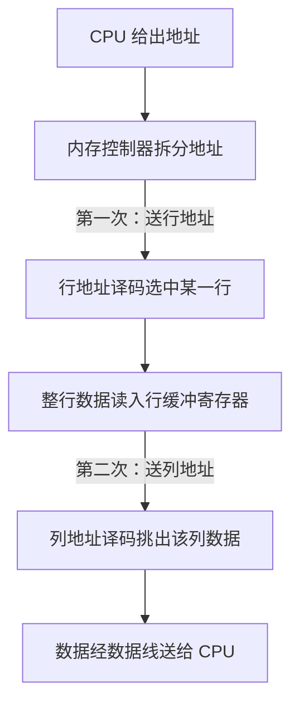

> ⚠️ **易错提醒**：(1) 过程是"先整行读入行缓冲，再按列挑一格"，不是直接按行列交叉点读——这正是行缓冲寄存器存在的原因；(2) 地址是**分两次**（行、列）送的，所以地址引脚可减半，而非数据引脚；(3) 注意"内存控制器"与"DRAM 芯片"的职责划分：控制器负责拆分地址并发起 RAS、CAS 请求，芯片负责译码与数据输出。

---

#### 第 7 题 DRAM 芯片包含哪些控制信号？各有什么作用？

DRAM 芯片在**定时和控制**单元接收的控制信号主要有以下四个（行列地址译码器只有在收到控制信号后才把地址送给存储部分）：

| 控制信号 | 全称 / 含义 | 作用 |
| --- | --- | --- |
| RAS | Row Address Strobe，行选通控制信号 | 行地址译码器收到 RAS 后，给出行地址到 DRAM 存储部分，确定某一行 |
| CAS | Column Address Strobe，列选通控制信号 | 列地址译码器收到 CAS 后，将列地址送到行缓冲寄存器（选择某一列） |
| WE | Write Enable，读写信号 | 在 RAS、CAS 控制下分时传送行、列地址；WE 为读写控制引脚，**低电平时执行写操作**，高电平时执行读操作 |
| OE | Output Enable，输出使能信号 | 控制数据输出（数据缓冲/输出选通），一般在读操作时有效，把数据送上数据总线 |

> 说明：实际 DRAM 芯片还可能有片选信号 CS（Chip Select），用于选中某一片芯片；考题中主考 RAS、CAS、WE、OE 四个。记忆口诀：**RAS 选行、CAS 选列、WE 定读写（低写高读）、OE 管输出**。

> ⚠️ **易错提醒**：(1) WE 的"低电平写、高电平读"是极高频考法，不要记反；(2) RAS 与 CAS 的先后顺序：**先 RAS（行）、后 CAS（列）**，因为要先选行再选列；(3) 控制信号本身不携带地址，地址还是通过地址线送入，控制信号只是"开关"，决定译码器何时把地址放行到存储部分。

---

#### 第 8 题 DRAM 芯片地址引脚和数据引脚个数怎么计算？

##### 一、先厘清几个量

存储芯片的**容量**表达为"存储单元数 × 每单元位数（字长/位宽）"，例如 4M × 8 位、64M × 8 位、2K × 1 位。

- **存储单元数** = 芯片总容量（单位是位）除以每单元位数。例如 4M × 8 位，单元数 = 4M = 2 的 22 次方。
- **数据引脚数** = 每个存储单元的位数（字长 / 位宽）。例如 4M × 8 位芯片，数据引脚 = 8。
- **地址引脚数** 分两种情况：
  - **SRAM 非复用**：地址引脚 = log2（存储单元数）= 地址线根数。例如存储单元数 2 的 22 次方，地址引脚 = 22。
  - **DRAM 行列地址复用**：把地址分成行、列两次送，地址引脚 = max（行地址位数，列地址位数）。当行数 = 列数（即行地址位数 = 列地址位数）时，**地址引脚 = log2（存储单元数）再除以 2**，即地址引脚减半。

##### 二、公式（独立成块）

$$
\text{存储单元数} = \frac{\text{芯片总容量（位）}}{\text{每单元位数}}
$$

$$
\text{数据引脚数} = \text{每单元位数（字长）}
$$

$$
\text{SRAM 地址引脚数} = \log_2(\text{存储单元数})
$$

$$
\text{DRAM 地址引脚数（行列复用，行数=列数）} = \frac{\log_2(\text{存储单元数})}{2}
$$

$$
\text{DRAM 地址引脚数（行列复用，一般）} = \max(\log_2 \text{行数},\ \log_2 \text{列数})
$$

> 约定：行数 × 列数 = 存储单元数；为使地址引脚最少并兼顾刷新开销，通常令行数与列数尽量接近（见例题二）。

##### 三、真题示例

**示例一（2014 年真题）**：某容量为 256MB 的存储器由若干 **4M × 8 位**的 DRAM 芯片构成，该 DRAM 芯片的地址引脚和数据引脚总数是（A）。A. 19　B. 22　C. 30　D. 36

解析：4M × 8 位，单元数 = 4M = 2 的 22 次方。数据引脚 = 8。DRAM 行列复用，行数与列数尽量接近，取行 11 位、列 11 位（2 的 11 次方 × 2 的 11 次方 = 2 的 22 次方），地址引脚 = 11。总数 = 11 + 8 = **19**，选 A。

**示例二（PPT 例题）**：若主存由 1 个 DRAM 芯片构成，容量为 **16 行 × 16 列 × 1 字节**，存储单元大小为 1 字节，数据线个数为 8。

1. 若想 CPU 可访问完整主存地址，CPU 出厂时地址引脚至少需多少？答：16 × 16 = 256 = 2 的 8 次方，CPU 地址引脚 = **8 个**。
2. 该 DRAM 芯片地址引脚个数为多少？答：行列复用，行 4 位、列 4 位（2 的 4 次方 = 16，行 = 列），地址引脚 = **4 个**（数据引脚 = 8）。

**示例三（2018 年真题）**：假定 DRAM 芯片中存储阵列的行数为 r、列数为 c。对于一个 **2K × 1 位**的 DRAM 芯片，为保证其地址引脚数最少，并尽量减少刷新开销，则 r、c 的取值分别是（C）。A. 2048、1　B. 64、32　C. 32、64　D. 1、2048

解析：2K = 2048 = 2 的 11 次方个存储单元，数据引脚 = 1。行列复用后地址引脚 = max（log2 r, log2 c）。要让地址引脚最少，应使 r、c 尽量接近；刷新按行进行，行数 r 越少，刷新开销越小。取 r = 32（2 的 5 次方）、c = 64（2 的 6 次方）时，地址引脚 = 6，且行数较少、刷新开销小。故选 **C（32、64）**。

> ⚠️ **易错提醒**：(1) 地址引脚与"地址线/地址总线"是两回事：CPU 的**地址引脚**决定其能访问的最大地址空间（由 CPU 出厂决定）；DRAM 芯片的**地址引脚**是芯片对外引出的地址脚，因行列复用可减半；(2) 数据引脚数是"每单元位数"，不是"存储单元数"；(3) 计算"总引脚数"一定是**地址引脚数 + 数据引脚数**；(4) DRAM 行列复用后地址引脚不是 log2（单元数），而是约一半，务必不要直接套 SRAM 的公式；(5) 为"尽量减少刷新开销"，应选**行数少**的方案（刷新按行），但行数少列数就多，地址引脚可能更大，需两者权衡——真题取"行数少且地址引脚最小"的折中。

---

#### 第 9 题 DRAM 芯片刷新时的一些问题

##### 1) 刷新周期（Refresh Cycle）概念

- **刷新的目的**：DRAM 存储元件采用电容存储数据，电容中的电荷会缓慢放电。刷新的初衷是维持 DRAM 芯片中保存的电荷。
- **刷新周期**：指从上次对整个存储器刷新结束的时刻作为开始点，到**下次对整个存储器全部刷新一遍为止**的时间间隔。它规定了必须在多长时间内把整个存储器的每一行都刷新一遍（典型值是 2 毫秒）。在此期间每一行都必须至少被刷新一次，否则数据会因电荷泄漏而丢失。

##### 2) 刷新具体操作

- DRAM 刷新**不需要外部提供行地址信息**，是一个内部的自动操作。DRAM 芯片内部有一个**行地址生成器（刷新计数器）**，自动产生要刷新的行地址。
- 刷新控制电路按刷新计数器给出的行地址，**逐行**读出该行数据，再依托"数据再生"机制将该行数据重新写回（即"充电"）。每次刷新实际上相当于执行一次该行的读操作，再把电荷补回。
- **刷新和再生的区别**：
  - **刷新**是硬件自动控制。由于 DRAM 芯片要定期"充电"，刷新操作实际是读出某一行数据，依托数据再生机制把行内数据读后再生。
  - **数据再生**依赖于读操作。在执行读完操作后，DRAM 芯片被破坏性读出，其中的电荷流出，再生操作重新给流出的部分补充电荷。

##### 3) 刷新的分类（集中 / 分散 / 异步）

| 刷新方式 | 何时进行 | 刷新间隔 | 是否产生死时间 | 特点 |
| --- | --- | --- | --- | --- |
| 集中刷新 | 在刷新周期内，前一段时间正常读写，后一段时间**停止读写集中逐行刷新** | 集中在一段（后段时间）完成全部行刷新 | 产生死时间 | 死时间集中，且与行数 × 存储周期成正比；实现简单 |
| 分散刷新 | **延长存储周期**，把存储周期分成两半：前一半用于正常读写，后一半用于刷新一行 | 每个存储周期刷新一行，刷新间隔 = 存储周期 × 行数 | 无死时间 | 无死区，但存储周期被拉长，影响正常访存效率 |
| 异步刷新（透明刷新） | 把刷新周期**按照行平均划分**，每隔固定间隔刷新一行 | 相邻两行刷新间隔 = 刷新周期 / 总行数 | 死时间极短、分散 | 最常用；兼顾效率与实现，死时间平均到整个刷新周期 |

**分散刷新的进一步说明**：假设未采用分散刷新策略的存储周期长度为 T，采用分散刷新后存储周期首先延长为 **2T**——前一半时间 T 用于正常的读写操作，后一半时间 T 停止读写，由刷新计数器提供一个行地址去刷新一行。所以在分散刷新前提下，在一个"存储周期"内相当于执行了两次读操作：一次读数据、一次刷新一行数据。

##### 4) 异步刷新刷新时间间隔计算（公式）

异步刷新中心思想：**将刷新周期按行平均划分**。

$$
\text{相邻两行刷新间隔} = \frac{\text{刷新周期}}{\text{总行数}}
$$

**例题**：假设某 DRAM 的存储周期为 2 微秒，共 4096 行数据，刷新周期为 65.536 毫秒，则相邻两行之间的刷新间隔为：

$$
\frac{65.536\ \text{ms}}{4096} = 16\ \mu\text{s}
$$

即每 16 微秒刷新一行，大约相当于 8 个存储周期。

> 记忆：**"刷新间隔 = 刷新周期 ÷ 行数"**。刷新周期通常给 2ms 或 65.536ms 这类值；行数由存储阵列行数决定；题目往往让你求"每行需在多少时间内被刷新一次"。

##### 5) 刷新与访存冲突时的注意事项

- 若刷新到来的同时，CPU 想要访问主存，则**优先刷新**；在经过一个存储周期后，CPU 再进行访存。
- 因此在 DRAM 刷新期间，**CPU 无法对 DRAM 进行读或写操作**，这段时间称为**死时间**（或"死区"。注意 PPT 用"死时间"，教材用"死区"）。
- **不同刷新方式对死时间的影响**：
  - **集中刷新**：把死时间**集中**在一起，死时间 = 行数 × 存储周期，集中在一个刷新周期末尾，期间 CPU 完全不能访存。
  - **异步刷新**：把死时间**平均分布**在整个刷新周期中，每次只占用很短的一小段时间，对 CPU 的影响小。
  - **分散刷新**：由于把刷新并入每个存储周期后半段，**不存在死时间**（但整个存储周期变长、读写效率下降）。
- **注意**：每次刷新执行，其实就是进行一次读操作（读出 DRAM 中一行的电荷，再对电荷进行再生）。所以本质上刷新操作就是一次主存读操作，这也就解释了为什么刷新执行时 CPU 不能访问主存。

> ⚠️ **易错提醒**：(1) 刷新以"**行**"为单位进行，不是以存储单元为单位；刷新计数器存的是行号；(2) 三种方式对比：集中刷新"有死区、死区集中"；分散刷新"无死区但周期变长、效率低"；异步刷新"无集中死区、最常用"——判断题常考这三句；(3) "刷新周期"是"整个存储器全部刷一遍"的总时间，不是"刷一行"的时间；异步刷新单行间隔 = 刷新周期 / 行数；(4) 刷新时 CPU 无法访存，这是死时间的原因；(5) 刷新不需要外部提供行地址（靠刷新计数器），也不受 WE 等写信号控制。

---

#### 第 10 题 总线事务的概念和具体过程

##### 一、概念（总线事务是重点）

数据流通过称为**总线**的共享电子电路在 CPU 和 DRAM 主存之间来回传送。每次 CPU 和主存之间的数据传送都是通过一系列步骤来完成的，这些步骤称为**总线事务（Bus Transaction）**。

- **读事务**：从主存传送数据到 CPU。
- **写事务**：从 CPU 传送数据到主存。

##### 二、总线读事务的具体过程（PPT 示例：CPU 访问地址 000010H）

1. CPU 跟**总线控制器申请总线控制权**，总线控制器将总线控制权交给 CPU。
2. CPU 将地址送到 **MAR**，并经过总线送到内存控制器；内存控制器收到地址后启动 DRAM 准备数据。
3. 数据准备完毕后，将数据发送到 **MDR**，MDR 再将数据发送到具体的寄存器（送入 CPU）。

##### 三、要点总结

- 一次总线事务 = 申请总线控制权（仲裁）→ 传送地址 → 传送数据（可能分多次/突发传送）→ 释放总线。
- 读事务方向：主存 → CPU；写事务方向：CPU → 主存。方向不要搞反。

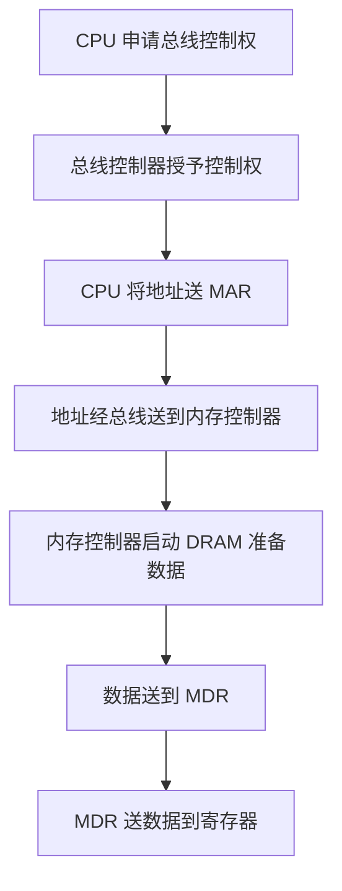

> ⚠️ **易错提醒**：(1) 总线事务的起点是"申请/获得总线控制权"（仲裁），不是直接发地址；(2) 地址经 MAR 送出，数据经 MDR 接收，两个寄存器不可互换——MAR 存地址，MDR 存数据；(3) 读事务数据流向为"主存到 CPU"，写事务为"CPU 到主存"，方向判断是必考点；(4) 突发传送（每次只给块首地址，然后连续传送整个块）是总线事务的重要扩展，常与 Cache 缺失、行缓冲寄存器配合考（详见第 6 题行缓冲寄存器）。

---

#### 第 11 题 带 Cache 的 CPU 访存的具体步骤（命中 / 缺失两种情况）

Cache 是 CPU 与主存之间的小容量高速缓冲，利用局部性原理，把当前正在使用的部分数据放在高速、容量较小的 Cache 中，使 CPU 大多数访存直接针对 Cache，提高程序执行速度。访存时，CPU 先访问 Cache，检查所找数据块是否在 Cache 中。

##### 一、Cache 命中（Hit）

1. CPU 给出访存地址。
2. 根据映射方式划分地址：取出**行号/组号**，定位到对应的 Cache 行（或组内某行）。
3. 查看该 Cache 行的**有效位**。若有效位为 1，则再比较 Cache 标记阵列中保存的 **Tag 字段**是否与主存地址中给出的 Tag 一致。
4. 若 Tag 一致（且有效位为 1），则 **Cache 命中**。直接取出该行中对应块内偏移位置的数据，送入 CPU 的 **MDR**。
5. 命中时**不访问主存**，读取速度快。

##### 二、Cache 缺失（Miss）

1. 给出的地址不能在 Cache 中找到匹配项（有效位为 0，或 Tag 不一致），则 **Cache 缺失**。
2. CPU 转而**访问主存**（此时把主存地址经 MAR 送到内存控制器）。
3. 从主存中读出**整个主存块**（一个 Cache 行大小的数据），经数据总线和 MDR 送入 Cache 的**数据阵列**，覆盖对应 Cache 行。
4. 同时更新该 Cache 行的**标记阵列**：写入新块的 Tag，把**有效位置 1**（若为写回策略且被替换行被修改过，还需先写回主存）。
5. 在 Cache 命中为 1 的情况下，把该块中块内偏移位置的数据送给 CPU。若为一次缺失，则本次访存仍需把该字送给 CPU。

##### 三、总体流程（mermaid）

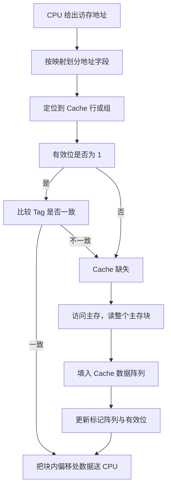

> ⚠️ **易错提醒**：(1) 命中的前提是"**有效位 = 1 且 Tag 一致**"两条件同时满足，缺一不可——只看 Tag 不看有效位是错误的；(2) 命中只需读 Cache，不需要访问主存；缺失才访问主存；(3) 缺失时要搬运的数据单位是"**一个主存块**"（一个 Cache 行的容量），而不是一个存储单元；(4) 若采用"写回 + 写分配"策略，被替换的脏行须先写回主存，再装入新块；(5) 带 Cache 后，CPU 与主存之间的数据直接交互减少，多数针对 Cache，只有缺失才真正访问主存。

---

#### 第 12 题 描述局部性原理（时间局部性 / 空间局部性）

**局部性原理**：程序在运行过程中，对存储器的访问呈现一种聚集倾向——在一段时间内，CPU 访问的指令或数据集中在某个局部区域内。它是 Cache 能够高效工作的理论基础。分为两类：

| 局部性 | 定义 | 典型例子 |
| --- | --- | --- |
| 时间局部性 | 如果一个数据**现在被访问了，那么在以后很有可能还会被访问** | 循环变量 i、循环累加变量、反复执行的同一段循环代码 |
| 空间局部性 | 如果一个数据**现在被访问了，那么它周围的数据在以后也有可能被访问** | 顺序访问数组元素 A0、A1、A2……；指令顺序执行 |

##### 局部性原理的应用

- **空间局部性在单片 DRAM 芯片中的应用**：主存块就是一组地址连续的存储单元（比如设定 4 个地址连续的存储单元为一个主存块）。访问了一个存储单元后，它周围的存储单元可能也会被访问，所以一次读入一整块数据（而非单个单元）往往能命中后续访问。
- **空间局部性在多片 DRAM（内存条）中的应用**：内存条构建主存块基于两点——一是内存条中多个 DRAM 采用交叉编址，二是按块（行）读写，从而在一次总线突发中连续取回整块数据。
- **局部性在 Cache 中的应用**：Cache 技术就是利用空间（和时间）局部性，把程序中正在使用的部分数据放到一个高速、容量较小的 Cache 中，使 CPU 的访存操作大多数针对 Cache 进行，从而提高程序的执行速度。

**代码示例（时间局部性 + 空间局部性）**：

```c
int A[100];
for (int i = 0; i < 100; i++)
    A[i] = i;   // 数组 A 连续访问→空间局部性；循环变量 i 反复使用→时间局部性
```

> ⚠️ **易错提醒**：(1) 时间局部性强调"**同一个数据**反复被访问（同一地址重复）"；空间局部性强调"**相邻数据**被访问（地址相邻）"，二者不要混淆；(2) Cache 之所以有效，是因为程序有局部性，也是因为搬入的是"一块"而不是"一个单元"；若程序无局部性（如随机访问大稀疏数组），Cache 命中率会很低。

---

#### 第 13 题 Cache 中标记阵列包含的字段及其具体含义

Cache 在硬件上分成两部分：一部分是**数据阵列（数据区）**，用于保存主存中送来的数据；另一部分用于保存 Cache 的**标记字段**，称为**标记阵列（Tag Array）**。每个 Cache 行对应一行标记记录，标记阵列存储的是"非数据部分"。

> 说明：不同教材对标记阵列的构成略有差异，408 以"有效位、Tag 标记"为核心，脏位与替换控制位视具体策略而加。以下统一列出常见字段。

##### 一、字段总览（标记阵列包含）

| 字段 | 是否需要 | 具体含义 / 作用 |
| --- | --- | --- |
| 有效位（Valid Bit） | 必须有 | 用于表示该 Cache 行中的数据是否有效。系统启动或复位时每行都置空（有效位为 0）；删除某行数据时只需把有效位置 0，并不真正清除信息。有效位为 1 才可被命中，为 0 视为不可用、可被新块覆盖 |
| 标记 Tag | 必须有 | 用于表示该 Cache 行对应的主存块的"公共标识"。它保存的是主存地址中除去行号/组号与块内偏移之外的高位部分。比较 Tag 是否一致可判断是否命中 |
| 脏位 / 修改位（Dirty Bit） | 写回策略时必须有 | 用于记录该 Cache 行中的数据是否被**修改过**（与主存不一致）。若为 1 说明该行已被修改，被替换时需先写回主存；为 0 说明未修改过，可被直接覆盖。只在写回策略下使用，写直达（同时写主存）时不需要 |
| 替换控制位（算法替换位） | 组相联 / 全相联需 LRU 时必须有 | 用于记录 Cache 行的使用历史，作为替换算法（如 LRU）的参照。当某块需要替换时，依据该位决定淘汰哪一行。直接映射无需替换控制位（每个主存块只对应唯一一行） |
| 行地址（行号） | 取决于映射方式 | 在直接映射中，主存地址的低位（行号/索引）直接给出了该块应放入哪个 Cache 行，并由硬件自动产生；组相联中则是"组号"（set）定位到哪一组。标记阵列中的 Tag 用于在组内/行内进一步区分不同的主存块 |

##### 二、各字段的相互关系（理解框架）

- **数据阵列**：存数据本体。
- **标记阵列**：存非数据部分（有效位 + Tag + 可能有的脏位 + 可能有的替换控制位）。
- **命中判定**：有效位 = 1 且 Tag 一致。
- **替换判定**：需要时，看替换控制位（LRU 历史）。

##### 三、标记阵列示例（直接映射 Cache，4 行，每行 4 字节，数据阵列 16 字节）

下方为"有效位 + 标记阵列 + 数据阵列"排布示意（纯文字，且每格表示一个字段）：

```text
有效位     标记阵列(Tag)                数据阵列
  1         1101                      行0数据
  0         0000                      行1数据(无效)
  1         0110                      行2数据
  0         0000                      行3数据(无效)
      |                        |
      +------ 比较器 --------> 判断 Tag 是否一致
```

- 比较器：用于比较标记阵列中保存的 Tag 与主存地址中的一致；直接映射只需一个比较器。
- 多路选择器：用于选择 Cache 行中具体是哪一字节地址（如一个主存块 4 字节，则需一个 4 选 1 多路选择器）。

> ⚠️ **易错提醒**：(1) 有效位是判定"是否可用"的前提，但它与 Tag 不同——有效位代表"这行数据有效吗"，Tag 代表"这行对应主存哪个块"；(2) 脏位只在**写回策略**下才有意义；写直达策略下不需要脏位（因为它同时写主存，主存与 Cache 始终一致）；(3) 替换控制位只有在**需要替换算法（组相联/全相联 + LRU 等）**时才存在，直接映射不需要；(4) "标记阵列"与"数据阵列"是一一对应的，一个 Cache 行同时有标记记录和数据；(5) 计算 Cache 总容量时（在映射、容量类题目中），**只算数据阵列会漏掉标记部分**——总容量 = 行数 ×（有效位 + Tag 位数 + 数据位 + 脏位/替换位等），务必把标记阵列部分也算上。

---

#### 资料定位

**零壹 PPT（基础）**
- 《计组PPT5第三章存储器上》第 5、7 页：存储器基本知识、材料构成（ROM/RAM、SRAM/DRAM 用途与易失性）。
- 《计组PPT5第三章存储器上》第 19—23 页：存取方式（随机/顺序/直接）、2011 真题（不采用随机存取方式选 B）。
- 《计组PPT5第三章存储器上》第 25—26 页：SRAM 与 DRAM 应用、408 涉及的 5 种 CPU 与内存体系结构。
- 《计组PPT5第三章存储器上》第 32—33 页：存储周期 Tm 与读出时间 Tr、DRAM 性质（含 5 个步骤）。
- 《计组PPT5第三章存储器上》第 39—40 页：存储体、DRAM 芯片内部逻辑结构（行/列缓冲、译码器、行缓冲寄存器、刷新计数器）。
- 《计组PPT5第三章存储器上》第 42 页：单片 DRAM 芯片按地址发送数据过程。
- 《计组PPT5第三章存储器上》第 47 页：控制信号（RAS、CAS、WE、OE）。
- 《计组PPT5第三章存储器上》第 49—51 页：地址引脚与地址总线、数据引脚与数据总线、地址引脚数计算。
- 《计组PPT5第三章存储器上》第 54—61 页：DRAM 刷新（目的、具体操作、刷新与再生区别、异步/分散/集中刷新、刷新与访存冲突、死时间）。
- 《计组PPT5第三章存储器上》第 57 页：地址引脚与数据引脚真题（2014、2018 年统考）。
- 《计组PPT5第三章存储器上》第 64 页：总线事务（读/写事务概念与三步过程）。
- 《计组基础PPT6第三章_存储器中》第 8—12 页：Cache 基本知识、局部性原理（时间/空间局部性及其在 DRAM、内存条中的应用）。
- 《计组基础PPT6第三章_存储器中》第 18—20 页：Cache 硬件结构、标记阵列与数据阵列、有效位、Tag、脏位、算法替换位。
- 《计组基础PPT6第三章_存储器中》第 23、27 页：直接映射下 Cache 命中/缺失的访存过程（比较器、多路选择器）。

**零壹讲义**
- 《零壹计组基础讲义5-存储器上》第 7—8 页：存取方式（随机/顺序/直接）、易失与非易失、存储层次化结构。
- 《零壹计组基础讲义5-存储器上》第 10 页：基本存储元件、DRAM 数据读出/写入/刷新、SRAM 与 DRAM 区别、刷新与再生区别。
- 《零壹计组基础讲义6-存储器中》第 6—9 页：Cache 的基本原理、局部性、Cache 行、指令 Cache 与数据 Cache、有效位、脏位、算法替换位、Tag 标记、标记阵列与数据阵列。

**教材（判定标准）**
- 《计算机组成与系统结构（第3版）》（袁春风、唐杰、杨若瑜、李俊）第 7 章 第 223 页：7.1.1 存储器的分类（按存储元件分类、按存取方式分类：随机/顺序/直接存取）。
- 同书 第 227 页：DRAM 读出过程、破坏性读出与再生。
- 同书 第 229—230 页：DRAM 芯片与地址引脚复用、刷新周期定义。
- 同书 第 253—259 页：Cache 基本工作原理、命中与缺失、地址划分（标记/组号/块内地址）、组相联映射与 Tag、有效位、Cache 缺失时的访存过程。

**真题**
- 《2011 年计算机 408 统考真题》第 21 行附近：下列各类存储器中，不采用随机存取方式的是（答案：B. CD-ROM）。
- PPT 引用的 2014 年真题（4M×8 位芯片地址+数据引脚总数 = 19）、2018 年真题（2K×1 位芯片 r、c 取值 = 32、64）。


## 第三讲 存储器（二：Cache 映射、写策略、扩展、双口、编址）

> 本讲对应《零壹计组白纸输出法框架》第 14–23 题。
> 适用科目：计算机组成原理（408 统考「第三章 存储系统」）。
> 相关零壹 PPT：《计组PPT7_第三章_存储器下》《计组基础PPT6第三章_存储器中》《计组-强化4-存储器PPT》；讲义：《零壹计组基础讲义6-存储器中》《零壹计组基础讲义7-存储器下》；判定标准：袁春风《计算机组成与系统结构（第3版）》第 7 章。

---

#### 第 14 题　Cache 的三种映射方式：直接映射 / 全相联映射 / 组相联映射

##### 前情：统一符号约定

| 符号 | 含义 | 中文说明 |
|------|------|----------|
| m | 主存地址总位数 | 主存地址一共有多少位（主存容量 = 2 的 m 次方字节） |
| b | 块内地址位数 | 一个 Cache 行（主存块）含 2 的 b 次方个可寻址单元，按字节编址时即 2 的 b 次方字节 |
| C | Cache 总行数 | Cache 数据区容量 = C 乘 2 的 b 次方字节 |
| k | 组相联的路数 | 每组含 k 个 Cache 行，k 路组相联 |

> 不管哪种映射，主存地址的低 b 位永远是「块内地址（Offset）」，它不变。

##### 14.1 主存地址的划分（考纲核心，必背公式）

$$
\text{直接映射：主存地址}=\underbrace{\text{Tag（标记）}}_{\large m-\log_2 C-b}\;\Big|\;\underbrace{\text{Index（行号）}}_{\large \log_2 C}\;\Big|\;\underbrace{\text{Offset（块内地址）}}_{\large b}
$$

$$
\text{全相联映射：主存地址}=\underbrace{\text{Tag（标记）}}_{\large m-b}\;\Big|\;\underbrace{\text{Offset（块内地址）}}_{\large b}
$$

$$
\text{组相联映射（k 路）：主存地址}=\underbrace{\text{Tag（标记）}}_{\large m-\log_2(C/k)-b}\;\Big|\;\underbrace{\text{Set（组号）}}_{\large \log_2(C/k)}\;\Big|\;\underbrace{\text{Offset（块内地址）}}_{\large b}
$$

| 映射方式 | 地址划分（按高到低） | 行号/组号位数 | 标记 Tag 位数 |
|----------|----------------------|---------------|---------------|
| 直接映射 | 标记 + 行号 + 块内地址 | log2（Cache 行数） | m 减 行号位数 减 块内位数 |
| 全相联映射 | 标记 + 块内地址 | 无行号字段 | m 减 块内位数 |
| 组相联映射（k 路） | 标记 + 组号 + 块内地址 | log2（组数）= log2（Cache 行数除以 k） | m 减 组号位数 减 块内位数 |

**例（直接映射）**：主存 1MB 按字节编址（m 等于 20），Cache 数据区 8KB、块大小 512B。则块内地址 b 等于 log2(512) 等于 9 位；Cache 行数为 8KB 除以 512B 等于 16 个；行号位数 log2(16) 等于 4 位；标记位数 20 减 9 减 4 等于 7 位。主存地址拆成 7 位标记 + 4 位行号 + 9 位块内地址。

**例（全相联映射）**：同样的主存 20 位地址，块大小 512B（b 等于 9），无行号字段，故标记 11 位，块内地址 9 位。

**例（2 路组相联）**：同样的主存 20 位地址、块大小 512B、Cache 数据区 8KB。Cache 16 行，2 路组相联得 16 除以 2 等于 8 组，组号位数 log2(8) 等于 3 位；标记 20 减 3 减 9 等于 8 位；剩余 9 位块内地址。地址拆成 8 + 3 + 9。

##### 14.2 标记位（Tag）如何设置

- **直接映射**：每个 Cache 行保存一个 Tag 字段。因为「同一行号的主存块可以有多个（它们行号相同、Tag 不同），但同一时刻只能放一个」，所以用 Tag 区分「当前放的是哪一个主存块」。标记位数见上表。
- **全相联映射**：每个 Cache 行保存一个 Tag 字段，==等于该行的整个主存块号==（m 减 b 位）。因为无行号，所以 Tag 就是「唯一身份」，一个主存块可放任意一行。
- **组相联映射**：每个 Cache 行保存一个 Tag 字段（m 减组号位数减块内位数）。组间直接映射（组号唯一确定一组）、组内全相联（同组各行靠 Tag 区分）。
- **三种映射共同需要**：
  - **有效位（valid）**：1 位，表示该行是否存放了有效主存块（初始全 0，装入后置 1）。
  - **脏位（dirty / 修改位）**：仅当采用**写回法**时才有，1 位；1 表示该行数据被修改过、被替换前必须写回主存。写直达法不需要脏位。
  - **替换算法控制位（LRU 计数器位）**：仅全相联 / 组相联需要（见 14.5）。

> 标记阵列（Tag 阵列）容量 = 行数 乘（有效位 1 + 标记位数 + 脏位 0/1 + 替换控制位）。真题常据此让你算「标记阵列总容量」，务必区分「数据区容量」与「标记阵列容量」。

##### 14.3 访存过程（给出主存地址后）

流程都一样是「先 Tag 匹配判命中，再取数据」，三种方式的区别只在「如何定位 Cache 行」。

**直接映射**（唯一行，1 个比较器）：

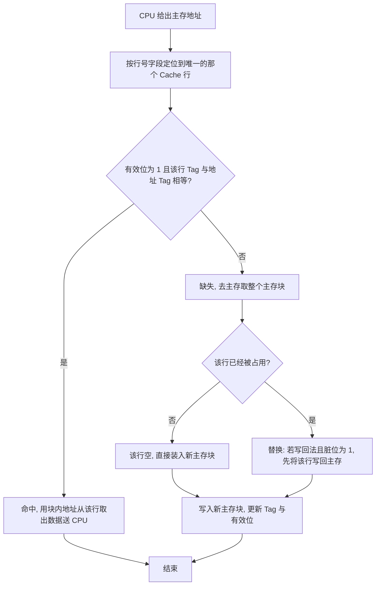

**全相联映射**（任意行，每行一个比较器 → 并行比较）：

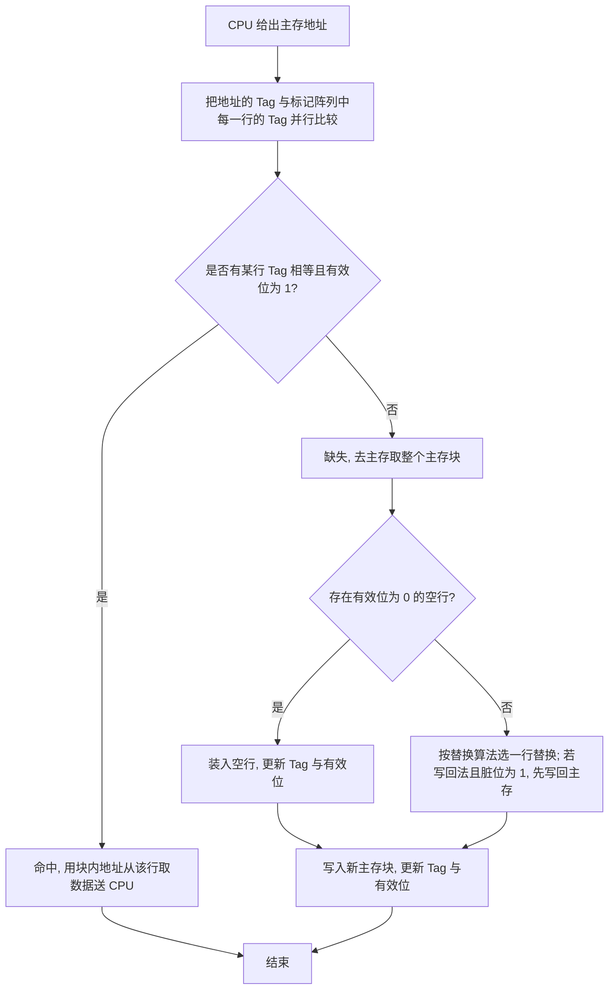

**组相联映射**（组间直接映射 + 组内全相联，每组 k 个比较器）：

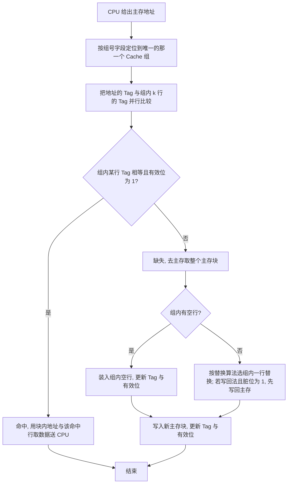

> 一句话记忆：**直接映射「只看一行」，全相联「看所有行」，组相联「先定组、再比组内各行」。**

##### 14.4 比较器个数、多路选择器（MUX）位数与作用

| 映射方式 | 比较器个数 | 比较对象 | 多路选择器位数 | 多路选择器作用 |
|----------|------------|----------|----------------|----------------|
| 直接映射 | 1 个 | 该行的 Tag 与主存地址的 Tag | 块内地址位数 b | 从该行的 2 的 b 次方个字节中选出要访问的那 1 字节 |
| 全相联映射 | 每行 1 个（共 C 个，并行）≈ 也可 1 个串行 | 每行 Tag 与主存地址 Tag（逐个/并行） | 块内地址位数 b（每行一个选字）；命中结果选通对应路 | 先按块内地址从每行选字，再用命中信号选出命中的那一路送 CPU |
| 组相联映射（k 路） | k 个（每组） | 组内每行 Tag 与主存地址 Tag | 块内地址位数 b（每路选字）+ 选路信号（k 路选 1） | 先用块内地址从组内 k 行各选字，再用组内 k 个比较器的命中结果选出命中路 |

**规律（真题最爱考）**：**k 路组相联 → 有 k 个比较器。** 直接映射可看作「C 组、每组 1 路」的 1 路组相联 → 1 个比较器；全相联可看作「1 组、C 路」，→ C 个比较器。标记阵列中每行都带比较器时数量最多、速度最快但耗电大。

**例（判断路数）**：已知某组相联 Cache 的标记位数、块内地址位数，反推路数 k。设主存 20 位地址，块大小 512B（b 等于 9），标记 8 位，则组号位数等于 20 减 8 减 9 等于 3 位，组数等于 8；由 Cache 数据区 8KB 得行数 16，路数 k 等于 16 除以 8 等于 2，比较器个数为 2。

##### 14.5 替换算法及算法替换位

> 只有全相联 / 组相联需要替换算法；**直接映射每行唯一映射，无需替换算法（不存在选择哪一行的问题）。**

| 算法 | 思想 | 特点 | 算法替换控制位的位数 |
|------|------|------|----------------------|
| 随机替换（Random） | 随机选一行替换 | 无局部性思想，实现最简单，硬件为一个随机触发器（random 触发器） | 0 位 |
| 先进先出（FIFO） | 替换最先进入 Cache 的那一行 | 按进入先后排队，与「是否被用过」无关，可能替换掉正在频繁使用的行 | 需记录进入次序 |
| 最近最少使用（LRU） | 替换最久未（最近最少）被访问的那一行 | 符合时间局部性，命中率最高，是 408 重点 | 每路一个计数器，位数等于 log2（路数）：4 路为 2 bit，8 路为 3 bit |

**LRU 计数器位数说明（讲义原话）**：以 4 路组相联为例，要给同组的 4 个 Cache 行排出「一二三四名」从而选出访问最少的那个，就需要 2 bit 来对 4 个行排序，这额外产生的 bit 就是算法替换位。8 路组相联则需要 3 bit。所以 **算法替换位 = log2（路数）位 / 路**。

**具体替换过程**（组相联为例）：
1. 访问缺失，先看组内是否有「有效位为 0」的空行；有 → 直接装入空行。
2. 若组内行已满 → 按替换算法选一行：
   - LRU：比较各计数器，选计数值最小（最久未用）的那一行。
   - FIFO：选最早进入的那一行。
   - 随机：随机触发器产生随机数选一行。
3. 若被替换行采用写回法且脏位为 1 → **先把它写回主存**，腾出位置。
4. 装入新主存块，刷新该行 Tag、有效位、计数器 / 进入次序。

##### 14.6 平均访存时间（AMAT）的计算方法

$$
T_{\text{平均访存}}=T_{\text{命中时间}}+\text{缺失率}\times\text{缺失损失}
$$

$$
T_{\text{平均访存}}=h\cdot T_{\text{命中}}+(1-h)\cdot\big(T_{\text{命中}}+T_{\text{缺失}}\big)
$$

其中：h 为命中率，缺失率 = 1 减 h；命中时间 = 访问 Cache 的时间；缺失损失（缺失代价）= 命中时间 + 从主存读取并装入该块的时间（即一次 Cache 缺失导致的额外时间）。**缺失损失通常是「每次访问的一个整数倍」的访问时间，切勿与缺失率混淆。**

**CPU 被 Cache 缺失阻塞的时钟数**：

$$
\text{Cache 缺失阻塞时钟数}=\text{访存次数}\times\text{缺失率}\times\text{缺失损失}=\text{指令条数}\times\frac{\text{缺失数}}{\text{指令}}\times\text{缺失损失}
$$

**多级 Cache（L1 与 L2）**：

$$
T_{\text{平均访存}}=T_{L1}+\text{全局缺失率}_{L1}\times\Big(T_{L2}+\text{缺失率}_{L2}\times T_{\text{主存}}\Big)
$$

- L1 命中时间（约 1 个时钟）就是它的命中时间；L1 缺失时访问 L2。
- 全局缺失率（在某级及以下所有级都缺失）与局部缺失率（在某级缺失）是不同概念，多级 Cache 题务必区分。

**易错提醒**：
- 平均访存时间公式里是「缺失率 × 缺失损失」，不是「缺失率 × 命中时间」；命中时间只加一次。
- 缺失损失是「存一次」（含取块、装块），不是「缺失的那一个单元」的时间，别把块大小当成缺失损失。
- 组相联：块内地址位数永远不变（低 b 位）；变化的是「行号/组号」与「标记」的分界。题目给「标记位 + 块内位」时，用 主存位 减 标记 减 块内 得 组号位，再反推路数。
- 比较器个数：跟着「路数」走（k 路 = k 个比较器），不是跟着「组数」走。

---

#### 第 15 题　Cache 的写策略：写直达 / 写回，写分配 / 非写分配

##### 15.1 写命中的两种基本方法

| 方法 | 别名 | 写命中时怎么做 | 优点 | 缺点 / 说明 |
|------|------|----------------|------|-------------|
| 写直达 | 全写法 / 通写法 / 直写法（write through） | 同时写入 Cache 和主存 | Cache 与主存一致性最易保证 | 每次写都访问主存，写开销大；常加一个 FIFO 写缓冲（write buffer）缓解 |
| 写回 | 回写法 / 一次性写法（write back） | 只写入 Cache，不立即写主存；仅当该行被替换移出且脏位为 1 时才写回主存 | 减少写主存次数，性能更好 | 需脏位维护一致性，实现较复杂 |

**写缓冲**：写直达时在 Cache 与主存之间加一个 FIFO 缓冲，CPU 只把数据快速写入写缓冲，由存储控制器稍后写入主存。优点是不用等慢速主存；缺点是写缓冲满时 CPU 需等待（阻塞）。

**脏位（修改位）**：写回法专用。某行被修改则脏位置 1；该行被替换移出时为 1 即写回主存，为 0 则不写回。写直达法无脏位（因为每次都同步写主存了）。

##### 15.2 写不命中时的两种处理方法

| 方法 | 英文 | 写不命中时怎么做 | 特点 / 搭配 |
|------|------|------------------|-------------|
| 写分配法 | write allocate | 先分配一个 Cache 行，把主存中的整个块装入该行，再在 Cache 中更新数据 | 遵循空间局部性，但每次写不命中都要从主存读一个块，增加读块开销；一般与写回法搭配 |
| 非写分配法 | no-write allocate | 只更新主存中相应单元，不把主存块装入 Cache | 减少读入主存块的时间，但不利用局部性；一般与写直达法搭配 |

**经典搭配（记牢）**：**写直达 ↔ 非写分配；写回 ↔ 写分配。**（写直达已写主存，不必再把块调进 Cache；写回靠「装入块后再改」来保证把整块都更新干净。）

**易错提醒**：
- 「写直达 / 写回」是**写命中**的两策略；「写分配 / 非写分配」是**写不命中**的两策略。二者是不同维度，别混。
- 写回法一定需要脏位，写直达法不需要。题目问「标记阵列含哪些位」时，写回法 = 有效位 + 标记 + 脏位 +（替换控制位）；写直达 = 有效位 + 标记 +（替换控制位），无脏位。
- 非写分配在写不命中时**不调块进 Cache**，所以不会因为这个写缺失而把块调入；这点与写分配相反。
- 真题的文字判断题：采用写回法时，只有该行被替换移出（且脏位为 1）时才需写主存，**不是每次写都写主存**；采用写直达法时，写命中同时写 Cache 和主存，**不是写辅存**（辅存是磁盘，不属于主存-Cache 层）。

---

#### 第 16 题　位扩展的特点与片选 / 地址 / 数据线连接

##### 特点
- **存储单元个数不变，存储字长（位数）变大**。
- 用若干片「字长较小的 DRAM 芯片」拼接成「字长较大的主存」。
- 因为单元个数不变，所以**地址线位数不变**（所有芯片同时选中、同时寻址同一个「列」）。

##### 连接方式（口诀：地址并、数据拆、片选并、控制并）

| 信号 | 连接方式 |
|------|----------|
| 地址线 | 各芯片地址线**并联**接到系统总线低位地址线（单元数不变，故各芯片收到相同地址） |
| 数据线 | 各芯片数据线**分别**接到系统总线**不同位段**，拼接成完整字长（如 8 片 8bit = 64bit） |
| 片选线 | 各芯片 CS（片选）**并联连在一起**（因为要同时选中所有芯片，读/写同一地址单元的各位） |
| 读写控制线 | 各芯片 WE / OE 等控制线**并联** |

**例**：用 16 乘 8 bit 的 DRAM 芯片构成 16 乘 64 bit 的主存。
- 单元个数 16（4 位地址）不变；字长由 8 位扩到 64 位。
- 需要芯片数 = 64 除以 8 等于 **8 片**。
- 地址：4 位地址线并联到 8 片（所有片同时定位第 0 到 15 号单元）。
- 数据：第 1 片接数据线低 8 位、第 2 片接高 8 位 … 第 8 片接最高 8 位，拼成 64 位。
- 片选：8 片 CS 并联（同一时刻全部被选中）。

---

#### 第 17 题　字扩展的特点与片选 / 地址 / 数据线连接

##### 特点
- **存储字长不变，存储单元个数增加**。
- 每个字多少位不变，通过增加芯片数来增加「行（单元）」数。
- 因为单元数变多，需要**高位地址参与片选**（分时选中不同芯片）。

##### 连接方式（口诀：地址低位并、高位译码选片、数据并、控制并）

| 信号 | 连接方式 |
|------|----------|
| 地址线 | 各芯片**内部低位地址线并联**接到系统总线低位；**高位地址经译码器译码**产生各片片选信号（分时选中不同芯片） |
| 数据线 | 各芯片数据线**并联**接到系统总线数据线（字长相同，故各片数据线并到同一组数据线） |
| 片选线 | 由高位地址译码器输出，各片 CS 分别接译码器的不同输出；**同一时刻只有一片被选中** |
| 读写控制线 | 并联 |

**例**：用 16 乘 8 bit 芯片构成 32 乘 8 bit 主存。
- 字长 8 位不变；单元数由 16 增至 32。
- 需要芯片数 = 32 除以 16 等于 **2 片**。
- 地址：低 4 位（单元号）并联到 2 片；高 1 位（第 5 位）作片选：为 0 选第 1 片（0 到 15 号），为 1 选第 2 片（16 到 31 号）。
- 数据：2 片数据线并联到系统总线 8 位数据线。
- 片选：2 片 CS 分别接 1 位地址（经译码，互斥选中）。

---

#### 第 18 题　字位同时扩展的特点与片选 / 地址 / 数据线连接

##### 特点
- **既增加字长，又增加单元个数**（字长、单元数同时变）。
- 策略：**先位扩展（把若干片拼成一个大字长的 rank/行），再字扩展（多个 rank 拼接增加单元数）**，层层递进。
- 等价于「位扩展数 × 字扩展数」两维扩展。

##### 连接方式

| 信号 | 连接方式 |
|------|----------|
| 地址线 | **低位地址（单元号）并联到全体芯片**（用于选组内单元）；**再高位地址经译码器**产生各组（rank）的片选，分时选中不同组 |
| 数据线 | **组内各芯片数据线分别接总线不同位段（位扩展拼接字长）**；**组间（rank 之间）数据线并联复用到同一组数据线**（字扩展分时复用） |
| 片选线 | **组内芯片 CS 并联（同组同时选中）**；**组间由高位地址译码产生不同 CS（分时选中不同组）** |
| 读写控制线 | 并联 |

**例**：4 片 16 乘 8 bit 的 DRAM 芯片，先位扩展成 16 乘 32 bit 的 rank（4 片位扩展），再取 2 个 16 乘 32 bit 的 rank 字扩展，构成 32 乘 32 bit 的主存。
- 位扩展：4 片 8bit 拼成 32bit（字长由 8 变 32）；单元数 16 不变。
- 字扩展：2 个 rank 拼成 32 个单元（单元数 16 变 32）；字长 32bit 不变。
- 共需 4 乘 2 等于 **8 片**。
- 地址：低 4 位（16 单元）并联全部 8 片；第 5 位（第 5 位地址）作 rank 选择（0 选第 1 组 rank，1 选第 2 组 rank），经译码产生组片选。
- 数据：每组 4 片分别接 32 位数据线的 4 段（每 8 位一段）；两组数据线并联复用 32 位总线。

**易错提醒**：字位扩展是先位后字；位扩展解决「字长不够」，字扩展解决「单元数不够」。计算芯片总数 = 位扩展数 × 字扩展数 =（目标字长 / 单片字长）×（目标单元数 / 单片单元数）。

---

#### 第 19 题　双口存储器：概念、读写特点、冲突处理

##### 概念
- 在一个存储器中提供**两组独立的读写控制电路**和**两个读写端口（A、B）**，因而可以**同时提供两个数据的并行读写**，是一种**空间并行技术**（靠多套硬件并行，不是时间上的分时）。

##### 读写特点
- 每个端口都有一套独立的**地址缓存（锁存）器、译码电路、读写控制电路**，两套电路并行独立工作、互不干扰。
- 当 A、B 两端口地址**不相同时**，可以向存储体**一次读写两个单元**的内容（并行）。

##### 冲突处理
- 当 A、B 两端口地址**相同时**，会发生**读写冲突**（例如一个在读、一个在写，或两个都在写同一单元）。
- 处理方式：按**特定的优先顺序**选择其中一个端口进行读写；另一个端口等待（通常通过 BUSY / 忙信号提示、后请求或低优先级的端口被阻塞），待冲突解决后再继续。

**易错提醒**：
- 双口存储器是「两个端口、两个独立控制器」实现**并行**，靠的是硬件资源翻倍（空间并行），不是「轮流使用一个端口」（那是时间并行/分时）。考纲只要求「冲突时按优先顺序选一个端口读写」这一结论。
- 双口存储器常用于「寄存器堆 / 多总线」场景（如一个端口喂 A 总线、一个端口喂 B 总线），这与 Cache、主存层次无关，属于独立的并行存储技术，注意别和交叉编址混淆。

---

#### 第 20 题　窄型数据传输：概念与传输时间计算

##### 概念
- 主存与 Cache 之间传输的最小单位是**主存块**（不是单个字节）。
- 当**系统总线数据线宽度（位数）不足以一次传给整个主存块**（即总线一次最多只能传 1 个（或部分）存储单元）时，需要**分多次（逐个单元）传输**，这样的结构称为**窄型结构（窄型数据传输）**。
- 它对应「没有构建快速通道（突发传送）」的情形，只能按「发送地址 + 读出 + 传送」一个单元一个单元地串行进行。

##### 每个单元的传输过程
1. **发送地址和读命令**到主存（耗时 t1）。
2. **主存准备好一个数据**（耗时 t2，通常等于存储周期 / 存取时间）。
3. **从总线传送一个数据**到 Cache（耗时 t3）。

##### 传输时间计算公式

$$
T_{\text{总}}=\text{单元数}\times\big(\text{发送地址与读命令时间}+\text{主存准备一个数据时间}+\text{总线传送一个数据时间}\big)
$$

**例（PPT p20 原题）**：4 片 DRAM 构成的内存条作主存，按字节编址，主存块大小 4B；系统总线数据线为 8 根（一次只能传 1 字节）；发送地址与读命令 1 个时钟周期，主存准备一个数据 10 个时钟周期，总线传送一个数据 1 个时钟周期。
- 单元数 = 主存块 4B（一次传 1B）→ 需传 4 次。
- 每单元 = 1 + 10 + 1 等于 12 个时钟周期。
- 总时间 = 4 乘 12 = **48 个时钟周期**。

**易错提醒**：
- 窄型传输的「单元数」= 主存块大小 除以 总线一次能传的字节数。若总线宽 8 根、块 4B → 传 4 次；若总线宽 32 根、块 4B → 一次就能传完（就不是窄型了，转成「同时启动 / 快速通道」）。
- 每个单元都要算「发送地址 + 准备 + 传送」三段时间；但这只是「无快速通道的顺序编址串行」情形，与下面第 22/23 题的「交叉编址并行」形成对比。

---

#### 第 21 题　顺序编址与交叉编址的概念

##### 前提
现代主存往往由多片 DRAM 芯片构成一个存储体组（存储模块），按一定规则把地址分配到各个存储体（芯片）上。**体号取值字段放高位还是低位，决定了是顺序编址还是交叉编址。**

| 编址方式 | 体号取自地址的哪部分 | 地址划分（高位到低位） | 连续地址落在哪儿 |
|----------|----------------------|------------------------|------------------|
| 顺序编址（高位交叉） | 地址的**高位** | 体号（高位） + 体内地址（低位） | 连续地址**落在同一个体**内 |
| 交叉编址（低位交叉） | 地址的**低位** | 体内地址（高位） + 体号（低位） | 连续地址**轮流分布到不同体** |

- 设体数 H 等于 2 的 q 次方（如 4 体，q 等于 2），则体号占 q 位。
  - **低位交叉**：体号 = 地址 对 体数 取模（mod），即地址的低 q 位决定体号；连续地址依次落在 0、1、2、3、0、1 … 号体，可**并行/流水**。
  - **高位交叉**：体号 = 地址的高 q 位，连续地址仍落在同一体，无法并行连续传送。

##### 为什么「读一串连续地址」要用交叉编址
- 若内存条只提供一个存储单元的数据给 CPU 的 MDR，那么顺序编址还是交叉编址区别不大。
- 当 CPU 向内存条提出**读取一连串地址相邻的存储单元**（例如 Cache 缺失后要填一个主存块）时，为了构建**快速传送通道**（并行/突发），内存条**必须采用交叉编址**对其内部存储单元编址，这样连续地址才能平均分布在各个存储体上、交错启动、并行连续送出。

**易错提醒**：
- 判断体号归属：**低位交叉**看「地址的低几位」，**高位交叉**看「地址的高几位」。题干说「交叉编址」默认是**低位交叉**。
- 交叉编址的「体号」由地址低 q 位决定，于是「块内连续地址」会被打散到不同体，这是它能并行连续传送的根源。

---

#### 第 22 题　交叉编址下的同时启动：判断依据与数据传输流程

##### 22.1 判断依据（能否同时启动）
- 若**所有存储模块（存储体）一次并行读写能同时送出的总位数，正好等于系统总线中的数据线数**（也就是总线宽度 ≥ 一个主存块的全部数据位数，能一口气把整个主存块并行放到数据线上），则可采用**同时启动**方式。
- 即：**系统总线数据线位数 = 主存块位数**（例如主存块 4B 等于 32 bit → 数据线需 32 根）。
- 此时所有存储体**在同一时刻同时启动**，并行读出，经过 **1 个存储周期**后全部数据**同时**送到数据线上。

##### 22.2 数据传输流程
1. Cache Miss → 内存控制器把主存块所在地址的**行地址**广播到全部存储体（各体都收到同一行号）。
2. 每个存储体把对应行读入自己的**行缓冲**（行缓冲读）。
3. 内存控制器再把**列地址**广播到全部存储体，每个存储体从行缓冲的该列并行取出各自负责的那一个单元。
4. 全体存储体**同时**把数据送上数据线（并行送出），一次就凑齐整个主存块。

$$
T_{\text{同时启动}}\approx T_{\text{地址送达}}+T_{\text{存储周期}}+T_{\text{总线传送}}
$$

（地址送达主存、经过一个存储周期并行读出、再经过一次总线传送送到 Cache。由于各体并行，读块的「存储周期」只算 1 次。）

**例（PPT p25/p26）**：内存条由 4 片 DRAM 构成，按字节编址，主存块大小 4B，总线用异步传送。
- 访问 00000110（二进制）时出现 Cache Miss，需把主存块 000001 号块所在的 00000100、00000101、00000110、00000111 四个连续单元送入 Cache。
- 内存控制器把行地址 000 广播给 4 片，每片把该行读入自己的行缓冲；再把列地址 001 广播，4 片各自从行缓冲第 0 列读出数据。
- 从每片收到地址到**每片同时准备好对应位置的数据，用了 1 个存储周期**。
- 数据线位数：主存块 4B 等于 32 bit，且是同时启动，故**数据线至少 32 根**（每条体 8 bit，4 片乘 8 等于 32）。注意：同时启动要求「数据线根数必须和主存块位数一致，即 32 根」。

**易错提醒**：同时启动的前提是「总线宽度 ≥ 主存块位数」。若数据线只有 8 根（小于 32），则**不能**同时启动，必须用第 23 题的**轮流启动**。

---

#### 第 23 题　交叉编址下的轮流启动：判断依据、过程、间隔与总时间

##### 23.1 判断依据（为何要轮流启动）
- 当**系统总线数据线宽度小于主存块位数**（一次传不完一个主存块，例如主存块 4B、数据线只有 8 根，一次只能传 1 字节）时，不能同时启动，必须让各个存储体**按地址顺序轮流（交错）启动**，各自错开时间、流水工作，从而构建快速传送通道。
- 此时相邻地址分布在相邻存储体（低位交叉），先启动第 0 号体，过一个启动间隔再启动 1 号体，以此类推；最后按序把各体数据一个接一个送上总线。

##### 23.2 数据传输过程
1. CPU 发出地址（t 等于 0 时刻），经地址总线送往内存条。
2. 内存收到地址后，确定该单元所在的主存块，并按「低位交叉」先启动 0 号体；此后每隔一个**启动间隔**启动下一个体（1 号、2 号、3 号…）。
3. 每个体从自己被启动的时刻起，经过**一个存储周期**后把数据准备好，送到数据线上。
4. 数据一个接一个经过总线送往 CPU 中的 Cache（每个单元还需一次总线传送时间）。

> 关键时间点（PPT 逐体标注）：0 号体数据在「启动时刻 + 存储周期」后送上数据线，之后每体顺延一个间隔；最后一个体数据到 CPU 时还需再加一次总线传送时间。

##### 23.3 启动间隔时间与总时间计算公式

$$
\text{启动间隔}\;\Delta t=\text{总线传送一个单元的时间}
$$

$$
T_{\text{总}}=T_{\text{地址送达}}+(\text{体数}-1)\times\Delta t+T_{\text{存储周期}}+T_{\text{总线传送}}
$$

当启动间隔恰好等于总线传送时间（常见设定）时，化简为：

$$
T_{\text{总}}=T_{\text{地址送达}}+\text{体数}\times T_{\text{总线传送}}+T_{\text{存储周期}}
$$

**例（PPT p31–p36 原题）**：主存采用 4 体交叉多模块存储器，按字节编址，存储周期 40ns（简化为读出时间）；主存块大小 4B；总线数据线 8 根（一次传 1B）；总线在 CPU 与主存间传一次数据和地址的时间均为 10ns；存储器采用轮流启动。问从 CPU 访问产生 Cache Miss、把地址送往主存开始，到主存块数据全部送达 CPU 的时间。

逐步推演：

| 时刻/事件 | 说明 |
|-----------|------|
| 0 ns | CPU 把地址信息发往内存（地址开始传输） |
| 10 ns | 地址信息送达内存条（地址送达时间 = 10 ns） |
| 10 ns | 启动 0 号体 |
| 20 ns | 启动 1 号体（间隔 10 ns） |
| 30 ns | 启动 2 号体 |
| 40 ns | 启动 3 号体 |
| 50 ns | 0 号体完成一个存储周期，数据送上数据线 |
| 60 ns | 0 号体数据送达 CPU 中的 Cache；同时 1 号体数据送上数据线 |
| 70 ns | 1 号体数据送达 CPU；2 号体数据送上数据线 |
| 80 ns | 2 号体数据送达 CPU；3 号体数据送上数据线 |
| 90 ns | 3 号体数据送达 CPU（最后一个单元） |

代入公式：T 总 = 10 +（4 减 1）乘 10 + 40 + 10 = **90 ns**。（等价于 10 + 4 乘 10 + 40 = 90 ns。）

**易错提醒**：
- **最后必须再加一次「总线传送时间」**：每个单元送上数据线后还要花一个传送时间才到 CPU。很多同学只算到「最后一个体数据准备好（80 ns）」就停，漏掉最后一段总线传送，从而少算 10 ns。
- 必须把「地址送达主存」的时间算进去（这里是从 0 ns 起算，地址传送 10 ns）。
- 同时启动与轮流启动的分界：**总线宽度 ≥ 主存块位数**用同时启动（约 1 个存储周期 + 1 次传送）；**总线宽度 < 主存块位数**用轮流启动（公式如上，时间更长）。
- 主存块大小与数据线宽度的换算：4B 主存块、8 根数据线 → 一次传 1B → 需传 4 次，便与「体数 = 4」一致，这也是出题人常把「存储体个数 = 主存块内单元个数」设成一致的用意。

---

#### 资料定位（本地上课资料）

**零壹 PPT（优先）**

- 《计组基础PPT6第三章_存储器中》第 24–29 页：直接映射（地址划分、例题、未命中替换）；第 30–33 页：全相联映射（随意映射、比较器）；第 34–35 页：替换算法（随机/先进先出/LRU、random 触发器）；第 46、51 页：组相联映射（地址划分、比较器个数）；第 56 页：写不命中的写分配/非写分配。
- 《计组PPT7_第三章_存储器下》第 6、10 页：多片 DRAM 扩展引入；第 13 页：位扩展（8 片 16 乘 8bit 构成 16 乘 64bit）；第 14 页：字扩展（2 片构成 32 乘 8bit）；第 15 页：字位同时扩展（4 片 16 乘 8bit 先位扩展成 16 乘 32bit rank，再字扩展成 32 乘 32bit）；第 16 页：双口存储器（两端口、冲突按优先顺序选一端口）；第 19 页：地址连续存储单元传输（交叉编址的必要性）；第 20 页：窄型结构传输（4 乘（1+10+1）= 48 时钟周期）；第 21–25 页：交叉编址、同时启动（p25 例：主存块 4B、4 片 DRAM）；第 26 页：同时启动需数据线 32 根（与主存块位数一致）；第 31–36 页：轮流启动逐步推演（4 体、40ns、10ns 间隔、总时间 90ns）。
- 《计组-强化4-存储器PPT》第 32 页：写分配/非写分配判断题；第 5–8、17 页：Cache 软/硬件考法（真题入口）。

**零壹讲义（教学视角补充）**

- 《零壹计组基础讲义6-存储器中》第 9 页：直接映射（地址划分、1MB/8KB/512B 例题）；第 11 页：直接映射总容量、全相联映射（20 位地址、11+9 划分）；第 12 页：全相联/组相联硬件示意图（比较器、多路选择器）；第 13 页：组相联（2 路、8+3+9 划分）；第 14 页：三种映射公式（组相联 = 标记+组号+块内；全相联 = 标记+块内）；第 15 页：LRU（4 路 2bit、8 路 3bit）、随机替换、写命中的写直达/写回；第 16 页：写分配/非写分配。
- 《零壹计组基础讲义7-存储器下》第 8 页：双口存储器逻辑结构（两套独立地址缓存器/译码电路、冲突按优先顺序）。

**判定标准（袁春风《计算机组成与系统结构（第3版）》）**

- 第 254 页：命中率、命中时间、缺失率定义（Cache 层次基础）。
- 第 259 页：组相联映射（2 的 s 次方组乘 2 的 t 次方行/组；s=1 为 2 路、s=2 为 4 路）。
- 第 261 页：三种映射方式比较（关联度与命中率、命中时间、标记开销的关系；直接映射命中时间最短、全相联命中率最高）。
- 第 264 页：写直达（全写法/通写法）、写回（回写法/一次性写法）、写分配法、非写分配法、写缓冲（FIFO）。
- 第 265 页：Cache 缺失阻塞时钟数 = 访存次数 × 缺失率 × 缺失损失。

**真题参考**

- 《27relax1000题解析册_7.29最新勘误版》第 117–118 页：k 路组相联 → k 个比较器、组号/标记位反推路数。
- 《真题\408解析（2009-2025）\2022年计算机408统考真题解析》第 3 页：8 路组相联、组号 6 位、标记 20 位（地址划分标准化流程）。
- 《真题\408解析（2009-2025）\2015年计算机408统考真题解析》第 3 页：标记阵列容量（有效位、标记位、脏位、替换算法控制位的取舍）。


## 第四讲 指令系统

> 考纲定位：计算机组成原理 第四章 指令系统。核心考点：ISA 与透明性、指令格式（定长/可变长操作码）、扩展操作码、寻址方式（含有效地址 EA 与访存次数）、标志位（ZF/SF/OF/CF）生成与大小比较判断、CISC 与 RISC、MIPS 指令格式与机器码、过程调用与栈帧。
> 本讲框架：一条指令先「怎么拼」（格式/操作码），再「怎么找操作数」（寻址方式），再「怎么判断结果」（标志位），再「怎么设计」（CISC/RISC），最后「怎么落地」（MIPS 与过程调用）。

---

#### 一、ISA 是什么？透明与不透明的例子

##### 1. 定义

**ISA（Instruction Set Architecture，指令集体系结构）** 是软件与硬件之间的**分界面**，是机器语言程序员（汇编程序员、编译器）所能看到的计算机抽象。它规定了一台计算机「面向程序员的全部可编程属性」，是软硬件的契约。程序员只需按 ISA 编写程序，无需关心底层硬件如何实现。

ISA 包含（属于「不透明/可见」层）：指令系统（指令格式、指令种类）、寻址方式、通用寄存器个数与编号、可寻址空间（内存寻址范围）、机器字长与数据类型、程序可见寄存器（PC、SP、PSW 等）、I/O 接口及编址方式。

与之相对的是**微体系结构（Microarchitecture）**，即「实现」，是 ISA 之下对程序员隐藏的部分。

##### 2. 透明与不透明

| 类别 | 含义 | 典型例子 |
|---|---|---|
| **ISA 不透明**（程序员可见，属 ISA 一部分） | 程序员/编译器能感知并依赖 | 指令格式、寻址方式、通用寄存器编号与数量、内存寻址范围、机器字长与数据类型、程序可见寄存器（PC/SP/PSW） |
| **ISA 透明**（程序员不可见，属实现细节） | 程序员不感知，由硬件决定 | 具体指令的物理实现（微程序还是硬布线）、Cache 容量与组织、流水线级数、数据通路结构、**存储器芯片编址方式**、主存实际容量、ALU 具体实现、指令执行时序 |

##### 3. 易错提醒

- 「**存储器芯片编址方式**」对 ISA **透明**（属硬件实现细节，程序员不感知）；「**内存寻址范围**」对 ISA **不透明**（程序员能感知的地址空间大小）。这一对最常考、最易混淆。
- 通用寄存器**编号**对 ISA 不透明（程序员必须知道用哪个寄存器），但寄存器文件的**物理实现**（如用多少个触发器、双端口还是单端口）对 ISA 透明。
- ISA 的「透明」指软件开发人员**看不见**，不是指是否真实存在。Cache 物理上存在，但对程序员透明，程序员无法也无需直接用指令访问它。

---

#### 二、指令字长不变、操作码可变的指令系统，设计需注意的点

指令字长不变而**操作码长度可变**，即**扩展操作码**（变长操作码）：当地址码个数减少时，操作码可以做长，从而用同一条指令字支持更多指令种类。这类设计必须注意：

1. **前缀规则（最关键）**：不允许短操作码是长操作码的**前缀**，即短操作码不能与长操作码「前面部分的代码」相同，否则译码产生二义性。
2. **各指令操作码不能重复**：任何两条指令的操作码必须唯一。
3. **指令字长必须为 8 的整数倍**：便于按字节编址取指（若按字节编址，指令字长应为字节的整数倍）。
4. **按使用频率分配长度**：使用频率高的指令分配**较短**操作码，频率低的分配**较长**操作码，以减小平均译码/分析时间（霍夫曼思想）。
5. **扩展方向与顺序**：按地址码个数**从多到少**扩展（三地址到二地址再到单地址再到零地址）；逐级扩展时，每级必须为下一级**至少留下 1 个前缀**，否则无法继续扩展。

##### 易错提醒

- 扩展只能**逐级**进行：三地址留出前缀，二地址占用并再留前缀，再到单地址，再到零地址。不能「跳级」，否则会破坏前缀规则。
- 判断能否继续扩展，看上一级「剩余的前缀数」与下一级「需要的指令数」是否匹配，且要给更下一级留足前缀。

---

#### 三、课程题目：最多支持多少条单地址指令

**题目**：指令字长 16bit，每个地址码 4bit，支持操作码扩展。已知支持三地址指令 14 条、二地址指令 31 条、零地址指令 17 条，求最多能支持多少条单地址指令。

##### 推导（逐级按剩余编码空间算）

（1）**三地址指令**：操作码占 $16-4\times 3=4$ 位，共 $2^4=16$ 种。用 14 条（0000~1101），**剩 2 个前缀 1110、1111**。

（2）**二地址指令**：操作码占 $16-4\times 2=8$ 位，前 4 位只能取上一步剩的 {1110, 1111}。每个前缀联合后 4 位可得 $2^4=16$ 种，两个前缀共 $2\times 16=32$ 种。需要 31 条，用 31 条，**剩下 1 个 8 位编码 1111 1111** 作为继续扩展的前缀。

（3）**单地址指令**：操作码占 $16-4=12$ 位。从剩余的 1111 1111 再扩展 4 位，共 $2^4=16$ 个单地址编码（1111 1111 0000 ~ 1111 1111 1111）。设实际作为单地址指令的为 $x$ 条，则剩下的 $16-x$ 个编码要作为**零地址指令**的前缀，每个可扩展出 $2^4=16$ 条零地址指令。

（4）**零地址指令**：指令操作码占满 16 位。零地址条数 $=(16-x)\times 16$。要求满足零地址至少 17 条：

$$(16-x)\times 16 \ge 17 \Rightarrow 16-x \ge \left\lceil \frac{17}{16}\right\rceil = 2 \Rightarrow x \le 14$$

所以**最多 14 条单地址指令**（取 $x=14$：单地址 14 条，其余 $16-14=2$ 个前缀可扩展出 $2\times 16=32 \ge 17$ 条零地址，满足；若取 $x=15$，则 $(16-15)\times 16=16 < 17$，零地址不够）。

##### 易错提醒（本题结论与常见误判相反）

- 很多人把 12 位单地址编码总数 $2^4=16$ 直接当答案，**错**。因为必须给零地址指令留下前缀：零地址条数 $=(16-x)\times 16$，要装下 17 条零地址，需要 $16-x\ge 2$，即 $x\le 14$。
- 本题正确结论是 **14 条**，不是「约 16 条」。「16」只是单地址层可用的全部编码个数，未扣除留给零地址的前缀。
- 口诀：**逐级扩展，上一级「剩余前缀数」乘「本字段可编码数」等于本级可扩展总数；给下一级留足前缀后再算本级最大值。**

---

#### 四、指令寻址方式：如何获取操作数、各访存几次

##### 1. 定义

**寻址方式**指指令给出操作数或操作数地址的方式。核心是求**有效地址 EA**（Effective Address，操作数在内存中的真实地址），再判断「取操作数需要访存几次」。注意：**取指令本身通常还要访存 1 次**，以下「访存次数」指取操作数的访存次数（不含取指）。

##### 2. EA 与访存次数表

| 寻址方式 | 有效地址 EA 或操作数 | 指令给出内容 | 访存次数 | 特点 |
|---|---|---|---|---|
| 立即寻址 | 无 EA，操作数=指令中的立即数 | 立即数 | 0 | 最快；立即数范围受字段长度限制 |
| 直接寻址 | EA = A（形式地址即有效地址） | 形式地址 A | 1 | 简单；地址范围有限 |
| 寄存器寻址 | 无 EA，操作数=寄存器内容 | 寄存器编号 | 0 | 最快；指令短；用寄存器不访存 |
| 寄存器间接寻址 | EA = (R)（寄存器内容为地址） | 寄存器编号 | 1 | 指令短；可动态改址 |
| 间接寻址 | EA =（A）（按 A 再取有效地址） | 形式地址 A | 2 | 灵活；多访存慢，现少用 |
| 相对寻址 | EA =（PC）+A（A 为符号扩展偏移） | 形式地址 A | 1 | 用于转移/分支，与 PC 相关 |
| 基址寻址 | EA =（BR）+A（BR 为基址寄存器） | 形式地址 A | 1 | 面向系统/程序重定位，BR 由 OS 控制 |
| 变址寻址 | EA = A+（IX）（IX 为变址寄存器） | 形式地址 A | 1 | 面向数组/循环，IX 由程序修改 |
| 隐含寻址 | 不显式给出（如用累加器 ACC） | 无（隐含寄存器） | 0 或 1 | 指令短；固定使用隐含寄存器 |

##### 3. 易错提醒

- **寄存器寻址取寄存器内容不访存（0 次）**；**寄存器间接寻址**要用寄存器内容作为地址，再访存一次取操作数（**1 次**）。两者一字之差，访存次数不同。
- **间接寻址**要访存**2 次**（先按 A 取出 EA，再按 EA 取操作数）。
- 问「执行一条指令共访问几次内存」时，通常要把**取指（1 次）**加上；问「取两个操作数共访问几次」则只计取操作数的访存，且要看两个操作数各自用什么寻址方式。
- 相对寻址的偏移量 A 一般是有符号数，需**符号扩展**后与 PC 相加；MIPS 中计算相对寻址偏移是「目标指令与下一条 PC 之间隔了几条指令」（看指令条数而非字节数，因为定长指令每条 4 字节，但地址差按字节取时要乘 4）。

---

#### 五、ZF、SF、OF、CF 分别如何得到（公式法 + 真值法）

##### 1. 定义

标志位用于反映运算结果的状态，供分支/判断指令使用。设运算结果的最高位为 $D_{n-1}$，最高位进位为 $C_{n+1}$，次高位进位为 $C_n$，减法标识为 SUB（做减法时 SUB=1，加法时 SUB=0）。

##### 2. 公式法

- 零标志：$ZF = 1$ 当且仅当结果各位全为 0。
- 符号标志：$SF = D_{n-1}$（结果最高位）。
- 进位/借位标志：$CF = C_{n+1} \oplus SUB$；加法 $SUB=0$ 时 $CF=C_{n+1}$，减法 $SUB=1$ 时 $CF=\overline{C_{n+1}}$。
- 溢出标志：$OF = C_n \oplus C_{n+1}$。

| 标志位 | 中文含义 |
|---|---|
| **ZF**（零标志） | 结果是否为 0 |
| **SF**（符号标志） | 结果按有符号解释是否为负（取结果最高位） |
| **CF**（进位/借位） | 无符号数运算是否产生进位（加法）或借位（减法） |
| **OF**（溢出标志） | 有符号数运算结果是否溢出 |

即：加法的 CF 看最高位进位；减法的 CF 看最高位无进位则为借位（取反）。OF 只看次高位与最高位进位是否不同（异或）。

##### 3. 真值法（语义法）

- **ZF**：把结果逐位看，是否「全为 0」即可，与是否溢出无关。
- **SF**：直接看结果**最高位**（符号位），1 为负，0 为正。
- **CF**：把参与运算的机器数**按无符号整数**解释，看结果是否超出无符号数表示范围（加法产生进位、减法产生借位）。
- **OF**：把参与运算的机器数**按有符号整数**解释，看结果是否溢出（两正相加得负、两负相加得正、正减负得负、负减正得正，即为溢出）。溢出时结果符号位不可信。

##### 4. 数字例子

**例子一（减法判借位，PPT 例题）**：计算 $10-5$。机器数：$10=1010$（4 位），$-5=1011$（补码）。用加法器实现减法即 $1010+1011$，结果取低 4 位为 $0101$（=5），且 SUB=1。

按位加：$1010+1011$，得各位进位 $C_n=0$（次高位进位），$C_{n+1}=1$（最高位进位）。
- ZF = 0（结果 0101 不为 0）
- SF = 0（最高位为 0）
- CF = $C_{n+1}\oplus \text{SUB} = 1\oplus 1 = 0$（无借位，$10>5$ 正确）
- OF = $C_n\oplus C_{n+1} = 0\oplus 1 = 1$

**例子二（加法正溢出）**：4 位，计算 $5+3$。$5=0101$，$3=0011$，$0101+0011=1000$。
- ZF = 0、SF = 1（结果 MSB=1）
- CF = $C_{n+1}\oplus 0$：最高位无进位 $C_{n+1}=0$，故 CF = 0（无符号 $5+3=8<16$，无溢出）
- OF = $C_n\oplus C_{n+1}$：$C_n=1$（bit2 向 bit3 有进位）、$C_{n+1}=0$，故 OF = 1（有符号 $5+3=8>7$，正溢出）

**例子三（相等判零）**：$5-5$，结果为 0，ZF=1；无借位 CF=0；无溢出 OF=0；SF=0。

##### 5. 易错提醒

- OF 只看 $C_n$ 与 $C_{n+1}$ 是否**不同**；CF 在减法时要 **异或 SUB**（即对 $C_{n+1}$ 取反得到借位），二者极易混。
- ZF 与「结果是否为 0」等价，与溢出无关；即使结果因溢出而「错」，ZF 仍反映实际算出的每一位。
- SF 单独不能判断有符号大小（溢出时会错），必须结合 OF。

---

#### 六、用标志位比较无符号数与有符号数的大小

统一记：比较 $A$ 与 $B$，用 $A-B$ 运算生成标志位。

##### 1. 无符号数比较（看 CF、ZF）

无符号数判断用**借位/进位（CF）**与**相等（ZF）**：

| 关系 | 条件表达式 |
|---|---|
| A 大于 B | CF = 0 且 ZF = 0（无借位且不相等） |
| A 小于 B | CF = 1（有借位） |
| A 等于 B | ZF = 1 |
| A 大于等于 B | CF = 0 |
| A 小于等于 B | CF = 1 或 ZF = 1 |

##### 2. 有符号数比较（看 SF、OF、ZF）

有符号数判断用**符号（SF）、溢出（OF）**与**相等（ZF）**：

| 关系 | 条件表达式 |
|---|---|
| A 大于 B | SF = OF 且 ZF = 0 |
| A 小于 B | SF 不等于 OF 且 ZF = 0 |
| A 等于 B | ZF = 1 |
| A 大于等于 B | SF = OF（或 ZF = 1） |
| A 小于等于 B | SF 不等于 OF（或 ZF = 1） |

记忆：**有符号「大于」看 SF 与 OF 相同**（SF=OF 且 ZF=0）；**「小于」看 SF 与 OF 不同**（SF 不等于 OF 且 ZF=0）。

##### 3. 数值辨析（为什么会是 SF 与 OF）

以 4 位有符号为例：

| 情形 | SF | OF | ZF | 实际大小 |
|---|---|---|---|---|
| A-B 未溢出，SF=0 | 0 | 0 | 0 | A大于B |
| A-B 未溢出，SF=1 | 1 | 0 | 0 | A小于B |
| A-B 正溢出，SF=0 | 0 | 1 | 0 | 实为 A小于B（负溢出，符号位被溢出翻转） |
| A-B 负溢出，SF=1 | 1 | 1 | 0 | 实为 A大于B（正溢出，符号位被溢出翻转） |

可见：未溢出时 SF 直接表示大小；溢出时 SF 被翻转，需用 OF 纠正，故统一成「SF 等于 OF 为大于，SF 不等于 OF 为小于」。

##### 4. 易错提醒

- **无符号看 CF+ZF**；**有符号看 SF+OF+ZF**。不要用 CF 判断有符号，也不要用 SF 单独判断（溢出会错）。
- 相等判断一律看 **ZF**，与有无符号无关。
- 溢出时大小判断要「按实际」（用 SF 与 OF 的关系纠正），不能只看结果符号 SF。

---

#### 七、CISC 与 RISC 指令集特点对比

| 对比项 | **CISC**（复杂指令集，如 x86） | **RISC**（精简指令集，如 MIPS） |
|---|---|---|
| 指令系统 | 指令多、种类杂，指令格式多、长度可变 | 指令少且精简，指令格式统一 |
| 指令长度 | 可变长（定/变长混合） | **定长**（MIPS 固定 32 位） |
| 指令周期 | 多数指令需多个时钟周期 | 大多 1 个时钟周期完成 |
| 指令周期差距 | 指令周期差距大 | 指令周期差距小（规整） |
| 访存方式 | 大多数指令都能直接访问存储器 | **只有 load/store 访存**，其余寄存器-寄存器运算 |
| 寻址方式 | 寻址方式多 | 寻址方式少且规整 |
| 寄存器使用 | 通用寄存器较少 | 通用寄存器多（MIPS 32 个） |
| 控制器 | 多用**微程序**控制器 | 多用**硬布线**控制器 |
| 编译适配 | 硬件复杂，编译器负担小 | 硬件简单，依赖编译器优化 |
| 设计目标 | 减少指令条数、指令功能强 | 提高指令执行速度、规整高效 |

##### 易错提醒

- RISC 的「定长指令 + 只有 load/store 访存 + 大量寄存器 + 硬布线控制器」是综合特征，不要只记「指令少」。
- CISC 常配**微程序**控制器，RISC 常配**硬布线**控制器（MIPS 配硬布线控制器，x86 配微程序控制器），这是常见判断题。
- MIPS 是典型 RISC，但其指令字固定为 **32 位**、机器字长也为 32 位，寄存器 32 个（编号 0~31，其中 zero=0 恒为 0）。

---

#### 八、MIPS 指令分类、指令格式与常见指令

##### 1. 指令分类与 32 位格式（三个字段布局）

MIPS 为 32 位定长指令字（一次取指固定取 1 条），无专门寻址方式字段，由指令格式决定寻址方式。分三类：

| 类型 | 名称 | 字段布局（从高位到低位） | 用途 |
|---|---|---|---|
| **R 型** | 寄存器型（RR） | OP(6) / rs(5) / rt(5) / rd(5) / shamt(5) / func(6) | 寄存器-寄存器运算、移位 |
| **I 型** | 立即数型 | OP(6) / rs(5) / rt(5) / **立即数(16)** | 立即运算、load/store、分支 |
| **J 型** | 跳转型 | OP(6) / **直接地址(26)** | 无条件跳转、过程调用 |

各字段位号（R 型）：31 到 26 为 OP，25 到 21 为 rs，20 到 16 为 rt，15 到 11 为 rd，10 到 6 为 shamt，5 到 0 为 func。

##### 2. 各类型特点与寻址方式

- **R 型**：OP 固定为 `000000`，真正的操作由 **func** 决定（如 add 的 func=100000）。操作数（rs、rt）和结果（rd）都是寄存器。**寻址方式只有一种：寄存器寻址。** 常用于两寄存器间的算术/逻辑/移位运算。
- **I 型**：rs 与立即数符号扩展后相加得内存地址（load/store），或 rs、rt 参与运算，或相对寻址（分支）。**寻址方式有 4 种：寄存器寻址、立即数寻址、相对寻址、基址/变址寻址。** 常见：addi、lw、sw、beq、bne、slti。
- **J 型**：直接给出 26 位目标地址，与 **PC 高 4 位**拼接并在末两位补 00（因为 32 位定长，地址 4 字节对齐，末两位恒 0）形成 32 位目标。**寻址方式只有一种：变通的直接寻址。** 常见：j、jal。

##### 3. 常见指令一览（认识指令）

| 指令 | 含义 | 类型 |
|---|---|---|
| add `s1,s2,s3` | s1 = s2 + s3 | R |
| sub `s1,s2,s3` | s1 = s2 - s3 | R |
| sll `s1,s2,10` | s1 = s2 逻辑左移 10 位 | R |
| slt `s1,s2,s3` | 若 s2 小于 s3，则 s1=1，否则 s1=0 | R |
| jr `ra` | 跳转到 ra 所指地址（过程返回） | R |
| addi `s1,s2,100` | s1 = s2 + 100（立即数符号扩展） | I |
| lw `s1,100(s2)` | s1 = Memory[s2 + 100] | I |
| sw `s1,100(s2)` | Memory[s2 + 100] = s1 | I |
| beq `s1,s2,L` | 若 s1=s2，则跳转到 L（相对寻址） | I |
| slti `s1,s2,100` | 若 s2 小于 100，则 s1=1，否则 s1=0 | I |
| j `L` | 无条件跳转到 L（直接寻址） | J |
| jal `L` | ra = PC+4；跳转到 L（过程调用） | J |

##### 4. 具体指令的机器表示（例：add）

以 `add s1, s2, s3` 为例，寄存器编号 s0=16、s1=17、s2=18、s3=19（R 型，OP=000000，func=100000）：

| 字段 | OP | rs | rt | rd | shamt | func |
|---|---|---|---|---|---|---|
| 值 | 000000 | 10010 | 10011 | 10001 | 00000 | 100000 |

拼接成 32 位：`00000010010100111000100000100000`，按 4 位分组为 `0000 0010 0101 0011 1000 1000 0010 0000`，即十六进制 **0x02538820**。

（扩展练习：`lw s1,100(s2)` 为 I 型，OP=100011（lw 的 OP），rs=s2=18=10010，rt=s1=17=10001，立即数=100=0000000001100100。）

##### 5. 易错提醒

- R 型 vs I 型的最直观区分：**R 型 OP 恒为 000000**，靠 func 区分；I 型第三个是 16 位立即数（lw/sw 中它是偏移量，需符号扩展）。
- lw/sw 的偏移量是**有符号 16 位**，与基址寄存器相加得内存地址（基址/变址寻址）。
- beq 用**相对寻址**：目标 = （PC+4）+（偏移量符号扩展），偏移量按「指令条数」计（MIPS 定长 32 位，故字节差要除以 4）。
- jal 把**返回地址（下一条指令地址 PC+4）存入 `ra`**，这是过程调用的关键；j 只是无条件跳转，不保存返回地址。

---

#### 九、将寄存器 s0、s1、s2 的值依次入栈（MIPS）

MIPS 无单条 push 指令，入栈用「sp 下移 + sw」两步。MIPS 栈**向下增长**（sp 递减），栈顶在低地址。

##### 写法一：逐个入栈（最直观，依次压 s0、s1、s2）

```asm
addi sp, sp, -4      # sp = sp - 4
sw   s0, 0(sp)       # 压入 s0（此时 s0 在栈顶）
addi sp, sp, -4
sw   s1, 0(sp)       # 压入 s1
addi sp, sp, -4
sw   s2, 0(sp)       # 压入 s2（最后压入，位于当前栈顶）
```

##### 写法二：一次分配栈帧，再统一存（推荐，3 个字预留 12 字节）

```asm
addi sp, sp, -12     # 一次性预留 3 个字（12 字节）
sw   s0, 8(sp)       # 存 s0（栈帧最上方，高地址）
sw   s1, 4(sp)       # 存 s1
sw   s2, 0(sp)       # 存 s2（栈顶，低地址）
```

##### 栈内顺序说明

栈向下增长，因此先压入的 s0 在**较高地址**，最后压入的 s2 在**最低地址（栈顶）**。两种写法结果相同：从栈顶往栈底（由低地址到高地址）依次是 **s2、s1、s0**。

##### 易错提醒

- MIPS 不用 `push`/`pop` 单指令，入栈必须「**先 sp 减后 sw**」（或先分配栈帧再按偏移 sw）；不能用 `sw reg, -4(sp)` 这种「先存后减」的 CISC 风格而对 MIPS 语义理解错误。`sw s1,-4(sp)` 表示把 `s1` 存到 sp-4 这个地址，不等于「sp 减 4 再存」。
- 栈**向下生长**：sp 减小是「开辟」空间；sp 增大是「回收」空间，二者不可颠倒。
- 出栈用反序：`lw` 恢复 + `addi sp,sp,12` 回收。

---

#### 十、过程调用：栈帧变化、寄存器变化及原因

##### 1. 过程调用六步（P 调用 Q）

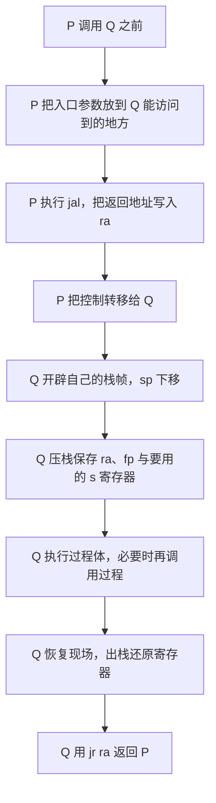

##### 2. 一个具体例子（PPT 例题，C 代码与 MIPS）

C 代码：

```c
int i;
void set_array(int num) {
    int array[10];                 // 10 个 int = 40 字节局部数组
    for (i = 0; i < 10; i++) {
        array[i] = compare(num, i);
    }
}
```

对应 MIPS 汇编片段（注意栈帧建立与保存）：

```asm
set-array:
        addi sp, sp, -52     # 生成栈帧，sp 下移 52 字节（预留空间）
        sw   ra, 48(sp)      # 保存返回地址 ra
        sw   fp, 44(sp)      # 保存帧指针 fp
        sw   s1, 40(sp)      # 保存被调用者要用的 s1
        addi fp, sp, 48      # 设置 fp，指向栈帧顶部（保存 ra 处）
        move s1, sp          # s1 指向栈帧底部，作为数组基地址
        move t0, a0          # t0 = num（保存参数）
        move s0, zero        # i = 0
for-loop:
        slti t1, s0, 10      # t1 = (i<10)?1:0
        beq  t1, zero, exit  # 若 i>=10 则跳出
        move a0, t0          # 传递参数1：a0 = num
        move a1, s0          # 传递参数2：a1 = i
        jal  compare           # 调用 compare，返回地址存入 ra
        sll  t1, s0, 2       # t1 = i*4（数组下标乘 4 得字节偏移）
        ...
```

##### 3. 栈帧变化过程

以 `set_array` 为例，栈帧（从高地址到低地址）分配如下（栈向下增长）：

```text
高地址  ┌───────────────────────┐
        │   调用者（P） 的栈帧      │
        ├───────────────────────┤  ← 调用前的 sp（也是 set_array 旧 sp）
        │  ra（48~51）          │  ← fp 指向这里
        │  fp（44~47）          │
        │  s1（40~43）          │
        │  array[0..9]（0~39）    │   ← 40 字节局部数组
低地址  └───────────────────────┘  ← 新的 sp（set_array 的栈帧底部）
```

变化过程：

1. **调用前**：调用者 P 把参数放入 `a0`、`a1`（入口参数寄存器），然后执行 `jal`。
2. **jal 保存返回地址**：`ra = PC+4`（紧接 `jal` 的下一条指令地址），`set_array` 获得控制权。
3. **开辟栈帧**：`addi sp,sp,-52`，sp 下移 52 字节，为局部变量与现场保存腾出空间。
4. **压栈保存现场**：依次 `sw ra,48(sp)`、`sw fp,44(sp)`、`sw s1,40(sp)`，把返回地址、帧指针、被调用者要用的 `s1` 保存到栈帧。
5. **设置帧指针**：`addi fp,sp,48`，令 `fp` 指向栈帧顶部（保存 `ra` 处），之后访问局部变量以 `fp` 为基准更稳定。
6. **执行过程体**：局部数组 array[10] 占用栈帧下方 40 字节；当再次调用 `compare` 时，又发生一次过程调用（再 `jal`，又覆盖 `ra`，故第一次就得把旧 `ra` 压栈保护）。
7. **返回**：出栈反序恢复 `s1`、`fp`、`ra`，`addi sp,sp,52` 回收栈帧，最后 `jr ra` 返回。

##### 4. 各寄存器为什么这么变

| 寄存器 | 变化 | 原因 |
|---|---|---|
| **sp**（栈顶指针） | 进入过程时减 52 开辟空间；返回时加回 52 回收 | MIPS 栈向下增长，sp 指向当前栈顶（可用/最新），开辟与回收靠加减小量 |
| **fp**（帧指针） | 保存旧值后，置为当前栈帧顶部（sp+48 处） | 因为过程内 sp 会随多次调用再变，用 fp 固定局部变量的访问基准；返回前恢复旧 fp |
| **ra**（返回地址） | 被 jal 写入 PC+4；若还要再调用子过程，必须先压栈 | 再执行 jal 会覆盖 ra，所以用 sw 保存 ra 到栈帧，返回前恢复 |
| **s0/s1**（被调用者保存/callee-saved 寄存器） | 若要用 s 系寄存器，须先压栈保存旧值，返回前恢复 | 调用者期望 s 寄存器在调用后不变（调用约定），被调用者要遵守 |
| **a0/a1**（参数寄存器） | 调用前由调用者放入参数 | MIPS 前 4 个参数用 a0~a3 传递，返回结果用 v0~v1 |
| **t0/t1**（临时寄存器） | 过程内随意使用，无需保存 | 调用者不指望 t 系寄存器在调用后保留（caller-saved） |

##### 5. 易错提醒

- **返回地址 ra 由谁保存**：MIPS 中由 **jal** 写入 `ra`（调用方动作），但**把 `ra` 压入内存栈的活由被调用方**在其栈帧里用 `sw ra` 完成——这与 x86 的 `call` 指令自动压栈不同，是高频易错点。
- 栈帧里「先存 `ra`、`fp`、`$s` 系寄存器」是**调用约定**（callee-saved）；`$t` 系（t0-t9）和 `$a`/`$v` 系是 caller-saved，过程内可随便用、无需保存。
- `fp` 指向栈帧**顶部**（保存 `ra` 处），便于在 sp 频繁变化时仍能访问局部变量；不要误以为 fp 指向栈底。
- 局部数组 array[10] 占 40 字节，位于栈帧下部；变量访问用「`fp` 固定基准 + 偏移」或「`s1` 数组基地址 + 偏移（i 乘 4）」。
- 现场保存与恢复必须**对称**：压栈顺序 ra、fp、s1，出栈顺序 s1、fp、ra（后进先出），再加回 sp。

---

#### 资料定位（按优先级：零壹 PPT、零壹讲义、袁春风教材）

**零壹 PPT（最高优先级）**

- 《计算机组成基础课8_指令系统_PPT (1).pdf》
  - 第 22、23 页：定长/可变长操作码概念
    _p22.png>)
  - 第 33 页：可变长操作码需注意的点（前缀规则、不能重复、字长 8 的整数倍、按频率分配长度）
    _p33.png>)
  - 第 34、39、40、41、42、43 页：扩展操作码推导（第 43 页给出（16-X）乘 16 大于等于 17，故 X 小于等于 14）
    _p39.png>)
  - 第 46 页：寻址方式分类
    _p46.png>)
  - 第 65~76 页：标志位生成（ZF/CF/SF/OF，含 10 减 5 数值例）
    _p71.png>)
    _p72.png>)
  - 第 80 页：有符号数大于、小于判断（SF 等于 OF 为大于）
    _p80.png>)
  - 第 84 页：RISC 主要特点
  - 第 130~138 页：过程调用、栈帧建立、现场保存
    _p131.png>)
- 《计算机组成强化2_指令系统_PPT.pdf》
  - 第 5、6 页：真题梳理（MIPS、标志位、寻址结合考法）
  - 第 59 页：MIPS 指令类型介绍（add/sub/lw/sw/beq/j/jal 等）
    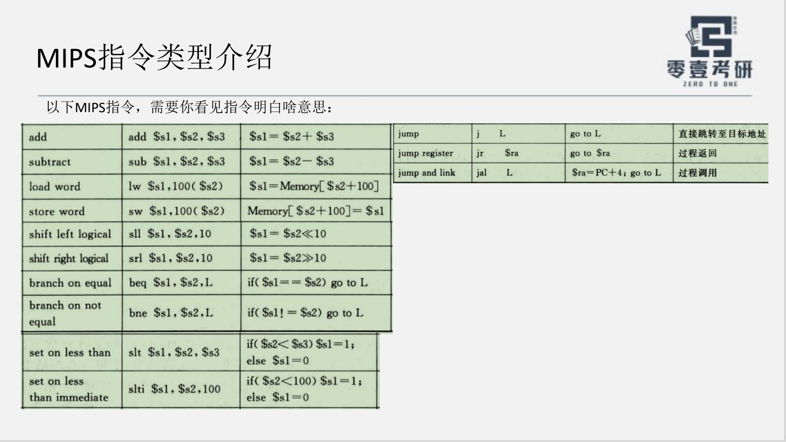
  - 第 65 页：x86 与 MIPS 在「保存返回地址」上的差异（MIPS 由 Q 对 ra 压栈）

**零壹讲义**

- 《零壹计组基础讲义8_指令系统 (1).pdf》
  - 第 5~7 页：指令格式与扩展操作码（含三地址 15 条例题）
  - 第 8~10 页：寻址方式（直接/间接/寄存器间接/隐含等）
  - 第 12 页：CISC 指令系统特点
  - 第 13、14 页：MIPS 寄存器（z、sp、fp、ra 等）与指令格式/寻址方式（R/I/J 型）
    _p13.png>)
  - 第 20 页：练习题（对 ISA 透明的是：指令寻址方式 / 通用寄存器编号 / 存储器芯片编址方式 / 内存寻址范围）
- 《零壹计组强化讲义2-指令系统.pdf》 第 1、3、5 页：指令大题考法、X86/MIPS、微程序与硬布线控制器

**袁春风教材（判定标准）**

- 《计算机组成与系统结构(第3版） (袁春风、唐杰、杨若瑜、李俊)》
  - 第 35 页：MIPS（百万条指令每秒）性能单位
  - 第 120、121 页（第 4 章）：MIPS 指令格式与寻址方式（R/I/J 型字段布局、OP/rs/rt/rd/shamt/func）
     (Z-Library)_p121.png>)
  - 第 126 页：过程调用（jal、栈帧建立、参数传递、返回地址保存）

> 备注：零壹 PPT 第 43 页明确给出本题零地址约束为「（16-X）乘 16 大于等于 17」，故 X 小于等于 14，即第三题正确答案为 14 条单地址指令（非题目提示的「约 16」）；袁春风教材第 121 页为 MIPS 三类指令格式的判定标准。


## 第五讲 总线

> 适用：408 计算机组成原理 第五章/第六章 总线。
> 本讲依据：零壹计组 PPT《27计组PPT9_第五章_总线》、零壹基础讲义《零壹计组讲义9-总线》、零壹强化 PPT《计组-强化4-存储器PPT》，判定标准为袁春风《计算机组成与系统结构（第3版）》第 8 章。

---

#### 一句话总纲

总线是把两个或两个以上部件连接起来、实现信息交换的**共享公共传输通路**；本讲核心四件事：**总线是什么（分类）、总线多快（性能指标）、总线怎么传（传输过程与定时）、总线传完就放手吗（事务与事务分离）**。

---

#### 题目 1　总线的分类

##### 1.1 什么是总线

总线（Bus）是计算机内连接多个部件、用于**信息传输的公共通路**，它能实现两个或两个以上部件之间的信息交换，是各部件**共享**的传输介质。注意"共享"二字：同一时刻总线上一般只允许一个部件发送、多个部件接收，因此总线要靠**分时复用与仲裁**来避免冲突。

##### 1.2 按"所处层次（连接范围）"分类

| 类别 | 连接对象 | 特点与功能 |
|---|---|---|
| 片内总线 | CPU 芯片内部各部件之间 | 连接寄存器与寄存器、寄存器与 ALU、指令部件等；属于核内总线，速度最快 |
| 系统总线 | 处理器、存储器、I/O 模块等**主要部件**之间 | 通常所说的总线；由一组**数据线、地址线、控制线**构成 |
| 通信总线（外部总线） | 计算机系统之间 | 用于计算机系统之间或系统与外设之间的通信，如 USB、串行口等 |

所谓"系统总线"，是连接处理器芯片、存储器芯片和各种 I/O 模块等主要部件的总线。它通常由**数据总线（DB）、地址总线（AB）、控制总线（CB）**三组信号线组成。

##### 1.3 按"传输的信息种类"分类（系统总线内部结构）

| 总线 | 方向 | 功能 | 关键性质 |
|---|---|---|---|
| 数据总线 DB | 双向 | 在各部件之间传送**数据/指令/状态信息** | 位数 = 数据宽度，决定一次能传多少位数据 |
| 地址总线 AB | 单向（由主设备发出） | 给出要访问的**存储单元或 I/O 端口地址** | 位数 n 决定可寻址空间 = 2 的 n 次方 |
| 控制总线 CB | 双向（部分单向） | 传送**控制/状态/定时**信号（读、写、中断、总线请求、总线回答、时钟等） | 信号种类最多，每根线的方向由具体信号定 |

（.snippet 说明：PPT 第 5 页给出了"地址总线、数据总线、控制总线"并列的组成示意图。）

##### 1.4 按"数据传送方式"分类

| 类别 | 含义 |
|---|---|
| 并行总线 | 用**多根**数据线同时并行传送多位数据（如 32 位、64 位） |
| 串行总线 | 用**一根**数据线逐位串行传送（如 USB、SATA），速率可更高、线数更少 |

##### 1.5 按时序（定时）方式划分

同步总线、异步总线、半同步总线（详见题目 4、5），这是**按定时方式**划分，与上面的"按传输数据多少"不同，勿混淆。

##### 1.6 易错提醒

- **地址总线是单向的**（由主设备发出），数据总线是**双向**的，控制总线既有输入也有输出，不能笼统说"全部双向"。
- **地址总线位数决定寻址空间**：地址线 n 根，可寻址 2 的 n 次方个单元；数据总线位数决定数据字长，两者不要混。
- "系统总线"与"片内总线"按**层次**分；"数据/地址/控制"是**系统总线内部的三组信号线**，二者是不同维度的分类。

---

#### 题目 2　总线的性能指标

> 本组指标常考计算题，**公式必须记牢**，重点在**总线带宽**。

##### 2.1 各指标定义

| 指标 | 含义 | 说明 |
|---|---|---|
| 总线宽度 | 总线中**数据线的条数** | 决定每次能同时传送的信息位数；并行总线常见 16 位、32 位、64 位、128 位 |
| 总线工作频率 | 总线每秒传送数据的次数（不再是单纯时钟频率） | 早期一个时钟周期传一次数据，此时工作频率等于时钟频率；现在一个时钟可传 2 次或 4 次，工作频率为时钟频率的 2 倍或 4 倍 |
| 总线带宽 | 总线的**最大数据传输率**，即单位时间内最多可传数据的位数，通常用每秒传送的**字节数**衡量 | 记作 B，单位 B/s 或 MB/s |
| 总线传输周期（总线周期） | 从主设备取得总线控制权、发出地址开始，到收到数据为止的**完整时间** | 注意：总线周期 ≠ 总线时间周期，前者包含数据准备时间 |
| 数据传送率 | 单位时间内传送的数据量 | 与总线带宽是同一类概念，注意单位换算 |
| 总线寻址能力 | 由地址线位数确定的**可寻址空间大小** | 地址线 16 根，不分时多次传送时，最多可访问 2 的 16 次方个单元 |
| 总线复用 | 一组信号线在不同时间传送不同信息 | 如地址/数据复用：先送地址，再送数据 |

##### 2.2 关键公式

总线带宽的计算公式（袁春风教材）：

$$B = \frac{W \times F}{N}$$

其中：

- 大写 W 是总线并行传送的数据位数（字节数），即总线宽度；
- 大写 F 是总线时钟频率（Hz 或 MHz）；
- 大写 N 是完成一次数据传送所需的**时钟周期数**；
- 分数 F 除以 N 即总线**工作频率**（每秒实际传送次数）。

当 N 等于 1（一次传送占一个时钟周期）时简化为：

$$B = W \times F$$

若一个周期传送 2 次、4 次，则先算出工作频率：

$$f_{\text{work}} = F \times k \qquad (k = 1,2,4)$$

再用带宽公式代入。**注意带宽单位是字节每秒（B/s），要把位换算成字节（除以 8）。**

##### 2.3 典型例子

**例 1（袁春风教材 例 8.1）**：某同步总线在一个时钟周期内传送 4 字节数据，时钟频率 33 MHz，求总线带宽。

- 总线宽度 W = 4 字节，时钟 F = 33 MHz，N = 1；
- 带宽 = 4 乘 33 兆 = 132 MB/s。

**例 2（例 8.1 改进）**：若总线宽度改为 64 位（即 8 字节），时钟频率 66 MHz，一个时钟周期能传送 2 次数据，求带宽，并回答提高几倍。

- 工作频率 = 66 乘 2 = 132 MHz；
- 带宽 = 8 乘 132 = 1056 MB/s；
- 相比原 132 MB/s，提高了 1056 除以 132 = **8 倍**。

**例 3（2014 统考真题）**：某同步总线采用地址/数据线复用，地址/数据线共 32 根，总线时钟频率 66 MHz，每个时钟周期传送 2 次数据（上升沿和下降沿各一次），求总线的最大数据传输率。

- 一次传送 32 位 = 4 字节；工作频率 = 66 乘 2 = 132 MHz；
- 带宽 = 4 乘 132 = **528 MB/s**。

**例 4（2009 统考真题）**：某系统总线在一个总线周期内并行传送 4 字节信息，一个总线周期占用 2 个时钟周期，总线时钟频率 10 MHz，求总线带宽。

- 总线周期频率 = 10 除以 2 = 5 MHz（即工作频率）；
- 带宽 = 4 乘 5 = **20 MB/s**（答案选 B）。

##### 2.4 易错提醒

- **总线周期 ≠ 总线时间周期**。总线周期是从主设备获控制权、发地址到收到数据的**完整时间**，里面**包含**了主存准备数据的时间；而"总线时间周期"只是信号重复的时钟周期，二者不能混为一谈。
- 算带宽前先分清"是一次传几位、几个字节""一个周期传几次""一个总线周期占几个时钟周期"，**先求工作频率再乘字节数**，避免直接拿时钟频率乘宽度。
- 宽度单位要统一成**字节**（除以 8）。总线宽度常给"位"，带宽公式里要换成字节。
- 双沿传送（DDR）或四倍并发（quad pumped）时，工作频率 = 时钟频率乘相应倍数，**不要漏乘**。
- 异步总线带宽是平均值估算，题目一般按同步思路给数据，注意题目把"总线周期频率"当作工作频率即可。

---

#### 题目 3　总线传输的过程

##### 3.1 主设备与从设备

一次总线传输由**主设备（Master）**发起：主设备是获得总线控制权、能支配总线的部件（如 CPU、DMA 控制器）；**从设备（Slave）**是被主设备访问、从总线上接收命令或提供数据的部件（如主存、I/O 接口）。

##### 3.2 一次总线传输周期（总线周期）的四个阶段

总线上完成一次数据传送是一个完整的总线周期，传统教材把它分为四阶段：

| 阶段 | 内容 |
|---|---|
| 申请分配阶段 | 需用总线的主模块提出申请，由总线仲裁机构把下一传输周期的使用权授予某个申请者 |
| 寻址阶段 | 取得使用权的主模块通过总线发出本次要访问的从模块地址、及有关命令（读或写），启动从模块 |
| 数据传输阶段 | 主、从模块之间进行数据交换，可单向（读或写）也可双向 |
| 结束阶段 | 主模块的有关信息从系统总线上撤除，释放总线使用权 |

##### 3.3 流程图


##### 3.4 与"总线事务 5 阶段"的关系

408 考研常把上面的过程进一步细化为**总线事务的 5 个阶段**：**请求、仲裁、寻址、传输、释放**。其中"申请分配"被拆成了**请求**（发出申请并取得控制权）与**仲裁**（仲裁机构决定授予谁）两步，结尾的"结束"改称"释放"（见题目 6）。两套说法描述的其实是同一件事，**5 阶段是 4 阶段的细化**，答题时看题目问的是"总线传输过程"还是"总线事务"来选用。

##### 3.5 易错提醒

- 只有**一个主模块**能在总线上发送，其余都是接收；一次总线周期可由多个从设备被寻址，但发送方唯一。
- "申请分配"与"仲裁"在有些表述里合为一步，在另一些表述里分开，**不要因表述不同而误判**，抓住"申请争用、仲裁定夺、寻址启动、数据传送、释放"这条主线。
- 数据传输阶段一般传输一个**字（word）**的数据，突发传送则连续传一块，两者要区分（突发传送见题目 6 的补充）。

---

#### 题目 4　总线定时方式

##### 4.1 什么是定时方式

总线上信息传送的**定时方式**，指主、从模块之间用什么**统一的规则**来确定何时发地址、何时传数据、何时结束，以保证双方时序配合正确。按定时方式分为：**同步通信、异步通信、半同步通信**三类。题目问"定时方式有哪些"时，第一层答这三类；题目落到"异步"时，再细分**不互锁、半互锁、全互锁**三种。

##### 4.2 同步、异步、半同步定时

| 定时方式 | 定时依据 | 特点 |
|---|---|---|
| 同步定时 | 由**统一的时钟信号**同步 | 协议简单；但按最慢设备定时，总线不能太长，只适合存取时间相近的部件 |
| 异步定时 | **无统一时钟**，用**应答（握手）**方式 | 允许各模块速度不一致，灵活；但需要新增应答线，控制较复杂 |
| 半同步定时 | 同步与异步的**结合** | 折中方案：既有时钟同步，又有部分握手信号 |

##### 4.3 异步定时的三种互锁方式

异步（握手）方式根据主、从设备对"请求/回答"信号的**撤除时机与有无互锁关系**，分成三种（判图会考）：

| 方式 | 主设备撤除"请求"信号的时机 | 从设备撤除"回答"信号的时机 | 有无互锁 |
|---|---|---|---|
| 不互锁 | 不必等从设备回答，过一段时间便撤除请求 | 接到请求后发出回答，过一段时间自动撤除 | 双方无互锁关系 |
| 半互锁 | 必须等到从设备回答后才撤除请求 | 发出回答后，不必知道请求是否已撤除，隔一段时间自动撤除回答 | 只对"请求"有互锁，对"回答"无互锁 |
| 全互锁 | 必须等到从设备回答后才撤除请求 | 必须知道主设备的请求已撤除后，才撤除回答 | 双方存在互锁关系 |

（.snippet 示意图：异步通信不互锁、半互锁、全互锁三种时序波形，见零壹强化 PPT《计组-强化4-存储器PPT》第 30 页。）

##### 4.4 全互锁的握手时序（sequenceDiagram）

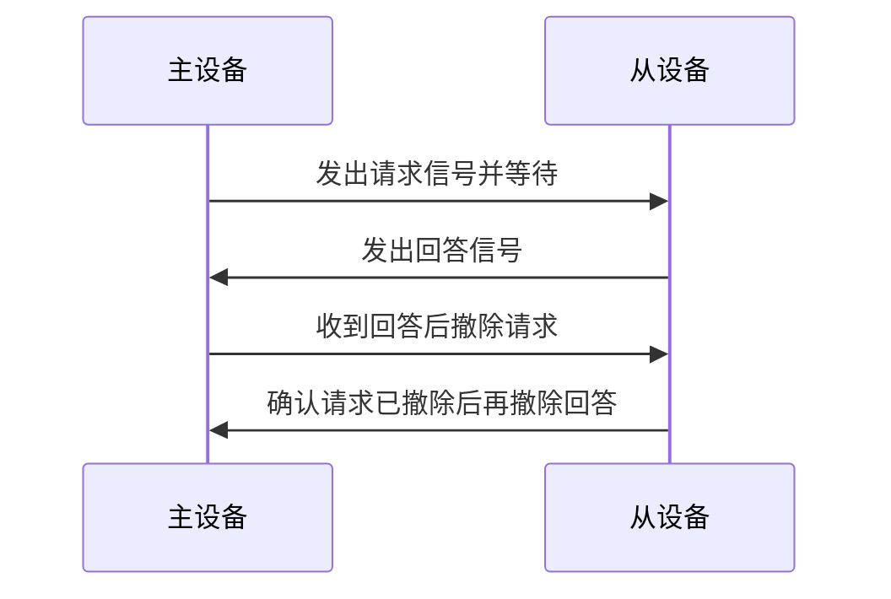

##### 4.5 易错提醒

- 同步定时按**最慢设备**定时间，所以同步总线**不能太长**、只适合存取时间差距不大的部件；异步定时允许速度不一致，但需要**握手信号线**，实现成本更高。
- 三种互锁方式的核心区别在**"撤除信号是否要等对方"**：不互锁大家各自撤、半互锁只请求等回答、全互锁双双等对方。
- 半同步是"同步 + 异步"的**结合**，不要和异步的三互锁混在一起记。
- 现代 CPU 与 SDRAM 之间通常用**同步**方式（因为 SDRAM 读写字受系统时钟 CLK 控制）；CPU 与 I/O 之间常用**异步**方式（速度差异大）。这对应题目 5 的实际应用。

---

#### 题目 5　同步总线与异步总线的对比

##### 5.1 同步总线

同步总线采用**公共的时钟信号**进行定时。挂接在总线上的所有设备都从 CPU（或总线控制部件）获得同一时钟信号，总线的时钟与 CPU 保持一致，传输协议非常简单：只要在规定的第几个时钟周期内完成特定操作即可。

例如，CPU 通过总线访问 SDRAM 主存的"存储器读操作"协议可规定：

1. 主控设备（处理器）在第 1 个时钟周期发送地址和存储器读命令；
2. 从设备（存储器）在第 5 个时钟周期将数据放到总线上作为响应；
3. 处理器在第 6 个时钟周期从 MDR 上取数据。

（.snippet 示意图：同步总线 MAR 送地址 05H、MDR 收数据 3BH 的时序，见 PPT 第 21 页。）

同步总线的缺点：

1. 总线定时以**最慢设备**所花时间为标准，所以只适合存取时间相差不大的多个功能部件之间的通信；
2. 由于存在**时钟偏移**问题，同步总线**不能过长**，否则会降低总线传输效率（时钟偏移导致各位信号到达时间不一致）。

##### 5.2 异步总线

异步总线**没有公共时钟标准**，不要求所有部件严格统一动作时间，而是采用**应答（握手）方式**：当主模块发出请求信号后，一直等到从模块反馈回"响应"信号后才开始通信。它克服了同步总线的缺点，**允许各模块速度的不一致性**，给设计者充分的灵活性和选择余地。

##### 5.3 对比表

| 对比维度 | 同步总线 | 异步总线 |
|---|---|---|
| 定时依据 | 统一**时钟信号** | **握手（应答）**信号，无统一时钟 |
| 时序配合 | 规定第几个时钟周期完成什么操作 | 靠请求/回答信号互相配合 |
| 速度 | 受最慢设备限制，频率一般不很高 | 各设备可自行决定速度，可更高 |
| 可靠性 | 受时钟偏移影响，总线不能太长 | 依赖握手，可靠性取决于应答逻辑 |
| 实现成本 | 协议简单、实现容易，成本低 | 需增加应答线（握手线），控制复杂、成本高 |
| 适用场景 | 存取时间相近的部件（如 CPU 与 SDRAM） | 速度差异大的部件（如 CPU 与 I/O） |
| 冗余度 | 总线短、设备多时受限 | 灵活，可适应更多设备 |

##### 5.4 易错提醒

- 不要误以为"同步总线一定比异步总线快"。**同步总线反而常因按最慢设备定时而偏慢**，但协议简单；异步总线允许各设备快慢自由，更适合**速度差异大**的场合。
- "统一时钟"只解决**时序同步**，不解决信道利用率问题；同步总线因时钟偏移而**不能做长**，这是性能上限。
- 现代多总线结构里**离 CPU 越近的总线速度越快**，如处理器总线与存储器总线（用同步方式），I/O 总线速度较低（常用异步/同步结合的桥接）。

---

#### 题目 6　总线事务的 5 个阶段

##### 6.1 什么是总线事务

每次 CPU 和主存（或其他部件）之间的数据传送都要通过一系列步骤完成，这一整次控制在总线上的**完整交互过程**称为一次**总线事务（Bus Transaction）**。数据流通过总线的共享电子电路在 CPU 和主存之间来回传输，每次传送都是一次总线事务。

##### 6.2 五个阶段（408 考纲细化为 5 阶段）

| 阶段 | 内容 |
|---|---|
| 请求阶段 | 主设备（CPU 或 DMA）发出总线传输请求，并且获得总线控制权 |
| 仲裁阶段 | 总线仲裁机构决定将下一个传输周期的总线使用权授予某个申请者 |
| 寻址阶段 | 主设备通过总线给出要访问的从设备地址及有关命令，启动从模块 |
| 传输阶段 | 主、从设备之间进行数据交换，可单向或双向传送 |
| 释放阶段 | 主模块的有关信息均从系统总线上撤除，让出总线使用权 |

##### 6.3 流程图


##### 6.4 与"四阶段"的关系

前文题目 3 的"申请分配阶段"在此被拆成**请求阶段**与**仲裁阶段**两步，结尾的"结束"改称**释放阶段**。因此，**5 阶段 = 4 阶段的细化**，本质相同，只是拆分粒度不同，答题看题目表述选用。

##### 6.5 补充：突发传送总线事务

总线事务在传送阶段可分为**非突发传送**与**突发传送**两种：

- 非突发传送：每个传输周期都先送地址、再送数据；
- 突发传送（Burst）：一开始给出主存块的**首地址**，然后**连续传送**整块数据，后续数据的地址自动在前一地址上加上一个数据单元，**无需每次都送地址**，效率高。

408 真题中常结合"突发传送总线事务"计算带宽（如"先送首地址和命令、存储器准备数据、传送数据，每次突发传送 32 B"），此时要按**一次突发传多少字节**来算总量，而不是按单个字算。

##### 6.6 易错提醒

- 请求阶段和仲裁阶段不要合并写成"申请分配"而不区分，408 明确要 5 阶段；若题目考查"总线事务几个阶段"，标准答案是**5 个**。
- 传送阶段一般传输一个**字**；突发传送才传**一块**。两者计算方式不同，注意题目给的是"突发传送 32 B"还是"并行传送 4 字节"。
- 释放阶段不是"结束"就完了，要强调**让出总线使用权**给下一个申请者，这是影响总线利用率的关键。

---

#### 题目 7　总线事务分离

##### 7.1 概念（问题一）

**总线事务分离（拆分总线事务）**：把一次原本连续占用总线的完整事务，拆分成**两个独立的部分**，中间**释放总线**，让总线在等待数据期间能被其他设备使用，从而提高总线利用率。

思想：主设备（如 CPU）先发地址与命令就**放手**（释放总线控制权），从设备（如主存）准备好数据后**再申请总线**把数据传回。这样主存准备数据的这段时间，总线空出来可给别的主设备用，不再被 CPU 独占。

##### 7.2 未采用总线事务分离（问题二）

流程：

1. 主设备（CPU）获取总线控制权；
2. 作为主设备，把地址从其内部 MAR 送给主存；
3. **在主存准备好数据之前，CPU 一直占据着总线控制权**；
4. 数据准备好后，主存向 CPU 申请总线控制权；
5. 获得总线控制权后，将数据传输出去。

特点：在**主存准备数据的整个阶段**，总线一直被 CPU 占用，即使实际没在传数据，也**白白浪费**了总线带宽。

用 mermaid 表示：


补充：CPU 与 DRAM 的**异步方式**交换数据就是一种**未采用**事务分离的方式——CPU 在向 DRAM 发出地址信息后，一直占据总线控制权，DRAM 在数据准备好后才申请总线，准备数据的这段时间全部由 CPU 占用总线。

##### 7.3 采用总线事务分离（问题三）

流程：

1. 主设备（CPU）获取总线控制权；
2. 作为主设备，把地址从其内部 MAR 送给主存；
3. **立即释放总线控制权**，不再等待主存；
4. 主存数据准备好后，主存向总线控制器**申请总线控制权**；
5. 主存获得总线控制权后，把数据传输出去（数据准备好了再由主存作为"主"把数据送回）。

特点：主存准备数据的这段时间，**总线空出来给了其他主设备使用**，CPU 也可以去执行别的事情，系统利用率提高。

用 mermaid 表示：


补充：CPU 与 SDRAM 之间**同步方式**交换数据，就是使用了事务分离。SDRAM 芯片读写受系统时钟 CLK 控制，因此与 CPU 之间采用同步方式交换数据；它把 CPU 或其他主设备发出的地址和控制信息**锁存**起来，经过确定的几个时钟周期后给出响应。因此主设备（CPU）在这段时间内可以**安全地进行其他操作**，主存则作为后续"主"把数据送回。

##### 7.4 区分是否采用事务分离的方法（问题四）

| 判断角度 | 未采用事务分离 | 采用事务分离 |
|---|---|---|
| 主设备在"主存准备数据"期间是否占总线 | **一直占着总线**，不放手 | **释放总线**，去做其他操作 |
| 数据由谁主动送回 | 主存准备好后申请总线送回 | 主存准备好后申请总线送回（但中途总线上已有别的设备用过） |
| 总线利用情况 | 准备阶段**总线空转**，利用率低 | 准备阶段**总线可被复用**，利用率高 |
| CPU 该时间段做什么 | 只能等待（空等） | 可以执行其他操作 |
| 与时序方式对应 | 多对应**异步**方式（如 CPU 与 DRAM） | 多对应**同步/锁存**方式（如 CPU 与 SDRAM） |

**最直接的判断方法**：看主设备在**发出地址与命令之后、收到数据之前，是否一直持有总线控制权**。

- 若**一直持有**（从头到尾占用到数据传回），则对应未采用事务分离；
- 若**中途释放**（数据由从设备准备好后再申请总线送回），则对应采用了事务分离。

##### 7.5 易错提醒

- 事务分离后，**数据不是由原主设备"再发起"一次事务去取**，而是由**从设备（主存）作为新的主设备**在数据准备好后申请总线把数据送回。因此分离后实际上有**两个阶段**，且这两个阶段之间总线交还给了其他设备。
- "未采用事务分离"不等于"异步"；"采用事务分离"不等于"同步"。二者是**两个维度**：事务分离说的是**总线是否中途放手**，同步/异步说的是**定时靠时钟还是握手**。虽然常见搭配是"未分离 + 异步""采用分离 + 同步"，但判断时**别把这两条混为一谈**。
- 分离后主设备放手的时刻是**"发完地址和命令之后立即"**，而不是"数据准备好之后"；掌握这个时间点就能区分。
- 判定标准（教材为准）：袁春风教材在讲异步总线与 DRAM 交互时，明确"CPU 在发出地址信息后一直占住总线直到数据送回"即未分离；讲 SDRAM 锁存地址、若干周期后响应即已分离。PPT 第 39、40 页分别给出这两种情形的对比图。

---

#### 资料定位（本地资料库）

**零壹 PPT（优先）**
- 《27计组PPT9_第五章_总线 (1).pdf》 第 5 页：总线组成（数据/地址/控制总线）
  _p5.png>)
- 第 17 页：总线带宽定义与 2014 真题例
  _p17.png>)
- 第 18 页：总线周期（总线周期不是总线时间周期）与 2009 真题例
  _p18.png>)
- 第 19 页：总线周期四阶段（申请分配、寻址、传输、结束）
- 第 20 页：总线定时方式（同步/异步/半同步）
  _p20.png>)
- 第 21 页：同步总线（统一时钟、存储器读操作协议）
  _p21.png>)
- 第 26 页：总线分类（片内/系统/I/O 总线）
  _p26.png>)
- 第 38 页：总线事务 5 个阶段
  _p38.png>)
- 第 39 页：未采用事务分离
  _p39.png>)
- 第 40 页：采用事务分离
  _p40.png>)

**零壹基础讲义**
- 《零壹计组讲义9-总线 (2).pdf》 第 1 页：目录（含总线事务分离）；第 6 页：总线性能指标与带宽公式；第 7 页：总线定时方式（同步/异步/半同步）；第 9 页：总线分类（片内/系统总线等）；第 13 页：总线事务五阶段；第 14 页：存储器总线/事务分离。

**零壹强化 PPT**
- 《计组-强化4-存储器PPT.pdf》 第 30 页：异步通信不互锁、半互锁、全互锁三种时序图
  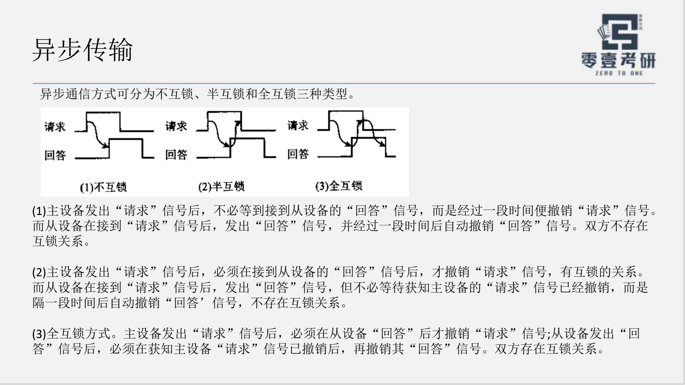
- 《计算机组成强化1_数据运算总线_PPT (1).pdf》 第 14 至 19 页：存储器总线带宽/突发传送事务例题。

**判定标准（袁春风教材）**
- 《计算机组成与系统结构（第3版）》 第 288 至 298 页：第 8 章 总线概述、组成、同步/异步总线；
- 第 295 页：总线定义、系统总线组成（数据/地址/控制线）、同步总线；
- 第 296 页：总线性能指标（总线宽度、工作频率、带宽公式 带宽 = W 乘 F 除以 N、寻址能力、定时方式、传送方式）
   (Z-Library)_p296.png>)
- 第 297 至 298 页：MHz 与 MT/s 的区别、四倍并发（quad pumped）传送。

> 说明：本讲以零壹 PPT/讲义为讲解框架与图示来源，答案判定以袁春风教材为准；二者对"总线周期 vs 总线时间周期"、异步三种互锁的表述以教材为准，PPT 作教学视角补充。


## 第六讲 CPU

> 定位：408 计算机组成原理 第五章 中央处理器。本讲围绕"CPU 是什么 + 怎么组成 + 一条指令怎么走 + 怎么提速（流水线）"展开，共 12 大题。
>
> **寄存器/信号约定**：通用寄存器 R0～R3；程序计数器 PC；指令寄存器 IR；存储器地址寄存器 MAR；存储器数据寄存器 MDR；累加寄存器 ACC；数据缓冲寄存器 X；暂存寄存器 temp；程序状态字寄存器 PSW。控制信号采用"源寄存器 out => 总线 / 目的寄存器 in（从总线写入）"的命名方式，如 `PCout`、`MARin`、`read`、`PCinc`、`MDRout`、`IRin`、`R1in`。

---

#### 一、CPU 的基本构成和基本功能

##### 1.1 CPU 的基本功能

CPU 是中央处理器（Central Processing Unit），是计算机的核心部件，用于执行程序指令。基本功能：

1. **取指令**：从主存取出下一条指令，放入指令寄存器 IR。
2. **分析指令**：对指令操作码进行译码，确定操作数和操作类型。
3. **执行指令**：根据译码结果，产生相应的控制信号，驱动各部件完成该指令规定的操作。
4. **控制数据流**：负责算术逻辑运算、控制数据流、管理计算机的输入输出等任务。

> 一句话：CPU 在程序控制下，自动**取指 → 译码 → 执行**循环，并协调全机各部件完成指令。

##### 1.2 CPU 的基本构成

CPU 由**运算器**、**控制器**以及若干**用户不可见寄存器**（如 MAR、MDR）组成。注意：**冯·诺依曼结构**下，程序和数据都存放在主存中，CPU 靠控制器自动完成取指与执行。

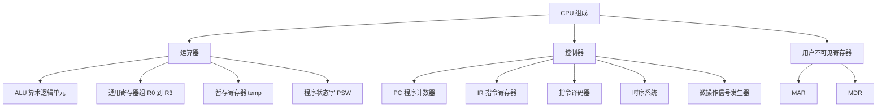

##### 1.3 主要寄存器功能

| 寄存器 | 类型 | 功能 |
| --- | --- | --- |
| PC | 用户可见 | 存放下一条指令在主存中的地址，具有自增功能 |
| IR | 用户不可见 | 保存当前正在执行的指令 |
| MAR | 用户不可见 | 存放要访问的主存单元地址 |
| MDR | 用户不可见 | 存放从主存读出或要写入主存的数据（缓冲） |
| ACC | 用户可见 | 累加寄存器，常暂存 ALU 运算结果，可作加法一个输入端 |
| X | 用户可见 | 数据缓冲/操作数寄存器，暂存操作数 |
| temp | 用户不可见 | 暂存寄存器，暂存中间结果，避免破坏通用寄存器内容 |
| PSW | 用户可见 | 程序状态字，保存 OF SF ZF CF 等状态标志 |
| R0～R3 | 用户可见 | 通用寄存器，存放操作数、结果、地址 |

---

#### 二、控制器的主要组成部分及各部分功能

控制器是"指挥中心"，其工作原理是：根据指令操作码、执行步骤（微命令序列）和条件信号，生成当前机器各部件所需用的控制信号，指挥全机协同运行，从而得到预期的执行结果。

| 组成部分 | 功能 |
| --- | --- |
| 程序计数器 PC | 指出下一条指令在主存中的存放地址；CPU 依据 PC 内容去主存取指；程序通常顺序执行，故 PC 有自增功能 |
| 指令寄存器 IR | 保存当前正在执行的指令；其操作码段送译码器 |
| 指令译码器（ID） | 对指令操作码字段进行译码，向控制器提供特定的操作信号 |
| 时序系统（时序信号产生部件） | 产生各种时序信号，由统一时钟（CLK）分频而来；含脉冲源、启停控制线、时序信号部件 |
| 微操作信号发生器（控制信号形成部件） | 根据 IR 的内容（指令）、PSW 的内容（状态信息）及时序信号，产生控制整个计算机系统所需的各种控制信号；结构分**组合逻辑型**和**存储逻辑型**两种 |

> 补充：MAR、MDR 是 CPU 与主存之间的接口寄存器，常被教材归入控制器（取指/访存机制的一部分），也有的教材把它们归入数据通路部件。答题时按"属于 CPU 内部寄存器、介于控制器与主存之间"理解即可。

---

#### 三、运算器的主要组成部分及各部分功能

运算器接收控制器送来的命令并执行相应动作，对数据进行加工和处理，是 CPU 对数据进行加工处理的中心。

| 组成部分 | 功能 |
| --- | --- |
| 算术逻辑单元 ALU | 核心部件，进行算术/逻辑运算 |
| 暂存寄存器 temp | 暂存从主存读来的数据；该数据不放在通用寄存器中，否则会破坏其原有内容；对程序员透明 |
| 累加寄存器 ACC | 通用寄存器，用于暂存 ALU 运算的结果信息，可作为加法运算的一个输入端 |
| 通用寄存器组 | 存放操作数、中间结果和各种地址；如 R0～R3、SP（堆栈指针）等 |
| 程序状态字寄存器 PSW | 保存 ALU 运算结果建立的各种状态信息，如 OF SF ZF CF 等；这些位参与并决定微操作的形成 |
| 移位器 | 对操作数或运算结果进行移位运算 |
| 计数器 | 控制乘除运算的操作步数 |

> 运算器功能：进行算术与逻辑运算、移位、暂存数据，并生成状态标志（OF SF ZF CF）。
> 易错：**ACC、X（操作数缓冲）、temp 都属于运算器/数据通路**，但 ACC 是用户可见、temp 是用户不可见；PSW 属于运算器（状态部件），不是控制器。

---

#### 四、数据通路概念及其组成部分

##### 4.1 定义

**数据通路**：数据在功能部件之间传输的**物理路径**。它包含 PC、通用寄存器、ALU、暂存寄存器、PSW 状态寄存器等运算/存储部件，以及它们之间的互连（总线、多路选择器等）。数据通路是 CPU 中实现**数据流动和处理**的路径。

> 数据通路的核心作用：在**控制信号**驱动下，把数据从一个部件经总线/ALU 传送到另一个部件，完成取指、间址、执行等操作。
> 重要区分：**控制单元 CU（控制器）不属于数据通路**，它是产生控制信号、指挥通路工作的控制器，只"控制"数据通路运行；数据通路本身**不产生**控制信号，只是被动响应控制信号。

##### 4.2 组成部分

数据通路主要由两类元件组成：

1. **组合逻辑（操作）元件**：输出只取决于当前输入，如多路选择器 MUX、加法器 Adder、算术逻辑部件 ALU、译码器 Decoder、三态门、符号扩展单元等。
2. **时序逻辑（状态）元件**：具有存储功能，由时钟控制写入，如 PC、IR、MAR、MDR、通用寄存器、暂存寄存器、PSW 等。

##### 4.3 单总线数据通路示意

"单总线"指所有寄存器都挂在一根共享总线上，通过控制信号分时传送数据。下图以 CPU 单总线数据通路为例（数据通路 + 控制逻辑单元）：

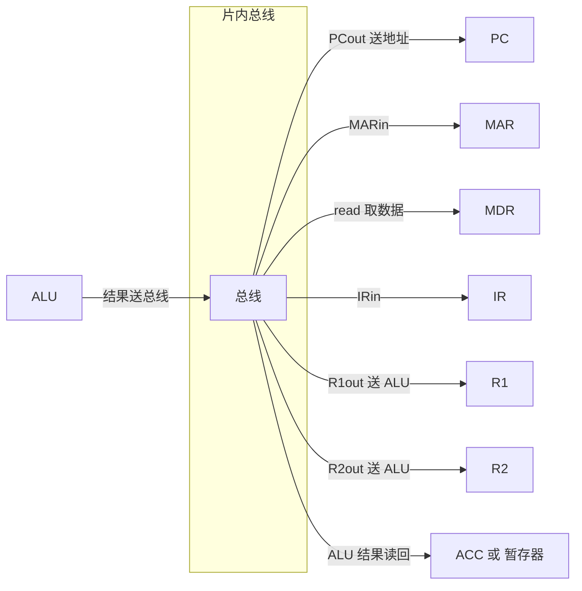

> 注：图中箭头仅为数据流向示意；实际单总线结构靠"源寄存器 out + 目的寄存器 in + 读/写/ALU 控制"信号驱动。

---

#### 五、组合逻辑元件和时序逻辑元件

##### 5.1 概念与对比

| 项目 | 组合逻辑（操作）元件 | 时序逻辑（状态）元件 |
| --- | --- | --- |
| 输出依据 | 只取决于当前输入 | 取决于当前输入和当前状态（存储内容） |
| 定时是否受时钟控制 | 不受时钟信号控制 | 由时钟控制写入，输出保持到下一时钟 |
| 是否具有存储功能 | 无 | 有（存储功能） |
| 常见举例 | 多路选择器 MUX、加法器 Adder、ALU、译码器、三态门、符号扩展单元 | D 触发器、寄存器（PC、IR、MAR、MDR、R1、R2）、暂存器、PSW |
| 体现 | 数据从输入到输出经逻辑门延迟后改变 | 输入状态由时钟决定何时被写入，输出端随时可读且保持 |

> 例：R1、R2、PC、IR、MAR、MDR 是**时序逻辑元件**；ALU、MUX、加法器、译码器是**组合逻辑元件**。

##### 5.2 时钟周期长度确定方式

时钟周期是 CPU 的最小时间单位，等于主频的倒数（$$T_{clk}=1/f$$）。

**时钟周期必须以相邻状态单元之间组合逻辑电路的最大延迟为基准确定**（与 2019 年统考真题含义一致）。即满足：

$$T_{clk} \geq t_{comb,max} + t_{setup}+t_{hold}$$

其中 $$t_{comb,max}$$ 为相邻状态单元之间组合逻辑的最大延迟，$$t_{setup}$$、$$t_{hold}$$ 为时序元件（触发器/寄存器）的建立、保持时间。

归纳到三种 CPU：

| CPU 类型 | 时钟周期确定方式 |
| --- | --- |
| 单周期 CPU | 所有指令在一个时钟周期完成，故时钟周期不小于最长指令所需时间 |
| 多周期 CPU | 一个指令周期分若干机器周期，每个机器周期若干节拍；机器周期以存取周期为基准 |
| 流水线 CPU | 各流水段执行时间可能不同，时钟周期不小于最慢流水段所需时间（以最慢段为准） |

---

#### 六、指令周期、机器周期、时钟周期关系

##### 6.1 定义

| 名称 | 定义 | 地位 |
| --- | --- | --- |
| 指令周期 | CPU 每取出并执行一条指令所需的全部时间，即 CPU 完成一条指令的时间 | 最大周期 |
| 机器周期 | 完成一个基本工作周期（取指、间址、执行、中断等）所需时间，也称基本工作周期；其宽度通常以**主存存取周期**为基准（存取延迟大） | 中等周期 |
| 时钟周期（节拍） | CPU 的最小时间单位，由统一时钟产生；一个机器周期内含若干时钟周期 | 最小周期 |

##### 6.2 包含关系

- 指令周期由若干机器周期组成；机器周期由若干时钟周期（节拍）组成。
- **408 常见划分**：把一个指令周期分成 4 个机器周期——**取指周期、间址周期、执行周期、中断周期**。其中取指周期、间址周期、执行周期、中断周期都各自可称为机器周期。

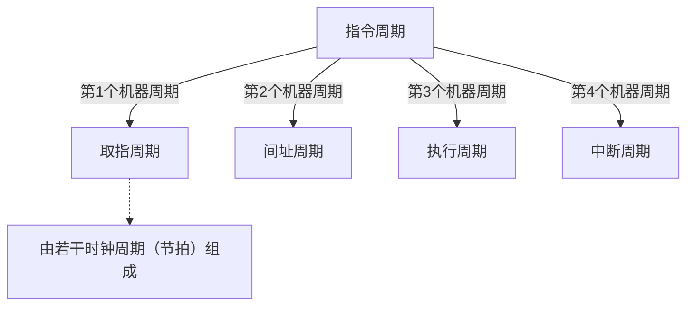

##### 6.3 定长与变长指令周期

- **定长指令周期**：所有指令的指令周期相同，机器周期数固定，每个机器周期包含固定数量的节拍数（T-states）。如早期按"存取周期"统一。
- **变长指令周期**：不同指令的指令周期不同（如乘法比加法长、有间址的比无间址的长）。现代 CPU 引入 Cache 后可直接由时钟周期组成，不再显式用"机器周期"概念。

##### 6.4 易错提醒

- 机器周期宽度以**存储器访问时间**为基准确定，而不是以 CPU 内部操作（如寄存器访问、ALU 计算，通常更快）为基准。若以 CPU 内部操作为基准，会因存取延迟大而出现"无法完成内存访问"的问题。
- 指令周期、机器周期、时钟周期是**逐层包含**的关系（指令周期最大、时钟周期最小），不要颠倒。
- 间址周期只在有间址寻址的指令中出现；没有间址操作的指令，其指令周期只含取指周期 + 执行周期。

---

#### 七、取指周期功能和节拍安排

##### 7.1 功能

**取指周期**的功能：从主存取出当前指令并送入 IR，同时使 PC 指向下一条指令（PC 自增）。它是每条指令都必须经历的阶段，是机器周期中**必不可少**的一个。

##### 7.2 节拍-微操作-控制信号表（单总线/通用模型）

| 节拍 | 微操作 | 控制信号 | 说明 |
| --- | --- | --- | --- |
| 节拍1 | PC 到 MAR | PCout，MARin | 把 PC 内容（指令地址）送总线，MAR 从总线读入，同时 CPU 申请总线控制权 |
| 节拍2 | 从主存读，PC 自增 | read，PCinc | 主存按 MAR 读出指令送 MDR；PC 加 1（自增），为取下一条指令做准备 |
| 节拍3 | MDR 到 IR | MDRout，IRin | 把 MDR 中的指令送 IR；其后 IR 经专用线把操作码 OP 送译码器译码 |

> 取指周期通常需要 **3 个时钟周期（节拍）**：PC到MAR（1 时钟）、读主存+PC自增（1 时钟，PC自增可合并到第二个时钟）、MDR到IR（1 时钟）。译码通过专用线进行，不需额外时钟。

> 说明：本表用"单总线"约定，反映所有指令共用的取指微命令序列；控制信号随教材/数据通路设计略有差异（如有的把 PC自增放在最后），但**取指三拍的核心（送地址、读主存、送 IR）不变**。

---

#### 八、间址周期功能和节拍安排

##### 8.1 功能

**间址周期**：当指令中某个操作数采用**间址寻址**时，CPU 在取指周期之后进入间址周期。它的目的**是取出操作数的有效地址**（形式地址指向的存储单元中存放的是有效地址）。

以指令 `MOV R1, 05H` 为例，源操作数 `05H` 采用间址寻址。此时指令字段中的 `05H` 是**形式地址**，真正存放操作数的地址（有效地址）存放在主存单元 `05H` 中。

##### 8.2 节拍-微操作-控制信号表

| 节拍 | 微操作 | 控制信号 | 说明 |
| --- | --- | --- | --- |
| 节拍4 | 形式地址送 MAR | AD(IR)out，MARin | IR 把形式地址（05H）送上总线，MAR 从总线读入形式地址 |
| 节拍5 | 从主存读，得到有效地址 | read | 主存按 MAR 读出内容（有效地址）送入 MDR |

> 控制信号同样是进入间址周期前，由控制信号发生器根据指令操作码分析得出；微程序控制器会在进入间址周期前生成间址周期和执行周期的微程序。

##### 8.3 时序示意图

```mermaid
flowchart LR
  A["IR 中的形式地址 05H"] -->|"AD（IR）out，MARin"| B["MAR 装入形式地址"]
  B -->|"read"| C["主存按 05H 读出有效地址"]
  C -->|"MDR"| D["MDR 中得到有效地址"]
  D -->|"进入执行周期"| E["执行周期"]
```

---

#### 九、执行周期节拍安排（MOV R1, 05H）

**题目**：以指令 `MOV R1, 05H` 为例，源操作数 `05H` 采用间址寻址。在间址周期根据形式地址取到了**有效地址**，执行周期将有效地址中的**数据**给到 R1，请给出执行周期节拍安排。

##### 9.1 分析

- 取指周期（节拍1～3）：取出 `MOV R1, 05H` 指令到 IR，PC 自增。
- 间址周期（节拍4～5）：把形式地址 05H 送 MAR，读主存得到**有效地址**（存于 MDR）。
- **执行周期（节拍6～8）**：把有效地址送 MAR，读主存得到真正的**操作数数据**，再写入 R1。

##### 9.2 执行周期节拍安排表

| 节拍 | 微操作 | 控制信号 | 说明 |
| --- | --- | --- | --- |
| 节拍6 | 有效地址送 MAR | MDRout，MARin | 把间址周期得到的有效地址（在 MDR 中）送上总线，MAR 从总线读入 |
| 节拍7 | 从主存读数据 | read | 主存按 MAR 中的有效地址读出数据，送入 MDR |
| 节拍8 | 数据送 R1 | MDRout，R1in | 把 MDR 中的数据送上总线，R1 从总线读入，完成赋值 |

##### 9.3 完整指令周期（MOV R1, 05H，源操作数间址寻址）总表

| 机器周期 | 节拍 | 微操作 | 控制信号 |
| --- | --- | --- | --- |
| 取指周期 | 1 | PC 到 MAR | PCout，MARin |
| 取指周期 | 2 | 读主存，PC 自增 | read，PCinc |
| 取指周期 | 3 | MDR 到 IR | MDRout，IRin |
| 间址周期 | 4 | 形式地址送 MAR | AD(IR)out，MARin |
| 间址周期 | 5 | 读主存得有效地址 | read |
| 执行周期 | 6 | 有效地址送 MAR | MDRout，MARin |
| 执行周期 | 7 | 读主存得数据 | read |
| 执行周期 | 8 | 数据送 R1 | MDRout，R1in |

##### 9.4 易错提醒

- 间址周期读到的是**有效地址**，执行周期读到的才是**真正的操作数数据**，两者不能混。`MOV R1, 05H` 的间址寻址：`05H` 是形式地址，内存 `05H` 单元放的才是有效地址，内存"有效地址"单元放的才是要赋值给 R1 的数据。
- 节拍编号是连续的（本模型里取指 1～3，间址 4～5，执行 6～8），但不同教材/数据通路的节拍数可能不同（如无间址则直接跳到执行）。答题时**按"微操作-控制信号"对应关系为主**，节拍编号是辅助。

---

#### 十、指令流水线分为哪几个流水段

##### 10.1 流水段划分（MIPS 经典五段）

| 流水段 | 名称 | 功能 |
| --- | --- | --- |
| IF | 取指（Ifetch） | 从取指部件取出指令；若是分支指令，还把分支返回地址保存在 IF/ID 段间寄存器（供返回用）；结果送 IF/ID 寄存器 |
| ID | 译码（Reg/Dec） | ① 根据 Rs、Rt、Rd 从寄存器堆取相应寄存器值；② 对操作码 op 字段译码，生成控制信号；结果（rs rt rd 控制信号 imm16）送 ID/EX 寄存器 |
| EX | 执行（Exec） | 由指令类型决定：R 型做 ALU 运算并产生 Zero/Overflow 标志；I 型运算类对立即数扩展后运算；lw/sw 对立即数扩展后与 busA 相加得存储器地址；beq 对 busA、busB 相减得 Zero，并把立即数扩展左移 2 位与 PC+4 相加得转移目标地址；j 型生成转移目标地址 |
| MEM | 访存（Mem） | R 型/I 型运算类为空操作；lw 取数；sw 存数；beq/j 将转移目标地址更新到 PC（beq 时当 Zero=1 则生成 Branch=1、MemWr=0，控制 PC 多路选择器选目标地址） |
| WB | 写回（Wr） | R 型/I 型运算类把 ALU 结果写寄存器堆；lw 把数据存储器读出结果写寄存器；sw、beq、j 不写寄存器 |

##### 10.2 每个阶段用时怎么确定

- 流水线把一条指令的执行划分为若干**同样时长**的流水段，每个流水段的执行时间**以最慢的流水段所需时间为准**，等于**一个时钟周期**。
- 因为各流水段功能不同、执行时间可能不同，时钟周期应取**各段用时的最大值**：$$T_{clk} \geq \max(t_{IF},t_{ID},t_{EX},t_{MEM},t_{WB})$$，最慢段决定时钟周期，快段会出现空闲（时间浪费）。
- 时钟周期越短、流水段越细，吞吐率越高；但流水段越细分，流水寄存器的开销（额外建立保持时间、寄存器延迟）也越大，故不是越细分越好。

##### 10.3 流水线五段示意

```mermaid
flowchart LR
  S1["IF 取指段"] --> S2["ID 译码段"]
  S2 --> S3["EX 执行段"]
  S3 --> S4["MEM 访存段"]
  S4 --> S5["WB 写回段"]
  S1 --- R1["IF/ID 段间寄存器"]
  S2 --- R2["ID/EX 段间寄存器"]
  S3 --- R3["EX/MEM 段间寄存器"]
  S4 --- R4["MEM/WB 段间寄存器"]
```

> 各段之间用**流水段寄存器（段间寄存器）** 相连：IF/ID、ID/EX、EX/MEM、MEM/WB，用于保存上一段结果供下一段使用。

---

#### 十一、指令流水线的冒险及处理方法

##### 11.1 冒险的分类

| 冒险类型 | 别称 | 成因 | 产生场景 |
| --- | --- | --- | --- |
| 结构冒险 | 资源冲突 / 硬件资源冲突 | 多条指令在同一时钟周期竞争同一硬件资源 | 如取指令与访存都要访存（单存储体）、寄存器堆同一周期读写冲突 |
| 数据冒险 | 数据相关 | 后面指令用到前面指令的结果，而前面指令结果尚未产生 | RAW（Read After Write，写后读）、WAR（Write After Read，读后写）、WAW（Write After Write，写后写） |
| 控制冒险 | 分支冒险 | 分支指令在 EX 段才判断是否跳转、MEM 段才更新 PC，而更新之前已有指令进入流水线 | 如 beq、j 型指令引起的跳转不确定 |

##### 11.2 三种数据冒险（RAW / WAR / WAW）说明

| 类型 | 含义 | 是否真正引起问题 | 说明 |
| --- | --- | --- | --- |
| RAW | 写后读 | 会（最典型、必须处理） | 后指令读该寄存器时，前一指令还没写入 |
| WAR | 读后写 | 基本不引起问题 | 后指令写前，前指令已读过该寄存器（顺序流水线中无害） |
| WAW | 写后写 | 基本不引起问题 | 后指令写前，前指令已写入该寄存器（顺序流水线中无害） |

> 在**顺序发射、顺序完成**的简单流水线中，WAR、WAW 一般不引起问题；主要处理的是 **RAW**。在**乱序执行**（动态流水线调度）中 WAR、WAW 才需专门处理。

##### 11.3 处理方法

| 冒险类型 | 处理方法 |
| --- | --- |
| 结构冒险 | ① 资源重复：指令 Cache 与数据 Cache 分离、增加功能部件（如多个加法器/乘法器）；② 让冲突部件分时复用（如把访存操作集中），必要时插入气泡/空操作 |
| 数据冒险 RAW | ① 插入空操作指令（插入气泡），直到前面指令结果就绪；② **转发（旁路/前递）技术**：把 ALU 输出直接转发给下一指令输入端，不必等写回；③ 对于 load-use 冒险（lw 后紧跟使用该寄存器的 R 型/I 型指令），转发无法完全解决，需**插入一个气泡**（停顿 1 拍）或由编译器/硬件重排 |
| 数据冒险 WAR/WAW | 采用**寄存器堆的沿触发写入 + 异步读出**：同一周期内"写"在时钟沿后更新、"读"得到旧值，天然避免同一周期读写冲突，无需额外备份（MIPS 寄存器堆）；乱序时用**寄存器重命名** |
| 控制冒险 | ① **分支预测**（静态预测 + 动态预测）；② 采用**延迟槽**（在分支后安排一条必执行的指令）；③ 若预测失败则**冲刷（清空）** 已错误进入流水线的指令并重取；④ 提前在 ID 段对分支进行判断（把判断提前，减少空转） |

##### 11.4 数据旁路技术的两种实现

1. **直接将数据通路中生成的中间数据转发到另一流水段的输入端**（硬件转发，从 EX/MEM、MEM/WB 输出旁路到 ID/EX 输入端）。
2. **把寄存器"写"和"读"分别控制在不同半周期**：前半周期执行写操作，后半周期执行读操作，从而避免同一周期读写冲突（MIPS 沿触发写入 + 异步读出的思想）。

```mermaid
flowchart TD
  A["流水线冒险"] --> B["结构冒险"]
  A --> C["数据冒险"]
  A --> D["控制冒险"]
  C --> C1["RAW 写后读"]
  C --> C2["WAR 读后写"]
  C --> C3["WAW 写后写"]
  B --> E1["资源重复或分时复用"]
  C --> E2["转发旁路或插入气泡"]
  D --> E3["分支预测或延迟槽或冲刷"]
```

##### 11.5 易错提醒

- 转发（旁路）能解决**大部分 RAW**，但**不能完美解决 load-use 冒险**（lw 后面紧跟用到该结果指令），此时仍须**插入一个气泡（停顿）**。
- 结构冒险本质是**资源冲突**，不是数据相关；控制冒险的本质是**分支跳转结果不确定导致后面指令取错**。
- 在简单顺序流水线中，真正需要重点处理的只有 **RAW**；WAR/WAW 在**乱序执行**时才需要处理（寄存器重命名）。

---

#### 十二、高级流水线（超标量、超流水线、VLIW、多发射）

##### 12.1 概述

指令级并行（ILP）的两种大方向：**多发射技术**（通过多个功能部件，使流水线功能段同时处理多条指令，处理器一次可发射多条指令）与**超流水线技术**（通过增加流水线级数，使更多指令同时在流水线中重叠执行）。

##### 12.2 各类高级流水线对比

| 技术 | 别称 | 原理 | 实现要点 | 特点 |
| --- | --- | --- | --- | --- |
| 超标量 | 动态多发射 / 超标量处理器 | 每个时钟周期内可并发多条独立指令，并行执行（流水线级数不变，宽度扩展） | 需配置**多个功能部件**、多条指令发射/译码 | 不能调整指令执行顺序；靠编译优化把可并行指令搭配，挖掘指令并行性 |
| 超流水线 | 超流水（Superpipeline） | 将指令执行过程划分得更**细**，采用**更多级数**的流水线 | 把流水段细分、均衡 | 重在**时间上并行**（同一时钟内多段重叠）；流水段越多，流水寄存器开销越大，不是越多越好 |
| 超长指令字 VLIW | 静态多发射 / 超长指令字技术 | 由**编译程序**挖掘指令间潜在并行性，把多条能并行操作的指令组合成一条**超长指令**（含多个操作码字段，可多达几百位） | 需多个处理部件；一条超长指令的多字段同时控制多个功能部件 | 静态调度，硬件简单，指令由编译器打包对齐 |
| 多发射 | 多发射流水线 / 动态多发射 | 同时发射多条指令，并由多个功能部件并行执行 | 依赖编译或硬件动态调度 | 超标量即动态多发射的一种；与流水线结合提高吞吐率 |
| 动态流水线调度 | 乱序执行 | 处理器动态确定哪些指令并行/何时发射，允许乱序执行；依指令相关性与动态分支预测 | 需相关性检测、动态分支预测、寄存器重命名 | 当无法同时发射时，动态地从后面找无依赖指令提前执行，属超标量处置方式 |

> 补充：**超标量与超流水线的区别**：超标量靠"加宽"（同一时间、多条指令并行）；超流水线靠"加细"（流水线段数更多、时间细分）。超长指令字是**静态**多发射（编译期打包），超标量是**动态**多发射（运行期决定）。

##### 12.3 附：经典高级流水线示意图

```mermaid
flowchart LR
  P["指令级并行 ILP"] --> S["多发射技术"]
  P --> T["超流水线技术"]
  S --> S1["超标量（动态多发射）"]
  S --> S2["超长指令字 VLIW（静态多发射）"]
  T --> T1["更多流水级、更细划分"]
```

##### 12.4 易错提醒

- **超标量 = 动态多发射**，**超长指令字 = 静态多发射**（编译器打包），两者发射时机不同，是常考点。
- 超流水线"段数越多越好"是**错误的**：流水段寄存器（段间寄存器）开销随级数增加而增大，会抵消收益，故**有限制、不是越多越好**。
- 关于 CPI：理想情况下，基本流水线、超标量流水线的 CPI 可小于 1（一个周期发射并完成多条指令），单周期/多周期 CPU 的 CPI 不小于 1。

---

#### 插图 7～9 配套分析

框架插图 7、8、9 分别对应**取指周期 / 间址周期 / 执行周期**三大机器周期的结构示意图（可对照本讲第七、八、九题）。配套要点：

- **插图7（取指周期）**：图内数据流向为 `PC → 总线 → MAR → 主存 → MDR → 总线 → IR`，同时 `PC + 1`。重点：PC 输出地址、主存读、MDR 缓冲、IR 接收这 4 个环节，对应控制信号 `PCout/MARin`、`read/PCinc`、`MDRout/IRin`。
- **插图8（间址周期）**：图内为 `IR（形式地址 05H）→ 总线 → MAR → 主存 → MDR`。重点：先把**形式地址**送 MAR，再读主存得到**有效地址**存入 MDR；对应 `AD(IR)out/MARin`、`read`。
- **插图9（执行周期）**：图内为 `MDR（有效地址）→ 总线 → MAR → 主存 → MDR → 总线 → R1`。重点：用有效地址再访存一次得到真正**数据**，写入目标寄存器 R1；对应 `MDRout/MARin`、`read`、`MDRout/R1in`。

> 三张插图连起来就是一条 `MOV R1, 05H`（源操作数间址寻址）指令的完整指令周期：取指（1～3 拍）→ 间址（4～5 拍）→ 执行（6～8 拍）。注意间址读的是"有效地址"，执行读的才是"数据"。

---

#### 资料定位

（本地资料库，零壹 PPT 优先；教材/讲义作判定标准）

**零壹 PPT（基础）**
- 《计算机组成原理\基础\PPT\27计组PPT10_第六章_CPU (3).pdf》 第 20 页：时序系统（指令周期/机器周期/时钟周期三级时序，4 个机器周期划分）
- 同文件 第 15 页：逻辑单元（组合逻辑/时序逻辑元件定义与举例）
- 同文件 第 13、14、18 页：数据通路概念、单总线/单周期数据通路、2021 统考真题
- 同文件 第 29～34 页：间址周期、执行周期（MOV R1, 05H 的节拍-控制信号表）

**零壹 PPT（强化）**
- 《计算机组成原理\强化\PPT\计组-强化3PPT-CPU.pdf》 第 32～37 页：指令流水线五段（IF/ID/EX/MEM/WB）功能
- 同文件 第 39 页：流水线控制信号；第 52 页：数据旁路技术（数据冒险）；第 57 页：控制冒险；第 58 页：Load-use 冒险及其处理

**零壹讲义**
- 《计算机组成原理\基础\讲义\零壹计组讲义10-中央处理器基础 (1).pdf》 第 4～6 页：CPU 概述、基本功能、控制器、运算器
- 同文件 第 9～11 页：指令周期、取指周期微指令序列、间址周期
- 同文件 第 18 页：高级流水线技术（超标量/超长指令字/超流水线）
- 《计算机组成原理\强化\讲义\零壹计组强化讲义3_单周期与流水线CPU.pdf》 第 1 页：单周期与流水线 CPU 关系、控制信号

**教材（判定标准）**
- 《计算机组成与系统结构（第3版）》（袁春风、唐杰、杨若瑜、李俊） 第 219 页：6.5 本章小结（流水线基本思想、资源/数据/控制冲突、超流水线、多发射、动态流水线调度）
- relax1000 题解析册（《27relax1000题解析册_7.29最新勘误版.pdf》）第 131～134 页：数据通路定义与范畴（CU 不属于数据通路）、时钟周期确定标准、机器周期以存取周期为基准、2021 真题解析

> 多份资料冲突时以教材与官方解析为准；本解答节拍表取零壹 PPT 的单总线模型约定。


## 第七讲 CU 与 ALU

> 适用范围：408 计算机组成原理考纲。概念给定义／组成；控制表达式给与或逻辑式；加法器给进位／和式与优劣势表；乘除器给结构、扩展、控制信号分析；配 mermaid 结构图；附易错提醒。

---

#### 一、指令执行的本质是什么？微程序控制与硬布线控制的实现原理

##### 1.1 指令执行的本质

**指令执行本质上就是把一条机器指令翻译成若干有序的"微操作"，控制单元（CU）在对应节拍下逐个判断并发出微命令去完成。**

- 从**时间角度**看：一条指令的执行被分解为一串有序的微操作组，按节拍（T0、T1、T2…）依次执行：

  $$微操作组1\ \rightarrow\ 微操作组2\ \rightarrow\ 微操作组3\ \rightarrow\ 微操作组4$$

- 从**微操作角度**（即控制单元的功能）看：在任意一个时间点，对某个具体微操作，CU 决定"执行"还是"不执行"。例如在取指周期 T0 拍，CU 向 PC、MAR 发出微命令，使 $PC\rightarrow MAR$（把 PC 内容送到 MAR），这就是一个被"执行"的微操作。

- **微命令**：控制单元通过控制线向执行部件发出的各种控制命令，称为微命令（它是若干微操作的集合、是控制信号）。
- **机器周期 / 工作周期**：一条指令的执行被划分为取指周期、间址周期（若有）、执行周期、中断周期（若有）四个工作周期。每个工作周期再由若干个节拍（时钟周期）构成。
- **易错提醒**：指令执行的本质是"取指 — 译码 — 执行"的反复，宏观上表现为主存与 CPU 之间、寄存器与寄存器之间的数据传送与运算；微观上就是一条条微命令的有序发起。不要把"指令"和"微指令"混为一谈：一条机器指令由若干条微指令（或若干微命令）完成。

##### 1.2 微程序控制方式（软控制）

**实现原理**：把一条机器指令的执行过程"软件化"。将机器指令的每个工作周期对应为一段**微程序**，微程序由若干**微指令**组成，存放在**控制存储器（CM，ROM 实现）**中，通过读取微指令来产生微命令。

- 一条微指令通常包含两大部分：**操作控制字段**（微操作码字段，产生一步操作所需的各种控制信号）与**顺序控制字段**（微地址码字段，决定下一条微指令地址）。
- 执行流程：控制单元按微地址（由 IR 的操作码经"微地址形成部件"生成的首地址，或由顺序逻辑选出的地址）从 CM 读出微指令 → 送入微指令寄存器 CMDR → 译码产生微命令 → 同时按顺序控制字段／顺序逻辑确定下一条微指令地址。
- **优点**：结构规整、设计层次化、易于修改和扩展指令集，功能修改只需改 CM 中的微程序，不需要改硬件连线，因此灵活。
- **缺点**：每条微指令都要访问控制存储器（ROM），速度比硬布线慢；需要额外的控制存储器。
- **特点**：微程序控制器的核心是"存储程序"，把控制逻辑固化在 ROM 中，是**微程序控制器**。

##### 1.3 硬布线控制方式（硬控制）

**实现原理**：直接用**组合逻辑电路**（与门、或门、非门等）加上**时序逻辑**（状态寄存器/节拍寄存器、计数器）来产生控制信号。每个微操作的控制信号写成一个逻辑表达式，再用门电路实现。

- 一个微操作命令（控制信号）的逻辑表达式一般形如：

  $$控制信号\ =\ \sum\ (工作周期标志\ \cdot\ 节拍\ \cdot\ 指令码\ \cdot\ 状态条件)$$

- 设计步骤（组合逻辑设计）：① 列出各条指令各周期的微操作节拍安排 → ② 列出微操作时间表（含全部控制信号）→ ③ 写出每个微操作命令的逻辑表达式 → ④ 画出组合逻辑电路（逻辑门）。
- **优点**：功能由逻辑门组合实现，速度主要取决于电路延迟，因此**高速 CPU、RISC 机器常用硬布线控制器**。
- **缺点**：设计复杂，指令功能一旦修改往往要改电路，不易扩展和修改。
- **特点**：核心是**组合逻辑电路 + 状态寄存器**，把"控制逻辑"直接做成门电路，是**硬布线控制器**。

**对比易错点**：微程序控制"慢但灵活易改"，硬布线控制"快但难改"。题干常见"关于控制器实现方式说法错误的是"，陷阱在于"微程序控制器速度慢但对指令功能修改更简单"（正确）；"硬布线一般用组合逻辑 + 状态寄存器"（正确）。注意微程序控制也是"控制逻辑"，与之配套的还有**CPU 主频、微指令读出时间**等影响速度的因素。

---

#### 二、译码器、多路选择器、三态缓冲器的功能

##### 2.1 译码器

- **功能**：把二进制编码转换为唯一选择的输出。n 个输入对应 $2^n$ 个输出，某一时刻**只有一个**输出有效（高电平/低电平）。
- **用途**：① 指令译码（把 IR 的 OP 操作码译出，选中所要执行的微程序/控制）；② 寄存器堆/寄存器选择（地址译码选中某一寄存器）；③ 存储器地址译码（行/列译码、片选）。
- **示例**：指令译码器输出"ADD 有效"或"LDA 有效"，从而在微操作时间表中选中对应指令列；存储器地址译码器把地址转换成驱动读写电路的高电平。

##### 2.2 多路选择器（MUX）

- **功能**：从多个输入信号中选择一个输出。由"选择信号（控制位）"决定选哪一路。
- **特点**：有 n 个数据输入，则需要 $\lceil \log_2 n\rceil$ 个选择控制位。
- **用途**：① 数据通路的"多选一"（例如写入寄存器堆的源选择 RegDst）；② 微程序控制器中的**顺序逻辑**本质上就是一个多路选择器——根据各种条件（标志、INT、指令周期）在多个传入的微地址中挑出正确的一条送给 CMAR；③ 单总线结构中把不同寄存器的输出选到 ALU 输入端。

##### 2.3 三态缓冲器（三态门）

- **功能**：一种组合逻辑元件，可视为**受控制信号 EN 控制的开关**。有**高电平、低电平、高阻（浮空）**三种输出状态。当 EN 有效时，输出跟随输入（通）；EN 无效时，输出呈高阻（断），相当于与电路断开。
- **用途**：解决**总线共享冲突**。当很多部件（寄存器、ALU、存储器）挂到同一条总线上时，必须保证**任意时刻最多只有一个部件驱动总线**，否则会互相冲突。因此每个要"输出到总线"的部件的输出端都要通过三态门；当部件不向总线输出时，让三态门置为高阻即可。
- **示例（见 PPT 第 30 页：三态缓冲器对数据通路的控制）**：R1、R2 各通过两个三态门连到 CPU 内总线。做 $R1\rightarrow R2$ 时：三态门 1（R1 输出）流通、三态门 2（R1 输入）阻断、三态门 3（R2 输出）阻断、三态门 4（R2 输入）流通；反向 $R2\rightarrow R1$ 正好相反。可见"输出门＋输入门"配对，控制好 EN 即可完成寄存器间传送而不冲突。

**三者辨析易错点**（真题曾考）：多路选择器是"多个输入选一个输出"；译码器是"一种编码转成一组特定输出信号"；三态门是"控制通断的开关（高阻）"。在寄存器堆中，**译码器用于地址译码以选中寄存器**，三态门用于控制寄存器与总线的连接与断开。

---

#### 三、微操作 M(MAR)→MDR 的硬布线控制表达式

##### 3.1 微操作时间表（PPT50~53 页）

下表对应"组合逻辑设计步骤"，其中 M(MAR)→MDR 发生的行用红色标出（即控制信号取 1）。

| 工作周期 | 节拍 | 状态条件 | 微操作 | CLA | COM | SHR | CSL | STP | ADD | STA | LDA | JMP | BAN |
|---|---|---|---|---|---|---|---|---|---|---|---|---|---|
| 取指 FE | T0 | — | PC→MAR | 1 | 1 | 1 | 1 | 1 | 1 | 1 | 1 | 1 | 1 |
| 取指 FE | T0 | — | 1→R | 1 | 1 | 1 | 1 | 1 | 1 | 1 | 1 | 1 | 1 |
| 取指 FE | T1 | — | M(MAR)→MDR | 1 | 1 | 1 | 1 | 1 | 1 | 1 | 1 | 1 | 1 |
| 取指 FE | T1 | — | (PC)+1→PC | 1 | 1 | 1 | 1 | 1 | 1 | 1 | 1 | 1 | 1 |
| 取指 FE | T2 | — | MDR→IR | 1 | 1 | 1 | 1 | 1 | 1 | 1 | 1 | 1 | 1 |
| 取指 FE | T2 | I | 1→IND | 空 | 空 | 空 | 空 | 空 | 1 | 1 | 1 | 1 | 1 |
| 取指 FE | T2 | 非I | 1→EX | 1 | 1 | 1 | 1 | 1 | 1 | 1 | 1 | 1 | 1 |
| 间址 IND | T0 | — | Ad(IR)→MAR | — | — | — | — | — | 1 | 1 | 1 | 1 | 1 |
| 间址 IND | T0 | — | 1→R | — | — | — | — | — | 1 | 1 | 1 | 1 | 1 |
| 间址 IND | T1 | — | M(MAR)→MDR | — | — | — | — | — | 1 | 1 | 1 | 1 | 1 |
| 间址 IND | T2 | — | MDR→Ad(IR) | — | — | — | — | — | 1 | 1 | 1 | 1 | 1 |
| 间址 IND | T2 | IND | 1→EX | — | — | — | — | — | 1 | 1 | 1 | 1 | 1 |
| 执行 EX | T1 | — | M(MAR)→MDR | — | — | — | — | — | 1 | 空 | 1 | 空 | 空 |
| 执行 EX | T1 | — | ACC→MDR | — | — | — | — | — | 空 | 1 | 空 | 空 | 空 |
| 执行 EX | T1 | — | (ACC)+(MDR)→ACC | — | — | — | — | — | 1 | 空 | 空 | 空 | 空 |
| 执行 EX | T1 | — | MDR→M(MAR) | — | — | — | — | — | 空 | 1 | 空 | 空 | 空 |
| 执行 EX | T1 | — | MDR→ACC | — | — | — | — | — | 空 | 空 | 1 | 空 | 空 |

> 完整表中还有 CLA 的 0→ACC、COM 的非ACC→ACC、SHR 的 L(ACC)→R(ACC)、CSL 的 R(ACC)→L(ACC)、STP 的 0→G、JMP 的 Ad(IR)→PC、BAN 的 A0 时 Ad(IR)→PC、"无中断 1→FE""有中断 1→INT"等行，若某指令列无关则该格为空。上表只列与 M(MAR)→MDR 相关的行及相邻行，便于理解。

##### 3.2 M(MAR)→MDR 的硬布线控制逻辑表达式

由时间表可知，M(MAR)→MDR 这一微操作在下列三种情形下执行：

1. **取指周期 FE** 的 **T1** 拍：所有指令都要从主存取出指令（此时把 MAR 所指存储单元内容读到 MDR，即取指令），故该项无指令条件，恒为 1。
2. **间址周期 IND** 的 **T1** 拍：只有带间接寻址的指令（ADD、STA、LDA、JMP、BAN）才需要再从主存读有效地址到 MDR。
3. **执行周期 EX** 的 **T1** 拍：只有需要访存取操作数的 ADD、LDA 两条指令才把主存内容读入 MDR。

设指令操作码位 ADD、STA、LDA、JMP、BAN 为 1 表示该指令有效（为 0 表示无效），FE、IND、EX 为对应工作周期的置位标志，T1 为节拍（第 1 拍）信号，则：

$$M(MAR)\rightarrow MDR\ =\ FE\cdot T1\ +\ IND\cdot T1\cdot(ADD+STA+LDA+JMP+BAN)\ +\ EX\cdot T1\cdot(ADD+LDA)$$

**真值表验证**（用 FE、IND、EX、T1 及指令码代入）：

| FE | IND | EX | T1 | ADD | STA | LDA | JMP | BAN | M(MAR)→MDR |
|---|---|---|---|---|---|---|---|---|---|
| 1 | 0 | 0 | 1 | 0 | 0 | 0 | 0 | 0 | 1 |
| 0 | 0 | 1 | 1 | 1 | 0 | 0 | 0 | 0 | 1 |
| 0 | 0 | 1 | 1 | 0 | 0 | 0 | 1 | 0 | 0 |
| 0 | 0 | 1 | 1 | 0 | 0 | 1 | 0 | 0 | 1 |

与上表完全一致（第一行取指 T1 恒为 1；第二三行执行周期 T1，ADD 为 1 故为 1，JMP 为 1 但执行周期不含 JMP 项故为 0；第四行执行 LDA 为 1）。

##### 3.3 说明与易错提醒

- **符号意义**：FE＝取指周期标志；IND＝间址周期标志；EX＝执行周期标志；T1＝第一节拍；ADD/STA/LDA/JMP/BAN＝指令操作码译码信号；"1→R"表示主存读信号（配合 M(MAR)→MDR，即读到 MDR 时主存要发读命令）。表达式是"周期标志 · 节拍 · 指令码／状态条件"的与或式，正是硬布线控制器的生成方法。
- **易错提醒**：① 取指周期的 M(MAR)→MDR 对所有指令为 1，不要漏掉或加上指令条件；② 间址周期只有"带间接寻址指令"（间接寻址的 ADD、STA、LDA、JMP、BAN）才有此项，不是所有指令；③ 执行周期只有"访存取操作数"的 ADD、LDA 两项，注意 STA 在执行周期是把 ACC 写回主存（ACC→MDR、MDR→M(MAR)），而**不是** M(MAR)→MDR；④ 节拍用 T1 而非 T0/T2，因为读存储单元发生在 T1 拍。
- 若题目给出的是**单周期 MIPS 风格**数据通路（此时控制信号写作 C0、PCWr、IorD 等），只需把"周期标志·节拍·指令码"改写成对应控制信号名的与或式即可，本质相同。

---

#### 四、微程序控制器的主要部件及其功能

微程序控制器由"控制存储器 + 微地址形成 + 顺序逻辑 + 微指令寄存器 + 地址译码"等组成。

| 部件 | 别名 | 功能 |
|---|---|---|
| 控制存储器 CM | 控存 | 核心部件，用 ROM 实现，存放微程序。一条机器指令对应一段微程序；取指、间址、中断周期微程序可公用，各指令的差异只在执行周期微程序。控存中微指令按地址顺序排布 |
| 微地址寄存器 CMAR | 控制存储器地址寄存器 | 存放欲读出的微指令在控制存储器中的地址 |
| 微指令寄存器 CMDR | 控制存储器数据寄存器 μIR | 存放从控制存储器中读出的一条微指令，由它发出微命令并送"下地址"给顺序逻辑 |
| 微地址形成部件 | 起始地址形成部件 | 根据 IR 送来的指令操作码，形成对应机器指令执行阶段微程序在 CM 中的首地址 |
| 顺序逻辑 | 多路选择器 | 根据各种条件（标志、INT、指令周期标志、下地址字段）在多个传入的微地址中选择正确的微指令地址送给 CMAR |
| 地址译码器 | — | 把 CMAR 的内容译码，选中 CM 中要读出的那条微指令 |

**工作流程**（每条微指令的执行过程）：

1. 根据顺序逻辑选出的微指令地址（经 CMAR）读出微指令；
2. 根据微指令的**操作控制字段**译码，执行对应微操作命令（发出控制信号）；
3. 由**顺序控制字段（下地址）**经由顺序逻辑确定下一条微指令地址。

> 微程序控制器与数据通路执行部件之间的控制信号流：CMDR 的操作控制字段发出"送到 CPU 内部和系统总线"的控制信号；顺序逻辑接受 IR 操作码、标志、INT、下地址等输入，经过微地址形成部件后送给 CMAR，再经地址译码去控制存储器取微指令。

**关联易点**：微程序控制器的速度快慢取决于"控存读出时间"；控存用 ROM 而不是 RAM／寄存器堆（微程序固化工序）；取指微程序、间址微程序、中断微程序可公用，只有每条指令的执行周期微程序不同（见 PPT 第 63、70 页）。

---

#### 五、微指令操作控制字段的编码方式、下地址字段、字段直接编码的设计

##### 5.1 操作控制字段的编码方式

**（1）直接编码（直接控制）方式**

- **做法**：操作控制字段的**每一位代表一个微操作命令**。某位为 1 表示该控制信号有效，为 0 表示无效。
- **优点**：含义清晰；只要微指令从控存读出，就能由操作控制字段直接发出微操作命令，**速度快**；可并行执行的微操作只要相应位全为 1 即可，**并行性好**。
- **缺点**：微指令中每个微操作命令都占一位，**微指令字会很长（可达几百位）**，造成控制存储器容量太大。

**（2）字段直接编码（显式编码）方式**

- **做法**：把操作控制字段分成若干小段（字段），把一个字段内的一组**互斥**的微操作命令放在一起，通过对该字段**译码**得到相应的微命令。同一时间每个字段只译出一个有效微命令，而**不同字段的微操作可以并行**。
- **优点**：**压缩了微指令的长度**。
- **缺点**：需要增加译码电路，会减慢速度。
- **字段位数确定**：一个字段含 k 个互斥微命令，则需

  $$位数\ =\ \lceil\log_2(k+1)\rceil$$

  即 k 个有效微命令再留一个"**该字段所有微操作都无效**"的编码（一般取全 0）。因此是 k+1 种状态。
- **设计要点**：① 只有**互斥**（不可能同时执行）的微操作才能放同一字段；可并行的微操作必须分到不同字段。② 每个字段都要保留 000…0 表示"本字段不执行任何微命令"。
- **易错提醒**：求字段直接编码的操作控制字段总位数时，**千万要加 1 再取对数**。例：操作控制字段采用字段直接编码，共 35 个微命令，构成 5 个互斥类，分别含 8、4、12、5、6 个微命令，则操作控制字段至少为：

  $$4+3+4+3+3\ =\ 17\ 位$$

  理由：8 个命令需保留 1 个"无效"状态，故要 $\lceil\log_2(8+1)\rceil=4$ 位；同理 4 个→$\lceil\log_2(5)\rceil=3$ 位；12 个→$\lceil\log_2(13)\rceil=4$ 位；5 个→$\lceil\log_2(6)\rceil=3$ 位；6 个→$\lceil\log_2(7)\rceil=3$ 位，合计 17 位（答案 D）。若误算成 3+2+4+3+3=15 位，是**漏掉了"全无效"编码**，属于经典错误。

**（3）字段间接编码（隐式编码）方式**

- **做法**：一个字段的某些微命令还要由另一个字段中的某些微命令来解释（即靠第二字段来"指明"本字段是哪种含义）。
- **优点**：进一步压缩微指令长度。
- **缺点**：由于不是靠字段直接译码发出微命令，削弱了微命令的并行控制能力，译码也更复杂。

**（4）混合编码方式**

- **做法**：直接编码与字段编码混合使用，以便综合考虑微指令的字长、灵活性和执行微程序的速度。

> **分类说明**：直接编码、字段直接编码、字段间接编码、混合编码本质上都属于**水平型微指令**——一条微指令一次性定义并执行多个并行操作的命令；真正的**垂直型微指令**见下一题。

##### 5.2 下地址字段（顺序控制字段）的作用与位数

- **作用**：微指令一旦执行，需要确定"下一条要执行的微指令的地址"。下地址字段就是用来给出（或参与决定）这条下一条微指令地址的。它配合"指令周期"标志、中断、条件标志等，实现微程序的**顺序执行**与**分支转移**（例如取指微程序的最后一条微指令，其下地址指向间址微程序首地址或执行微程序首地址；执行微程序的最后一条微指令，其下地址指向取指微程序首地址或中断微程序首地址）。
- **位数确定**：若 CM 中共有 $2^m$ 条微指令（编址），则下地址字段需要 **m 位**才能唯一指定一条微指令，即 $位数=\lceil\log_2(微指令总条数)\rceil$。例如控存共 512 条微指令，则下地址字段为 9 位。
  - 若采用"**顺序＋转移**"方式：正常情况下由微地址计数器 uPC 自动加 1（顺序执行），下地址字段只需在需要转移时给出分支地址（或给出转移条件＋分支地址），此时字段位数可减少，但需要额外硬件（uPC）。
  - 常见设计是："当前微指令位于微程序内部时，下一条就是 CM 中下一个地址（顺序）；当前微指令是某周期微程序最后一条时，下一条由下地址字段＋指令周期／中断标志决定分支"。

**易错提醒**：下地址字段的位数取决于指控存储器的容量（微指令总条数），不是微命令个数；如果一条微指令从所在微程序"顺序往下"，则下地址可能是隐含的（当前地址加 1），只有分支时才用到下地址字段。

---

#### 六、垂直型微指令的格式和特征

- **垂直型微指令**：采用类似机器指令操作码的方式，在微指令字中设置**微操作码字段（μOP）**，由微操作码规定微指令的功能。通常一条垂直型微指令只含 **1 个微命令**，控制 **1 种操作**，因而不强调并行控制能力。

**格式**：

$$[\ \text{微操作码字段}\ \muOP\ \mid\ \text{微地址码字段（顺序控制字段）}\ ]$$

- 形式与机器指令相似（操作码＋地址码／下地址）。

**垂直型与水平型微指令的比较**：

| 比较项 | 水平型微指令 | 垂直型微指令 |
|---|---|---|
| 并行操作能力 | 强（一条微指令可执行多个并行操作） | 弱（一条通常只有一个微命令） |
| 效率与灵活性 | 高、灵活 | 较低 |
| 执行一条机器指令所需微指令数 | 少 | 多 |
| 速度 | 更快 | 较慢 |
| 微程序长度 vs 微指令长度 | 微程序短、微指令长 | 微程序长、微指令短 |
| 与机器指令的相似度 | 差别较大 | 相似 |

**结论**：水平型用较短的微程序换取较长的微指令结构；垂直型相反，用较长的微程序换取较短的微指令。直接编码、字段直接编码、字段间接编码、混合编码都属于水平型微指令（能一条微指令定义并执行多个并行操作命令），只有"用操作码字段规定功能、一条微指令基本做一个操作"的是垂直型微指令。另有**混合型微指令**：在垂直型基础上增加一些并不复杂的并行操作。

**易错提醒**：垂直型微指令不是"编码方式"，而是与水平型对立的一种**格式**；不要把"字段间接编码"误当成垂直型。垂直型微指令"与机器指令相似"，水平型"与机器指令差别较大"（这是常考点）。

---

#### 七、全加器的输入输出与逻辑表达式

- **输入**：两个加数 $A_i,B_i$ 和低位进位 $C_i$（记为 $C_{in}$）。
- **输出**：本位和 $S_i$（或记为 $F_i$）和向高位的进位 $C_{i+1}$（记为 $C_{out}$）。

**真值表**：

| Ai | Bi | Ci | Si 本位和 | Ci+1 本位进位 |
|---|---|---|---|---|
| 0 | 0 | 0 | 0 | 0 |
| 0 | 0 | 1 | 1 | 0 |
| 0 | 1 | 0 | 1 | 0 |
| 0 | 1 | 1 | 0 | 1 |
| 1 | 0 | 0 | 1 | 0 |
| 1 | 0 | 1 | 0 | 1 |
| 1 | 1 | 0 | 0 | 1 |
| 1 | 1 | 1 | 1 | 1 |

**逻辑表达式**：

$$S_i\ =\ A_i\oplus B_i\oplus C_i$$

$$C_{i+1}\ =\ A_i\cdot B_i+(A_i\oplus B_i)\cdot C_i\quad(\text{等价于}\ A_i\cdot B_i+(A_i+B_i)\cdot C_i)$$

- 其中 $A_i\cdot B_i$ 称为进位**产生**条件（该位本身产生进位）， $(A_i\oplus B_i)$ 或 $(A_i+B_i)$ 称为进位**传递**条件（该位把低位进位传给高位）。
- n 位加法器由 n 个一位全加器（FA）组成。
- **说明**：半加器只考虑两位相加（输入 A、B），不考虑低位进位；全加器同时考虑两个加数和低位进位（输入 A、B、C），所以叫"全加器"。4 位二进制数相加需要 4 个全加器依次连接。

**全加器结构 mermaid**：

```mermaid
flowchart LR
  A["Ai 被加数"]
  B["Bi 加数"]
  CI["Ci 低位进位"]
  FA["全加器 FA"]
  SI["Si 本位和"]
  CO["Ci+1 本位进位"]
  A --> FA
  B --> FA
  CI --> FA
  FA -->|"本位和等于 Ai 异或 Bi 异或 Ci"| SI
  FA -->|"本位进位等于 Ai乘Bi 加 Ai异或Bi 乘 Ci"| CO
```

**易错提醒**：① 全加器输入是 3 个（2 个操作数 + 1 个低位进位），输出是 2 个（1 个和、1 个进位），不要写成 2 输入。② 表达式里的 $A_i\cdot B_i$ 与 $(A_i\oplus B_i)\cdot C_i$ 两段要分清"产生"与"传递"；③ 有的教材用 $C_i=A_iB_i+(A_i+B_i)C_{i-1}$（用或替代异或），两者等价，因为当 $A_i=B_i=1$ 时 $A_iB_i$ 已为 1，$P_i$ 具体取异或还是取或不影响结果。

---

#### 八、串行／并行／单级先行进位／多级先行进位加法器

##### 8.1 串行加法器（行波进位加法器，CRA）

- **实现**：把 n 个全加器（FA）相连，低位的进位输出直接作高位的进位输入，进位**逐级串行**传送。
- **进位表达式**（各位递推）：$C_i$ 由前一位的进位 $C_{i-1}$ 和本位 $A_i,B_i$ 决定，$C_i=G_i+P_iC_{i-1}$，逐位向后传。
- **延迟**：低位运算产生进位所需时间影响高位；从 $C_0$ 到 $C_n$ 约需 2n 级门延迟，最后一位和 $F_n$ 约需 2n+1 级门延迟。位数越多，延迟越长，速度越慢。
- **优势**：结构简单、所用元件少、成本低；**劣势**：进位串行传递，速度慢。优化方向就是"加快进位产生"。

##### 8.2 并行（先行进位／超前进位）加法器，CLA

- **实现**：引入进位产生函数与进位传递函数，使各位进位**不必等待低位**，可并行产生。

  $$G_i=A_i\cdot B_i,\qquad P_i=A_i\oplus B_i,\qquad C_i=G_i+P_i\cdot C_{i-1}$$

- **展开 C1 ~ C4**：

  $$C_1=G_1+P_1C_0$$

  $$C_2=G_2+P_2G_1+P_2P_1C_0$$

  $$C_3=G_3+P_3G_2+P_3P_2G_1+P_3P_2P_1C_0$$

  $$C_4=G_4+P_4G_3+P_4P_3G_2+P_4P_3P_2G_1+P_4P_3P_2P_1C_0$$

- **特点**：$C_i$ 只与 $A_1\sim A_i$、$B_1\sim B_i$ 和最低位进位 $C_0$ 有关。只要这些信号同时到达，几乎可以**同时形成 C1~C4**，从而同时生成各位的和。
- **优势**：进位并行产生，速度快；**劣势**：硬件复杂，位宽加大时电路庞大，门扇入扇出问题突出，成本高。

##### 8.3 单级先行进位并行加法器（组内并行进位，组间串行进位）

- **实现**：以 16 位加法器为例，分成 4 组，每组 4 位做**先行进位（4 位 CLA）**，组与组之间**串行**进位（C4→C8→C12→C16）。
- **进位表达式**：组内用 $C_i=G_i+P_iC_{i-1}$ 并行展开；组间是 C8、C12、C16 依次依赖前一组的组进位输出。
- **优势**：比全并行硬件少、比纯串行快，是速度与成本折中；**劣势**：组间仍要等前一组的进位输出，速度受"组间串行进位"限制。

##### 8.4 多级先行进位并行加法器（组内并行进位，组间并行进位）

- **实现**：在组内先行进位基础上，再为组与组之间定义"组进位产生函数"与"组进位传递函数"，形成**两级先行进位**，组间也并行。
- **组进位产生函数与组进位传递函数**（以位 1~4、5~8、9~12、13~16 四组为例）：

  $$G_1^*=G_4+P_4G_3+P_4P_3G_2+P_4P_3P_2G_1,\qquad P_1^*=P_4P_3P_2P_1$$

  $$C_4=G_1^*+P_1^*C_0$$

  $$C_8=G_2^*+P_2^*C_4=G_2^*+P_2^*G_1^*+P_2^*P_1^*C_0$$

  $$C_{12}=G_3^*+P_3^*C_8,\qquad C_{16}=G_4^*+P_4^*C_{12}$$

- **特点**：$C_4,C_8,C_{12},C_{16}$ 均**不依赖前面的进位，只与 $C_0$ 有关**，可用一个 CLA 电路同时产生（组间也先行进位）。
- **优势**：更快（组内、组间都并行进位）；**劣势**：硬件更复杂。
- 说明：本部分内容考纲策略为"了解即可"，重点掌握单级（组内并、组间串）即可。

**四种加法器对比**：

| 类型 | 进位方式 | 优势 | 劣势 | 延迟 |
|---|---|---|---|---|
| 串行加法器（CRA） | 逐位串行 | 结构简单、元件少、成本低 | 进位串行、速度慢 | 2n 级门（进）、2n+1 级门（和） |
| 并行加法器（CLA） | 全并行 | 进位并行产生、速度快 | 硬件复杂、成本高 | 与位宽近似无关（受门延迟限制） |
| 单级先行进位 | 组内并行、组间串行 | 速度与成本折中 | 组间仍串行 | 组间进位串行 |
| 多级先行进位 | 组内、组间均并行 | 最快 | 硬件最复杂 | 两级并行进位 |

**串行加法器结构 mermaid**：

```mermaid
flowchart LR
  C0["C0 最低位进位"]
  FA1["全加器FA1 最末位"]
  FA2["全加器FA2 次位"]
  FA3["全加器FA3"]
  FAn["全加器FAn 最高位"]
  CN["Cn 进位输出"]
  C0 -->|"进位 C1"| FA1
  FA1 -->|"进位 C2"| FA2
  FA2 -->|"进位 C3"| FA3
  FA3 -->|"进位 Cn"| FAn
```

**单级先行进位（组内并行、组间串行）结构 mermaid**：

```mermaid
flowchart LR
  subgraph 单级先行进位16位加法器
    G1["4位CLA 第1组 最高4位"]
    G2["4位CLA 第2组"]
    G3["4位CLA 第3组"]
    G4["4位CLA 第4组 最低4位"]
  end
  G1 -->|"组间进位 C12"| G2
  G2 -->|"组间进位 C8"| G3
  G3 -->|"组间进位 C4"| G4
```

> 注：图中"组间进位"方向为高级组向低级组传送（把最高位组到最低位组串成一条链），组内 4 位用先行进位，组与组之间串行进位。

**易错提醒**：① 串行加法器延迟 $2n$ 级门指的是"进位"，和数还需再加 1 级，故 $2n+1$；② "并行加法器"指 CLA（超前进位），不是"n 位并排的全加器串联"（那是串行）；③ 单级 vs 多级的关键区别是"组间串行"还是"组间也并行"，多级用 $G^*、P^*$ 并行产生组间进位，考试常考这点；④ 先行进位虽然进位并行，但和 $S_i$ 仍需用 $A_i,B_i$ 与 $C_i$ 经异或门得到，故"几乎同时形成 C1~C4"而非"和也完全无延迟"。

---

#### 九、乘法器、除法器的结构与控制信号分析

> 统一约定：图中寄存器宽度以 32 位为例；X 存被乘数，Y 存乘数或除数，P 存积，R、Q 分别存余数高位和低位（余数／商寄存器），Cn 为计数器（记录要循环的位数）。

##### 9.1 无符号数乘法器（原码乘法／移位相加）

- **结构**：被乘数寄存器 X（32 位）、32 位 ALU（加）、乘积寄存器 P（低位）＋乘数寄存器 Y（低位）联合起来放 64 位结果、进位 C、控制逻辑＋计数器 Cn。
- **初始状态**：$P=0$，$Y=$ 乘数，$X=$ 被乘数，$Cn=32$。
- **每轮循环**：
  1. 看 Y 的最低位：若为 1，则做 $P+X$（ALU 加法）；若为 0，则不做任何加减（不动）。
  2. 把 C、P、Y **整体右移**一位；$Cn$ 减 1。
- **循环到 $Cn=0$**。
- 与"原码定点小数运算"用同一套逻辑（原码乘，直接用无符号加法累加部分积再右移）。

##### 9.2 有符号数乘法器（补码乘法，布斯 Booth 算法）

- **结构**：同无符号，但 ALU 支持加或减，且右移为**算术右移**（考虑符号）。
- **初始**：$P=0$，$Y=$ 乘数（补码），$X=$ 被乘数（补码），$Cn=32$。
- **每轮循环**：
  1. 看 Y 的最低位与附加位 C（相当于乘数最后两个数位）的取值：
     - 00 或 11：不动；
     - 01：加 $[+X]_\text{补}$；
     - 10：减 $[+X]_\text{补}$（即加 $[-X]_\text{补}$）。
  2. 把 P、Y、C **整体算术右移**一位；$Cn$ 减 1。
- **循环到 $Cn=0$**。
- 与"补码定点小数运算"用同一套逻辑。

##### 9.3 无符号数除法器（加减交替，不恢复余数法）

- **结构**：除数寄存器 Y（32 位）、32 位 ALU（加或减）、余数寄存器 R（高位，32 位）＋余数／商寄存器 Q（低位，32 位）组成 64 位、控制逻辑＋计数器 Cn。
- **初始**：$R=0$，$Q=$ 被除数，$Y=$ 除数（补码表示），$Cn=$ 保留有效数字位数。
- **生成初始余数**：做 $(R,Q)-Y$。
- **每轮循环**：
  1. 看余数正负：
     - 余数为正（或为 0）：商位记 **1**，R、Q **左移**，再做减 $[-Y]_\text{补}$；
     - 余数为负：商位记 **0**，R、Q **左移**，再做加 $[+Y]_\text{补}$。
  2. $Cn$ 减 1。
- **循环到 $Cn=0$**。

##### 9.4 原码小数除法器

- **结构**：同无符号除法器。
- **初始**：$R=$ 被除数，$Q=0$，$Y=$ 除数（补码表示），$Cn=$ 保留有效数字位数。
- **生成初始余数**：$(R,Q)-Y$。
- **每轮循环**：
  1. 看余数正负：
     - 正：商位记 **1**，左移，减；
     - 负：商位记 **0**，左移，加。
  2. $Cn$ 减 1。
- **循环到 $Cn=0$**。（本质与无符号数除法器相同，只是小数点位置与数值范围不同。）

##### 9.5 有符号数除法器（补码除法）

- **结构**：同上。
- **初始**：$R=$ 符号扩展高位，$Q=$ 被除数，$Y=$ 除数（补码表示），$Cn=$ 保留有效数字位数。
- **生成初始余数**（决定初始是加还是减）：
  - 被除数与除数**同号**：做 $(R,Q)-Y$；
  - 被除数与除数**异号**：做 $(R,Q)+Y$。
- **每轮循环**：
  1. 看余数与除数**同号还是异号**：
     - 同号：商位记 **1**，左移，减 $Y$；
     - 异号：商位记 **0**，左移，加 $Y$。
  2. $Cn$ 减 1。
- **循环到 $Cn=0$**。
- **溢出情况（补码整数）**：当被除数的真值为 $-2^n$（机器数 1000…0）、除数的真值为 $-1$（机器数 11…1）时，结果真值为 $2^n$，超出 n 位补码整数表示范围，发生溢出。
- **有符号数定点小数除法器**：初始 $R=$ 被除数、$Q=0$、$Y=$ 除数（补码）、$Cn=$ 保留有效数字位数；生成初始余数同样按被除数与除数同号／异号决定加减。溢出情况：被除数真值为 $-1$（1000…0）、除数真值为 $-1$（100…0）时，结果真值为 1，超出 n 位补码小数表示范围，发生溢出。

##### 9.6 子问题回答

**（1）n 位被除数与 n 位除数相除，被除数如何扩展、写入哪个寄存器？**

被除数要与除数配合运算，需要把 n 位被除数扩展成 **2n 位**（高 n 位作为余数部分、低 n 位作为被除数/商部分），写在高位寄存器 R 与低位寄存器 Q：

| 类型 | 高位 R | 低位 Q | 扩展方式 |
|---|---|---|---|
| 无符号数除法器 | R=0 | Q=被除数 | 高 n 位补 0（无符号扩展，被除数放 Q） |
| 原码小数除法器 | R=被除数 | Q=0 | 低位补 0（小数除法被除数放 R，Q 初始为 0） |
| 有符号数（补码）除法器 | R=符号扩展高位 | Q=被除数 | 高 n 位做符号扩展（被除数为负则 R 全 1，为正则 R 全 0） |
| 有符号定点小数除法器 | R=被除数 | Q=0 | 低位补 0（被除数放 R） |

- 规律：**整数除法**被除数放 **Q**（低位），R 作扩展（无符号补 0／有符号符号扩展）；**小数除法**被除数放 **R**（高位），Q 补 0。Y（Y 除数、Y 被乘数/除数寄存器）存放 n 位除数。

**（2）无符号数与有符号数时，乘法器与除法器有什么区别？**

- **乘法器**：
  - 无符号：每轮看**乘数 Y 的最低位**，为 1 就加被乘数，为 0 就不加，然后整体**逻辑右移**（右移补 0）。各数位按无符号数直接累加。
  - 有符号（补码）：用**布斯算法**，看**乘数最低位与附加位 C**（即乘数最后两位）的取值，00/11 不动、01 加、10 减；右移为**算术右移**（保持符号位）。因为补码乘法要考虑符号，不能简单"为 1 就加"。
  - 共同点：都是"移位相加"的思想，但符号处理不同（无符号逻辑右移，有符号算术右移并用两数位判断加减）。
- **除法器**：
  - 无符号：每轮只需看**余数的正负**（余数≥0 → 商 1、左移、减；余数<0 → 商 0、左移、加）。初始余数固定做 $(R,Q)-Y$。
  - 有符号：**初始余数**先按"被除数与除数同号／异号"决定做减还是加；随后每轮看**余数与除数同号还是异号**（同号→商 1、左移、减；异号→商 0、左移、加）。符号只体现在初值和"比较符号"上，除数的符号作为判断基准。
  - 区别核心：无符号只看余数的正负；有符号要看"余数与除数的符号关系"（同号/异号），并且要和**除数符号**联合判断。

**（3）控制逻辑每轮根据哪些数位发出什么操作控制信号？**

| 运算器 | 依据的数位 | 发出的控制信号 |
|---|---|---|
| 无符号乘法器 | 乘数 Y 的最低位 | 为 1 → 发"加法使能"（ALU 做 P+X）；为 0 → 不动；随后发"右移"（C、P、Y 整体右移）＋写使能，Cn 减 1 |
| 有符号乘法器 | 乘数最低位与附加位 C | 00/11 → 不动；01 → 发"加"；10 → 发"减"（加补码相反数）；随后发"算术右移"（P、Y、C），Cn 减 1 |
| 无符号除法器 | 余数（R,Q）的正负（ALU 最高位） | 正 → 置商位 1、发"左移"、发"减"；负 → 置商位 0、发"左移"、发"加"；Cn 减 1 |
| 有符号除法器 | 余数与除数的符号（同号/异号） | 同号 → 置商位 1、发"左移"、发"减"；异号 → 置商位 0、发"左移"、发"加"；Cn 减 1 |

- 概括：乘法器控制逻辑看**乘数（最低位/两数位）**，发"加减使能＋右移＋写使能"；除法器控制逻辑看**余数（的正负／与除数符号关系）**，发"加减选择＋左移＋商位写入"。Cn 每轮减 1，减到 0 结束。

**无符号数乘法器结构 mermaid**：

```mermaid
flowchart TD
  X["被乘数寄存器 X 32位"]
  ALU["32位 ALU 加"]
  P["乘积寄存器 P"]
  Y["乘数寄存器 Y"]
  C["进位 C"]
  CTRL["控制逻辑 计数器 Cn"]
  X -->|"被乘数"| ALU
  Y -->|"乘数最低位"| CTRL
  C -->|"附加位"| CTRL
  CTRL -->|"若为1则加X"| ALU
  ALU -->|"和写回P"| P
  P -->|"整体右移"| Y
  Y -->|"右移"| C
  CTRL -->|"右移信号"| P
  CTRL -->|"右移信号"| Y
  CTRL -->|"右移信号"| C
  CTRL -->|"Cn减1"| CTRL
```

**无符号数除法器结构 mermaid**：

```mermaid
flowchart TD
  Y["除数寄存器 Y 32位"]
  ALU["32位 ALU 加或减"]
  R["余数寄存器 R 高位"]
  Q["余数商寄存器 Q 低位"]
  CTRL["控制逻辑 计数器 Cn"]
  Y -->|"除数"| ALU
  ALU -->|"结果写回R"| R
  R --> Q
  Q -->|"合作出2n位被除数"| ALU
  R -->|"余数正负反馈"| CTRL
  CTRL -->|"加或减选择"| ALU
  CTRL -->|"左移"| R
  CTRL -->|"左移"| Q
  CTRL -->|"商位写入"| Q
  CTRL -->|"Cn减1"| CTRL
```

> **易错提醒**：① 乘法器"整体右移"的目的：把部分积的低位移出到乘数寄存器（乘积低位进 Y），从而同时保存乘积低位和乘数剩余位；② 除法器"左移"是把被除数高位逐位移入余数；③ 有符号乘法器（布斯）**必须用算术右移**以保持符号；④ 除法器的 Cn 是"保留有效数字位数"，不是固定 32，注意题目给的是小数位数还是整数位数；⑤ 除法会溢出：n 位有符号整数 $-2^n$ 除以 $-1$（或补码小数 $-1$ 除 $-1$）结果超范围，考纲重点，要能判断。

---

#### 十、阵列乘法器基本结构及各细胞模块的计算与数据传递

##### 10.1 基本结构

阵列乘法器基于**移位与求和**算法，由若干**全加器（FA）细胞**排成二维阵列（如图为 4×4 位无符号数阵列乘法器）。每一行对应乘数的一个数位，每一列由被乘数的某一数位控制。

- **每一行**：由乘数的某一数位 $y_j$（j=1,2,3,4）控制得到本级的部分积 $X\cdot 2^{j-1}\cdot y_j$，即把被乘数 X 各数位与 $y_j$ 相与。
- **每一列**：由被乘数的某一数位 $x_i$（i=1,2,3,4）控制，得到部分积项 $x_i\cdot y_j\cdot 2^{j-1}$。
- 所有部分积产生后，再用加法阵列求和得到乘积（P7…P0）。
- 教材图（袁春风图 3.13）为**基于行波进位加法器（CRA）**的阵列乘法器，采用串行进位；也可改用**进位保存加法器（CSA）**结构。

##### 10.2 细胞模块的计算

每个细胞（单元）就是一个"与门 ＋ 全加器"，输入输出如下：

- **输入**：
  1. 部分积输入（来自上方/上一行的部分积）
  2. 被乘数的一位 $x_i$
  3. 乘数的某一位 $y_j$（用于与 $x_i$ 相与，形成部分积项 $x_i\cdot y_j$）
  4. 进位输入（来自上一位的进位，即更高位方向传来）
- **内部运算**：先用**与门**产生 $x_i\cdot y_j$，再与"部分积输入"和"进位输入"一起送入**全加器 FA**相加。
- **输出**：
  1. 本位和 → 作为**部分积输出**向下传（传给下一行）；
  2. 进位 → 作为**进位输出**向高位方向（左）传。

即每个细胞完成一次"相乘 + 累加"：

$$S = (\text{部分积输入})\oplus(x_i\cdot y_j)\oplus(\text{进位输入})$$

$$C_{out} = \text{多数表决}(\text{部分积输入},\ x_i\cdot y_j,\ \text{进位输入})$$

##### 10.3 数据传递

- **部分积输出**向下传给下一行（对应乘数的下一位，相当于部分积左移一位）。
- **进位输出**向高位（下一列方向）传递。
- 阵列最上方一行、最右边一列的初值补 **0**（初始部分积为 0）。
- 每一行（乘数的每一位 $y_j$）与上一行传下来的部分积逐列相加，最终在阵列底部输出乘积各位 P7…P0。

**阵列乘法器细胞与阵列结构 mermaid**：

```mermaid
flowchart TD
  subgraph 单个细胞单元
    PPI["部分积输入 来自上方"]
    XI["被乘数一位 Xi"]
    YJ["乘数一位 Yj"]
    AND["与门 求Xi乘Yj"]
    FA["全加器 FA"]
    PO["部分积输出 向下传"]
    CO["进位输出 向高位传"]
  end
  XI --> AND
  YJ --> AND
  PPI --> FA
  AND -->|"部分积项"| FA
  FA -->|"本位和"| PO
  FA -->|"进位"| CO
```

```mermaid
flowchart LR
  subgraph 4乘4阵列乘法器 部分积网格
    R4["第4行 对应乘数Y1"]
    R3["第3行 对应乘数Y2"]
    R2["第2行 对应乘数Y3"]
    R1["第1行 对应乘数Y4"]
  end
  P0["初始部分积 为0"]
  P0 -->|"向下"| R1
  R1 -->|"部分积向下"| R2
  R2 -->|"部分积向下"| R3
  R3 -->|"部分积向下"| R4
  R4 -->|"输出各位乘积P7到P0"| PROD["乘积输出"]
```

> 图中"×"是乘数位与被乘数位的与运算，不是普通的乘号；mermaid 中为避免半角符号，节点文本用中文"对应乘数Y1"等表示行号，实际阵列是 4 行（乘数 4 位）×每行 4 个细胞（被乘数 4 位）。

##### 10.4 优劣势与易错提醒

- **优势**：结构规整、标准化程度高，有利于布局布线，适合用超大规模集成电路（VLSI）实现；能获得较高运算速度（速度取决于逻辑门和加法器的传播延迟）；乘法只有数据通路，无时序控制。
- **劣势**：至少要做 O(N) 次加法（行数／位数的量级），对很大位宽较慢（若用 CRA 则受串行进位限制）；器件多、占用面积大。
- **改进**：用**进位保存加法器（CSA）**替代行波进位，把本位和与进位同时传给下一级而不是先传给下一位进位，从而加快（CSA 只取决于逻辑门延迟与字长）。
- **易错提醒**：① 阵列乘法器是**组合逻辑**（无存储、无时钟控制），靠纯逻辑电路完成；② 每个细胞必须"与门 + 全加器"，少写全加器（只写与门）是常见错；③ 顶端/右端初始部分积补 0；④ 区分**行波进位（CRA）**与**进位保存（CSA）**的差别——CRA 进位逐列串行，CSA 进位向左送到下一级、更快。

---

#### 十一、三态门分布与 add R1,R2,R3 的时钟周期分析

##### 11.1 三态门分布在哪里

- **三态门的基本分布**（PPT 第 30 页）：在有内部总线的数据通路中，每个要挂到总线的寄存器（如 R1、R2）都要通过**两个三态门**与总线相连——一个用于"输出到总线"（输出门，寄存器→总线方向），一个用于"从总线输入"（输入门，总线→寄存器方向）。总线是共享的，**任一时刻只能有一个部件驱动总线**，因此所有"向总线输出"的部件输出端都必须有三态门，靠控制信号 EN 决定谁接通、其他置为高阻。
- **在 ALU 与单内部总线连接中，Y 寄存器的输出端必须包含三态门**（PPT 第 135 页）。原因：Y 是 ALU 的输出寄存器，它要把结果送回共享数据总线（再写入 R3），如果 Y 的输出端不加三态门，就会和其他要向总线输出的寄存器（R1、R2、R3）同时驱动总线造成冲突。应由控制信号控制"何时让 Y 输出到总线"。
- **T 寄存器**：它是 ALU 的**输入**寄存器，其输入端从总线接收数据（由写使能/锁存控制即可），本身并不向总线输出，因此 T 的**输出端**不必（也不能）用三态门去驱动总线。所以本题答案：**Y 的输出端必须包含三态门**。

##### 11.2 单内部总线结构连接 ALU 的问题

把 ALU 与 R1、R2、R3 直接连到同一条单数据总线存在两个问题：
1. **R1、R2 无法同时送入 ALU 两端**（一次只能有一个寄存器把数据送上总线）；
2. **输入端与输出端数据冲突**（ALU 的结果要送回总线，而总线上同时又可能有输入数据）。

为此引入两个缓冲寄存器：
- **T**：ALU 的输入暂存寄存器——先把第一个操作数锁存进来，等待第二个操作数；
- **Y**：ALU 的输出暂存寄存器——先把结果锁存，稍后再送上总线写入目标寄存器。

##### 11.3 add R1,R2,R3 每个时钟周期的操作

`add R1,R2,R3` 语义为 R1 加 R2 的结果送入 R3。单总线结构需分时，3 个时钟周期完成：

$$T0:\ R1\rightarrow T,\qquad T1:\ (T)+(R2)\rightarrow Y,\qquad T2:\ Y\rightarrow R3$$

| 时钟周期 | 微操作（文本描述） | 说明 |
|---|---|---|
| T0 | R1 送 T | R1 经输出三态门送上总线，写入 ALU 输入暂存寄存器 T |
| T1 | T 加 R2，结果送 Y | T 与 R2（经输出三态门上总线）送入 ALU 两端相加，结果写入 ALU 输出寄存器 Y |
| T2 | Y 送 R3 | Y 经其输出三态门送上总线，写入目标寄存器 R3 |

**mermaid 时钟周期流程**：

```mermaid
flowchart LR
  T0["T0 周期 R1送到T"]
  T1["T1 周期 T加R2结果送到Y"]
  T2["T2 周期 Y送到R3"]
  T0 -->|"下一拍"| T1
  T1 -->|"下一拍"| T2
```

> 共需 **3 个时钟周期**。如果题目给出的是"多总线结构"（如多操作数同时可上总线），则可能只需 1~2 拍，但单内部总线一定需要 3 拍。

**易错提醒**：① 单总线结构下，凡是"向总线输出"的地方都必须有三态门（Y 是典型，输出端必须有）；"从总线输入端"用写使能即可。② add 的 T0 把 R1 存进 T（而不是直接上 ALU），是因为总线一次只能传一个操作数，T 用来"扣住第一个数"。③ 三态门的另一作用是**高阻隔离**，不是"放大信号"；④ 区分"寄存器输出三态门"与"ALU 输出寄存器 Y"，后者是把 ALU 与总线解耦的关键。

---

#### 资料定位

零壹 PPT（按引用顺序最前）：

1. 计算机组成原理\基础\PPT\计算机组成基础课11_CU与ALU_PPT (1).pdf
   - 第 12 页：指令执行的本质（时间角度微操作组、微操作角度“执行/不执行”，PC→MAR 举例）
   - 第 30 页：三态缓冲器对数据通路的控制（R1/R2 与 CPU 内总线，三态门 1-4 状态表）
   - 第 33、43、48、54 页：组合逻辑设计步骤（微操作时间表、控制信号逻辑式、组合逻辑电路）
   - 第 50 页：取指周期（FE=1）T0/T1/T2 微操作时间表（PC→MAR、1→R、M(MAR)→MDR、(PC)+1→PC、MDR→IR、OP(IR)→ID、1→IND、1→EX）
   - 第 51 页：间址周期（IND=1）T0/T1/T2 微操作时间表（Ad(IR)→MAR、1→R、M(MAR)→MDR、MDR→Ad(IR)、1→EX）
   - 第 52 页：执行周期（EX=1）微操作时间表（含 M(MAR)→MDR 仅 ADD/LDA 为 1、ACC→MDR、MDR→M(MAR) 等）
   - 第 53 页：M(MAR)→MDR 逻辑表达式与真值表（FE·T1 + IND·T1·(ADD+STA+LDA+JMP+BAN) + EX·T1·(ADD+LDA)）
   - 第 58-59 页：微程序设计思想（微命令→微指令→微程序；取指微程序 T0/T1/T2 与微指令 micro1~3）
   - 第 60-62 页：微程序控制单元结构（控制存储器 CM、CMAR 微地址寄存器、CMDR 微指令寄存器、微地址形成部件、顺序逻辑、地址译码）
   - 第 63 页：顺序逻辑的微地址选择（控存中取指/间址/执行微程序排布，各指令差异在执行微程序）
   - 第 65-66 页：顺序逻辑微地址选择（当前在微程序内部则取下一地址；取指最后一条指向间址/执行首地址）
   - 第 67、69 页：执行微程序最后一条指向取指/中断微程序首地址（INT FLAG 判定）
   - 第 70 页：微程序控制单元结构与控存布局（LDA/ADD/STA 微程序，末条下地址指向取指入口）
   - 第 72 页：微程序设计步骤（读出微指令→执行微命令→确定下条地址）
   - 第 84 页：直接编码（直接控制）方式定义与优缺点
   - 第 85、88 页：字段直接编码（显式编码）方式、000 代表所有微命令不执行、字段译码输出
   - 第 90 页：字段直接编码举例（字段 010 代表仅执行 M(MAR)→MDR）
   - 第 93-94 页：字段直接编码例（35 微命令 5 互斥类，须保留“全部无效”编码，答案 17 位）
   - 第 95-96 页：字段间接编码（隐式编码）定义与优缺点
   - 第 97 页：混合编码定义
   - 第 98-99 页：垂直型微指令格式（μOP + 微地址码）与水平/垂直型比较
   - 第 103 页：全加器（n 位由 n 个一位加法器组成，A/B/Cin 输入，F/Cout 输出，F=A⊕B⊕Cin，Cout=A·B+(A⊕B)·Cin，真值表）
   - 第 104 页：串行加法器（n 个全加器相连，进位串行，延迟随位数增加）
   - 第 105 页：并行加法器（Gi=Ai·Bi，Pi=Ai⊕Bi，Ci=Gi+Pi·Ci-1，C1~C4 展开）
   - 第 106 页：单级先行进位并行加法器（组内并行、组间串行，16 位分 4 组）
   - 第 107-108 页：多级先行进位并行加法器（组内并行、组间并行，Gi*、Pi*、C4/C8/C12/C16 只与 C0 有关）
   - 第 113 页：无符号数乘法器（初始 P=0、Y=乘数、X=被乘数、Cn=32；Y 低位为 1 则 P+X、整体右移）
   - 第 114 页：有符号数乘法器（初始 P=0、Y=乘数补码、X=被乘数补码、Cn=32；看 Y 最低位与 C：00/11 不动、01 加+X、10 减-X，算术右移）
   - 第 115 页：无符号数除法器（初始 R=0、Q=被除数、Y=除数、Cn；生成初始余数(R,Q)-Y；余数正→商1左移减、负→商0左移加）
   - 第 116 页：原码小数除法器（初始 R=被除数、Q=0、Y=除数、Cn）
   - 第 117-118 页：有符号数除法器（初始 R=符号扩展、Q=被除数、Y=除数；同号减异号加；同号商1左移减、异号商0左移加；溢出：-2^n 除以 -1 结果 2^n 溢出）
   - 第 119-120 页：有符号数定点小数除法器（初始 R=被除数、Q=0、Y=除数；溢出：-1 除 -1 结果 1 溢出）
   - 第 121-126 页：阵列乘法器（4×4 阵列乘法器；细胞＝与门+全加器；部分积输入、被乘数 X、乘数 Y、进位输入/输出、部分积输出；部分积网格、P7~P0）
   - 第 133-138 页：ALU 输入输出端与单内部总线结构的连接（add R1,R2,R3；R1/R2 无法同时送 ALU 两端、输入输出端冲突；T 输入寄存器、Y 输出寄存器；Y 输出端必须含三态门；T0:R1→T、T1:(T)+(R2)→Y、T2:Y→R3，共 3 时钟周期）

零壹讲义：

2. 计算机组成原理\基础\讲义\零壹计组基础讲义11-CU与ALU (1).pdf
   - 第 2-4 页：CU 的功能与概述（微命令、控制线、指令执行三阶段；指令分类 CLA/COM/SHR/CSL/STP/ADD/STA/LDA/JMP/BAN；控制单元输入输出；时钟、指令寄存器、标志、来自系统总线控制信号；机器周期划分）
   - 第 20 页：串行加法器延迟讨论（低位进位传递时间决定最长运算时间，位数增多延迟增大）

袁春风教材（判定标准）：

3. 计算机组成与系统结构(第3版)（袁春风、唐杰、杨若瑜、李俊）(Z-Library).pdf
   - 第 73 页：全加和 Fi 生成、全加进位 Ci 生成（图 3.1/3.2/3.3）；n 位串行进位加法器（进位串行），2n 级门进位延迟、2n+1 级门和延迟
   - 第 74 页：并行（先行进位）加法器及其进位产生条件 C1…C4
   - 第 85 页：4×4 基于 CRA 的阵列乘法器（细胞=与门+全加器，各级部分积 X·2^(i-1)·Yj 与 Xi·Yj·2^(j-1)；CRA 串行慢，可用 CSA 加快；结构规整利于 VLSI）

其他可参考：

4. 计算机组成原理\强化\PPT\计算机组成强化1_数据运算总线_PPT (1).pdf（数据运算与总线，加法器/乘法器/除法器/数据通路配图，可作补充；本题核心内容以基础 PPT 与教材为准）


## 第八讲 输入/输出系统

> 适用：408 计算机组成原理 第七章 输入/输出系统。
> 本讲依据：零壹计组基础 PPT《计组ppt12_第七章_IO (2)》、零壹基础讲义《零壹计组基础讲义12-IO (1)》、零壹强化 PPT《计组-强化-IO+多处理器PPT》，判定标准为袁春风《计算机组成与系统结构（第3版）》第 8 章（第 8.3、8.4 节）。

---

#### 一句话总纲

输入/输出系统要回答三件事：**谁来做接口**（接口/端口，让 CPU 与低速外设"异频"对接）、**怎么通知 CPU**（程序查询让 CPU 等、中断让外设"喊"CPU、DMA 让外设直接搬数据）、**数据怎么传**（程序直接控制、中断、DMA 三条路径）。本讲核心主线：**程序查询（CPU 等）、中断（CPU 被叫）、DMA（外设自己搬），CPU 逐步从数据搬家中解放出来**。

---

#### 题目 1　I/O 接口主要组成部分

##### 1.1 为什么要接口（引出）

由于 CPU、主存等主机部件是**高速元器件**，而大多数外设属于**低速设备**，二者在**工作速度、时序、数据格式**上差异很大，各自有独立的时钟与时序控制，因此两者之间多数采用**异步工作方式**。I/O 接口就是连接外设和 CPU 的一个"**中间件**"：CPU 把数据先送到这个中间件，中间件再把数据交给相对低速的外设。

##### 1.2 接口的两侧

I/O 接口本质上是一个**设备控制器**，它在**主机侧**与内存、CPU 相连，在**设备侧**与具体外设相连。

| 侧 | 名称 | 连接对象 |
|---|---|---|
| 主机侧 | 内部接口 | 与内存、CPU 相连（通过系统总线） |
| 设备侧 | 外部接口 | 通过 I/O 接口电缆（如 USB 线、网线）连到外设 |

##### 1.3 主要组成部分

以零壹 PPT 的通用接口框图为准，I/O 接口主要包括下列几大部分：

| 组成部分 | 功能 |
|---|---|
| 数据缓冲寄存器 | 用于保存 CPU 发来的数据和外设提供的数据，实现数据缓冲与速度匹配（对应**数据端口**） |
| 状态/控制寄存器 | 用于保存 CPU 控制设备的**控制指令（命令字）**和设备反馈给 CPU 的**状态信息（状态字）**（对应**控制/状态端口**） |
| 地址译码和 I/O 控制 | 对要访问的 I/O 端口号进行译码，并对控制字译码以生成相应的控制信号 |
| 外设控制逻辑（外设界面） | 把命令/数据经外设侧接口送到外设，或把外设送来的数据/状态传给接口寄存器 |

（提示：零壹基础讲义与教材把上面的 "数据缓冲寄存器、状态/控制寄存器" 合称为接口中的**各寄存器**，并强调**状态/控制寄存器在数据、状态传送方向上相反**，故在接口中往往将其"合二为一"。）

##### 1.4 系统总线中三组信号线与接口的关系

接口通过系统总线与主机交互，总线上的三类信息分别对应接口的不同部分：

| 总线 | 传送内容 |
|---|---|
| 数据线 | 具体数据、设备状态字、控制设备的指令字等 |
| 控制线 | 读、写等控制信号 |
| 地址线 | 指出想要访问的 I/O 端口（接口内具体寄存器）的地址 |

（.snippet 示意图：接口由数据缓冲寄存器、状态/控制寄存器、地址译码和 I/O 控制、外设控制逻辑组成，左侧接系统总线的数据线、控制线、地址线，右侧接外设，见 PPT 第 10 页。）

##### 1.5 易错提醒

- **"接口"不是"端口"**：接口是包含寄存器、译码、控制逻辑在内的整块硬件；**端口**只是接口中可以被 CPU 直接访问的**寄存器**（见题目 3）。
- 接口两侧名称易混淆：**内部接口**（主机侧）连内存/CPU，**外部接口**（设备侧）连外设，不要记反。
- 状态/控制寄存器**在数据方向上与数据缓冲寄存器相反**（一个收数据、一个发数据），教材因此常把它们画成一个寄存器，答题时按"数据端口 + 状态/控制端口"理解即可。

---

#### 题目 2　以打印机为例，解释 CPU 利用打印机打印数据的过程

##### 2.1 前提：本过程属于"程序直接控制方式（程序查询方式）"

打印机的速度比 CPU 慢得多，CPU 要打印一个字符，必须**先查询打印机是否就绪**（能否接收下一个字符），就绪了才把数据送过去。这一"查一查、送一送、再查一查"的过程，就是**程序查询（程序直接控制）I/O 方式**。零壹 PPT 以"CPU 按程序查询方式控制打印机开机并打印"为例，分为三步。

##### 2.2 三步流程

**第一步：CPU 先执行一个初始化程序，来预制参数。**

- 主程序（用户程序）先执行一段初始化，设定 I/O 接口中相关寄存器初值；
- CPU 将相应的"外设开机/启动"命令字通过 I/O 指令送到 I/O 接口（例如送到地址 F6H 的状态/控制寄存器）；
- I/O 接口收到命令字后，经**地址译码和 I/O 控制**译码，再经**外设控制逻辑**给外设发送启动信号，外设开机并开始工作。

**第二步：CPU 运行一段查询程序，不断查询接口中是否收到外设给出的就绪（ready）信号。**

- 这段查询程序本质上是一个 `while` 循环：`while（信号不等于 ready）{ 继续查询 }`；
- CPU 反复读接口中的**状态寄存器**，查看外设是否已就绪；
- 一旦查询到接口的状态位为"就绪（ready）"，就**跳出循环**，准备进行数据传送。

**第三步：CPU 跳到就绪后要执行的传送程序，把一个字符数据送到打印接口；重复上述"查询—送字符—再查询"，直到整串字符打印完毕。**

- 数据从数据端口（数据缓冲寄存器，如 F5H）送出，送往打印机缓存；
- 每打印一个字符，外设又进入"忙"，CPU 再次回头查询，等它就绪再送下一个；
- 全部字符打印完毕后，把用户进程从阻塞中解除，使其进入就绪队列，继续原来的主程序。

##### 2.3 时序流程图（流程图）

```mermaid
flowchart TD
    A[CPU执行初始化程序，设定接口寄存器初值] --> B[CPU通过I/O指令发送外设开机命令字到控制端口]
    B --> C[接口地址译码与I/O控制把命令字译码，经外设控制逻辑发信号给外设]
    C --> D[外设启动并工作，就绪后向接口返回就绪信号]
    D --> E[CPU运行查询程序，不断读取状态寄存器状态位]
    E --> F{查询到就绪信号？}
    F --"否"--> E
    F --"是"--> G[CPU执行传送程序，把一个字符数据送到数据端口]
    G --> H[外设接收并打印该字符，再次进入忙状态]
    H --> I{整串字符是否打印完毕？}
    I --"否"--> D
    I --"是"--> J[解除用户进程阻塞，返回主程序]
```

##### 2.4 程中打印机图示（以开机为例，接口内部结构）

CPU 经数据线把"启动"命令字送到地址 F6H 的状态/控制寄存器，接口将其译码后由外设控制逻辑发出启动信号给打印机；数据则走地址 F5H 的数据缓冲寄存器。打印机为**慢速设备**，所以 CPU 在等待其就绪时要反复查询。

##### 2.5 易错提醒

- 程序查询方式下，**数据传送的控制逻辑完全由 CPU 执行程序实现**，属于"软件完成数据传送"；它与中断、DMA 的主要区别就在**谁来做数据搬运**。
- 本过程 CPU 与外设**完全串行**：CPU 把 100% 的时间花在等待与查询上（独占查询情形），这是程序查询方式**最大的缺点**（见题目 4）。
- 若题目要求以"中断方式"打印：则 CPU 发完启动命令后**不再等待**，而是让打印机打印完一个字符后发中断请求，CPU 再转去执行"字符打印"中断服务程序送下一个字符。**过程骨架相同，区别在"等待"还是"被叫"**。
- 打印一串字符与打印一个字符的差别：**整串要反复进行"查询—送字符"**，所以 CPU 长时间被占用的缺点在小批量、慢速外设上体现得最明显。

---

#### 题目 3　I/O 端口的概念及其编址方式

##### 3.1 什么是 I/O 端口

**I/O 端口**实际上就是 **I/O 接口中的寄存器**。例如：

- 数据缓冲寄存器对应**数据端口**；
- 控制/状态寄存器对应**控制/状态端口**。

为了便于 CPU 对 I/O 设备快速选择、对 I/O 端口方便寻址，必须给所有 I/O 接口中**各个可访问的寄存器**进行编址（给出端口号）。编址方式有**独立编址**和**统一编址**两种。

##### 3.2 统一编址（存储器映射 I/O）

**定义**：I/O 地址空间与主存地址空间**统一编址**，即从主存地址空间中分出一部分地址给 I/O 端口进行编号。I/O 端口和主存单元在**同一个地址空间的不同分段**中，根据**地址范围**就能区分访问的是 I/O 端口还是主存单元。

**要点**：

- 无需设置专门的 I/O 指令，只要用一般的**访存指令（如 Load/Store、访问寄存器指令）**就能存取 I/O 端口；
- 大多数 **RISC 架构**（如 RISC-V、MIPS）采用统一编址，I/O 端口的读/写通过 Load/Store 指令实现；
- 其保护机制可由**分段或分页存储管理**实现，无须专门保护机制；
- 任何对内存存取的指令都可用于访问主存的 I/O 端口，且所有寻址方式都能用于 I/O 端口编址，编程灵活。

**优点**：无需专门 I/O 指令，指令系统简单；I/O 与内存共用指令、共用保护机制，编程灵活；端口数量可较多（占用主存地址）。

**缺点**：I/O 端口**占用了一部分主存地址空间**，减少了可用的主存寻址范围；访问 I/O 端口时需用访存指令，**指令执行时间相对较长**，且会占用存储管理（需区分是访存还是访 I/O）。

##### 3.3 独立编址（独立 I/O 地址空间）

**定义**：对所有的 I/O 端口**单独进行编号**，使它们成为一个**独立的 I/O 地址空间**。指令系统中需要**专门的输入/输出指令**来访问 I/O 端口，指令中的地址码部分给出 I/O 端口号。

**要点**：

- I/O 地址空间与主存地址空间是**两个独立的地址空间**，无法从地址码形式上区分，需用专门的 I/O 指令来表明访问的是 I/O 空间；
- 例如 **x86 体系**用 **In 和 Out** 指令把数据送到 I/O 接口、从 I/O 接口接收数据；x86 提供 `in`、`ins`、`out`、`outs` 四条专用指令；
- 通常 I/O 端口数目比主存单元少得多，选择 I/O 端口时只需**较少的地址线**，因此 I/O 端口**译码简单、寻址速度较快**；
- 独立编址的 I/O 指令**只能由特权指令执行**（操作系统内核层），便于保护和理解。

**优点**：I/O 地址空间独立，**不占用主存地址空间**；专用 I/O 指令**寻址速度快**、译码简单；程序清晰，便于检查与保护。

**缺点**：需要有**专门的 I/O 指令**，指令系统复杂；这些指令通常只提供**简单的传输操作**，I/O 程序设计的灵活性差（如不能直接用算术逻辑指令对 I/O 端口做运算）。

##### 3.4 两种编址方式对比表

| 对比维度 | 统一编址（存储器映射） | 独立编址 |
|---|---|---|
| 地址空间 | I/O 与主存共用地址空间，I/O 占主存一部分 | I/O 与主存是**两个独立**地址空间 |
| 访问指令 | 用一般**访存指令**（Load/Store）即可 | 需**专门 I/O 指令**（如 x86 的 In/Out） |
| 是否占用主存地址 | 是，**占用主存地址范围** | 否，**不占主存地址范围** |
| 寻址/译码 | 需区分访存还是访 I/O，译码略复杂 | I/O 端口数少，译码简单、寻址快 |
| 程序设计 | 灵活，可用所有寻址方式与运算 | 指令功能简单，灵活性较差 |
| 保护机制 | 靠分段/分页存储管理实现 | 靠"特权 I/O 指令"实现 |
| 典型体系 | RISC-V、MIPS（RISC 居多） | x86（In/Out） |

##### 3.5 易错提醒

- **统一编址 ≠ 不设端口号**：统一编址仍然给每个端口编址，只是与主存单元**共用一套编号**（靠地址范围区分）；独立编址则是**另外一套独立的编号**。二者都编址，区别在**编址空间是否与主存重叠**。
- "统一编址占用主存地址"与"独立编址不占用主存地址"是**最常见的判断题考点**，务必记牢。
- RISC 多用统一编址、x86 用独立编址，是**典型记忆点**；但也别绝对化（MIPS 也有独立编址特例），以教材"大多如此"为准。
- 题目若问"统一编址下用什么指令读 I/O 端口数据"，答**Load/Store（访存）指令**；问"独立编址下需要设计什么指令"，答**专门的输入/输出指令**（In/Out）。

---

#### 题目 4　程序查询方式有哪两种

##### 4.1 程序直接控制方式的大框架

先分清两级命名，避免混淆：

- **程序直接控制方式**（也叫程序查询方式）下，数据在 CPU 与 I/O 接口间交换的控制逻辑**完全由 CPU 执行程序实现**；
- 程序直接控制方式又可分为**无条件传送**（无须检测接口或设备状态，适合巡回检测或过程控制）与**条件传送**（程序查询，CPU 需通过查询状态决定是否传送）。

**条件传送（程序查询方式）**在 I/O 接口中设置一个**数据缓冲寄存器（数据端口）**和一个**设备状态寄存器（状态端口）**。主机进行 I/O 操作时，先发询问信号、读取设备状态，并根据设备状态决定下一步是**进行数据传送**还是**等待**。

**"程序查询方式的两种"**，指的是**条件传送（程序查询）按查询被启动的方式不同**分为：**独占查询** 和 **定时查询** 两种。

##### 4.2 独占查询（独占/无条件地等待）

**定义**：CPU 一旦进入对该设备 I/O 的查询，就**一直在查询**，直到条件满足才进行一个数据的传送；传送完成后再回到用户程序，或继续查下一批。

**实现**：CPU 执行一个 `while` 循环，**不断**读取状态寄存器；状态不就绪就一直循环等待，状态就绪就退出循环进行数据传送。整个过程 CPU **不再做别的事**。

**特征**：

- CPU **被独占**用于该设备的 I/O，完全控制 I/O 的整个过程；
- CPU **花费 100% 的时间**在 I/O 操作上，对 CPU 时间浪费大；
- 此时**外设和 CPU 完全串行工作**。

##### 4.3 定时查询（周期性查询）

**定义**：CPU **周期性（每隔固定时间间隔）**地查询接口状态，不是一直死死等待；每次查询总是一直等到条件满足，才进行一个数据的传送，传送完成后返回用户程序。

**实现**：设定一个定时中断或定时周期，CPU 每隔若干时钟周期（例如每 500 个时钟周期）查询一次接口状态。两次查询的空隙里 CPU 可进行其他工作。

**特征**：

- 查询是**周期性地**，而非连续独占；
- 定时查询的**时间间隔与设备的数据传输率有关**（间隔要合适，既不频繁空转、又不漏传数据）；
- 相比独占查询，CPU 不是 100% 时间都被占用，**效率有所提高**，但仍要占用 CPU 时间进行查询。

##### 4.4 两种查询方式对比表

| 对比维度 | 独占查询 | 定时查询 |
|---|---|---|
| 查询方式 | **连续**独占查询 | **周期性**查询 |
| 两次查询间 CPU | 一直等待，不做事 | 可"插入"其他工作，时间间隔与数据率有关 |
| 对 CPU 占用 | **100% 时间**被占用 | 只占部分时间（每次查询花若干时钟） |
| 与设备关系 | **完全串行**工作 | 周期性协调，效率更高 |
| 适用 | 简单、对实时性要求不高的小数据 | 数据率较高、不希望 CPU 长时间空等的场合 |
| 本质特点 | 由软件实现数据传送，靠状态位判断 | 同样由软件实现，只是查询节奏不同 |

##### 4.5 易错提醒

- **"两种"是指独占查询与定时查询**，不是"无条件传送与条件传送"。无条件/条件是**程序直接控制方式**层面的划分，独占/定时是**程序查询（条件传送）**层面的划分，层级不同，别混写。
- 独占查询下 CPU 时间**全部**被占，是判断"效率最低"的关键词；定时查询因为**每隔若干周期才查一次**，所以效率优于独占查询，但仍需 CPU 参与（不能算"解放 CPU"）。
- 计算题常见给"每隔 500 个时钟周期查询一次，每次查询代价 50 个时钟周期"，此时 CPU 用于该外设的开销 = 每个周期内的查询代价 50 除以周期长度 500，占 10% 左右，**注意别把"查询周期"和"时钟周期"混淆**。

---

#### 题目 5　中断控制方式

##### 5.1 中断控制方式的概念

**定义**：所谓中断控制方式，就是 CPU 在收到外设给出的**中断信号**后，**暂停当前程序指令流的执行**，转而执行对应外设中断信号的**中断服务程序**；执行完中断服务程序后，返回被暂停的程序指令流**继续执行**。

**为什么需要**：程序查询方式下，CPU 和外设采用串行工作方式，把处理器时间浪费在等待慢速外设上。为避免 CPU 长时间等待，提出"中断"控制 I/O 方式：CPU 只在指令的**中断周期**检查是否有外部设备产生中断信号，若无则继续执行原程序，若有则暂停当前程序、转去处理中断，**CPU 与外设并行工作**。

**硬件/软件配合**：现代计算机系统都配有一套完善的异常和中断处理系统。CPU 的数据通路中有相应的异常和中断的检测与响应逻辑，外设接口中有相应的**中断请求和控制逻辑**，操作系统中有相应的**中断服务程序**。硬件中断线路和中断服务程序有机结合，共同完成异常和中断的处理过程。

**本质**：中断驱动方式下，**CPU 不用再循环等待**，而是等外设传完一个数据后主动"叫" CPU 一次，CPU 处理完再回去，属于"**被外设叫去干活**"。所以中断 I/O 方式请求的是 **CPU 的处理时间**（让 CPU 来处理一个数据），而不是一直占用处理时间等着。

##### 5.2 中断的分类

中断可从多个维度分类，408 常考下列几组：

**(1) 按可否被屏蔽（按能否被处理器屏蔽/禁用）**

| 类别 | 含义 | 典型来源 |
|---|---|---|
| 不可屏蔽中断 | 无法被处理器屏蔽或禁止，处理优先级最高，只要发生就立即中止现行程序转去处理 | 硬件故障、电源故障等严重错误（如 8086 的 NMI） |
| 可屏蔽中断 | 可通过屏蔽字/中断允许标志被屏蔽，屏蔽后 CPU 不响应 | 外设发来的普通中断请求（如 8086 的 INTR） |

**(2) 按产生中断的来源是内部还是外部**

| 类别 | 含义 | 说明 |
|---|---|---|
| 内中断（异常） | 由 CPU **内部**产生的中断 | 通常由特定指令在执行过程中产生，如缺页、溢出、除零、非法指令等 |
| 外中断 | 通过中断请求线从 CPU **外部**发出的中断请求 | 包括可屏蔽的中断请求和不可屏蔽的中断请求 |

注意：Intel 8086/8088 在名称上**不区分"异常"和"中断"**，统称为"中断"：由 CPU 内部产生的异常称为**内中断**，内中断皆为不可屏蔽中断；通过 INTR 和 NMI 等从外部发出的中断请求称为**外中断**。通过 INTR 发出的外中断是**可屏蔽**中断，通过 NMI 发出的是**不可屏蔽**中断。

**(3) 硬件中断与软件中断**：指产生中断的**来源是硬件还是软件指令**。硬件中断由外设或硬件故障引起；软件中断由执行程序中的特定指令（如系统调用、断点指令）触发。

**(4) 向量中断与非向量中断（按中断源的识别方式）**

| 类别 | 含义 |
|---|---|
| 向量中断 | 中断服务程序的入口地址由**中断向量**给出，CPU 通过中断向量快速找到服务程序地址。硬件判优得到中断类型号后，根据"中断类型号"找到中断向量表对应项，读出服务程序入口地址与初始 PSW 装入 PC 与 PSW |
| 非向量中断 | 中断服务程序入口地址由**查询中断源**的方式确定（软件查询中断源），或由固定的服务程序入口统一处理后再分支 |

（补充：向量中断/非向量中断对应**中断源的识别方式**，这与题目 5.4 的保护现场、识别中断源一节呼应。）

##### 5.3 中断响应优先级与中断处理优先级

这两个概念最容易混淆，核心区别在**"由什么决定"**和**"发生在什么时候"**。

**(1) 中断响应优先级**

- **含义**：表示在**指令的中断周期**发现多个中断信号时，**先响应哪一个**中断。
- **由什么决定**：由**硬件**决定。中断响应优先级在 CPU **出厂时就已决定**，通过**中断判优电路**（中断请求寄存器 + 判优逻辑）完成硬件判优。它解决的是：在一条指令流中，若在该指令的**中断周期**前检测到**多个中断源**同时请求，先响应哪个。
- **常见优先级（硬件判定）**：
  - 不可屏蔽中断 大于 内部异常 大于 可屏蔽中断；
  - 内部异常中，硬件故障 大于 软件中断；
  - DMA 中断请求 优先于 I/O 设备传送的中断请求；
  - 在 I/O 传送类中断请求中，高速设备优先于低速设备，输入设备优先于输出设备，实时设备优先于普通设备。

**(2) 中断处理优先级**

- **含义**：执行具体的**中断服务程序**时，且处于**开中断**的前提下，若出现其他中断，则要根据当前中断源配置的**中断屏蔽字**来决定是否处理新产生的中断源。这种在**中断服务程序执行过程中**决定是否执行新中断的方式，称为**中断处理优先级**。
- **由什么决定**：由**软件（中断屏蔽字）**决定，即**中断处理优先级通过设置中断屏蔽字来决定**（见题目 5.6）。

**(3) 两者关系（关键）**

| 对比项 | 中断响应优先级 | 中断处理优先级 |
|---|---|---|
| 决定方式 | 由**硬件**（判优电路）决定 | 由**软件**（中断屏蔽字）决定 |
| 决定时机 | 在**中断周期**同时有多个请求时，决定"先响应谁" | 在**中断服务程序执行中**，决定"新中断能否打断当前中断" |
| 硬件/软件 | 硬件判优 | 软件（屏蔽字） |
| 决定对象 | 谁先被响应 | 谁可以嵌套打断 |
| 常见例子 | 不可屏蔽大于内部异常大于可屏蔽 | 处理优先级 1 大于 2 大于 3 大于 4 |

**易错提醒**：响应优先级是"**响应前**"的决定（硬件），处理优先级是"**执行服务程序过程中**"的决定（软件屏蔽字）。**一个管"先响应谁"，一个管"能不能被高优先级打断"**，两者可以不同（例如响应优先级 1 大于 2 大于 3 大于 4，处理优先级也 1 大于 2 大于 3 大于 4，见例 8.3）。

##### 5.4 中断执行过程（完整中断过程）

一次完整的中断处理分为**中断响应**和**中断服务**两大部分。其中**中断响应阶段由硬件完成**（通过一条特殊的机器周期——**中断隐指令**完成：关中断、保存断点、识别中断源并转服务程序），**中断服务阶段由软件（中断服务程序）完成**（保护现场、执行服务、恢复现场、开中断、返回）。

**完整中断过程八步**（零壹 PPT 与教材一致）：

1. **关中断**：将中断允许标志位置为禁止（"关中断"）状态，屏蔽掉所有可屏蔽中断请求；
2. **保存断点**：把 CPU 中的 **PC（程序计数器）和 PSW（程序状态字）** 寄存器的数据保存（压栈或送入特定寄存器）；
3. **识别中断源（引出中断向量）**：通过中断向量方式，获得优先级最高的中断源所对应的中断服务程序的**首地址和初始 PSW**，并分别装入 PC 和 PSW 寄存器；
4. **保护现场**：将中断服务程序要用到的**通用寄存器内容（现场）**压栈保存，并保存相关屏蔽字；
5. **开中断**：允许更高级别的中断可以打断当前中断服务程序（为**中断嵌套**做准备，并非所有情况都开中断）；
6. **执行中断服务程序**：完成对本次中断的实际处理（如打印一个字符、做数据校验等）；
7. **恢复现场**：把保存的现场（寄存器内容）恢复，并保护断点、关中断；
8. **开中断并中断返回**：开中断，执行中断返回指令，恢复被中断程序的执行。

**注意**：这里"关中断、保存断点、识别中断源"在**中断响应周期（硬件）**完成，"保护现场、执行服务、恢复现场、开中断、返回"在**中断服务程序（软件）**中完成。若把整个中断过程画成一张图，就是零壹 PPT 第 45 页右侧的竖排流程图（关中断、保存 PC 和 PSW、引出中断向量、保存现场和屏蔽字、开中断、执行中断服务程序、关中断、恢复现场、开中断、中断返回）。

**流程图**：

```mermaid
flowchart TD
    A[当前指令执行完毕，进入中断周期] --> B{是否满足中断响应条件？}
    B --"否"--> X[继续执行原程序，不响应]
    B --"是"--> C[硬件自动执行中断隐指令：关中断]
    C --> D[保存断点：把PC与PSW保存起来]
    D --> E[识别中断源，取出对应中断服务程序入口地址与初始PSW装入PC与PSW]
    E --> F[软件执行中断服务程序：保护现场与屏蔽字]
    F --> G[开中断]
    G --> H[执行中断服务程序本体]
    H --> I[关中断]
    I --> J[恢复现场]
    J --> K[开中断]
    K --> L[执行中断返回指令，恢复被中断程序的执行]
```

##### 5.5 中断响应的时机和条件

**响应时机**：CPU 在**每条指令执行结束后**（进入**中断周期**）检查是否有中断请求。对于非流水线处理器，此时 **PC 中存放的是下一条指令的地址**。也就是说，中断响应发生在**一条指令执行完之后**，不会在一条指令执行到一半时响应。

**响应条件（三条，缺一不可）**：

1. **CPU 处于"开中断"状态**（中断允许标志位为 1，可屏蔽中断才能被响应）；
2. **至少有一个未被屏蔽的中断请求**（存在一个没有被屏蔽、且优先级足够高的中断信号）；
3. **当前指令刚执行完，进入中断周期**（即当前指令执行结束，正处于中断检测/响应阶段）。

只有同时满足上述三个条件，处理器才可以响应中断、进入中断响应阶段。

**补充**：DMA 响应的时机与此不同——**DMA 响应发生在一个总线事务完成后**（见题目 6）。这正好说明"**中断响应在一条指令结束后，DMA 响应在一个总线事务后**"这一经典对比点。

##### 5.6 中断屏蔽字的设计方法及如何据此决定是否响应

**(1) 中断嵌套与中断屏蔽字概念**

现代计算机大多采用**中断嵌套技术**：中断系统允许 CPU 在执行某个中断服务程序时，被新的**更高处理优先级**的中断请求打断。但并非所有中断服务程序执行都可被新的中断打断——若当前正在执行**紧急事件**的中断程序，就要设置为**不可被其他新中断事件打断**，这就是**中断屏蔽**的概念。

系统通过使用"**中断屏蔽字**"这一屏蔽机制，来决定系统中每个中断可以**允许被其他哪些中断打断**、**不允许被哪些中断打断**。假设系统中有 20 个中断源，那么可以给每个中断源对应配置一个 **20 位的中断屏蔽字**，屏蔽字中的**每 1 位对应一个中断源**。

**(2) 设计方法（规则）**

设中断源按处理优先级从高到低排序为 1 号、2 号、...、n 号。对第 i 号中断源，设计其中断屏蔽字第 j 位的取值：

- 若第 j 号中断的**处理优先级高于**第 i 号，则该位置 **0**（不屏蔽，允许被它打断）；
- 若第 j 号中断的**处理优先级低于或等于**第 i 号（含自身），则该位置 **1**（屏蔽，不被它打断）。

**结果**：把中断源按处理优先级从高到低排列作为列，则屏蔽字矩阵呈"**下三角为 0、上三角为 1**"（即主对角线及右上角全为 1，主对角线左下方全为 0）。这保证**中断嵌套只允许更高处理优先级的中断打断当前中断**，同级或低级都被自己屏蔽。

**(3) 如何根据屏蔽字决定是否响应**

在**中断响应阶段（硬件判优）**，当同时出现多个中断请求时，硬件用中断请求寄存器记录，并由**中断判优电路**选出一个优先级最高的中断请求去响应。

在**中断服务程序执行过程中（软件/屏蔽字判优）**，若正处于**开中断**状态、且中断周期前查询到新的中断信号，则**查看当前正在执行的中断源对应的中断屏蔽字**：

- 新中断在屏蔽字中的对应位为 **0**（未屏蔽），则**响应**该新中断（允许打断当前中断，进入嵌套）；
- 新中断在屏蔽字中的对应位为 **1**（被屏蔽），则**不响应**，继续执行当前中断服务程序。

因此，"**中断处理优先级由中断屏蔽字决定**"：屏蔽字为 0 的位对应的中断，处理优先级**高于**当前中断；屏蔽字为 1 的位对应的中断，处理优先级**低于或等于**当前中断。

**(4) 例 8.3（经典例题）**

某中断系统有 4 个中断源，分别记为 1、2、3、4，其**响应优先级**为 1 大于 2 大于 3 大于 4，**处理优先级**也为 1 大于 2 大于 3 大于 4。对应各中断源的中断屏蔽字为（行 = 当前中断服务程序，列 = 1 号到 4 号）：

| 中断服务程序 | 1 号 | 2 号 | 3 号 | 4 号 |
|---|---|---|---|---|
| 1 号中断源 | 1 | 1 | 1 | 1 |
| 2 号中断源 | 0 | 1 | 1 | 1 |
| 3 号中断源 | 0 | 0 | 1 | 1 |
| 4 号中断源 | 0 | 0 | 0 | 1 |

**解读**：根据该屏蔽字，上述中断的**处理优先级**为 1 大于 2 大于 3 大于 4。

- 若正在执行 **2 号中断源**的服务程序，此时出现 **1 号中断**（对应屏蔽位为 0，未屏蔽），则在中断周期响应中断（被打断去服务 1 号）；
- 若正在执行 2 号中断源的服务程序，此时出现 **3 号中断**（对应屏蔽位为 1，被屏蔽），则**不响应**中断，继续执行 2 号中断服务程序；
- 1 号中断源屏蔽字全 1，表示 1 号（处理优先级最高）在服务过程中**不被任何中断打断**；
- 4 号中断源屏蔽字为 0 0 0 1，表示它执行时可被 1、2、3 号打断。

**(5) 易错提醒**

- **屏蔽字的"0/1"含义要记牢**：0 = 不屏蔽（允许打断，处理优先级更高），1 = 屏蔽（不允许打断，处理优先级更低或同级）。**别把 0/1 与"响应/不响应"反着记**。
- **自身所在位一定为 1**（自己不能打断自己，防止同优先级嵌套）。
- **处理优先级与响应优先级是两回事**：响应优先级由硬件判优电路在"多条同时请求"时决定先响应谁；处理优先级由屏蔽字决定"服务程序执行中谁能打断谁"。两者可能相同（例 8.3）也可能不同。
- 屏蔽字表按**处理优先级**设计，而"响应优先级"往往与硬件 IRQ 引脚编号相关，判题时先看清题目问的是"响应优先级"还是"处理优先级"。

---

#### 题目 6　DMA 控制方式

##### 6.1 DMA 控制器的组成部分

**DMA（Direct Memory Access，直接存储器存取）**方式，是用**专门的 DMA 接口硬件**来控制外设与主存间的**直接数据交换**，数据**不通过 CPU**。通常把专门用来控制总线进行 DMA 传送的接口硬件称为 **DMA 控制器（DMA 接口/DMAC）**。

DMA 控制器中一般设有若干寄存器，用于存放 I/O 传送所需的**各参数**，主要包括：

| 组成部分 | 功能 |
|---|---|
| 主存地址寄存器（地址寄存器） | 存放主存中要读/写的**首地址**，每传一个字后自动加 1（指向下一个地址） |
| 字计数器（传送长度计数器） | 存放本次要传送的**字数（数据块长度）**，每传一个字减 1，减到 0 表示数据块传送完毕 |
| 数据缓冲寄存器（数据端口） | 用于与主存/外设之间暂存一个数据（作为一个字的缓冲） |
| 控制/状态寄存器 | 存放 DMA 传送的**控制字、命令字、状态字**（如传送方向等） |
| DMA 请求/响应机构 | 接收外设的 DMA 请求、向 CPU 请求总线使用权、获得总线响应后接管总线 |
| 地址译码与 I/O 控制 | 对端口地址译码、生成相应的读/写控制信号 |
| 中断机构 | 数据块传送结束后向 CPU 发出"**DMA 结束**"中断请求，用于通知 CPU 做后处理 |

（教材强调：DMA 控制器还有"其他控制逻辑"，能控制设备通过总线与主存直接交换数据；若 I/O 接口能够作为数据通信的主控设备，则它能发起总线事务并控制总线进行数据传送，此时其地址线方向是**输出**。）

##### 6.2 DMA 控制下的数据传输过程

DMA 的数据传输过程分为三步（以"主存数据经 DMA 控制器存入磁盘"为例）：

**第一步：DMA 控制器的初始化（由 CPU 执行程序完成）**

- 在数据传送之前，CPU 先执行一段**初始化程序**，对 DMA 控制器中各**参数寄存器**的初值进行设定，主要操作有三方面：
  1. **准备内存区**：先在内存中准备好要传送的数据（若是输出）或申请缓冲区（若是输入）；
  2. **设置传送参数**：对 DMA 控制器设置各种参数，例如**内存首址送地址寄存器、字计数值送字计数器、传送方向送控制寄存器**；
  3. **发送"启动 DMA 传送"命令**：CPU 发 I/O 指令发出启动命令，然后调度 CPU 执行其他进程。
- 中途还要经历**寻道、查找扇区**等，在磁盘类设备上由程序查询/中断方式配合完成。

**第二步：DMA 数据传送（DMA 传送，由 DMA 控制器硬件完成）**

- CPU 对 DMA 控制器发送"启动 DMA 传送"命令后，就把数据传送的工作交给了 **DMA 控制器**；
- 在整个 DMA 传送过程中，**不再需要 CPU 的参与**，完全由 DMA 控制器实现数据传送；
- DMA 控制器**给出内存地址，并在读/写线上发出"读"或"写"命令**，随后在数据总线上给出数据（或接收数据）；
- 主存收到地址后，把数据经数据总线存入 DMA 接口的数据缓冲寄存器中；
- DMA 控制器每完成一个数据的传送，就将**字计数值减 1**，并**修改主存地址**（地址寄存器加 1）；当字计数器减到 0 时，完成所有数据传输操作。

> 408 题目中多数情况 DMA 传送都是**周期挪用法**进行的（见 6.3）。注意此时 DMA 控制器是**直接控制总线**完成传送，数据传输是**硬件控制**。

**第三步：DMA 结束处理（后处理，由 CPU 通过中断完成）**

- 当字计数器为 0 时，发出 "**DMA 结束**" 中断请求信号给 CPU，转入中断服务程序，做**数据校验等后处理**工作；
- 结束后，CPU 再调度用户进程继续执行。

**关键结论**：DMA 方式与程序查询/中断方式不同，**CPU 不直接执行输入输出指令来实现数据传送**，而只是进行一些**辅助工作**（参数设置、发起动命令、数据校验）。CPU 只在最初的 DMA 控制器初始化和最后"数据处理（DMA 结束中断）"时介入，而在**整块数据传送过程中都不需要 CPU 参与**，因此 **CPU 用于 I/O 的开销非常小**。

**流程图**：

```mermaid
flowchart TD
    A[CPU执行初始化程序：准备内存区，设置内存首址、字计数值、传送方向] --> B[CPU发送启动DMA传送命令给DMA控制器]
    B --> C[DMA控制器向CPU请求总线使用权，获得总线接管]
    C --> D[DMA控制器给出主存地址，在读线或写线上发出读或写命令]
    D --> E[主存与DMA接口之间完成一个数据的传送]
    E --> F[字计数值减1，主存地址加1]
    F --> G{字计数器为0？}
    G --"否"--> D
    G --"是"--> H[DMA控制器发出DMA结束中断请求给CPU]
    H --> I[CPU响应中断，转入中断服务程序做数据校验等后处理]
    I --> J[CPU返回，继续执行原程序]
```

##### 6.3 三种 DMA 方式（DMA 控制器与主存间的数据传送方式）

由于 **DMA 控制器和 CPU 共享主存**，所以可能出现两者都想要访问主存的现象。为使两者协调使用主存，DMA 通常采用以下 **3 种方式**之一进行 DMA 控制器与主存之间的数据传送：

**(1) CPU 停止法（停止 CPU 访问主存法）**

- DMA 传输时，由 DMA 控制器发一个**停止信号**给 CPU，使 CPU **脱离总线、停止访问主存**，直到 DMA 传送**一块数据**结束才恢复；
- 特点：**整个数据块传输期间，CPU 完全不访问主存**，主存被 DMA 独占，实现最简单、控制最直接；但 **CPU 在传送期间完全无法访问主存**（CPU 可能处于空转/等待），系统效率低；
- 适用于数据块较大、传送较快、且 CPU 可以等待的场合。

**(2) 周期挪用法（周期窃取/挪用）**

- DMA 传输时，**CPU 让出一个总线事务周期**，由 DMA 控制器**挪用一个主存存储周期**来访问主存，传送完**一个数据**后立即释放总线；
- 特点：这是一种**单数据传送方式**，即每次只"挪用"一个存储周期传一个数据；**传送一个数据后马上交还总线给 CPU**；
- 408 题目中**多数情况下 DMA 传送都是周期挪用法**；
- 优点：对 CPU 的影响小（每次只让出一个周期），CPU 和 DMA **交替**使用主存，系统效率较高；但需要额外的"挪用一个周期"的控制逻辑，且若频繁挪用也会略微降低 CPU 访问主存的效率。

**(3) 交替分时访问法（透明方式）**

- **每个存储周期分成两个时间片**，一个时间片给 CPU，另一个时间片给 DMA 控制器；这样在**每个存储周期内，CPU 和 DMA 控制器都可访问存储器**；
- 特点：对 CPU 来说，**好像 DMA 不存在**（"透明"）——CPU 不需要察觉 DMA 占用主存，两者**并行**访问主存，互不干扰；
- 优点：CPU 与 DMA 都能访问主存，**系统效率最高**，实现也相对复杂（需要把存储周期分片）；
- 缺点：需要额外的分片控制逻辑，且对存储周期利用率要求高。

**三种方式对比表**：

| DMA 方式 | 主存每周期谁访问 | 一次传多少数据 | 对 CPU 的影响 | 效率 |
|---|---|---|---|---|
| CPU 停止法 | 整个数据块期间只由 DMA 访问 | 传**一块**数据 | CPU 完全停止访问主存，空等 | 低（CPU 被冻住） |
| 周期挪用法 | CPU 与 DMA **交替**（每次挪用一周期） | 传**一个**数据 | 每次让出一个周期，影响小 | 较高 |
| 交替分时访问法 | CPU 与 DMA **各占一个时间片** | 每周期都可传 | 对 CPU 透明，并行工作 | 最高 |

##### 6.4 三种控制方式总对比（查询 / 中断 / DMA）

这是本讲最重要的对比表，几乎每年真题都会涉及：

| 对比维度 | 程序查询方式 | 中断控制方式 | DMA 控制方式 |
|---|---|---|---|
| 数据由谁传送 | **CPU（软件）** | **CPU（软件）**，经中断服务程序 | **DMA 控制器（硬件）**直接控制 |
| 谁请求 | CPU 主动查询外设 | **外设**主动向 CPU 发中断 | **DMA** 请求总线使用权 |
| 请求的是 | CPU 的处理（时间） | CPU 的处理时间 | **总线的使用权** |
| 响应时机 | 什么时候查都行（随时） | **一条指令执行结束后**（中断周期） | **一个总线事务完成后** |
| CPU 参与程度 | CPU 全程参与，100% 被占 | CPU 被叫去处理，参与每个数据 | CPU 只参与初始化与后处理，传块数据期间不参与 |
| 数据是否需要经过 CPU | 需（CPU 读写数据） | 需（CPU 经服务程序读写） | **不经过 CPU**，外设与主存直传 |
| 适用设备 | 简单、慢速、实时性要求低 | 中低速外设 | **高速**外设（磁盘、网卡等） |
| CPU 开销 | 大 | 中 | 很小 |
| 典型场景 | 打印机、简单传感器 | 键盘、鼠标等 | 磁盘、网卡等块设备 |

（本表综合零壹 PPT 第 65 页三道统考真题整理，可对照真题理解。）

##### 6.5 易错提醒

- **"中断 I/O 请求的是 CPU 处理时间，DMA 请求的是总线使用权"**——这是 2013 统考真题的核心考点（错误项往往把两者说反）。
- **"中断响应发生在一条指令执行结束后，DMA 响应发生在一个总线事务完成后"**——这是 2013 统考真题的另一个关键对比点。
- **DMA 传送是硬件完成的，中断/查询传送由软件（程序）完成**——不要写成"DMA 是软件实现"。DMA 的数据传输是**硬件控制**，CPU 只在初始化和结束后介入。
- **周期挪用法不是"整个数据块期间 CPU 停止访问"**——那叫 CPU 停止法。周期挪用法是**每次挪用一周**。判断时看题目是"传一块期间 CPU 停"还是"每次传一个数据让出一周期"。
- **DMA 结束不一定是"整个传送过程都由 DMA 硬件"**：初始化（设参数）和结束（校验）都**仍需 CPU**，只有中间"数据传送"阶段不需要 CPU。别把 DMA 理解成"CPU 完全不用管"。
- **DMA 方式适用于高速、成块传送设备**（磁盘、网卡），这点与中断方式面向中低速设备形成对比；2019 统考真题考查"DMA 传送前由设备驱动程序设置传送参数、数据传送由 DMA 控制器直接控制总线完成、结束后由中断服务程序处理"这三点都正确。

---

#### 资料定位（本地资料库）

**零壹 PPT（优先）**
- 《计组ppt12_第七章_IO (2).pdf》
  - 第 9 页：I/O 接口（设备控制器）概念、内部/外部接口、异步工作方式
    _p9.png>)
  - 第 10 页：I/O 接口构成（数据缓冲寄存器、状态/控制寄存器、地址译码与 I/O 控制、外设控制逻辑）与系统总线三组线
    _p10.png>)
  - 第 12 页：I/O 端口概念（端口 = 接口中的寄存器）
    _p12.png>)
  - 第 13 页：统一编址方式
    _p13.png>)
  - 第 16 页：独立编址方式（x86 用 In/Out）
    _p16.png>)
  - 第 20 页：程序查询方式-独占查询（概念、数据端口/状态端口、独占/定时）
    _p20.png>)
  - 第 21 页：程序查询-独占查询，CPU 控制打印机开机（初始化、启动命令、开机）
    _p21.png>)
  - 第 22 页：程序查询-独占查询，查询程序 while 循环（查询就绪信号）
    _p22.png>)
  - 第 26 页：中断控制方式概念（CPU 收到中断信号后转去执行中断服务程序）
    _p26.png>)
  - 第 33 页：中断响应优先级（中断判优电路与中断请求寄存器）
    _p33.png>)
  - 第 34 页：中断响应优先级（不可屏蔽 > 内部异常 > 可屏蔽，DMA > I/O 等四级规则）
    _p34.png>)
  - 第 38 页：中断执行过程（中断响应三条件 + 中断隐指令功能：关中断、保护断点、识别中断源）
    _p38.png>)
  - 第 44 页：多重中断嵌套与中断屏蔽字概念
    _p44.png>)
  - 第 45 页：多重中断嵌套（中断屏蔽字决定处理优先级 + 完整中断过程竖排流程图 + 中断周期）
    _p45.png>)
  - 第 46 页：中断处理优先级与中断屏蔽字表（例 8.3 的屏蔽字表）
    _p46.png>)
  - 第 47 页：例 8.3（响应优先级 1>2>3>4、处理优先级 1>2>3>4、写屏蔽字与完成过程）
    _p47.png>)
  - 第 52 页：内中断和外中断（8086 不区分异常与中断）
    _p52.png>)
  - 第 54 页：DMA 控制方式（DMA 用于高速设备，主存/DMA 接口/磁盘之间建立数据通道）
    _p54.png>)
  - 第 58 页：三种 DMA 方式（CPU 停止法、周期挪用法、交替分时访问法）
    _p58.png>)
  - 第 60 页：DMA 操作步骤 第一步 DMA 控制器初始化
    _p60.png>)
  - 第 61 页：DMA 操作步骤 第二步 DMA 数据传送（硬件直接控制，字计数减 1、改地址）
    _p61.png>)
  - 第 62 页：DMA 操作步骤 第三步 DMA 结束处理（发 DMA 结束中断，CPU 做后处理）
    _p62.png>)
  - 第 65 页：DMA 操作步骤统考真题（2013/2019/2020 年 DMA 对比题）
    _p65.png>)

**零壹基础讲义**
- 《零壹计组基础讲义12-IO (1).pdf》
  - 第 6 页：程序查询方式（定义、数据端口/状态端口、条件传送）
  - 第 7 页：定时查询定义（周期性查询、时间间隔与数据率有关）
    _p7.png>)
  - 第 8 页：中断控制方式概念与中断控制过程（含中断控制流程图）
    _p8.png>)
  - 第 10 页：硬件判优方法（向量中断法）、中断类型号
    _p10.png>)
  - 第 11 页：中断向量与中断向量表、中断服务程序流程
    _p11.png>)
  - 第 13 页：中断屏蔽字例（4 个中断源、响应优先级 1>2>3>4）
  - 第 16 页：异常和中断的关系（内中断产生于指令执行周期，中断异步发生）
  - 第 19 页：DMA 结束处理（DMA 方式 CPU 只做辅助工作）
  - 第 20 页：DMA 用于硬盘高速设备时结合程序查询与中断
  - 第 22 页：定时查询计算例（每隔 500 周期查询一次）

**零壹强化 PPT**
- 《计组-强化-IO+多处理器PPT.pdf》 第 42 页：I/O 端口编址真题（统一编址用 load 指令读取数据缓冲寄存器）。

**判定标准（袁春风教材）**
- 《计算机组成与系统结构（第3版）》
  - 第 285 页（PDF 302）：I/O 接口的通用结构（接口寄存器、地址译码与 I/O 控制、外设界面）
     (Z-Library)_p302.png>)
  - 第 286 页（PDF 303）：I/O 端口及其编址（独立编址 vs 统一编址，x86 In/Out 指令）
     (Z-Library)_p303.png>)
  - 第 287 页（PDF 304）：统一编址（存储器映射、RISC-V/MIPS Load/Store）
     (Z-Library)_p304.png>)
  - 第 301 页（PDF 318）：DMA 方式概念、DMA 用于高速设备、图 8.24 磁盘数据传送过程、三种 DMA 方式（CPU 停止法）
     (Z-Library)_p318.png>)
  - 第 302 页（PDF 319）：三种 DMA 方式（周期挪用法、交替分时访问法）、DMA 操作步骤三阶段、例 8.5
     (Z-Library)_p319.png>)

> 说明：本讲以零壹 PPT 为讲解框架与图示来源，答案判定以袁春风教材为准。二者对"中断响应/处理优先级""三种 DMA 方式""程序查询的独占/定时"的表述一致；若遇细微差别，以教材为准。教材把程序直接控制方式分为"无条件传送 + 条件传送(程序查询)"，零壹课把程序查询（条件传送）再细分为"独占查询 + 定时查询"，两者是不同层级，本讲已作区分。

