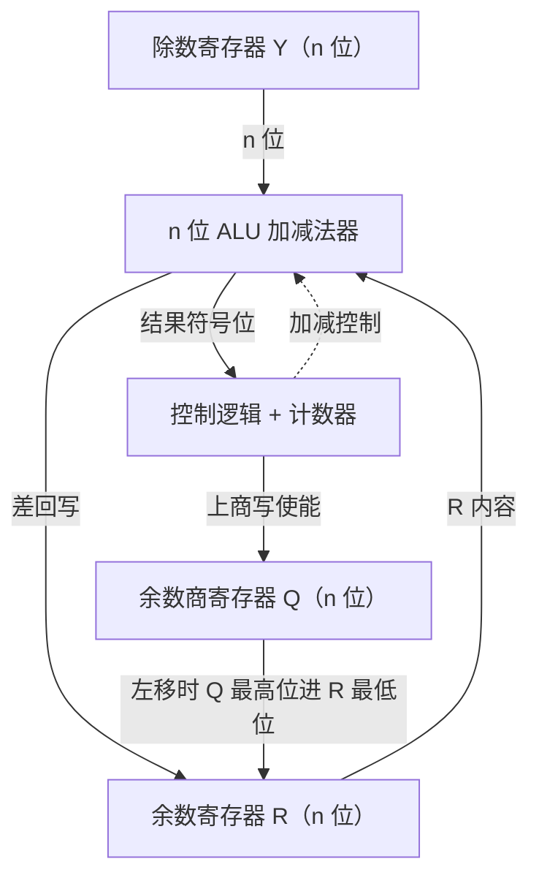
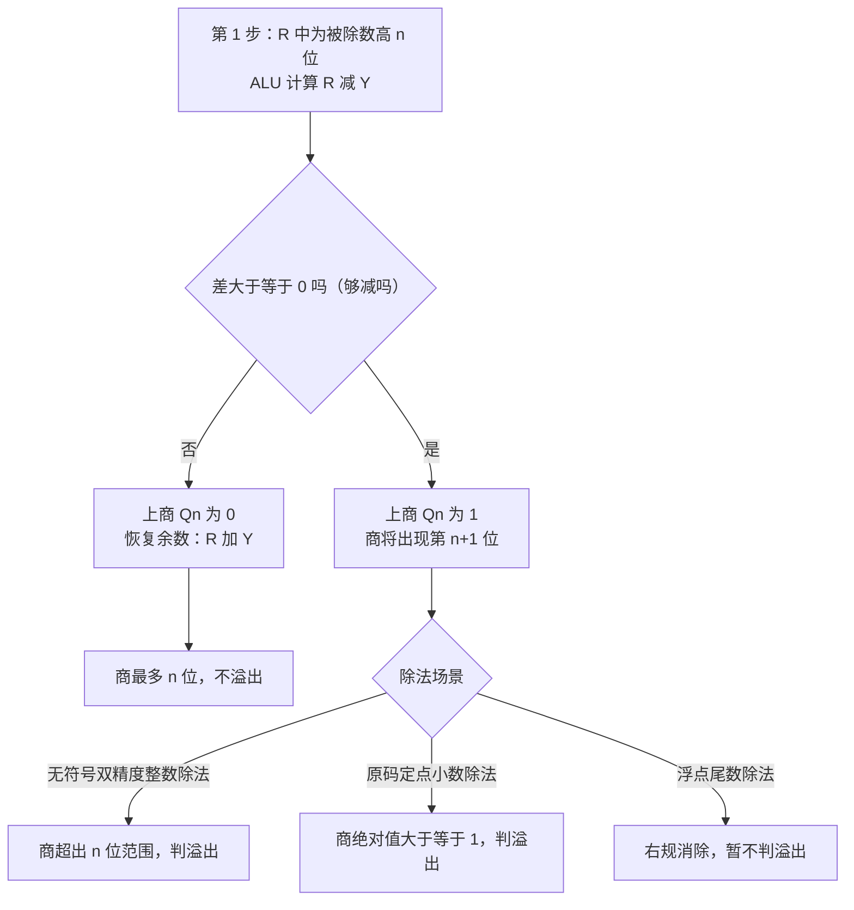
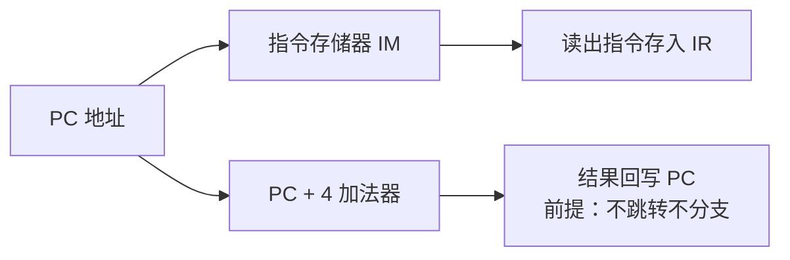
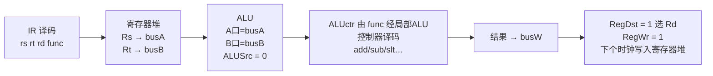
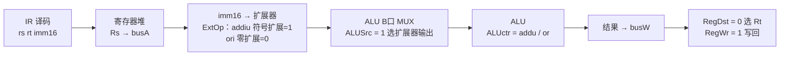
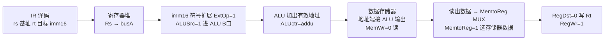
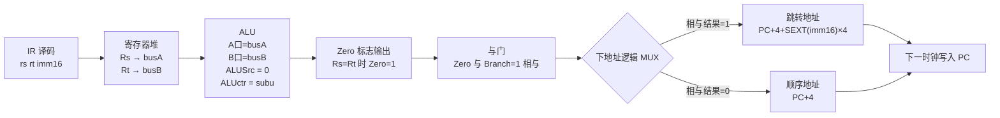
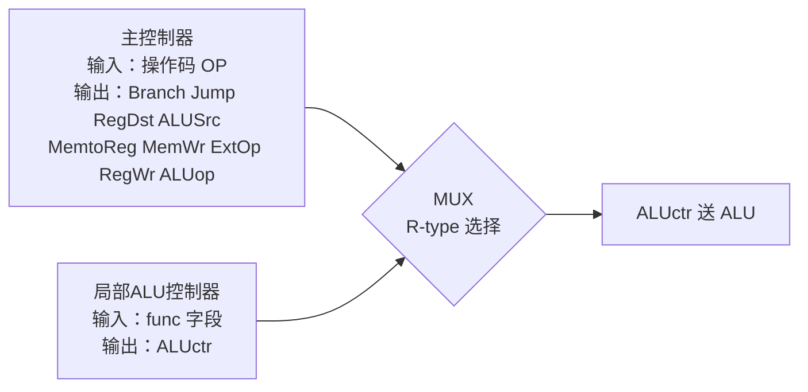
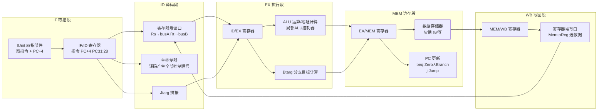

# 计算机组成原理

## 第一章 计算机系统概述

### 核心公式

- CPU执行时间 = 指令数 × CPI × 时钟周期
- MIPS = 时钟频率(MHz) / CPI
- 加权平均CPI = Σ(各类指令CPI × 使用频率)

### 易错点

- 时钟频率与周期互为倒数
- 不同指令CPI需加权

## 第二章 数据的表示与运算

### 定点数

- **原码**：符号位+数值位。0有两种表示，加减不统一。
- **补码**：负数 = 按位取反+1。溢出 = C_(n-1) ⊕ C_n，多表示一个负数。
- **移码**：补码符号位取反。用于浮点阶码比较。

### IEEE754浮点数

- 格式：S(1) | E(8/11) | M(23/52)
- 真值 = (-1)^S × 1.M × 2^(E-偏置)
- 偏置：单精度127，双精度1023

### C语言类型转换

- int→float：可能舍入（23位尾数不足）
- float→int：向0截断，可能溢出
- 无符号扩展：补0；有符号扩展：符号扩展

### 校验码

- 海明码：2^r ≥ n+r+1，校验位位置 2^k
- CRC：模2除法，生成多项式

### ALU标志位

- ZF = (结果==0)
- SF = 结果符号位
- CF = 最高位进位输出（无符号溢出）
- OF = C_(n-1) ⊕ C_n（有符号溢出）

### 定点乘除

- 原码乘：符号异或，数值无符号乘
- 补码乘：Booth算法，符号位参与运算
- 除法：余数符号同被除数

### 浮点运算步骤

- 加减：对阶 → 尾数运算 → 规格化 → 舍入 → 溢出判断
- 乘除：阶码运算 → 尾数运算 → 规格化 → 舍入 → 溢出判断

### 易错点

- 对阶小阶向大阶看齐
- 规格化后阶码调整
- 隐藏位1的处理

### 符号位的生成与标志位比较判定（2026-08-11）

#### 核心概念

- 标志位（条件码）由 ALU 在每次算术/逻辑运算后自动生成，存放在标志寄存器（PSW）中，供 CMP 指令与条件转移指令（if 判断）使用
- ZF（零标志）：运算结果全 0 时为 1，否则为 0
- SF（符号标志）：运算结果最高位（符号位）为 1（结果为负）时为 1，为 0 表示正
- CF（进位/借位标志）：加法看最高位是否有进位，减法看是否有借位，即无符号数运算的溢出信号
- OF（溢出标志）：有符号数运算溢出，$OF = C_{n-1} \oplus C_n$（次高位进位与最高位进位异或）

#### 要点总结

**各标志位的生成规则**

| 标志 | 生成条件 |
|------|---------|
| ZF | 结果全 0 时为 1 |
| SF | 结果最高位为 1（补码为负）时为 1 |
| CF | 加法最高位进位或减法借位时为 1 |
| OF | $C_{n-1} \oplus C_n = 1$ |

**无符号数比较（A - B，只看 CF 和 ZF）**

- 等于：$F = ZF$
- 大于：$F = \overline{CF} \cdot \overline{ZF}$
- 小于：$F = CF \cdot \overline{ZF}$
- 大于等于：$F = \overline{CF} + ZF$
- 小于等于：$F = CF + ZF$

**带符号数比较（A - B，看 SF、OF 和 ZF，不看 CF）**

- 等于：$F = ZF$
- 大于：$F = \overline{ZF} \cdot \overline{(SF \oplus OF)}$
- 小于：$F = \overline{ZF} \cdot (SF \oplus OF)$
- 大于等于：$F = ZF + \overline{(SF \oplus OF)}$
- 小于等于：$F = ZF + (SF \oplus OF)$

**记忆口诀**：无符号数看借位（CF），带符号数看符号位与溢出的异或（$SF \oplus OF$）

**原理深化（强化讲义补充，2026-08-11）**

为什么两类比较看的标志不同：

- 无符号数和有符号数**共用同一个 ALU**，机器数做加减的规则完全相同，所以每次运算后 4 个标志位（CF、ZF、SF、OF）**都会同时生成**
- CF 只反映无符号数角度的溢出（进/借位）；OF、SF 只反映带符号数角度的溢出和符号
- 因此：无符号数比较只能依赖 CF、ZF；带符号数比较只能依赖 SF、OF、ZF

无符号数运算产生的 SF、OF 是什么含义：

- 无符号数运算也会产生 SF 和 OF，其含义是："将运算数和结果的机器数**解释为有符号数**时的符号和溢出情况"
- 即 SF、OF 对无符号数比较**无意义**，这正是"无符号比较绝不看 SF、OF"的根源

无符号数减法定义（支撑 CF = 借位 ⟺ 被减数小）：

| 情况 | 结果 | 标志位表现 |
|------|------|-----------|
| x ≥ y | x − y | 无借位，CF = 0 |
| x < y | x − y + 2^w（补足 2^w） | 产生借位，CF = 1 |

- x < y 时实际差值为负，加 2^w 后最高位产生借位 → CF = 1，这就是"有借位 ⟺ 被减数小"

有符号数加减法的三种情况（解释 OF 的生成）：

- 加法：正常 / 正溢出（结果减 2^w）/ 负溢出（结果加 2^w）
- 减法：不溢出 / 负溢出（结果加 2^w）/ 正溢出（结果减 2^w）
- 溢出 ⟺ OF = 1，即 $OF = C_{n-1} \oplus C_n$ 的由来（次高位进位与最高位进位异或）

#### 解题方法与步骤

以"判定 A 小于等于 B"为例（无符号整数）：

1. 判断比较对象类型：无符号数只看 CF、ZF，排除与 SF、OF 相关的选项
2. 枚举 A - B 的三种结果，确定各标志位取值：

| A - B 的结果 | ZF | CF | 判定关系 |
|-------------|----|----|---------|
| A 大于 B | 0 | 0 | 大于 |
| A 等于 B | 1 | 0 | 等于 |
| A 小于 B | 0 | 1 | 小于 |

3. "小于等于" = "小于"或"等于"，条件相加（逻辑或）：$F = CF + ZF$
4. 选 CF + ZF = 1 对应的选项

#### 易错提醒

> [!WARNING]
> - 公式中的"+"是逻辑或（任一为 1 即成立），不是算术加法
> - 无符号数比较绝不看 SF、OF；带符号数比较不看 CF，两类公式不能混用
> - 减法中 CF 的含义是"借位"：有借位说明被减数小，即无符号数 CF = 1 表示 A 小于 B
> - 带符号数比较中 $SF \oplus OF = 1$ 表示结果为负：无溢出时看 SF，有溢出时符号位取反

#### 例题与真题

**第 41 题（选择题）**：某 CPU 中，CF、ZF、SF（0 表示正）、OF 已知，A、B 为无符号整数，则判定 A 小于等于 B 的条件是（ ）

- A. SF = 1
- B. SF + ZF = 1
- C. CF = 1
- D. CF + ZF = 1

**答案：D**

**关键解析**：无符号数比较只看 CF 和 ZF，排除 A、B；A ≤ B 即"小于"或"等于"，条件为 $F = CF + ZF$，故选 D

#### 资料定位

- 《零壹计组基础讲义8_指令系统》第 11 页：标志位 ZF、CF 定义与分支判断
  _p11.png>)
- 《计算机组成基础课8_指令系统_PPT》第 66 页：if 判断与标志位
  _p66.png>)
- 《零壹计组强化讲义1_数据运算》第 5 页：四则运算定义 + 标志位生成规则（原理深化）
  
- 《计算机组成强化1_数据运算总线_PPT》第 59 页：标志寄存器定义回顾
  _p59.png>)

### 除法器电路与除法溢出判断（2026-08-13）

#### 核心概念

- 除法器电路组成：余数寄存器 R（n 位）与余数/商寄存器 Q（n 位）联合构成 2n 位被除数寄存器；除数寄存器 Y（n 位）；n 位 ALU 加减法器；控制逻辑 + 计数器
- 运算本质：n 位定点除法等于"2n 位被除数除以 n 位除数"，得到 n 位商
- 被除数扩展方式：无符号整数高位补 n 个 0（预置时 R 全 0、Q 放被除数）；定点小数低位补 n 个 0（预置时 R 放被除数、Q 全 0）
- 恢复余数法流程：R、Q 联合左移一位 → ALU 算 $R - Y$ → 结果符号位送控制逻辑 → 不够减（为负）上商 0 并恢复余数（加回 Y），够减上商 1，商左移进 Q → 循环 n 次

**除法器电路结构**：

- 袁春风教材图 3.15（第 88 页）：除法逻辑结构与被除数扩展三种情况
   (Z-Library)_p88.png>)
- 零壹计组基础讲义 11 第 23 页：32 位除法器逻辑结构图
  _p23.png>)

#### 要点总结

**溢出检测点唯一：第 1 步试商**

- 第 1 步是唯一"不左移、直接减"的一步：$R_1 = R - Y$
- 若 $R_1 < 0$（不够减）：上商 $Q_n = 0$，并恢复余数。商最多 n 位，不溢出
- 若 $R_1 \geqslant 0$（够减）：上商 $Q_n = 1$，商将出现第 n+1 位。电路上这就是"第一步 ALU 结果的符号位为 0（非负）"，控制逻辑据此置溢出标志或除法错
- 第 2 步起都是先左移（$2R_i$）再减 Y，所以溢出只能由第 1 步发现

**四种场景的溢出结论**

| 场景 | 预置时 R 与 Q | 第 1 步试商 | 溢出条件 | 处理 |
|---|---|---|---|---|
| 无符号整数 单精度 | R 全 0，Q 为被除数 | 恒不够减，上商 Qn 为 0 | 不会溢出 | 无 |
| 无符号整数 双精度 | R 为被除数高 n 位 | 够减时上商 Qn 为 1 | 商超出 n 位范围 | 报溢出 |
| 原码定点小数 | R 为被除数，Q 全 0 | 够减时上商 Qn 为 1 | 商绝对值大于等于 1 | 报溢出 |
| 浮点尾数相除 | R 为尾数，Q 全 0 | 够减时上商 Qn 为 1 | 商绝对值大于等于 1，可右规 | 保留商继续算 |

- 定点小数的溢出条件等价于 $|X| \geqslant |Y|$（被除数绝对值大于等于除数绝对值），即商绝对值大于等于 1
- 商的符号位单独用异或算出（$s_x \oplus s_y$），溢出判断只针对数值位
- 浮点尾数相除时 $Q_n = 1$ 不算错，保留最高位商继续算，靠右规消除，只要阶码不溢出结果仍正确

**补码整数除法**

- 表示范围：$-2^{n-1} \sim 2^{n-1} - 1$
- 唯一溢出特例：$-2^{n-1} \div (-1) = 2^{n-1}$，超出补码最大值 $2^{n-1} - 1$，差 1 装不下，溢出
- 算法判据：被除数与除数同号时第 1 步上商 1、异号时第 1 步上商 0，即"首次商位与商的符号位不一致"判溢出
- 验证（n 取 4）：被除数 1000（即 -8）除以除数 1111（即 -1），同号，$R_1 = X - Y = 1001$ 与除数同号，上商 1；而商本应为正（符号位 0），第 1 步就上出 1，说明商数值最高位为 1、商大于等于 $2^{n-1}$，判溢出
- 溢出判断规则原文见袁春风教材第 89 页
   (Z-Library)_p89.png>)

#### 解题方法与步骤

判断除法是否溢出的通用步骤：

1. 先判断除法类型：无符号单精度 / 无符号双精度 / 原码定点小数 / 浮点尾数 / 补码整数
2. 看第 1 步试商（$R_1 = R - Y$ 的符号）：
   - 不够减 → 上商 $Q_n = 0$，商最多 n 位，不溢出
   - 够减 → 上商 $Q_n = 1$，商有 n+1 位，进入第 3 步分场景判定
3. 按场景判定：无符号双精度报溢出；原码定点小数商绝对值大于等于 1 报溢出；浮点尾数右规消除、暂不判溢出；补码整数看首次商位与商符号位是否一致

#### 易错提醒

> [!WARNING]
> - 只有第 1 步不左移；第 2 步起都是先左移再减 Y，所以溢出只能由第 1 步发现
> - 单精度整数除法（被除数高位补 0）永远不会溢出；"无符号除法除数不为 0 就不溢出"只对 n 位除以 n 位成立，双精度除法不满足，别把结论推广
> - 定点小数除法的溢出条件是被除数绝对值大于等于除数绝对值（商大于等于 1），**等于也算溢出**
> - 除数为 0 属于除法错/非法运算（异常中断），与溢出（商装不下）不是一回事
> - 补码除法的溢出不是看商算出来多大，而是看商符号位与第 1 步试商是否"打架"：同号时第 1 步上商 1、异号时第 1 步上商 0，都判溢出
> - 补码整数除法唯一溢出特例：最小负数（负 2 的 n 减 1 次方）除以负 1；若除以 1 则结果是最小负数本身，在范围内，不溢出

#### 例题与真题

**例 3.4（袁春风教材第 89 页）**：已知 $[x]_{原} = 0.1011$，$[y]_{原} = 1.1101$，用恢复余数法计算 $[x/y]_{原}$。

- 商的符号位：$0 \oplus 1 = 1$
- 数值位用恢复余数法：$[|x|]_{补} = 0.1011$，$[|y|]_{补} = 0.1101$，$[-|y|]_{补} = 1.0011$
- 第 1 步 $0.1011 - 0.1101 < 0$，上商 $Q_4 = 0$ 并恢复余数——"商的最高位为 0，说明没有溢出"
- 后续步骤得商数值部分 1101，最终 $[x/y]_{原} = 1.1101$

**自测校验（2026-08-13 用户手写笔记）**：

三条笔记判定：

- 无符号数，除数不等于 0，则不溢出：正确（前提是 n 位除以 n 位的单精度除法；双精度时除数非 0 也可能溢出）
- 补码定点整数范围：负 2 的 n 减 1 次方 到 2 的 n 减 1 次方 减 1：正确
- 负 2 的 n 减 1 次方 除以 负 1 等于 2 的 n 减 1 次方，溢出：正确（补码整数除法唯一的溢出特例；注意除数必须是 -1，除以 1 不溢出）

#### 资料定位

- 袁春风《计算机组成与系统结构（第3版）》第 88 页：图 3.15 除法逻辑结构与被除数扩展（整数高位补 0、小数低位补 0、双精度不扩展）
- 袁春风《计算机组成与系统结构（第3版）》第 89 页：恢复余数法算法、第 1 步试商与溢出判断规则（Qn 为 1 即商有 n+1 位）、例 3.4
- 零壹计组基础讲义 11《CU与ALU》第 23 页：32 位除法器逻辑结构图

## 第三章 存储系统

### RAM对比

- **SRAM**：6晶体管结构，不需要刷新，速度快，成本贵，用途Cache
- **DRAM**：1电容+1晶体管，需要刷新（2ms），速度慢，成本便宜，用途主存

### 多模块存储器

- 连续编址：模块间串行，模块内并行
- 交叉编址：模块间并行，模块数 = 存储周期/总线传输周期

### 映射方式地址划分

- **直接映射**：Tag | 行号 | 块内。关联度1，冲突高。
- **全相联**：Tag | 块内。关联度C行，冲突低。
- **N路组相联**：Tag | 组号 | 块内。关联度N，冲突中。

### 替换算法

- LRU：计数器法，命中置0其余+1，淘汰最大值
- FIFO：队列法，淘汰最早进入
- 随机：硬件简单

### 写策略组合

- 写命中：写直达（同时写）、写回（置脏位）
- 写不命中：写分配（先装入）、非写分配（直接写主存）
- 常用组合：写回+写分配、写直达+非写分配

### 性能计算

- 平均访问时间 = H×Tc + (1-H)×(Tc+Tm) = Tc + (1-H)×Tm
- Cache总容量 = 行数 × (有效位+Tag位+数据位+脏位)

## 第四章 指令系统

### 寻址方式速查

- **立即寻址**：操作数 = A，访存0次，最快
- **直接寻址**：EA = A，访存1次，简单
- **间接寻址**：EA = (A)，访存2+次，灵活
- **寄存器寻址**：操作数 = (Ri)，访存0次，快
- **寄存器间接**：EA = (Ri)，访存1次，常用
- **相对寻址**：EA = PC + A，访存1次，程序浮动
- **基址寻址**：EA = (BR) + A，访存1次，重定位
- **变址寻址**：EA = (IX) + A，访存1次，数组访问

### CISC vs RISC

- **CISC**：指令多且复杂、寻址方式多样、变长指令、各指令可访存、微程序控制器、难流水线
- **RISC**：指令少且简单、寻址方式少、定长指令、仅Load/Store访存、硬布线控制器、易流水线

## 第五章 中央处理器

### 寄存器分类

**用户可见**：
- 通用寄存器：R0-R15
- 专用寄存器：SP、PC
- 标志寄存器：ZFSFOFCF

**用户不可见**：
- MAR（存储器地址）
- MDR（存储器数据）
- IR（指令寄存器）
- 内部临时寄存器

### MIPS五段式指令

- IF：取指令，PC+4
- ID：译码，读寄存器，立即数扩展
- EX：ALU运算或地址计算
- MEM：访存（Load/Store/分支判断）
- WB：写回寄存器

### 中断响应（隐指令）

1. 关中断（IF←0）
2. 保存断点（PC→栈）
3. 识别中断源，查中断向量表
4. 加载ISR地址到PC
5. 保护现场（寄存器→栈）
6. 开中断（允许嵌套）
7. 执行ISR
8. 关中断
9. 恢复现场（栈→寄存器）
10. 开中断
11. 中断返回（栈→PC）

### 易错点

- 关中断发生在取指结束阶段
- 优先级判断
- 嵌套处理

### 性能公式

- 理想CPI = 1
- 实际CPI = 1 + 阻塞周期数/指令数
- 吞吐率 TP = n / [(k+n-1)×Δt]（n条指令，k段流水线）
- 加速比 S = 不采用流水线时间 / 采用流水线时间

### 数据冒险（5段流水线）

- **RAW**（读后写）：解决方法为转发/阻塞
- **WAR**（写后读）：顺序流水线不存在
- **WAW**（写后写）：顺序流水线不存在

### 转发规则

**EX阶段转发（优先级高）**：
- if (EX/MEM.RegWrite && EX/MEM.rd==ID/EX.rs) 转发ALU结果

**MEM阶段转发**：
- if (MEM/WB.RegWrite && MEM/WB.rd==ID/EX.rs && !(EX/MEM转发条件)) 转发MEM结果

### 阻塞规则（load-use冒险）

- if (ID/EX.MemRead && (ID/EX.rt==IF/ID.rs || ID/EX.rt==IF/ID.rt))
  暂停1周期（插入气泡）

### 控制冒险

- 分支预测：静态（总是跳转/不跳转）、动态（BTB）
- 延迟槽：分支指令后放无关指令
- 提前判断：在ID阶段完成分支条件判断

### 单周期数据通路与指令流水线梳理（2026-08-12）

> 相关章节：第四章 指令系统（寻址方式）、第五章 中央处理器。本笔记把单周期数据通路与五段流水线放在一起对比梳理。核心思想（零壹讲义）：流水线 = 把单周期 CPU 一个时钟周期做完的事，按功能拆成 5 段分给多个时钟周期做，控制信号与单周期几乎一致。

#### 核心概念

- 数据通路：指令执行过程中数据所经过的路径及路径上的部件（ALU、寄存器堆、指令/数据存储器、扩展器、多路选择器、加法器等）；控制器生成控制信号指挥数据流向。
- 单周期处理器：一个时钟周期内走完一条指令的全部信号流，控制信号一次性发出、执行过程中不变，CPI=1；时钟周期按最慢指令（lw）确定，一个周期内部件不能重复使用，性能差。
- 流水线处理器：把单周期一条指令的路径按功能切成 IF/ID/EX/MEM/WB 五段，段间用流水段寄存器隔开，多条指令时间上重叠执行，理想 CPI=1。
- 流水段寄存器（IF/ID、ID/EX、EX/MEM、MEM/WB）：保存"后面阶段需要的数据 + 控制信号"两类信息；PC 与段间寄存器不需要写使能（每个时钟都更新），寄存器堆 WE、数据存储器 MemWr 需要写使能。

#### 要点总结

**一、单周期数据通路**

#### 1. 总体框架（四阶段骨架）

单周期指令的执行是一条固定骨架，四类指令只是"从中取不同的一段走"：

- 完整单周期数据通路总览见教材图 5.16（袁春风《计算机组成与系统结构（第3版）》第 160 页，教材 143 页）：图中所有加下划线的都是控制信号，用虚线表示；指令执行结果总是在下个时钟到来时开始保存在寄存器、数据存储器或 PC 中。

 (Z-Library)_p160.png>)

**单周期的两个硬规则**：

- 一个时钟周期内发出全部控制信号并全部执行，指令执行过程中控制信号不变（计组-强化3PPT-CPU 第 12 页）；
- 运算结果在下一个时钟到来时才写入寄存器堆/数据存储器（写入必须等稳定结果），ALU 操作控制信号必须稳定足够长时间。

#### 2. 取指阶段（公共骨架）

- 顺序执行：下地址 = PC+4；转移执行：由 Branch（配合 Zero）或 Jump 选择目标地址覆盖 PC+4。
- 取指令部件的外部输入只有 3 个：标志 Zero、控制信号 Branch、Jump（教材图 5.15）。
- 指令存储器只有读操作，可看成组合逻辑，无须控制信号；PC 无须写使能（每周期必更新）。

**取指周期的控制信号：三种处理器对比（2026-08-12 补充）**

取指阶段功能都是 $IR \leftarrow M[PC]$、$PC \leftarrow PC+4$，但三种处理器的信号体系不同：

- **单周期**：取指与执行合在一个时钟周期，无独立取指信号；PC 无写使能（每周期必更新）；指令存储器视为组合逻辑，无须控制信号。
- **流水线**：IF 段是公共段，无控制信号；唯一控制点是 PC 输入端 MUX（由 MEM 段 Branch∧Zero、Jump 控制，用的是上一条指令的旧信号）；IF/ID 存入指令、PC+4、PC[31:28]。
- **多周期**：取指是有限状态机的第一个状态 IFetch，有专门控制信号（教材 169 页，教材 152 页）：

| 信号 | 取值 | 作用 |
|---|---|---|
| IorD | 0 | 存储器地址选 PC（1 则选 ALU 结果，留给访存） |
| ALUSelA | 0 | ALU 的 A 口选 PC |
| ALUSelB | 01 | ALU 的 B 口选常数 4 |
| ALUop | addu | ALU 做不判溢出加法，得到 PC+4 |
| PCSource | 01 | PC 的写入来源选 ALU 输出（PC+4） |
| PCWr | 1 | 下个时钟 PC+4 写入 PC |
| IRWr | 1 | 下个时钟读出指令写入 IR |
| MemWr | 0 | 不写存储器（此处是读指令） |
| RegWr | 0 | 不写寄存器堆 |
| BrWr | 0 | 不写分支目标地址寄存器 |
| R-type | 0 | 非 R 型指令 |
| 其余 | 任意 | don't care |

**记忆要点**：取指状态里"两个写使能"（PCWr、IRWr）为 1，其余写使能（MemWr、RegWr、BrWr）全 0——取指只动 PC 和 IR，别的都不写。PCWr/IRWr/IorD/PCSource 这些信号只出现在多周期语境，流水线里没有。

 (Z-Library)_p169.png>)

#### 3. R 型指令（add/sub/and/or/slt 等）

信号流（教材原文式描述）：

$$Rs \xrightarrow{寄存器堆} busA \xrightarrow{ALU输入1} ALU \xrightarrow{ALUctr按func} Result \xrightarrow{busW} 寄存器堆(Rd)$$

- 寄存器堆写地址端 Rw 选 Rd（RegDst=1），写数据端 busW 接 ALU 结果（MemtoReg=0）；
- 不访问数据存储器（MemWr=0）；不改 PC 流向（Branch=Jump=0）。
- R 型数据通路图见零壹计组强化讲义 3 第 2 页：Ra、Rb 接 Rs、Rt，Rw 接 Rd，busW 接 ALU 结果，RegWr 为写使能（经与门，非溢出才写）。

#### 4. I 型运算类（addiu/ori）

与 R 型的差别全在"立即数怎么进 ALU、结果写谁"。数据通路需要三处改动（零壹讲义第 3 页，考试常问"数据通路要做哪些修改"）：

1. 寄存器堆写地址端 Rw 加 MUX：RegDst 选 Rd（R 型）或 Rt（I 型）；
2. 增加扩展器：ExtOp 选符号/零扩展（按位逻辑用零扩展，算术用符号扩展）；
3. ALU 的 B 口加 MUX：ALUSrc 选 busB（R 型）或扩展器输出（I 型）。

- 三处改动对应的数据通路图见零壹讲义第 3 页（RegDst MUX、扩展器+ExtOp、ALUSrc MUX）。

- I 型运算指令在数据通路中的执行路径见教材图 5.19（袁春风教材第 162 页，教材 145 页）：Register File(Rs) → busA，扩展器(imm16) → ALU → Register File(Rt)。

 (Z-Library)_p162.png>)

#### 5. I 型访存类（lw / sw）

访存指令的 ALU 只做地址加法（基址寄存器 + 立即数），不产生"运算结果"；数据走数据存储器（教材图 5.11、5.20、5.21）。

$$lw: \quad R[Rt] \leftarrow M[R[Rs] + SEXT(imm16)]$$

$$sw: \quad M[R[Rs] + SEXT(imm16)] \leftarrow R[Rt]$$

**lw（读内存 → 写寄存器）**：

**sw（读寄存器 → 写内存）**：

- load/store 数据通路图见教材图 5.11（袁春风教材第 157 页，教材 140 页）：增加数据存储器（地址端 Adr 接 ALU 输出）、MemtoReg MUX（选 ALU 结果还是存储器读出数据送 busW）、MemWr 写使能；store 的写数据 busB 直连 DataIn。

 (Z-Library)_p157.png>)

- store 指令执行路径见教材图 5.21（袁春风教材第 163 页，教材 146 页）：Register File(Rs, Rt) → busA，扩展器(imm16)，busB → ALU(addu)，busB → 数据存储器。

 (Z-Library)_p163.png>)

#### 6. J 型（jump 无条件跳转）

J 型最特殊：不读寄存器、不进 ALU、不访存，唯一动作是改 PC。

目标地址计算公式（教材原文，字地址形式）：

$$PC_{31:2} \leftarrow PC_{31:28} \;\Vert\; target_{25:0}$$

即 PC 的高 4 位（$PC_{31:28}$）与指令中 26 位目标字段拼接成新的 30 位字地址（低 2 位固定 00，按字对齐；408 常见写法：字段左移 2 位后与 PC 高 4 位拼接）。注意 jump 不是 PC+4+偏移（那是 beq 的做法）。

- 取指令部件（含跳转目标地址计算、Jump 控制的 MUX）见教材图 5.14（袁春风教材第 159 页，教材 142 页）：下地址逻辑输出由两个 MUX 选择，Jump=1 时选跳转目标地址。

 (Z-Library)_p159.png>)

#### 7. beq 分支指令（完整信号流）

beq 是 I 型转移类指令（操作码 000100），不写寄存器、不写内存，输出只有一条"是否转移"的布尔判断（Zero）。

**功能定义**（教材 141 页）：

$$if\;(R[Rs] = R[Rt])\;则\;PC \leftarrow PC+4+SEXT(imm16)\times 4;\;否则\;PC \leftarrow PC+4$$

**信号流**：

- 支持分支指令的数据通路与下地址逻辑设计见教材图 5.12、图 5.13（袁春风教材第 158 页，教材 141 页）：ALU 中 R[Rs] 与 R[Rt] 做减法得 Zero；下地址逻辑 4 个输入为 PC、Zero、imm16、Branch；两个加法器分别算 PC+1 与 PC+1+SEXT[imm16]，由 Branch∧Zero 控制 MUX 选择。

 (Z-Library)_p158.png>)

**下地址逻辑地址计算**（PC 只存前 30 位地址 $PC_{31:2}$，指令地址低 2 位恒为 00）：

- 顺序执行：$PC_{31:2} \leftarrow PC_{31:2}+1$
- 转移执行（相与=1）：$PC_{31:2} \leftarrow PC_{31:2}+1+SEXT[imm16]$
- 取指令：指令地址 $= PC_{31:2} \Vert 00$

等效字节地址写法：跳转目标 = PC+4 + 符号扩展(imm16)×4（imm16 符号扩展后左移 2 位再与 PC+4 相加）。

**beq 控制信号**：

| 控制信号 | beq 取值 | 说明 |
|---|---|---|
| Branch | 1 | 标识分支指令，送下地址逻辑 |
| Jump | 0 | 走分支路径而非跳转路径 |
| RegDst | × | 不写寄存器，任意 |
| ALUSrc | 0 | ALU 第二操作数选 busB（寄存器 Rt），不是立即数 |
| ALUctr | subu | 减法（不判溢出）产生 Zero |
| MemtoReg | × | 不写寄存器，任意 |
| RegWr | 0 | 不写寄存器堆 |
| MemWr | 0 | 不写数据存储器 |
| ExtOp | × | 扩展器只服务下地址逻辑，此处任意 |

**特别易混点**：beq 虽为 I 型，但 ALUSrc=0（取 busB 做减法比较），与 I 型运算类/访存类的 ALUSrc=1 相反——beq 不用立即数做运算，imm16 只送下地址逻辑算转移目标。

**beq 与 jump 对比**：

| 对比项 | beq（条件转移） | jump（无条件跳转） |
|---|---|---|
| 指令类型 | I 型（op=000100） | J 型（op=000010） |
| 是否读寄存器 | 是（Rs、Rt 做减法） | 否 |
| 是否经 ALU | 是（subu 产生 Zero） | 否 |
| 目标地址 | PC+4 + SEXT(imm16)×4（相对） | PC 高 4 位拼接 26 位字段（绝对） |
| 控制信号 | Branch=1、Jump=0、ALUSrc=0、ALUctr=subu、RegWr=0、MemWr=0 | Jump=1、Branch=0、RegWr=0、MemWr=0、其余 × |
| 下地址选择 | 与门（Zero∧Branch）选 MUX | Jump 信号直接选跳转 MUX |

#### 8. 四类指令控制信号总表（教材表 5.4）

| 控制信号 | R 型运算 | I 型运算（addiu/ori） | lw | sw | beq | jump |
|---|---|---|---|---|---|---|
| RegWr | 1 | 1 | 1 | 0 | 0 | 0 |
| RegDst | 1（选 Rd） | 0（选 Rt） | 0（选 Rt） | × | × | × |
| ALUSrc | 0（选 busB） | 1（选扩展器） | 1（选扩展器） | 1（选扩展器） | 0（选 busB） | × |
| ALUctr | 由 func 译码 | addu / or | addu | addu | subu | × |
| MemtoReg | 0（选 ALU 结果） | 0 | 1（选存储器数据） | × | × | × |
| MemWr | 0 | 0 | 0 | 1 | 0 | 0 |
| ExtOp | × | 0（ori）/1（addiu） | 1 | 1 | × | × |
| Branch | 0 | 0 | 0 | 0 | 1 | 0 |
| Jump | 0 | 0 | 0 | 0 | 0 | 1 |

（× 表示取值任意，即 don't care）

- 各指令控制信号取值总表原文见教材表 5.4（袁春风教材第 164 页，教材 147 页），含各指令操作码 OP 与功能码 func 对照。

 (Z-Library)_p164.png>)

#### 9. 控制器设计（教材 5.3 节）

- 主控制器按 OP 产生全部控制信号，ALUop 只有 4 种情况：R 型任意（由 func 决定）、ori→or、addiu→addu、lw/sw→addu、beq→subu；
- 局部 ALU 控制器按 func 译码产生 ALUctr（add/sub/subu/slt/sltu）；
- R-type 信号选择取哪一路：R 型指令 R-type=1（选局部控制器输出），非 R 型 R-type=0（选主控制器的 ALUop）。

#### 10. 单周期性能特点

- 所有指令 CPI=1，时钟周期必须按最慢的指令（lw：取指+读寄存器+ALU+访存+写回全串行）确定；
- 一个指令周期内部件不能重复使用（每个部件一周期只用一次），所以性能差——这是多周期、流水线产生的原因。

**二、指令流水线（五段式）**

#### 1. 流水线与单周期的关系

流水线 = 把单周期 CPU 一个时钟周期做完的事，按功能拆成 5 段分给多个时钟周期做；控制信号与单周期几乎一致（零壹讲义第 1 页）。所以掌握单周期信号流 = 掌握流水线 7 成（零壹讲义第 5 页原话）。

#### 2. 流水线数据通路总览（教材图 6.5）

- 5 段流水线数据通路基本框架（含全部控制信号分布）见教材图 6.5（袁春风教材第 186 页，教材 169 页）：PC 与各流水段寄存器都没有写使能信号；Exec 段控制信号 5 个（ExtOp、ALUSrc、ALUop、RegDst、R-type），Mem 段 3 个（MemWr、Branch、Jump），Wr 段 2 个（MemtoReg、RegWr）。

 (Z-Library)_p186.png>)

- 段间寄存器保存两类信息：①后面阶段需要的数据（指令、PC+4、立即数、目的寄存器、busA/busB、转移目标地址、ALU 结果、标志等）；②前面传递过来的控制信号。
- 前两段（IF、ID）是公共流水段（每条指令功能相同），控制信号从 Exec 段开始起作用。

#### 3. 各指令类型 × 各流水段行为矩阵（核心！）

| 指令 | IF | ID | EX | MEM | WB |
|---|---|---|---|---|---|
| R 型（add 等） | 取指，PC+4 | 读 Rs、Rt；产生控制信号 | ALU 按 func 运算 | 空操作（直接传递） | ALU 结果写 Rd |
| I 型运算（ori/addiu） | 同上 | 读 Rs；立即数扩展 | ALU 按 or/addu 运算 | 空操作 | ALU 结果写 Rt |
| lw | 同上 | 读 Rs（基址） | ALU 加出访存地址 | 按地址读数据存储器 | DM 读出数据写 Rt |
| sw | 同上 | 读 Rs（基址）+ Rt（数据） | ALU 加出访存地址 | 按地址写数据存储器 | 不写寄存器 |
| beq | 同上 | 读 Rs、Rt | ALU 减法出 Zero；算 Btarg | Zero∧Branch 更新 PC | 不写寄存器 |
| j | 同上 | 拼 Jtarg | 仅传递 Jtarg | Jump 更新 PC | 不写寄存器 |

流水线推进示例（教材图 6.8：lw → ori → add）：

| 时钟 | 1 | 2 | 3 | 4 | 5 | 6 | 7 |
|---|---|---|---|---|---|---|---|
| lw | IF | ID | EX | MEM | WB | | |
| ori | | IF | ID | EX | MEM | WB | |
| add | | | IF | ID | EX | MEM | WB |

第 5 时钟内：WB 段由 lw 控制、MEM 段由 ori 控制、EX 段由 add 控制——同一时刻不同段执行不同指令的不同阶段，这就是流水线的本质。

- 三条指令流水时序图原文见教材图 6.8（袁春风教材第 190 页，教材 173 页）。

 (Z-Library)_p190.png>)

#### 4. 逐段分析

**IF 段（Ifetch，公共段，无控制信号）**

- 功能：用 PC 到指令存储器 IM 取指令；加法器算 PC+4 送 PC 输入端。
- 保存到 IF/ID：指令、PC+4（beq 算 Btarg 用）、PC[31:28]（j 算 Jtarg 用）。
- 唯一控制点：PC 输入端 MUX——由 MEM 段传来的 Branch∧Zero、Jump 控制（取指部件用的是上一条指令留下的旧信号，与单周期同理）。
- 取指部件 IUnit 的内部实现见教材图 6.6（袁春风教材第 187 页，教材 170 页）：PC 送 IM 地址端取指令，同时 PC+4 经加法器后由 MUX 选择送回 PC。
- 多周期对照：IFetch 状态有专门信号（PCWr=IRWr=1、IorD=0、ALUSelA=0、ALUSelB=01、ALUop=addu、PCSource=01、MemWr=RegWr=BrWr=R-type=0），详见上文"单周期-取指阶段"小节的三种处理器对比表与教材 169 页。

 (Z-Library)_p187.png>)

**ID 段（Reg/Dec，公共段，控制信号全部在此产生）**

- 功能：按 Rs、Rt 读寄存器堆（busA、busB）；主控制器对 OP 译码产生全部控制信号；拼接 Jtarg = PC[31:28]‖target[25:0]‖00。
- 保存到 ID/EX：PC+4、Jtarg、func、imm16、busA、busB、Rt、Rd + 全部 9 个控制信号。
- 指令本身不用再传（字段已拆解保存）。

**ID 段详细：各指令读什么寄存器、产生什么信号（2026-08-12 补充）**

| 指令 | 读 Ra | 读 Rb | 拼 Jtarg | ID/EX 寄存器存入 |
|---|---|---|---|---|
| R 型 | Rs→busA | Rt→busB | 否 | busA、busB、Rd、func |
| I 型运算（ori/addiu） | Rs→busA | 不读 | 否 | busA、Rt、imm16 |
| lw | Rs→busA | 不读 | 否 | busA、Rt、imm16 |
| sw | Rs→busA | Rt→busB | 否 | busA、busB、Rt、imm16 |
| beq | Rs→busA | Rt→busB | 否 | busA、busB、imm16 |
| jump | 不读 | 不读 | 是（Jtarg=PC[31:28]‖target[25:0]‖00） | Jtarg |

各指令在 ID 段一次产生的全部 9 个控制信号（随后按段使用）：

| 信号（使用段） | R 型 | ori | addiu | lw | sw | beq | jump |
|---|---|---|---|---|---|---|---|
| RegDst（EX） | 1 | 0 | 0 | 0 | × | × | × |
| ExtOp（EX） | × | 0 | 1 | 1 | 1 | 1 | × |
| ALUSrc（EX） | 0 | 1 | 1 | 1 | 1 | 0 | × |
| ALUop（EX） | ××× | or | addu | addu | addu | subu | ××× |
| R-type（EX） | 1 | 0 | 0 | 0 | 0 | 0 | × |
| MemWr（MEM） | 0 | 0 | 0 | 0 | 1 | 0 | 0 |
| Branch（MEM） | 0 | 0 | 0 | 0 | 0 | 1 | 0 |
| Jump（MEM） | 0 | 0 | 0 | 0 | 0 | 0 | 1 |
| MemtoReg（WB） | 0 | 0 | 0 | 1 | × | × | × |
| RegWr（WB） | 1 | 1 | 1 | 1 | 0 | 0 | 0 |

**EX 段（Exec，用 5 个控制信号）**

| 控制信号 | 含义 | R 型 | ori | addiu | lw | sw | beq | j |
|---|---|---|---|---|---|---|---|---|
| RegDst | 1=Rd，0=Rt | 1 | 0 | 0 | 0 | × | × | × |
| ExtOp | 1=符号扩展，0=零扩展 | × | 0 | 1 | 1 | 1 | 1 | × |
| ALUSrc | 1=扩展器，0=busB | 0 | 1 | 1 | 1 | 1 | 0 | × |
| ALUop | 3 位，辅助局部 ALU 控制器 | ××× | or | addu | addu | addu | subu | ××× |
| R-type | 1=R 型，0=非 R 型 | 1 | 0 | 0 | 0 | 0 | 0 | × |

- 执行部件 exec unit 内部实现见教材图 6.7（袁春风教材第 188 页，教材 171 页）：PC+4 左移 2 位与扩展器输出相加得 Btarg；busA 与 MUX 输出（ALUSrc 选择 busB 或扩展器输出）进 ALU；ALUctr 由 func 与 ALUop 经局部 ALU 控制器产生。

 (Z-Library)_p188.png>)

各指令在 EX 段的具体动作（教材 189 页，教材 172 页）：

- R 型：busA、busB 进 ALU，ALUctr 由 func 经局部 ALU 控制器译码；结果 ALUout + Zero + Overflow 送 EX/MEM；
- I 型运算：busA + 扩展器输出（ori 零扩展、addiu 符号扩展）进 ALU（or/addu）；ALUctr 由主控制器按 OP 给出；
- lw/sw：busA + 符号扩展立即数进 ALU 做 addu，得到访存地址送 EX/MEM；
- beq：busA、busB 进 ALU 做 subu 出 Zero；同时 imm16 符号扩展后左移 2 位与 PC+4 相加得 Btarg，与 Zero 一起送 EX/MEM；
- j：仅把 ID 段算好的 Jtarg 直接传过 EX/MEM，ALU 完全不用。

 (Z-Library)_p189.png>)

**MEM 段（用 3 个控制信号：MemWr、Branch、Jump）**

| 指令 | MemWr | Branch | Jump | MEM 段动作 |
|---|---|---|---|---|
| R 型 / I 型运算 | 0 | 0 | 0 | 空操作，数据直接传递 |
| lw | 0 | 0 | 0 | 地址 → DM 读端 RA，读出数据送 MEM/WB |
| sw | 1 | 0 | 0 | 地址 → DM 写端 WA，R[Rt] 送 Di，写入 DM |
| beq | 0 | 1 | 0 | Zero=1 时 MUX 选 Btarg 送 PC 输入端 |
| j | 0 | 0 | 1 | MUX 选 Jtarg 送 PC 输入端 |

- 完整流水线数据通路（含控制信号在各段的分布）见零壹计组强化讲义 3 第 5 页。

**WB 段（Write，用 2 个控制信号：MemtoReg、RegWr）**

| 指令 | MemtoReg | RegWr | WB 段动作 |
|---|---|---|---|
| R 型 / I 型运算 | 0 | 1 | ALU 结果 → Di，Rd/Rt → Rw，写寄存器堆 |
| lw | 1 | 1 | DM 读出数据 → Di，Rt → Rw，写寄存器堆 |
| sw / beq / j | × | 0 | 不写寄存器堆 |

注意：寄存器堆写使能 WE = RegWr 且非溢出（Overflow=0 时才写入，防止溢出结果污染寄存器）。

- 控制信号分段汇总（MemtoReg、RegWr 在 Wr 段）见零壹计组强化讲义 3 第 6 页。

#### 5. 控制信号产生与传递（教材图 6.9，高频考点）

全部控制信号在 ID 段由主控制器一次产生，随流水段寄存器逐级传递，产生后不再改变（与单周期控制器设计思路一致）：

| 控制信号 | 使用段 | 延迟周期 | 需要保存的流水段寄存器 |
|---|---|---|---|
| ExtOp、ALUSrc、ALUop、RegDst、R-type | EX | 下个周期 | ID/EX |
| MemWr、Branch | MEM | 随后第 2 个周期 | ID/EX → EX/MEM |
| MemtoReg、RegWr | WB | 随后第 3 个周期 | ID/EX → EX/MEM → MEM/WB |

- 控制信号在流水线中的传递图见教材图 6.9（袁春风教材第 191 页，教材 174 页）：主控制器在 Reg/Dec 段产生全部信号，分别在随后各周期被各段使用；同页还引出流水线冒险（结构/数据/控制）。

 (Z-Library)_p191.png>)

#### 6. 段间寄存器保存内容总表

| 流水段寄存器 | 保存的数据 | 保存的控制信号 |
|---|---|---|
| IF/ID | 指令、PC+4、PC[31:28] | 无 |
| ID/EX | PC+4、Jtarg、func、imm16、busA、busB、Rt、Rd | 全部 9 个 |
| EX/MEM | ALUout、Zero、Overflow、Btarg、Jtarg、R[Rt]（sw 用） | MemWr、Branch、MemtoReg、RegWr |
| MEM/WB | DM 读出数据（lw 用）或 ALUout | MemtoReg、RegWr |

#### 7. 流水线冒险（时间重叠的代价，教材 6.3 节）

| 冒险类型 | 起因 | 处理 |
|---|---|---|
| 结构冒险 | 资源冲突（如单端口存储器取指+访存） | 分开指令/数据存储器（本数据通路已用 IM+DM 双存储解决） |
| 数据冒险 | RAW 依赖（前一条结果后一条要用） | 转发（旁路）+ 必要时阻塞（load-use 只能插气泡） |
| 控制冒险 | beq/j 使取出的后续指令作废 | 分支预测、延迟槽、提前判断、硬件阻塞 |

- 数据旁路与 load-use 冒险详解（含 2023 真题）见零壹计组强化讲义 3 第 4 页：load 指令只有在 Mem 段结束时才能得到 DM 结果，后随指令在 Ex 段就要用 → 只能插入气泡处理。

#### 8. 各类指令在各流水段的控制信号汇总（2026-08-12 补充）

**核心规律**（教材 191 页、零壹讲义第 5-6 页）：

- IF、ID 段是公共段；ID 段主控制器一次产生全部 9 个控制信号（各指令产生的完整取值见上文"ID 段详细"总表）；
- EX 段用 5 个（下个周期使用，存于 ID/EX）：ExtOp、ALUSrc、ALUop、RegDst、R-type；
- MEM 段用 3 个（随后第 2 周期使用，存于 ID/EX → EX/MEM）：MemWr、Branch、Jump；
- WB 段用 2 个（随后第 3 周期使用，存于 ID/EX → EX/MEM → MEM/WB）：MemtoReg、RegWr。

**EX 段（5 个信号）各指令取值**：

| 指令类型 | RegDst | ExtOp | ALUSrc | ALUop | R-type |
|---|---|---|---|---|---|
| R 型（add/sub/slt 等） | 1 | × | 0 | ××× | 1 |
| I 型运算 ori | 0 | 0 | 1 | or | 0 |
| I 型运算 addiu | 0 | 1 | 1 | addu | 0 |
| I 型访存 lw | 0 | 1 | 1 | addu | 0 |
| I 型访存 sw | × | 1 | 1 | addu | 0 |
| J 型 jump | × | × | × | ××× | × |
| 分支 beq（有条件） | × | 1 | 0 | subu | 0 |

**MEM 段（3 个信号）各指令取值**：

| 指令类型 | MemWr | Branch | Jump |
|---|---|---|---|
| R 型 / I 型运算 | 0 | 0 | 0 |
| lw | 0 | 0 | 0 |
| sw | 1 | 0 | 0 |
| jump | 0 | 0 | 1 |
| beq | 0 | 1 | 0 |

**WB 段（2 个信号）各指令取值**：

| 指令类型 | MemtoReg | RegWr |
|---|---|---|
| R 型 / I 型运算 | 0 | 1 |
| lw | 1 | 1 |
| sw / jump / beq | × | 0 |

**逐类：各流水段动作与控制信号一览**

- R 型：IF 取指；ID 读 Rs、Rt；EX 按 func 运算（RegDst=1，ExtOp=×，ALUSrc=0，ALUop=×××，R-type=1）；MEM 空操作（MemWr=Branch=Jump=0）；WB 写 Rd（MemtoReg=0，RegWr=1）。
- I 型运算 ori：EX 为 ExtOp=0、ALUop=or；addiu 为 ExtOp=1、ALUop=addu；其余与 R 型不同处：RegDst=0（写 Rt）、ALUSrc=1（立即数）、R-type=0；MEM 空操作；WB 写 Rt（MemtoReg=0，RegWr=1）。
- lw：ID 只读 Rs；EX 加出地址（RegDst=0，ExtOp=1，ALUSrc=1，ALUop=addu，R-type=0）；MEM 读 DM（MemWr=0）；WB 写 Rt（MemtoReg=1，RegWr=1）。
- sw：ID 读 Rs、Rt；EX 加出地址（RegDst=×，ExtOp=1，ALUSrc=1，ALUop=addu，R-type=0）；MEM 写 DM（MemWr=1）；WB 不写（MemtoReg=×，RegWr=0）。
- jump：ID 不读寄存器、拼 Jtarg；EX 全 × 纯透传；MEM 更新 PC（MemWr=0，Branch=0，Jump=1）；WB 不写（RegWr=0）。
- beq：ID 读 Rs、Rt；EX 减法出 Zero 并算 Btarg（RegDst=×，ExtOp=1，ALUSrc=0，ALUop=subu，R-type=0）；MEM 用 Zero∧Branch 更新 PC（Branch=1，Jump=0，MemWr=0）；WB 不写（RegWr=0）。

**同一时刻不同段由不同指令控制（图 6.8 示例）**：第 5 时钟内，WB 段由 lw 控制（MemtoReg=1，RegWr=1）、MEM 段由 ori 控制（全 0）、EX 段由 add 控制（RegDst=1，ALUSrc=0，R-type=1）——答题时先定位指令当前处于哪一段，再取该段的信号取值。

#### 解题方法与步骤

1. 单周期信号流梳理：先画骨架（取指→读寄存器→ALU→写回），再对每条指令依次回答"ALUSrc 选谁、RegDst 写谁、MemtoReg 传什么、RegWr/MemWr 写不写、ALUctr 做什么"。
2. 数据通路扩展题：R 型→I 型需加 RegDst MUX（选 Rd/Rt）、扩展器+ExtOp、ALUSrc MUX（选 busB/扩展器）；I 型→lw/sw 需加数据存储器（地址端接 ALU 输出）、MemtoReg MUX、MemWr 写使能。
3. 流水线段分析题：先定位指令当前处于哪一段，再用该段的控制信号取值表回答；注意同一时刻不同段由不同指令控制（图 6.8：第 5 时钟 WB 段由 lw 控制、MEM 段由 ori 控制、EX 段由 add 控制）。
4. 控制信号传递题：记忆延迟周期分布（EX 用 1 周期、MEM 用 2 周期、WB 用 3 周期）。
5. 流水线控制信号答题模板：判断指令类型 → 判断当前段 → 查该段的信号表（ID 段查"产生 9 信号总表"、EX 查 5 个、MEM 查 3 个、WB 查 2 个）。
6. 取指周期信号题：先判断处理器类型——流水线 IF 段无控制信号（PC MUX 受 MEM 段 Branch/Jump 控制）；多周期 IFetch 状态有专门信号（PCWr=IRWr=1，IorD=0，ALUSelA=0，ALUSelB=01，ALUop=addu，PCSource=01，MemWr=RegWr=BrWr=R-type=0）。

#### 易错提醒

> [!WARNING]
> - R 型写 Rd、I 型写 Rt（RegDst 区分）；lw 也写 Rt，sw 不写寄存器（RegDst 任意）。
> - beq 的 ALUSrc=0：比较的是两个寄存器，立即数只送下地址逻辑算转移目标，不参与 ALU。
> - jump 目标地址 = PC 高 4 位拼接 26 位字段（绝对）；beq 目标 = PC+4+SEXT(imm16)×4（相对），两者算法不同。
> - 流水线同一时刻 EX/MEM/WB 各由不同指令控制，不要把一条指令的信号套到整条流水线。
> - lw 结果在第 5 段（WB）才写回，load-use 冒险只能插入气泡，转发无效。
> - sw 的 RegDst、MemtoReg 为 ×（don't care）；j 指令除 Branch/Jump/RegWr/MemWr 外全部 ×。
> - 运算结果在下一个时钟到来时才写入寄存器堆，ALU 控制信号必须稳定足够长时间。
> - 寄存器堆 WE=RegWr 且非溢出；PC 和段间寄存器不需写使能，寄存器堆与数据存储器需要。
> - 流水线信号在 ID 段一次产生、分段传递：ID/EX 保存全部 9 个信号，EX/MEM 只保存 4 个，MEM/WB 只保存 2 个（各流水段寄存器保存的信号数量是选择题考点）。
> - beq/jump 的 PC 更新发生在 MEM 段（不是 EX 段），因此控制冒险要冲刷后续已取出的指令。
> - sw 在 ID 段读两个寄存器（Rs 基址 + Rt 数据）、lw 只读 Rs、jump 不读寄存器——"访存类读几个寄存器"常考。
> - PCWr、IRWr、IorD、PCSource 只出现在多周期取指状态；流水线 IF 段无控制信号，PC MUX 用的是 MEM 段的旧信号。

#### 例题与真题

- 2023 年真题（选择题）：5 段流水线（取指、译码/取数、执行、访存、写回）执行 I1 add s2,s1,s0 / I2 load s3,0(s2) / I3 beq t2,s3,L1 / I4 addi t2,t2,20，采用转发处理数据冒险、硬件阻塞处理控制冒险，发生流水线阻塞的指令是（C）仅 I3、I4。关键解析：I2 的结果在 MEM 段末才可用，I3 要用 s3 比较属 load-use 冒险，只能阻塞 1 拍；I4 因 beq 在 MEM 段才确定分支，被冲刷/阻塞。来源：零壹计组强化讲义 3 第 4 页。
- 2021 年第 18 题（选择题）：关于数据通路的叙述，错误的是"数据通路不包含用于异常事件检测及响应的部件"——数据通路包含 ALU 等组合逻辑、寄存器等时序逻辑以及异常检测逻辑。
- 机组 CPU 大题年份：2022、2015、2013、2009 直接考察；2012、2014 以小问形式考察（来源：零壹计组强化讲义 3 第 1 页）。

#### 资料定位

**单周期部分**

- 袁春风《计算机组成与系统结构（第3版）》：第 140 页图 5.11（load/store 数据通路）、第 141 页图 5.12/5.13（分支数据通路、下地址逻辑）、第 142 页图 5.14/5.15（完整取指令部件）、第 143 页图 5.16（完整单周期数据通路）、第 145 页图 5.19/5.20（I 型运算、load 执行）、第 146 页图 5.21（store 执行）、第 147 页表 5.4（控制信号取值）、第 152 页（多周期取指令状态 IFetch 信号）
- 零壹计组强化讲义 3《单周期与流水线 CPU》：第 1 页（考向）、第 2 页（R 型数据通路）、第 3 页（I 型与访存数据通路）
- 计组-强化3PPT-CPU：第 12 页（单周期处理器控制信号特点）

**流水线部分**

- 袁春风《计算机组成与系统结构（第3版）》第 6 章：第 169 页图 6.5（5 段流水线框架）、第 170 页图 6.6（取指部件）、第 171 页图 6.7（执行部件）、第 172 页（各指令 Ex 段）、第 173 页图 6.8（流水时序）、第 174 页图 6.9（控制信号传递）
- 零壹计组强化讲义 3《单周期与流水线 CPU》：第 4 页（数据旁路与 load-use 冒险、2023 真题）、第 5 页（完整流水线数据通路）、第 6 页（控制信号汇总）

## 第六章 总线

### 分类

- 按层次：片内总线、系统总线、通信总线
- 按功能：数据总线、地址总线、控制总线
- 按时序：同步总线（统一时钟）、异步总线（握手信号）

### 性能

- 带宽 = 数据线宽度(字节) × 时钟频率 / 总线周期数

### 仲裁方式

- 链式查询：串行响应，优先级固定
- 计数器查询：串行响应，优先级可变
- 独立请求：并行响应，速度最快

### 异步通信（握手）

- 不互锁：主设备发送后立即撤销
- 半互锁：主设备等待从设备应答
- 全互锁：主从双方都等待对方应答撤销

## 第七章 输入/输出系统

### 编址方式

- 统一编址（存储器映射I/O）：用访存指令，占用主存地址
- 独立编址：专门I/O指令，独立地址空间

### 传输控制方式对比

- **程序查询**：传输单位字，CPU主动轮询，适用低速设备，响应随时
- **中断**：传输单位字，CPU被动响应，适用中速设备，响应指令结束
- **DMA**：传输单位块，CPU不参与，适用高速设备，响应存储周期

### DMA传输方式

- 停止CPU访存：DMA期间CPU停止
- 周期挪用：DMA与CPU交替访存
- 交替访问：物理上分时复用

### 硬盘存取时间

- 总时间 = 寻道时间 + 旋转延迟 + 传输时间
- 平均寻道时间 ≈ 最大寻道时间 / 3
- 平均旋转延迟 = 0.5 × 旋转周期
- 传输时间 = 数据量 / 磁盘传输率

### RAID级别

- RAID0：条带化，无冗余，容量100%
- RAID1：镜像，容量50%
- RAID5：分布式校验，容量(n-1)/n
- RAID6：双重校验，容量(n-2)/n

### 中断控制器与中断优先级（2026-08-12）

#### 核心概念

- 中断控制器：统一管理多个中断源的硬件部件，负责中断请求的**登记、排队、判优、屏蔽**与结束管理
- 可编程中断控制器（PIC，如 Intel 8259A）：可通过设置内部寄存器改变工作方式（中断屏蔽字、优先级方式、级联）
- 中断响应优先级：多个中断**同时请求**时先响应谁，由查询程序或硬件中断判优电路决定，**固定、不可编程改变**
- 中断处理优先级：多个中断服务程序的**执行先后次序**，可在每个中断服务程序中通过设置屏蔽字（IMR）**动态改变**，也是中断嵌套的基础

#### 要点总结

**8259A 三大寄存器**

| 寄存器 | 名称 | 作用 |
|---|---|---|
| IRR | 中断请求寄存器 | 记录哪些设备有中断请求（对应位置 1） |
| ISR | 中断服务寄存器 | 记录当前正在被服务的中断 |
| IMR | 中断屏蔽寄存器 | 某位为 1 则屏蔽对应中断请求 |

**中断响应优先级 vs 中断处理优先级（核心考点）**

| 对比项 | 中断响应优先级 | 中断处理优先级 |
|---|---|---|
| 含义 | 多个中断同时请求时先响应谁 | 多个中断服务程序执行谁先谁后 |
| 决定方式 | 查询程序或硬件中断判优电路 | 每个中断服务程序中设置屏蔽字（IMR） |
| 可否编程改变 | 不可（硬件固定） | 可（动态改变处理先后次序） |
| 作用 | 决定谁先进入中断处理 | 决定处理过程中能否被打断（嵌套） |

- 一句话：**响应优先级决定"先服务谁"，处理优先级决定"服务中能否被更高优先级打断"**
- EOI 机制：CPU 在中断服务程序**执行结束后**向 8259A 发送"中断结束"（EOI）信号，清除 ISR 中置位最高的那一位；不清除则无法响应同级或更低级中断
- 不可屏蔽中断（NMI）**不经过中断控制器**，直接连 CPU 的 NMI 引脚
- 各设备 I/O 接口通过控制总线上的中断请求线（IRQ 线）连到中断控制器对应 IRQ 引脚（IRQ0、IRQ1……）
- 8259A 可**级联**（主片 + 从片）扩展中断源数量

#### 解题方法与步骤

选项判断类题目通用做法：

1. 先抓题眼"可编程"：可编程意味着可通过**设置寄存器**改变行为
2. 辨析"响应优先级"与"处理优先级"：凡选项说"设置寄存器改变**响应**优先级"一律错；可改的是**处理**优先级（处理先后次序）
3. 逐项核对与 8259A 真实机制是否相符（屏蔽字、EOI、NMI 不经 PIC、IRQ 线经控制总线连接）

#### 易错提醒

> [!WARNING]
> - 屏蔽字（IMR）改的是中断**处理**优先级，不是中断**响应**优先级
> - 8259A 只管理**可屏蔽中断**，把 NMI 归入中断控制器管理是常见错误
> - EOI 是"服务结束后"由 CPU 发给中断控制器的，不是中断请求时发送
> - "响应优先级决定先服务谁，处理优先级决定能否被打断"不要混淆

#### 例题与真题

- 题干：关于可编程中断控制器的说法，错误的是（ ）
  - (A) CPU 可以通过设置中断控制器中的寄存器来控制各中断的中断响应优先级
  - (B) 中断控制器管理的所有中断类型均为可屏蔽中断
  - (C) CPU 完成一次完整的中断过程后会向中断控制器发送"中断结束"信号
  - (D) 中断控制器与各设备的 I/O 接口通过控制总线相连
- 答案：**A**
- 关键解析：中断响应优先级由硬件中断判优电路决定，不可通过设置寄存器改变；可通过屏蔽字寄存器改变的是中断处理优先级。B/C/D 均符合 8259A 真实机制

#### 资料定位

- 袁春风《计算机组成与系统结构（第3版）》第 311 页：中断控制器基本结构、中断屏蔽字寄存器、两种优先级区分
   (Z-Library)_p311.png>)
- 《零壹计组基础讲义12-IO》第 9 页：Intel 可编程中断控制器（PIC）工作原理、IRQ 线连接方式
  _p9.png>)

## 解题框架与常考陷阱

### 一、选择题（概念判断）

**思路**：
1. 明确概念定义和适用场景
2. 对比关键特征差异
3. 排除法筛选答案

**常考陷阱**：
- 原码/补码表示范围
- SRAM/DRAM特性混淆
- Cache映射方式容量计算
- 寻址方式访存次数
- 中断/DMA响应时机

### 二、计算题

**数据表示转换**：
1. 识别源格式（原码/补码/移码/浮点）
2. 转换为二进制真值
3. 转换为目标格式
4. 验证范围和精度

**浮点运算（IEEE754）**：
1. 转换为浮点格式（分离S、E、M）
2. 执行运算规则：
   - 加减：对阶→尾数运算→规格化→舍入
   - 乘除：阶码加减→尾数乘除→规格化→舍入
3. 判断溢出和异常
- 易错：对阶向大阶看齐；规格化调整阶码；隐藏位1

**Cache性能计算**：
1. 确定映射方式，划分地址字段
2. 模拟访问序列，统计命中/缺失
3. 应用替换算法（LRU计数器）
4. 计算：命中率H = 命中次数/总访问次数
5. 平均访问时间 = Tc + (1-H)×Tm

**流水线CPI**：
1. 画流水线时空图（Mermaid甘特图）
2. 逐周期检测冒险：
   - 数据冒险：检查rs/rt依赖
   - 控制冒险：分支指令后续
3. 应用转发/阻塞规则
4. 统计气泡数
5. 实际CPI = (k+n-1+气泡数) / n

**存取时间计算**：
- 硬盘：寻道+旋转延迟+传输
- 多模块：考虑并行访问和启动时间
- Cache+主存：考虑命中率和访问时间

### 三、综合大题

**数据通路设计**：
1. 分析指令类型和数据流
2. 画出关键部件：ALU、寄存器堆、存储器
3. 标注数据通路：MUX选择信号、数据流向
4. 给出控制信号真值表
- 建议使用Mermaid flowchart

**流水线冒险分析**：
1. 画完整时空图（5段流水线）
2. 逐条指令检测：
   - 结构冒险：资源冲突
   - 数据冒险：RAW依赖（检查rs/rt）
   - 控制冒险：分支指令
3. 标注解决方法：
   - 转发：EX/MEM→EX、MEM/WB→EX
   - 阻塞：load-use插入1个气泡
   - 预测错误：清空后续指令
4. 计算实际CPI和损失
- 建议使用Mermaid sequenceDiagram或gantt图

**Cache地址映射**：
1. 确定参数：Cache容量、块大小、相联度
2. 计算：
   - 块内偏移位数 = log2(块大小)
   - 组数 = Cache容量/(块大小×相联度)
   - 组号位数 = log2(组数)
   - Tag位数 = 地址位数-组号-块内
3. 模拟访问序列：
   - 提取组号，查找该组
   - 比较Tag，判断命中/缺失
   - 未命中时应用替换算法
4. 统计命中率
- 建议使用表格展示过程

**中断响应流程**：
1. 画中断响应时序图（隐指令）
2. 标注关键时刻：
   - 检测时机：指令周期结束
   - 保存内容：PC、PSW、通用寄存器
   - 嵌套处理：优先级判断
3. 计算响应时间和开销
- 建议使用Mermaid sequenceDiagram

### 四、模拟题（手算跟踪）

**LRU替换算法**：
- 表格记录：访问序列 | 组内块 | 计数器状态 | 命中/缺失 | 被替换块
- 更新规则：
  - 命中：该块计数器→0，其余+1
  - 缺失：新块计数器→0，其余+1，淘汰计数器最大的

**流水线冒险检测**：
- 表格记录：周期 | IF | ID | EX | MEM | WB | 冒险类型 | 处理方法
- 检测优先级：
  1. 结构冒险：资源冲突
  2. 数据冒险：检查ID/EX寄存器
  3. 控制冒险：分支指令在EX阶段

**海明码纠错**：
1. 确定校验位位置：2^0, 2^1, 2^2...
2. 计算校验位：P_i = XOR(所有第i位为1的数据位)
3. 接收端：重新计算校验位
4. 定位错误：S = S_k...S_2S_1（校验子）
5. 纠错：翻转第S位
